# Deep Learning Introduction — Telugu English Mix

> **Idi enti?** Ee file lo Deep Learning basics ni simple Telugu-English mix lo explain chestunnam.
> Image lo unna 3 main points:
>
> 1. What is Deep Learning?
> 2. Why do we need Deep Learning?
> 3. ML vs DL

---

## Image Notes

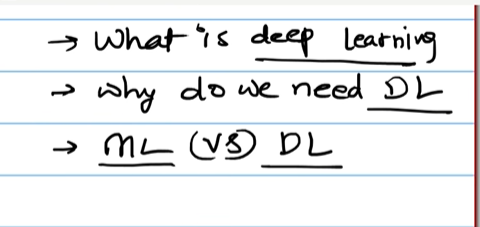

Image lo handwritten notes lo three questions unnayi:

- **What is Deep Learning**
- **Why do we need DL**
- **ML vs DL**

Ee three questions Deep Learning start cheyyadaniki foundation topics.

---

## 1. What is Deep Learning?

**Deep Learning** ante Machine Learning lo oka advanced part.

Machine Learning lo manam usually features manually prepare chestam.
Deep Learning lo neural networks data nundi important patterns automatic ga learn chestayi.

Simple ga:

```text
Data -> Neural Network -> Patterns learn -> Prediction/Output
```

Example:

- Image lo cat/dog identify cheyyadam
- Speech ni text ga convert cheyyadam
- Chatbot answers generate cheyyadam
- Language translation cheyyadam
- Medical image lo disease detect cheyyadam

**Deep Learning lo main idea:**

Human brain neurons laga artificial neurons layers create chestam.
Ee layers data ni step-by-step process chesi final answer istayi.

```text
Input Layer -> Hidden Layers -> Output Layer
```

- **Input Layer:** Raw data receive chestundi.
- **Hidden Layers:** Patterns learn chestayi.
- **Output Layer:** Final prediction istundi.

---

## 1.1 Neural Networks and ANN's

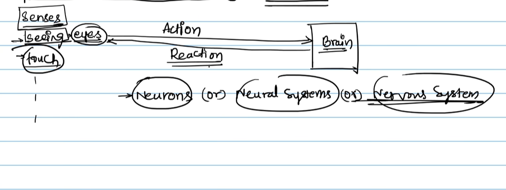

**Image lo main idea:**

Image lo human body senses, brain, action/reaction, neurons ane flow chupincharu.
Deep Learning neural networks ni human brain inspiration tho design chestaru.

Simple flow:

```text
Senses/Eyes/Touch -> Brain -> Action/Reaction
```

Deep Learning lo similar idea:

```text
Input Data -> Artificial Neural Network -> Prediction/Decision
```

---

### Human Brain Analogy

Manam real life lo ela respond chestam?

Example: Hot object touch chesam anukondi.

```text
Touch sense -> Signal brain ki vellutundi -> Brain process chestundi -> Hand remove chestam
```

Ikkada:

- **Senses** data collect chestayi.
- **Brain** data process chestundi.
- **Action/Reaction** final response.
- **Neurons** signals transfer cheyyadaniki help chestayi.

Deep Learning lo:

- **Input data** senses laga work chestundi.
- **Artificial neurons** brain neurons laga data process chestayi.
- **Output** action/reaction laga final prediction istundi.

---

### Neural Network ante enti?

Neural Network ante connected neurons/layers collection.
Idi input data ni process chesi output prediction generate chestundi.

Basic architecture:

```text
Input Layer -> Hidden Layer 1 -> Hidden Layer 2 -> Output Layer
```

**Input Layer:**

Raw data receive chestundi.
Example: image pixels, text tokens, numeric features.

**Hidden Layers:**

Patterns learn chestayi.
First hidden layer simple patterns learn chestundi.
Next hidden layers complex patterns learn chestayi.

**Output Layer:**

Final answer istundi.
Example: cat/dog, spam/not spam, price prediction.

---

### Architecture of ANN

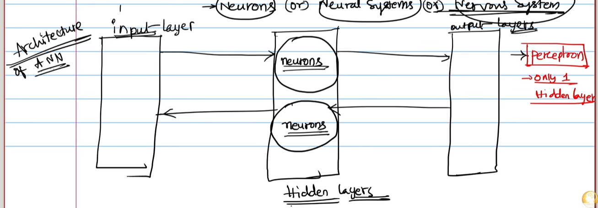

**Image lo main idea:**

Image lo ANN architecture ni three main parts ga chupincharu:

```text
Input Layer -> Hidden Layers -> Output Layer
```

Middle lo neurons untayi. Input nundi signal hidden layers ki vellutundi, hidden layers data process chesi
output layer ki send chestayi.

---

#### 1. Input Layer

Input layer ante model ki data first enter ayye place.

Example:

Student pass/fail prediction lo input layer values:

- Study hours
- Attendance percentage
- Previous marks

Image classification lo input layer values:

- Pixel values

Text model lo input layer values:

- Word/token numbers

**Simple meaning:** Input layer raw data ni receive chestundi. It does not deeply understand patterns yet.

---

#### 2. Hidden Layers

Hidden layers ante input and output madhya unde processing layers.

Image lo hidden layer area lo neurons circles ga chupincharu.

Hidden layers job:

- Input data ni process cheyyadam
- Patterns identify cheyyadam
- Important signals strong cheyyadam
- Less useful signals weak cheyyadam

Example:

Cat image classification lo:

```text
Layer 1 -> edges learn chestundi
Layer 2 -> eyes/ears patterns learn chestundi
Layer 3 -> full cat face/object pattern learn chestundi
```

**Why hidden ani antaru?**

Hidden layers direct input kaadu, direct final output kaadu. Avi middle lo internal calculations chestayi.
Anduke hidden layers ani pilustaru.

---

#### 3. Output Layer

Output layer final prediction istundi.

Examples:

- Cat or Dog
- Pass or Fail
- Spam or Not Spam
- House price
- Sentiment positive or negative

Output layer type problem batti change avtundi:

| Problem Type | Output Layer Example |
|---|---|
| Binary classification | 0 or 1, yes/no, pass/fail |
| Multi-class classification | cat/dog/bird |
| Regression | price, salary, temperature |

---

#### 4. Neurons in hidden layers

Neuron ante small calculation unit.

Each neuron:

1. Inputs receive chestundi.
2. Weights apply chestundi.
3. Bias add chestundi.
4. Activation function apply chestundi.
5. Output next layer ki send chestundi.

Simple flow:

```text
Inputs -> Weight + Bias calculation -> Activation -> Neuron output
```

**Telugu-English example:**

Suppose student pass/fail predict chestunnam.
One neuron study hours ki ekkuva importance ivvachu.
Another neuron attendance ki ekkuva importance ivvachu.
Training time lo model weights adjust cheskoni "which input is important?" ani learn chestundi.

---

#### 5. Signal forward direction

Image lo arrows input nundi hidden layer ki, hidden layer nundi output layer ki veltunnayi.
Idi **forward propagation**.

```text
Input -> Hidden processing -> Output prediction
```

Forward propagation lo model prediction generate chestundi.

Training time lo prediction wrong ayithe, error backward direction lo use chesi weights update chestam.
Idi **backpropagation**.

```text
Prediction error -> Backpropagation -> Weights update -> Better prediction
```

---

#### 6. Perceptron ante enti?

Image right side lo `Perceptron` and `only 1 hidden layer` ani mention undi.

**Perceptron** ante simplest neural network model.
Usually single neuron or very simple network laga explain chestaru.

Simple perceptron flow:

```text
Inputs -> One neuron -> Output
```

Perceptron basic decision boundary learn cheyyagaladu.

Example:

```text
Study hours + Attendance -> Perceptron -> Pass/Fail
```

**Important:** Perceptron very basic. Complex problems ki multiple neurons and multiple hidden layers kavali.

---

#### 7. Shallow ANN vs Deep Neural Network

Image lo `only 1 hidden layer` note undi.

One hidden layer unte usually shallow neural network/ANN laga treat chestam.
Many hidden layers unte deep neural network antaru.

| Network Type | Meaning |
|---|---|
| Perceptron | Very simple neural network, often single neuron |
| ANN with 1 hidden layer | Basic/shallow neural network |
| Deep Neural Network | Multiple hidden layers unna network |

Simple flow:

```text
1 hidden layer -> basic ANN
many hidden layers -> Deep Learning
```

---

#### 7.1 More Than One Hidden Layer -> Deep Neural Network

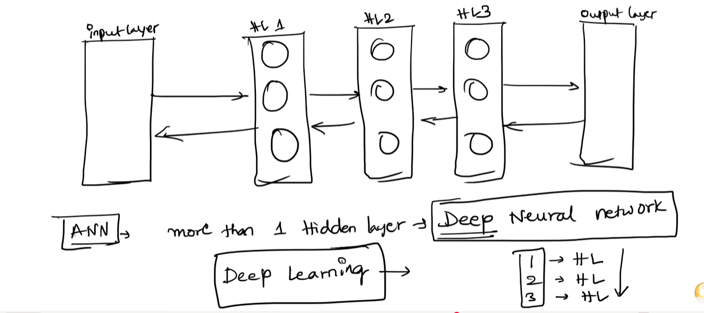

**Image lo main idea:**

Image lo input layer, hidden layer 1, hidden layer 2, hidden layer 3, output layer chupincharu.
Bottom lo `ANN -> more than 1 hidden layer -> Deep Neural Network -> Deep Learning` ani concept explain chesaru.

Simple ga:

```text
Input Layer -> HL1 -> HL2 -> HL3 -> Output Layer
```

Ikkada `HL` ante **Hidden Layer**.

---

##### ANN vs Deep Neural Network

Basic ANN lo one hidden layer undachu.
But hidden layers more than one unte, network deep avtundi.

```text
One hidden layer = Shallow Neural Network / Basic ANN
More than one hidden layer = Deep Neural Network
Deep Neural Network use cheyyadam = Deep Learning
```

**Simple Telugu-English meaning:**

Hidden layers ekkuva ayithe model data ni more levels lo process chestundi.
First layer simple patterns learn chestundi.
Next layers those simple patterns ni combine chesi complex patterns learn chestayi.

---

##### Layer by layer learning example

Cat image example teesukundam:

| Layer | Em learn chestundi? | Simple meaning |
|---|---|---|
| Input Layer | Image pixels receive chestundi | Raw image data |
| Hidden Layer 1 | Edges and lines learn chestundi | Basic shapes |
| Hidden Layer 2 | Eyes, ears, nose parts learn chestundi | Object parts |
| Hidden Layer 3 | Full cat face/body pattern learn chestundi | Complete object pattern |
| Output Layer | Cat or dog ani prediction istundi | Final answer |

---

##### Why multiple hidden layers useful?

Multiple hidden layers valla model complex patterns learn cheyyagaladu.

Example:

```text
Layer 1 -> small/simple features
Layer 2 -> medium-level features
Layer 3 -> high-level/complex features
Output -> final decision
```

Ila deep layers valla model raw data nundi final meaning varaku step-by-step learn chestundi.

---

##### More layers always better aa?

Short answer: **Kaadu.**

More hidden layers add chesthe model complex patterns learn cheyyagaladu.
But too many layers add chesthe model unnecessary ga complex avtundi.

Simple Telugu-English:

```text
Enough layers -> useful patterns learn chestundi
Too many layers -> training data ni memorize chestundi
Memorization -> overfitting
```

**Overfitting ante enti?**

Overfitting ante model training data meeda chala baga perform avtundi, but new/unseen data meeda poor ga perform avtundi.

Example:

Student exam ki concept ardham cheskokunda only previous question paper answers memorize chesadu anukondi.
Same questions vaste marks vastayi, but new questions vaste fail avtadu.
Model overfitting kuda alane.

**Correct idea:**

```text
More layers can improve learning, but huge/unnecessary layers can cause overfitting.
```

So model design lo balance important:

- Dataset size choodali.
- Problem complexity choodali.
- Validation accuracy monitor cheyyali.
- Overfitting unte layers reduce cheyyali or regularization/dropout use cheyyali.

---

##### Forward arrows and backward arrows meaning

Image lo arrows forward and backward direction lo unnayi.

**Forward direction:** Prediction generate cheyyadaniki.

```text
Input -> Hidden Layers -> Output
```

**Backward direction:** Error correct cheyyadaniki.

```text
Output error -> Backpropagation -> Hidden layer weights update
```

Forward pass lo model answer istundi.
Backward pass lo model mistake nundi learn chestundi.

---

##### Important point

Deep Neural Network powerful but careful ga use cheyyali.

Benefits:

- Complex patterns learn chestundi.
- Images, text, audio, videos lo useful.
- Automatic feature learning better ga jarugutundi.

Challenges:

- More data kavali.
- More training time kavali.
- GPU/compute power kavali.
- Overfitting risk untundi if data small unte.

---

##### One-line summary

ANN lo more than one hidden layer add chesthe adi **Deep Neural Network** avtundi; Deep Neural Networks use chesi patterns learn cheyyadam ne **Deep Learning** antaru.

---

#### 8. Complete ANN architecture example

Suppose house price predict cheyyali.

```text
Input Layer:
area, bedrooms, location_score

Hidden Layers:
patterns learn chestayi
example: area high + location good -> price high

Output Layer:
predicted house price
```

**Why ANN useful?**

ANN input features madhya nonlinear relationships learn cheyyagaladu.
Example: same area unna houses lo location batti price huge difference untundi. ANN hidden neurons such patterns capture cheyyadaniki help chestayi.

---

### Neuron ante enti?

Artificial neuron ante small mathematical unit.
Neuron inputs teesukoni calculation chesi output istundi.

Simple flow:

```text
Inputs -> Weights apply -> Sum calculate -> Activation function -> Output
```

Formula simple ga:

```text
output = activation((input1 * weight1) + (input2 * weight2) + bias)
```

**Inputs:** Data values.

**Weights:** Each input importance entha ani decide chese learnable values.

**Bias:** Output ni adjust cheyyadaniki extra value.

**Activation Function:** Neuron output active avvala ledha ani decide chese function.

---

### ANN ante enti?

ANN full form: **Artificial Neural Network**.

Artificial Neural Network ante human brain neural system inspiration tho create chesina machine learning model.

ANN lo multiple artificial neurons connected ga untayi.
Training time lo ANN weights adjust cheskuntu patterns learn chestundi.

```text
Training Data -> ANN -> Prediction -> Error/Loss -> Weights Update -> Better Prediction
```

---

### ANN ela learn chestundi?

ANN learning process simple ga ila untundi:

1. Input data model ki istam.
2. Model prediction chestundi.
3. Actual answer tho compare chestam.
4. Difference ni **loss/error** antaru.
5. Backpropagation through weights update chestam.
6. Repeated training valla model better avtundi.

Simple Telugu-English:

```text
First model mistakes chestundi.
Mistakes nundi learn chestundi.
Weights adjust chestundi.
Next time better prediction istundi.
```

---

### Example: Student Pass/Fail Prediction

Suppose student pass/fail predict cheyyali.

Inputs:

- Study hours
- Attendance
- Previous marks

ANN flow:

```text
Study hours + Attendance + Previous marks
        |
        v
ANN hidden layers
        |
        v
Pass or Fail prediction
```

ANN training lo learn chestundi:

- Study hours ekkuva unte pass chance ekkuva.
- Attendance low unte risk ekkuva.
- Previous marks good unte performance likely good.

---

### Neural Network vs ANN

| Term | Meaning |
|---|---|
| Neural Network | General concept: neurons connected layers laga data process cheyyadam |
| ANN | Artificial Neural Network; basic feed-forward neural network type |
| Deep Neural Network | ANN lo many hidden layers unte deep network antaru |
| Deep Learning | Deep neural networks use chesi complex patterns learn cheyyadam |

---

### Why ANN is important in Deep Learning?

ANN Deep Learning ki foundation.
CNN, RNN, LSTM, Transformers anni neural network family lo advanced versions.

```text
ANN -> CNN / RNN / LSTM / Transformers -> Modern Deep Learning
```

Examples:

- **ANN:** Tabular/numeric prediction problems.
- **CNN:** Images and videos.
- **RNN/LSTM:** Sequence/time-series data.
- **Transformers:** Text, chatbots, LLMs.

---

### Quick ANN Summary

- Neural networks human brain inspiration tho create chesaru.
- Artificial neurons inputs ni process chesi output istayi.
- ANN ante Artificial Neural Network.
- ANN lo input layer, hidden layers, output layer untayi.
- Weights and bias training time lo learn avtayi.
- ANN mistakes nundi learn chestundi using loss and backpropagation.

---

## 1.2 Introduction to ANN's — Complete Topic List

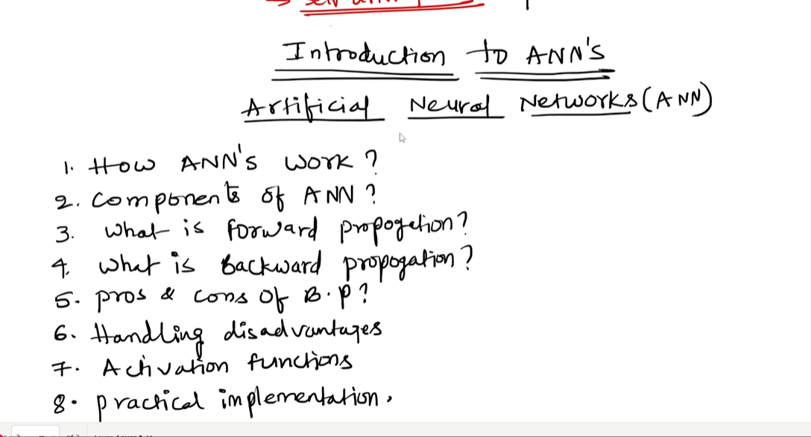

**Image lo main topics:**

Image lo Artificial Neural Networks (ANN) introduction ki 8 topics list chesaru:

1. How ANN's work?
2. Components of ANN?
3. What is forward propagation?
4. What is backward propagation?
5. Pros and cons of Backpropagation?
6. Handling disadvantages
7. Activation functions
8. Practical implementation

Ee section lo anni topics ni detail ga simple Telugu-English mix lo explain chestunnam.

---

### 1. How ANN's Work?

ANN ante Artificial Neural Network. Idi human brain inspiration tho create chesina model.

ANN work flow simple ga:

```text
Input Data -> Neurons/Layers -> Prediction -> Error check -> Weights update -> Better prediction
```

Example: Student pass/fail prediction.

Input values:

- Study hours
- Attendance
- Previous marks

ANN first random weights tho prediction chestundi.
Prediction wrong ayithe loss/error calculate chestundi.
Training repeated ga jarigite ANN correct patterns learn chestundi.

Simple Telugu-English:

```text
Data ivvamu
Model prediction chestundi
Wrong ayithe mistake measure chestam
Weights adjust chestam
Next time better prediction vastundi
```

ANN learning main idea:

- Important inputs ki high weights assign chestundi.
- Less important inputs ki low weights assign chestundi.
- Bias and activation function use chesi final output decide chestundi.

---

### 2. Components of ANN

ANN lo main components:

| Component | Meaning | Why important? |
|---|---|---|
| Input Layer | Raw data receive chestundi | Model ki initial values ikkada enter avtayi |
| Hidden Layers | Internal processing layers | Patterns and relationships learn chestayi |
| Output Layer | Final prediction istundi | Model answer ikkada vastundi |
| Neurons | Small calculation units | Inputs ni process chesi next layer ki output send chestayi |
| Weights | Input importance values | Model learning mainly weights update through jarugutundi |
| Bias | Extra adjustable value | Prediction ni flexible ga adjust cheyyadaniki |
| Activation Function | Non-linearity add chestundi | Complex patterns learn cheyyadaniki |
| Loss Function | Error measure chestundi | Prediction wrong entha ani chepthundi |
| Optimizer | Weights update chestundi | Loss reduce cheyyadaniki model ni improve chestundi |

#### Component flow

```text
Inputs
  |
  v
Weights + Bias
  |
  v
Activation Function
  |
  v
Output
  |
  v
Loss
  |
  v
Optimizer updates weights
```

---

### 3. What is Forward Propagation?

Forward propagation ante input data model lo left to right move ayi prediction generate cheyyadam.

Simple flow:

```text
Input Layer -> Hidden Layer -> Output Layer -> Prediction
```

Forward propagation lo steps:

1. Input values model ki istam.
2. Inputs weights tho multiply avtayi.
3. Bias add chestam.
4. Activation function apply chestam.
5. Next layer ki output send chestam.
6. Last layer final prediction istundi.

Formula:

```text
z = (x1 * w1) + (x2 * w2) + bias
a = activation(z)
```

Where:

- `x1`, `x2` = input values
- `w1`, `w2` = weights
- `bias` = adjustable extra value
- `z` = weighted sum
- `a` = neuron output after activation

**Simple example:**

```text
study_hours = 5
attendance = 80
model calculates score
score activation function through pass avtundi
output = pass probability
```

Forward propagation only prediction generate chestundi.
Learning/update backward propagation lo jarugutundi.

---

### 4. What is Backward Propagation?

Backward propagation ante model mistake nundi learn cheyyadam.

Forward propagation prediction istundi.
Prediction actual answer tho compare chestam.
Difference ni loss/error antaru.
Aa error ni use chesi weights backward direction lo update chestam.

Simple flow:

```text
Prediction -> Loss/Error -> Backward propagation -> Weights update
```

Backpropagation steps:

1. Model prediction generate chestundi.
2. Actual output tho compare chestam.
3. Loss calculate chestam.
4. Loss weights ki ela depend ayindo calculate chestam.
5. Gradients calculate chestam.
6. Optimizer weights update chestundi.
7. Next iteration lo prediction improve avtundi.

Simple Telugu-English:

```text
Model mistake chesindi
Mistake size measure chesam
Ye weights mistake ki responsible ani calculate chesam
Aa weights ni little bit correct direction lo update chesam
```

Backpropagation model ki learning engine laga work chestundi.

---

### 5. Pros and Cons of Backpropagation

#### Pros

| Pro | Explanation |
|---|---|
| Efficient learning | Many weights ni systematic ga update cheyyagaladu |
| Works for deep networks | Multiple hidden layers lo learning possible chestundi |
| Automatic optimization | Manual ga each weight tune cheyyalsina avasaram ledu |
| General method | ANN, CNN, RNN, Transformers lo core idea use avtundi |

#### Cons

| Con | Explanation |
|---|---|
| Vanishing gradients | Deep layers ki gradients tiny ga ayyi learning slow/stop avvachu |
| Exploding gradients | Gradients huge ga ayyi training unstable avvachu |
| Needs lots of data | Small data lo overfitting chance untundi |
| Computationally expensive | Large networks train cheyyadaniki GPU/time kavali |
| Local minima/saddle points | Sometimes optimizer best solution ki slow ga vellachu |
| Black-box behavior | Model exact ga ela decision teesukundo explain cheyyadam kastam |

---

### 6. Handling Disadvantages

Backpropagation and deep networks disadvantages handle cheyyadaniki common techniques:

| Problem | Solution | Telugu-English meaning |
|---|---|---|
| Vanishing gradient | ReLU activation, batch normalization, residual connections | Gradient weak avvakunda help chestayi |
| Exploding gradient | Gradient clipping | Gradient too large ayithe limit chestam |
| Overfitting | Dropout, regularization, more data, data augmentation | Model training data memorize cheyyakunda control chestam |
| Slow training | GPU, mini-batch training, better optimizer | Training speed improve chestam |
| Poor initialization | Xavier/He initialization | Starting weights better ga set chestam |
| Black-box issue | Feature importance, SHAP/LIME, visualization | Model decision explain cheyyadaniki tools use chestam |

#### Overfitting handling in simple words

```text
Problem: Model training data memorize chestundi
Solution: Dropout / regularization / validation monitoring
Goal: New data meeda kuda good performance ravali
```

#### Gradient problem handling in simple words

```text
Problem: Weights update signal too small or too large avtundi
Solution: ReLU, batch normalization, gradient clipping
Goal: Training stable ga jaragali
```

---

### 7. Activation Functions

Activation function neuron output decide chestundi.
Without activation function, neural network mostly linear model laga behave chestundi.
Activation functions valla ANN complex nonlinear patterns learn cheyyagaladu.

#### Why activation function needed?

Real-world data usually nonlinear.

Example:

- House price location + area combination batti nonlinear ga change avtundi.
- Image object shapes nonlinear patterns.
- Text meaning context batti change avtundi.

Activation function non-linearity add chestundi.

#### Common activation functions

| Activation | Formula/Idea | Best use |
|---|---|---|
| Sigmoid | Output 0 to 1 madhya | Binary classification output layer |
| Tanh | Output -1 to 1 madhya | Older RNNs/centered values |
| ReLU | Negative values 0, positive same | Hidden layers lo most common |
| Leaky ReLU | Negative side small value allow chestundi | Dead ReLU problem reduce cheyyadaniki |
| Softmax | Probabilities sum = 1 | Multi-class classification output |

#### Sigmoid

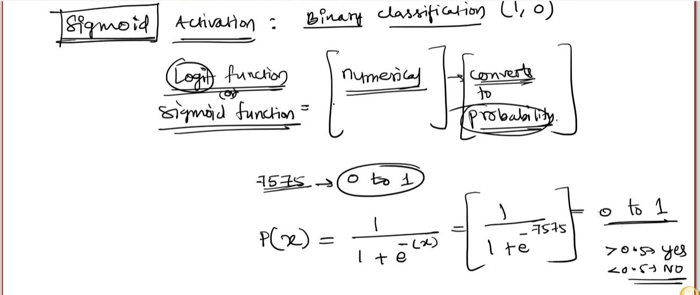

```text
Output range: 0 to 1
Use: Pass/fail, spam/not spam laanti binary output
```

Example:

```text
0.87 -> 87% chance positive class
```

**Image lo main idea:**

Sigmoid activation numerical output ni probability laga convert chestundi.
Binary classification lo output either `1` or `0` kavali kabatti sigmoid useful.

#### Sigmoid formula

```text
p(x) = 1 / (1 + e^(-x))
```

Where:

- `x` = neuron nundi vachina raw numerical value/logit.
- `e` = exponential constant.
- `p(x)` = 0 to 1 madhya probability.

#### Line-by-line image explanation

1. **`Sigmoid Activation`**  
   Idi activation function name. Mainly binary classification output layer lo use chestam.

2. **`Binary classification (1, 0)`**  
   Output two classes: yes/no, true/false, loan eligible/not eligible.

3. **`Logit function or sigmoid function`**  
   Neural network raw score ni probability ga convert cheyyadaniki sigmoid use chestam.

4. **`Numerical -> Converts to probability`**  
   Example raw output `7575` laanti number direct ga class kaadu. Sigmoid dani 0 to 1 probability range lo ki convert chestundi.

5. **`7575 -> 0 to 1`**  
   Raw score very large positive unte sigmoid output almost 1 ki close ga untundi.

6. **`> 0.5 yes, < 0.5 no`**  
   Probability 0.5 kanna ekkuva unte class 1/yes, less unte class 0/no ani decide chestam.

#### Sigmoid threshold logic

```text
Probability >= 0.5 -> Class 1 / Yes
Probability < 0.5 -> Class 0 / No
```

Example:

```text
0.82 -> Yes / 1
0.31 -> No / 0
```

---

#### Classification ANN With Sigmoid Output

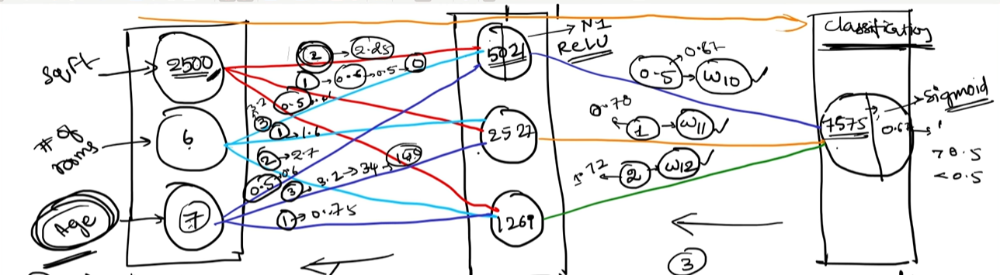

**Image lo main idea:**

House/loan example lo input features ANN lo pass ayi final output layer lo sigmoid activation use chestunnaru.
Regression lo output direct number ga untundi, but classification lo sigmoid output probability ga convert chestundi.

#### Flow

```text
sqft + rooms + age -> Input layer -> Hidden layer -> Output score -> Sigmoid -> Yes/No
```

#### Image line-by-line explanation

1. **Input values `2500`, `6`, `7`**  
   These are independent features.

2. **Hidden layer neuron `5021` with ReLU**  
   Hidden neuron weighted sum calculate chesi ReLU activation apply chestundi.

3. **Connections to output layer with weights `w10`, `w11`, `w12`**  
   Hidden neuron outputs output neuron ki weights through pass avtayi.

4. **Output value `7575`**  
   This is raw score/logit before sigmoid.

5. **`Sigmoid` at output layer**  
   Raw score ni 0 to 1 probability ga convert chestundi.

6. **`> 0.5 -> 1`**  
   Probability 0.5 kanna ekkuva unte positive class.

7. **`< 0.5 -> 0`**  
   Probability 0.5 kanna takkuva unte negative class.

#### Important

Regression problem lo output layer lo usually no activation/linear activation.
Binary classification lo output layer lo sigmoid activation use chestam.

---

#### Loan Eligibility Binary Classification Example

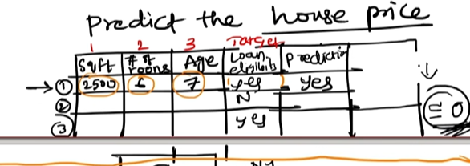

**Image lo main idea:**

Target column now `loan eligible` laga undi:

```text
loan eligible = yes / no
```

So problem regression kaadu, binary classification.

#### Dataset example

| sqft | rooms | age | loan eligible | prediction |
|---|---|---|---|---|
| 2500 | 6 | 7 | yes | yes |

#### Why sigmoid here?

Target values yes/no kabatti model final output probability ga ravali.

```text
Model raw score -> Sigmoid -> Probability -> Yes/No decision
```

#### Example decision

```text
sigmoid output = 0.78
0.78 > 0.5
prediction = yes
```

#### Error goal

Image lo `error ≈ 0` ani undi.
Classification lo kuda model goal prediction and actual target madhya error/loss reduce cheyyadam.

```text
Actual = yes
Predicted = yes
Error/Loss low
```

If:

```text
Actual = yes
Predicted = no
Error/Loss high
```

Then backpropagation weights update chestundi.

---

#### Sigmoid Python Example

```python
import math  # Exponential calculation kosam math module import chestunnam.

raw_score = 2.0  # Output neuron nundi vachina raw numerical score/logit.
probability = 1 / (1 + math.exp(-raw_score))  # Sigmoid formula apply chesi probability calculate chestunnam.

prediction = "Yes" if probability >= 0.5 else "No"  # 0.5 threshold use chesi final class decide chestunnam.

print(probability)  # Probability value print chestunnam.
print(prediction)  # Final Yes/No prediction print chestunnam.
```

#### Code line-by-line explanation

1. `import math` -> sigmoid formula lo `e^x` calculate cheyyadaniki.
2. `raw_score = 2.0` -> neural network output layer raw score.
3. `probability = ...` -> raw score ni 0 to 1 probability ga convert chestundi.
4. `prediction = ...` -> probability 0.5 kanna ekkuva unte `Yes`, otherwise `No`.
5. `print(probability)` -> model confidence/probability display chestundi.
6. `print(prediction)` -> final class output display chestundi.

---

#### ReLU

```text
If input < 0 -> output 0
If input > 0 -> output same input
```

ReLU hidden layers lo commonly use chestaru because simple and fast.

#### Softmax

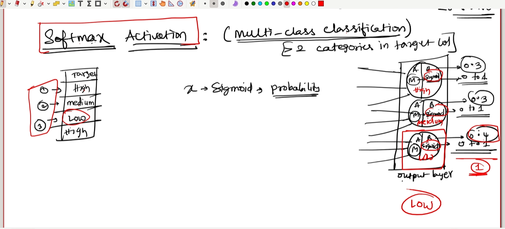

Softmax multiple classes probabilities istundi.

Example:

```text
Cat: 0.70
Dog: 0.20
Bird: 0.10
```

Highest probability unna class final prediction.

**Image lo main idea:**

Softmax activation **multi-class classification** kosam use chestam.
Multi-class classification ante target column lo 2 kanna ekkuva categories/classes undadam.

Image example lo target categories:

```text
High
Medium
Low
```

Ikkada 3 classes unnayi, so output layer lo 3 neurons untayi.

---

#### Softmax enduku use chestam?

Sigmoid binary classification kosam use chestam:

```text
Yes / No
1 / 0
```

But Softmax multi-class classification kosam use chestam:

```text
High / Medium / Low
Cat / Dog / Bird
0 / 1 / 2 / 3 / ... / 9
```

Softmax raw scores ni probabilities ga convert chestundi.
All probabilities total sum `1` avtundi.

Example:

```text
High = 0.30
Medium = 0.30
Low = 0.40
Total = 1.00
```

Highest probability `Low = 0.40`, so final prediction `Low`.

---

#### Softmax formula simple idea

Softmax formula:

```text
softmax(x_i) = e^(x_i) / sum(e^(all class scores))
```

Simple meaning:

- Each class raw score ni exponential value ga convert chestundi.
- Total exponential scores tho divide chestundi.
- Result probability laga 0 to 1 madhya untundi.
- All class probabilities sum 1 avtundi.

---

#### Image line-by-line explanation

1. **`Softmax Activation`**  
   Multi-class classification output layer lo use chese activation function.

2. **`Multi-class classification`**  
   Target lo 2 kanna ekkuva categories/classes unnappudu use chestam.

3. **`>= 2 categories in target col`**  
   Actually 2 kanna ekkuva classes unte Softmax common choice. Example: High, Medium, Low.

4. **Target column: `High`, `Medium`, `Low`, `High`**  
   Dataset lo output labels categories ga unnayi.

5. **Output layer lo 3 neurons**  
   High ki one neuron, Medium ki one neuron, Low ki one neuron.

6. **Each neuron sigmoid/probability style output**  
   Image lo each output neuron ki probability values draw chesaru.

7. **Probabilities: `0.3`, `0.3`, `0.4`**  
   Model each class ki confidence/probability istundi.

8. **Highest probability `0.4`**  
   `Low` class ki highest probability undi.

9. **Final output `Low`**  
   Highest probability unna class final prediction.

---

#### Output neurons count in Softmax

Output layer neurons count = number of classes.

| Classes | Output neurons |
|---|---|
| High, Medium, Low | 3 |
| Cat, Dog, Bird | 3 |
| Digits 0 to 9 | 10 |
| Red, Blue, Green, Yellow | 4 |

Simple rule:

```text
Multi-class output neurons = number of categories/classes
```

---

#### Softmax vs Sigmoid

| Topic | Sigmoid | Softmax |
|---|---|---|
| Use case | Binary classification | Multi-class classification |
| Output | One probability | Probability for each class |
| Example | Loan eligible yes/no | Risk: high/medium/low |
| Output neurons | Usually 1 | Number of classes |
| Decision | Probability >= 0.5 | Highest probability class |

---

#### Softmax Python Example

```python
import math  # Exponential calculation kosam math module import chestunnam.

class_scores = [1.2, 1.1, 1.5]  # Output layer raw scores: High, Medium, Low.
class_names = ["High", "Medium", "Low"]  # Score order ki matching class names create chestunnam.

exponential_scores = [math.exp(score) for score in class_scores]  # Each raw score ni exponential score ga convert chestunnam.
total_exponential_score = sum(exponential_scores)  # All exponential scores total calculate chestunnam.

probabilities = [score / total_exponential_score for score in exponential_scores]  # Softmax probabilities calculate chestunnam.
highest_probability_index = probabilities.index(max(probabilities))  # Highest probability unna class index find chestunnam.
final_prediction = class_names[highest_probability_index]  # Highest probability index use chesi final class name select chestunnam.

print(probabilities)  # High, Medium, Low probabilities print chestunnam.
print(final_prediction)  # Final predicted class print chestunnam.
```

#### Code line-by-line explanation

1. `import math` -> `e^x` exponential calculation kosam.
2. `class_scores = [1.2, 1.1, 1.5]` -> output layer raw class scores.
3. `class_names = ["High", "Medium", "Low"]` -> each score ki class label.
4. `exponential_scores = ...` -> raw scores ni positive exponential values ga convert chestundi.
5. `total_exponential_score = ...` -> denominator kosam total calculate chestundi.
6. `probabilities = ...` -> each class probability calculate chestundi.
7. `highest_probability_index = ...` -> biggest probability position find chestundi.
8. `final_prediction = ...` -> biggest probability class final output.
9. `print(probabilities)` -> probabilities display.
10. `print(final_prediction)` -> final class display.

---

---

### 8. Practical Implementation

Below simple NumPy based ANN/perceptron-style example.
Goal: Study hours and attendance based on pass/fail predict cheyyadam.

> Note: Real projects lo TensorFlow/PyTorch use chestaru. Ikkada basic math understand avvadani ki NumPy example istunnam.

```python
import numpy as np  # Numerical arrays and math operations kosam NumPy import chestunnam.

training_inputs = np.array([  # Training data create chestunnam; each row one student data.
    [2, 50],  # Student 1: 2 study hours, 50 attendance.
    [4, 60],  # Student 2: 4 study hours, 60 attendance.
    [6, 80],  # Student 3: 6 study hours, 80 attendance.
    [8, 90],  # Student 4: 8 study hours, 90 attendance.
], dtype=float)  # Values float type lo keep chestunnam for math operations.

training_outputs = np.array([[0], [0], [1], [1]], dtype=float)  # Actual labels: 0 fail, 1 pass.

training_inputs = training_inputs / np.array([10, 100])  # Study hours and attendance ni 0-1 range ki scale chestunnam.

def sigmoid(value):  # Sigmoid activation function define chestunnam.
    return 1 / (1 + np.exp(-value))  # Any number ni 0 and 1 madhya convert chestundi.

def sigmoid_derivative(value):  # Sigmoid derivative define chestunnam for backpropagation.
    return value * (1 - value)  # Gradient calculate cheyyadaniki derivative use chestam.

np.random.seed(42)  # Same random weights reproduce avvadani ki seed set chestunnam.

weights = np.random.rand(2, 1)  # Two inputs ki two weights initialize chestunnam.
bias = np.random.rand(1)  # One bias value initialize chestunnam.
learning_rate = 0.5  # Weights entha speed lo update avvali ani decide chestunnam.

for epoch in range(5000):  # Model ni 5000 times train chestunnam.
    weighted_sum = np.dot(training_inputs, weights) + bias  # Forward propagation weighted sum calculate chestunnam.
    predictions = sigmoid(weighted_sum)  # Sigmoid use chesi pass probability calculate chestunnam.

    error = training_outputs - predictions  # Actual output and prediction difference calculate chestunnam.
    adjustments = error * sigmoid_derivative(predictions)  # Backpropagation gradient-like adjustment calculate chestunnam.

    weights += np.dot(training_inputs.T, adjustments) * learning_rate  # Weights update chestunnam.
    bias += np.sum(adjustments) * learning_rate  # Bias update chestunnam.

new_student = np.array([[7, 85]], dtype=float)  # New student data create chestunnam.
new_student = new_student / np.array([10, 100])  # New data ni same scale lo convert chestunnam.
pass_probability = sigmoid(np.dot(new_student, weights) + bias)  # Trained model tho prediction chestunnam.

print(pass_probability)  # Pass probability print chestunnam.
print(pass_probability > 0.5)  # Probability 0.5 kanna ekkuva unte pass ani classify chestunnam.
```

#### Practical implementation flow

```text
Data prepare
  |
  v
Scale inputs
  |
  v
Initialize weights and bias
  |
  v
Forward propagation
  |
  v
Error calculate
  |
  v
Backward propagation / weight update
  |
  v
Prediction on new data
```

#### Code lo what and why?

- `training_inputs`: Model ki examples ivvadaniki.
- `training_outputs`: Correct answers ivvadaniki.
- Scaling: Big values learning unstable cheyyakunda.
- `weights`: Input importance learn cheyyadaniki.
- `bias`: Prediction flexible ga adjust cheyyadaniki.
- `sigmoid`: Output ni probability laga convert cheyyadaniki.
- `error`: Model mistake measure cheyyadaniki.
- `adjustments`: Mistake basis lo weights update cheyyadaniki.
- `learning_rate`: Update speed control cheyyadaniki.

---

### Final Summary of 8 ANN Topics

| Topic | One-line meaning |
|---|---|
| How ANN works | Data nundi prediction chesi mistakes through learn chestundi |
| Components | Inputs, hidden layers, neurons, weights, bias, activation, loss, optimizer |
| Forward propagation | Input nundi output varaku prediction generate cheyyadam |
| Backward propagation | Error nundi weights update cheyyadam |
| Pros/cons of BP | Powerful learning method but gradient/compute/overfitting issues untayi |
| Handling disadvantages | ReLU, dropout, regularization, clipping, better initialization use chestam |
| Activation functions | Neuron output decide chesi non-linearity add chestayi |
| Practical implementation | Data -> weights -> prediction -> error -> update -> new prediction |

---

## 2. Why do we need Deep Learning?

Deep Learning ni use cheyyadaniki main reasons:

### 2.1 Large data handle cheyyagaladu

Traditional ML small/medium data lo good ga work chestundi.
But huge data unte Deep Learning better patterns learn cheyyagaladu.

Example:

```text
Millions of images -> Deep Learning model -> Accurate image classification
```

### 2.2 Manual feature engineering reduce chestundi

Machine Learning lo manam features manually create cheyyali.
Deep Learning lo model itself important features learn chestundi.

Example:

Image classification lo:

- ML: Edges, shapes, colors manually extract cheyyali.
- DL: Neural network edges, shapes, objects automatic ga learn chestundi.

---

## 2.2.1 Feature Engineering Automatic ga Deep Learning lo Ela Jarugutundi?

**Feature Engineering ante enti?**

Feature engineering ante raw data nundi model ki useful information/features create cheyyadam.

Example:

```text
Raw house data -> area, bedrooms, location score -> ML model
```

Ikkada `area`, `bedrooms`, `location score` laanti columns features.

Traditional Machine Learning lo manam manually decide chestam:

- Which columns useful?
- Missing values ela fill cheyyali?
- Text ni numbers ga ela convert cheyyali?
- Image nundi edges/colors ela extract cheyyali?
- Date nundi month/day/year ela create cheyyali?

But Deep Learning lo, especially images/audio/text lo, model itself features learn cheyyagaladu.

---

### Deep Learning lo Automatic Feature Learning Flow

```text
Raw Data
   |
   v
Neural Network Layer 1 -> simple patterns learn chestundi
   |
   v
Neural Network Layer 2 -> medium-level patterns learn chestundi
   |
   v
Neural Network Layer 3+ -> complex patterns learn chestundi
   |
   v
Final Prediction
```

**Simple Telugu-English meaning:**

Deep Learning model lo multiple hidden layers untayi. Prathi layer data nundi konni patterns learn chestundi.
First layer simple things learn chestundi. Next layers aa simple things combine chesi bigger meaning learn chestayi.

---

### Image Example: Cat vs Dog

Suppose manam cat vs dog classify cheyyali.

#### Traditional ML approach

Traditional ML lo human manually features create cheyyali:

```text
Image -> manually extract edges, color, shape, texture -> ML model -> Cat/Dog
```

Manam decide cheyyali:

- Ear shape important aa?
- Fur texture important aa?
- Face shape important aa?
- Color important aa?
- Edge count important aa?

Idi manual feature engineering.

#### Deep Learning approach

Deep Learning lo raw image pixels model ki istam:

```text
Image pixels -> CNN layers -> automatic features -> Cat/Dog
```

CNN ante Convolutional Neural Network. Images ki commonly use chestaru.

CNN layers ila learn chestayi:

| Layer Level | Model em learn chestundi? | Simple meaning |
|---|---|---|
| Early layers | Edges, lines, corners | Basic shapes |
| Middle layers | Eyes, ears, fur patterns | Object parts |
| Deep layers | Full cat/dog face/body pattern | Complete object meaning |

So manam manually "ears extract cheyyi", "eyes extract cheyyi" ani cheppalsina avasaram takkuva.
Model training time lo itself useful features identify chestundi.

---

### Text Example: Sentiment Analysis

Problem: Review positive aa negative aa classify cheyyali.

#### Traditional ML approach

ML lo manam text ni manually features ga convert chestam:

```text
Review text -> Bag of Words / TF-IDF -> ML model -> Positive/Negative
```

Example:

- Word count
- Positive words count
- Negative words count
- TF-IDF values

#### Deep Learning approach

Deep Learning lo embeddings/transformers text meaning automatic ga learn chestayi:

```text
Review text -> Embedding/Transformer layers -> meaning features -> Positive/Negative
```

Example:

Sentence: `The movie was not bad`

Simple word count method lo "bad" word undi kabatti negative ani mistake avvachu.
But Deep Learning context understand chesi `not bad` ante actually positive/okay meaning ani learn cheyyagaladu.

---

### Audio Example: Speech Recognition

Problem: Voice ni text ga convert cheyyali.

Traditional ML lo manually audio features extract chestaru:

- Frequency
- Pitch
- MFCC features
- Sound energy

Deep Learning lo:

```text
Raw/processed audio -> neural network -> speech patterns -> text
```

Model voice patterns, sounds, words relationships automatic ga learn chestundi.

---

### Deep Learning Applications for Unstructured Data

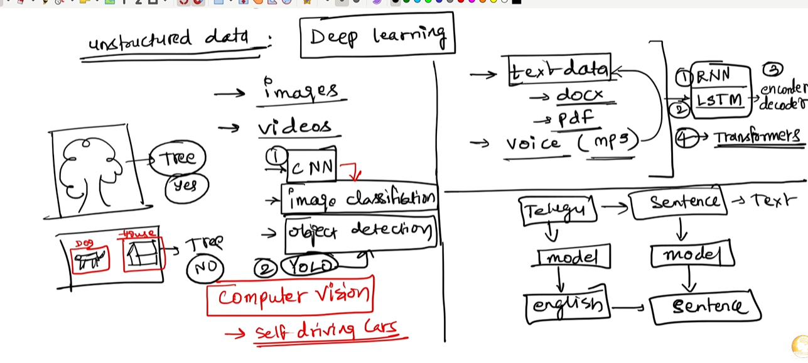

**Image lo main idea:**

Image lo unstructured data ni two major sides ga divide chesaru:

1. **Images/Videos side** -> Computer Vision
2. **Text/Voice side** -> NLP and speech processing

Deep Learning ee two sides lo chala powerful because model raw/complex data nundi patterns automatic ga learn chestundi.

---

#### 1. Images and Videos -> Computer Vision

Image left side lo images and videos examples unnayi.
Deep Learning lo images/videos process cheyyadaniki mainly **CNN** and object detection models use chestaru.

```text
Images / Videos -> Deep Learning -> Computer Vision output
```

**Computer Vision ante enti?**

Computer Vision ante computer ki images/videos understand cheyyadam nerpinchadam.

Examples:

- Image classification
- Object detection
- Face detection
- Medical image analysis
- Self-driving cars

---

#### 2. CNN for Image Classification

Image lo `CNN -> image classification` ani mention undi.

**CNN full form:** Convolutional Neural Network.

CNN images ki best because image lo spatial patterns untayi.
Spatial pattern ante pixels nearby relationship.

Example:

```text
Tree image -> CNN -> Tree: Yes
```

CNN layer by layer ila learn chestundi:

| CNN Layer Level | Model em learn chestundi? |
|---|---|
| Early layers | Edges, lines, corners |
| Middle layers | Leaves, branches, object parts |
| Deep layers | Full tree shape/pattern |

**Simple meaning:** CNN image lo important visual features automatic ga detect chestundi.

---

#### 3. YOLO for Object Detection

Image lo dog and house boxes draw chesi `YOLO` ani mention chesaru.

**YOLO full form:** You Only Look Once.

YOLO object detection model.
Image lo object ekkada undi and object name enti ani detect chestundi.

Image classification vs object detection:

| Task | Meaning | Example |
|---|---|---|
| Image Classification | Image lo main object enti ani chepthundi | This image is dog |
| Object Detection | Object location + object name chepthundi | Dog box here, house box there |

YOLO flow:

```text
Image -> YOLO model -> Bounding boxes + labels
```

Example:

```text
Street image -> YOLO -> Car, person, traffic light detect chestundi
```

**Self-driving cars lo use:**

Self-driving cars camera images/videos use chestayi.
YOLO/CNN models road lo cars, people, signals, lanes detect cheyyadaniki help chestayi.

---

#### 4. Text Data, DOC, PDF -> NLP

Image right side lo `text data -> doc -> pdf` ani mention undi.

Text documents and PDFs process cheyyadaniki Deep Learning NLP models use chestam.

**NLP full form:** Natural Language Processing.

NLP ante human language ni computer understand cheyyadam.

Examples:

- Sentiment analysis
- Text classification
- Summarization
- Translation
- Question answering
- Chatbots
- Resume parsing
- PDF understanding

Simple flow:

```text
Text / DOC / PDF -> NLP model -> meaning / summary / answer
```

---

#### 5. Voice / MP3 -> Speech Models

Image lo `voice (mp3)` ani mention undi.

Voice data lo sound waves untayi.
Deep Learning speech models voice nundi words and meaning extract cheyyagalavu.

Examples:

- Speech-to-text
- Voice assistant
- Speaker identification
- Audio classification

Simple flow:

```text
Voice MP3 -> Speech model -> Text transcript
```

---

#### 6. RNN and LSTM

Image right side lo `RNN` and `LSTM` boxes unnayi.

**RNN full form:** Recurrent Neural Network.

**LSTM full form:** Long Short-Term Memory.

RNN/LSTM sequence data kosam use chestaru.
Sequence data ante order important unna data.

Examples:

- Sentences
- Time series
- Audio signals
- Video frames

Why sequence important?

Sentence lo word order meaning ni change chestundi.

Example:

```text
"Dog bites man" != "Man bites dog"
```

RNN/LSTM previous words/context remember chesi next meaning predict cheyyadaniki help chestayi.

---

#### 7. Encoder and Decoder

Image lo `encoder decoder` ani mention undi.

Encoder-decoder architecture translation and sequence-to-sequence tasks lo use chestaru.

Simple flow:

```text
Input sentence -> Encoder -> Meaning representation -> Decoder -> Output sentence
```

Example:

```text
Telugu sentence -> Encoder -> Meaning -> Decoder -> English sentence
```

Image lo Telugu -> model -> English example undi.
Idi translation task.

---

#### 8. Transformers

Image lo `Transformers` ani underline chesaru.

Transformers are modern Deep Learning models for text and multi-modal tasks.
LLMs like ChatGPT/Claude/Gemini transformer architecture family lo untayi.

Transformers advantage:

- Long context better ga handle chestayi.
- Words madhya relationship better ga learn chestayi.
- Parallel training efficient ga untundi.
- Translation, summarization, chatbot tasks lo strong performance istayi.

Simple flow:

```text
Text -> Transformer -> Context understanding -> Output text
```

Example:

```text
Sentence -> Transformer model -> Better sentence / summary / answer
```

---

#### 9. Image lo shown complete mapping

| Input Data | Deep Learning Model | Output / Use Case |
|---|---|---|
| Images | CNN | Image classification |
| Videos | CNN + sequence models | Action/object understanding |
| Images with many objects | YOLO | Object detection |
| Text documents | RNN/LSTM/Transformers | Text classification, summarization |
| PDFs | OCR + NLP/Transformers | Document understanding |
| Voice MP3 | Speech models/RNN/LSTM/Transformers | Speech-to-text |
| Telugu text | Encoder-decoder/Transformers | English translation |

---

#### 10. Simple final understanding

Unstructured data lo data direct table format lo undadu.
Images, videos, text, PDFs, voice anni different formats lo untayi.
Deep Learning lo different model families use chestam:

```text
Images/Videos -> CNN, YOLO -> Computer Vision
Text/PDFs -> RNN, LSTM, Transformers -> NLP
Voice/MP3 -> Speech models -> Speech-to-text
Translation -> Encoder-Decoder, Transformers -> One language to another language
```

**One-line summary:**

Deep Learning unstructured data ni handle cheyyadaniki CNN, YOLO, RNN, LSTM, encoder-decoder, and Transformers laanti models use chestundi.

---

### Important Point: Automatic ante 100% manual work ledu ani kaadu

Deep Learning feature engineering automatic ga chestundi ani cheppadam correct, but **complete manual work zero** ani meaning kaadu.

Still manam cheyyalsina preprocessing untundi:

- Data cleaning
- Missing values handling
- Train/test split
- Scaling/normalization sometimes
- Image resizing
- Text tokenization
- Removing corrupted files
- Label preparation

**Main difference:**

Traditional ML lo feature design human heavily chestadu.
Deep Learning lo feature learning model heavily chestundi.

```text
ML: Human creates features -> Model learns mapping
DL: Model learns features + mapping
```

---

### Why Deep Learning can learn features automatically?

Deep Learning lo neural networks ki many layers untayi.
Each layer previous layer output ni process chestundi.
Training time lo backpropagation algorithm model weights adjust chestundi.

Simple flow:

```text
Prediction wrong -> Loss calculate -> Backpropagation -> Weights update -> Better features learn
```

**Meaning:**

Model first random ga predict chestundi.
Wrong predictions chusi error/loss calculate chestundi.
Then weights update chestundi.
Repeated training valla model useful patterns/features learn chestundi.

---

### Automatic Feature Engineering Benefits

| Benefit | Explanation |
|---|---|
| Less manual feature design | Human ki every pattern manually code cheyyalsina avasaram taggutundi |
| Better for unstructured data | Images, audio, text lo hidden patterns model learn chestundi |
| Complex patterns capture | Simple ML miss chese deep relationships identify cheyyagaladu |
| End-to-end learning | Raw input nundi output varaku model complete pipeline learn cheyyagaladu |

---

### Automatic Feature Engineering Limitations

| Limitation | Explanation |
|---|---|
| More data needed | Deep Learning ki usually large dataset kavali |
| More compute needed | GPU/high compute often required |
| Less interpretability | Model exact ga ye feature use chesindo explain cheyyadam kastam |
| Preprocessing still needed | Raw data totally messy unte model confuse avtundi |

---

### Simple Interview Answer

**Question:** Feature engineering Deep Learning lo automatic ga jarugutunda?

**Answer:**

Yes, Deep Learning lo neural networks multiple layers through raw data nundi useful features automatic ga learn chestayi.
Traditional ML lo human manually features design chestadu, but Deep Learning lo early layers simple patterns and deeper layers complex patterns learn chestayi.
However, data cleaning, resizing, tokenization, normalization laanti preprocessing still required.

---

### 2.3 Complex data ki best

Deep Learning especially unstructured data ki useful:

- Images
- Audio
- Video
- Text
- Sensor data

Traditional ML ki ee data direct ga understand cheyyadam kastam.
Deep Learning layers through complex patterns learn chestundi.

---

## 2.3.1 Unstructured Data -> Deep Learning

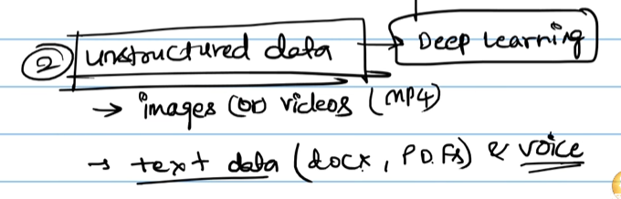

**Image lo main idea:**

Image lo `Unstructured data -> Deep learning` ani chupincharu.
Ante images, videos, text documents, PDFs, voice laanti data ni Deep Learning models better ga process cheyyagalavu.

---

### Unstructured Data ante enti?

Unstructured data ante fixed rows and columns format lo leni data.

Example:

```text
Structured Data:
Name | Age | Salary
Sai  | 24  | 50000
```

Ila table format lo unte structured data.

But below data table format lo direct ga undadu:

- Images
- Videos
- Text documents
- PDFs
- Voice/audio

Ivi **unstructured data**.

---

### Why Deep Learning is useful for unstructured data?

Unstructured data lo patterns hidden ga untayi.
Traditional ML ki aa patterns manually extract cheyyali.
Deep Learning lo neural networks layers through aa patterns automatic ga learn chestayi.

Simple flow:

```text
Images / Videos / Text / PDFs / Voice
        |
        v
Deep Learning Model
        |
        v
Features automatic ga learn
        |
        v
Prediction / Classification / Generation
```

---

### 1. Images

Image ante pixels collection.
Human eye ki cat/dog easy ga kanipistundi, but computer ki image numbers matrix laga untundi.

Deep Learning, especially **CNN**, image lo:

- Edges
- Corners
- Shapes
- Objects
- Faces

automatic ga learn chestundi.

Example:

```text
Cat image -> CNN -> Cat ani predict chestundi
```

---

### 2. Videos

Video ante multiple images/frames sequence.

Deep Learning video lo:

- Movement
- Object action
- Scene change
- Human activity

learn cheyyagaladu.

Example:

```text
Cricket video -> DL model -> Batting shot / bowling action detect chestundi
```

---

### 3. Text Data

Text data ante sentences, paragraphs, documents.

Example:

- Word documents
- Chat messages
- Reviews
- Emails
- Articles

Deep Learning, especially **RNN/LSTM/Transformer models**, text lo meaning and context learn chestayi.

Example:

```text
"This phone is not bad" -> Transformer -> Positive/neutral sentiment
```

Traditional ML simple word count use chesthe `bad` word chusi negative ani mistake cheyyachu.
Deep Learning context chusi `not bad` meaning better ga understand cheyyagaladu.

---

### 4. PDFs and Documents

PDFs lo text, tables, images, layout mixed ga untayi.

Deep Learning/OCR/NLP models PDFs nundi:

- Text extract cheyyadam
- Table understand cheyyadam
- Summary generate cheyyadam
- Question answering cheyyadam
- Document classification cheyyadam

cheyyagalavu.

Example:

```text
Resume PDF -> DL/NLP model -> Skills, experience, education extract chestundi
```

---

### 5. Voice / Audio

Voice data waveform format lo untundi.
Computer ki adi direct ga words laga kanipinchadu.

Deep Learning audio lo:

- Sound patterns
- Pronunciation
- Words
- Speaker tone
- Background noise patterns

learn cheyyagaladu.

Example:

```text
Voice recording -> Speech model -> Text transcript
```

---

### ML vs DL for Unstructured Data

| Data Type | Traditional ML lo problem | Deep Learning advantage |
|---|---|---|
| Images | Manual edge/shape extraction kavali | CNN features automatic ga learn chestundi |
| Videos | Frame-by-frame manual logic complex | DL movement and sequence patterns learn chestundi |
| Text | Bag-of-words context miss cheyyachu | Transformers context and meaning learn chestayi |
| PDFs | Layout/text/tables mixed ga untayi | OCR + NLP models document structure understand chestayi |
| Voice | Manual audio features difficult | Speech models sound-to-text patterns learn chestayi |

---

### Simple Summary

Unstructured data ante neat table format lo leni data.
Images, videos, text, PDFs, voice ivanni unstructured data examples.
Deep Learning models multiple layers use chesi hidden patterns automatic ga learn chestayi.
Anduke unstructured data problems ki Deep Learning chala powerful.

### 2.4 High accuracy possible

Enough data and compute power unte Deep Learning models high accuracy achieve cheyyagalavu.

Example:

- Face recognition
- Self-driving cars
- Voice assistants
- Generative AI tools

---

## 3. ML vs DL

ML ante Machine Learning.
DL ante Deep Learning.

Deep Learning is a subset of Machine Learning.

```text
Artificial Intelligence
       |
       v
Machine Learning
       |
       v
Deep Learning
```

### ML vs DL Comparison Table

| Topic | Machine Learning | Deep Learning |
|---|---|---|
| Data Requirement | Small to medium data lo work chestundi | Large data lo better work chestundi |
| Feature Engineering | Manual ga features create cheyyali | Model automatic ga features learn chestundi |
| Algorithms | Linear Regression, Decision Tree, Random Forest, SVM | Neural Networks, CNN, RNN, Transformers |
| Compute Power | Less compute enough | High compute/GPU often needed |
| Best For | Structured/tabular data | Images, text, audio, video |
| Interpretability | Easy ga explain cheyyachu | Often black-box laga untundi |
| Training Time | Usually fast | Usually slow |

---

## Simple Example

### Problem: House price prediction

**Machine Learning approach:**

Manam features prepare chestam:

- Number of bedrooms
- Area in square feet
- Location
- Age of house

Then model train chestam.

```text
Manual features -> ML algorithm -> House price
```

### Problem: Cat vs Dog image classification

**Deep Learning approach:**

Image pixels direct ga neural network ki istam.
Network itself edges, shapes, face, fur patterns learn chestundi.

```text
Image pixels -> Neural network layers -> Cat/Dog prediction
```

---

## When to use ML?

ML use cheyyandi when:

- Dataset small or medium size lo unte
- Data tabular format lo unte
- Output explain cheyyali ante
- Training fast ga kavali ante
- Compute resources limited unte

Examples:

- Loan approval prediction
- Customer churn prediction
- Sales forecasting
- Fraud detection with structured data

---

## When to use Deep Learning?

Deep Learning use cheyyandi when:

- Data very large unte
- Images/audio/text/video data unte
- Manual feature engineering difficult unte
- High accuracy important unte
- GPU/compute resources available unte

Examples:

- Image recognition
- Speech recognition
- Natural Language Processing
- Chatbots
- Object detection
- Generative AI

---

## 1.3 ANN Detailed Notes From All Images

Ee section lo attached images lo unna ANN concepts ni **image-by-image**, **point-by-point**, simple Telugu-English mix lo explain chestunnam.

---

### Image 1: Neurons in Input Layer

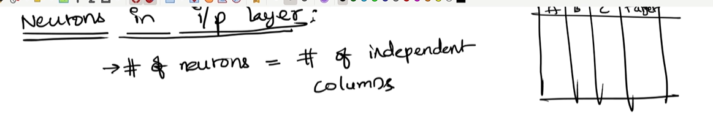

**Image lo note:** `Neurons in i/p layer = number of independent columns`

#### Meaning

Input layer lo neurons count usually dataset lo unna **independent features/columns** count ki equal ga untundi.

Example dataset:

| sqft | rooms | age | target price |
|---|---|---|---|
| 2500 | 6 | 7 | 50000 |

Ikkada:

- `sqft` = independent column
- `rooms` = independent column
- `age` = independent column
- `target price` = dependent/target column

So input layer neurons:

```text
Number of input neurons = 3
```

#### Line-by-line explanation

1. **`Neurons in i/p layer`**  
   Input layer lo enni neurons undalo decide chestunnam.

2. **`# of neurons = # of independent columns`**  
   Target column kakunda model ki input ga iche columns count = input neurons count.

3. **Table with A, B, C, target**  
   A, B, C independent features. Target predict cheyyalsina output.

#### Simple example

House price prediction lo:

```text
Input columns: sqft, number_of_rooms, age
Target column: price
```

So ANN input layer:

```text
3 input neurons -> one for sqft, one for rooms, one for age
```

---

### Image 2: Neurons in Hidden Layer and Output Layer

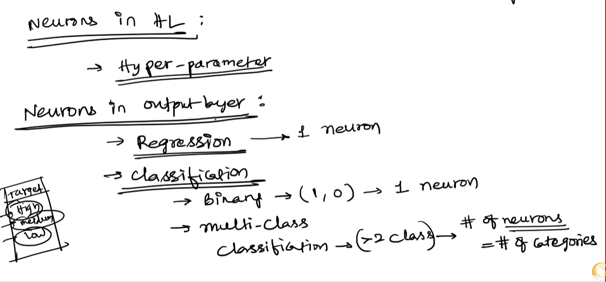

**Image lo notes:**

- `Neurons in HL = Hyper-parameter`
- `Regression -> 1 neuron`
- `Binary classification -> 1 neuron`
- `Multi-class classification -> number of neurons = number of categories`

#### Hidden layer neurons

Hidden layer lo enni neurons undali ani fixed rule ledu.
Adi **hyperparameter**.

Hyperparameter ante:

```text
Model training start avvakamunde manam decide chese setting
```

Examples:

- Number of hidden layers
- Number of neurons in each hidden layer
- Learning rate
- Batch size
- Epochs

#### Output layer neurons

Output layer neurons count problem type batti decide avtundi.

| Problem Type | Output Neurons | Example |
|---|---|---|
| Regression | 1 neuron | House price predict cheyyadam |
| Binary classification | 1 neuron | Spam/not spam |
| Multi-class classification | Number of classes | Cat/dog/bird = 3 neurons |

#### Line-by-line explanation

1. **`Neurons in HL -> Hyper-parameter`**  
   Hidden layer neurons manual ga choose chestam. Experiment chesi best value find chestam.

2. **`Regression -> 1 neuron`**  
   Regression lo single continuous value predict chestam. Example: price, salary, temperature.

3. **`Classification -> Binary -> (1,0) -> 1 neuron`**  
   Binary classification lo output yes/no or 1/0. Usually sigmoid activation tho 1 neuron enough.

4. **`Multi-class classification -> # of neurons = # of categories`**  
   More than 2 classes unte, output layer lo each class ki one neuron.

#### Examples

```text
House price -> output neurons = 1
Pass/fail -> output neurons = 1
Digit classification 0-9 -> output neurons = 10
Fruit classification apple/banana/orange -> output neurons = 3
```

---

### Image 3: ANN House Price Network Overview

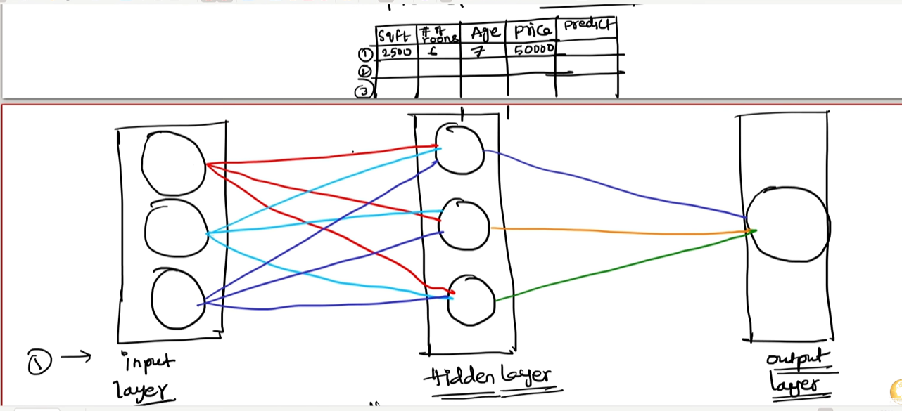

**Image lo idea:** House price prediction example with input layer, hidden layer, and output layer.

Dataset columns:

- sqft
- number of rooms
- age
- price/target

#### Network flow

```text
sqft, rooms, age -> input layer -> hidden layer -> output layer -> predicted price
```

#### Line-by-line explanation

1. **Input table**  
   Dataset lo independent features and target price unnayi.

2. **Input layer**  
   Three input neurons because three independent columns unnayi: sqft, rooms, age.

3. **Connections from input to hidden layer**  
   Prathi input neuron hidden layer neurons ki connect avtundi.

4. **Hidden layer neurons**  
   Hidden layer data patterns learn chestundi. Example: bigger sqft usually higher price.

5. **Output layer**  
   Final predicted price generate chestundi.

#### Why all connections?

Dense connection lo each input each hidden neuron ki connect avtundi.
So model input features combinations learn cheyyagaladu.

Example:

```text
sqft alone important
rooms alone important
age alone important
sqft + location/rooms combination also important
```

---

### Image 4: Weights and Activations Overview

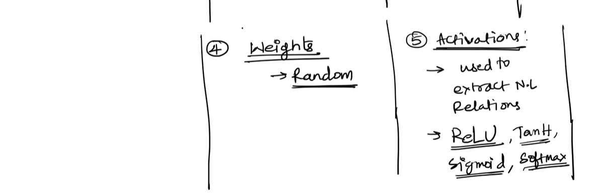

**Image lo topics:**

- Weights are random initially
- Activations extract nonlinear relations
- ReLU, Tanh, Sigmoid, Softmax

#### Weights

Weights input importance ni represent chestayi.
Training start lo weights usually random ga initialize chestaru.

Example:

```text
sqft weight = 2
rooms weight = 3
age weight = 0.5
```

Meaning:

- rooms feature ki weight 3 ante current model view lo rooms more important.
- age weight 0.5 ante age less important.

Training lo weights update avtayi.

#### Activation functions

Activation function neuron output ni transform chestundi.
Nonlinear relations learn cheyyadaniki activation functions important.

#### Line-by-line explanation

1. **`Weights -> random`**  
   Training starting lo model ki correct weights teliyavu. Random values tho start chestundi.

2. **`Activations -> used to extract N.L relations`**  
   N.L ante nonlinear. Activation functions model ki nonlinear patterns learn cheyyadaniki help chestayi.

3. **`ReLU, Tanh, Sigmoid, Softmax`**  
   Different use cases ki different activation functions.

---

### Image 5 and 6: Components of ANN and Activation Placement

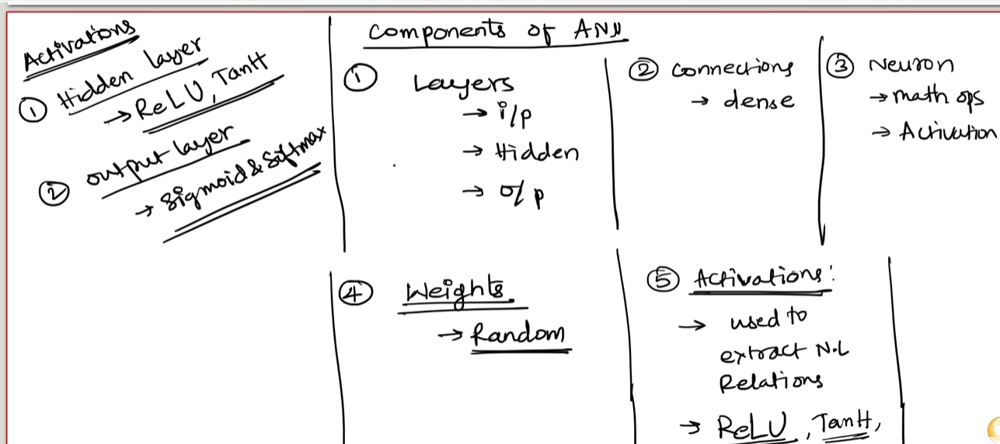

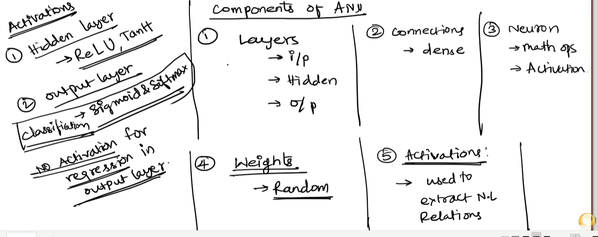

**Image lo components:**

1. Layers
2. Connections
3. Neuron
4. Weights
5. Activations

#### 1. Layers

ANN lo layers:

- Input layer
- Hidden layer
- Output layer

Input layer raw data receive chestundi.
Hidden layer patterns learn chestundi.
Output layer final result istundi.

#### 2. Connections

Connections usually dense/full connections ga untayi.

Dense ante:

```text
Previous layer lo every neuron -> next layer lo every neuron ki connect avtundi
```

#### 3. Neuron

Neuron math operation + activation operation chestundi.

Simple neuron:

```text
weighted sum = w1*x1 + w2*x2 + w3*x3 + bias
output = activation(weighted sum)
```

#### 4. Weights

Weights training start lo random.
Training time lo weights update ayi model learning jarugutundi.

#### 5. Activations

Image lo activation placement:

- Hidden layer: ReLU, Tanh commonly use chestaru.
- Output layer classification: Sigmoid or Softmax use chestaru.
- Output layer regression: Usually no activation / linear output.

#### Line-by-line explanation

1. **`Layers -> i/p, hidden, o/p`**  
   ANN lo data input nundi hidden processing through output ki veltundi.

2. **`Connections -> dense`**  
   Dense connection valla features combinations model learn cheyyagaladu.

3. **`Neuron -> math ops -> activation`**  
   Neuron first weighted sum calculate chestundi, then activation function apply chestundi.

4. **`Weights -> random`**  
   Initially random, training lo update.

5. **`Activations -> extract N.L relations`**  
   Nonlinear patterns learn cheyyadaniki activations required.

6. **`No activation for regression in output layer`**  
   Regression output continuous value. Price 7575, 50000 laanti any real number ravachu. Range restrict cheyyakudadhu.

---

### Image 7: Forward Pass With House Price Values

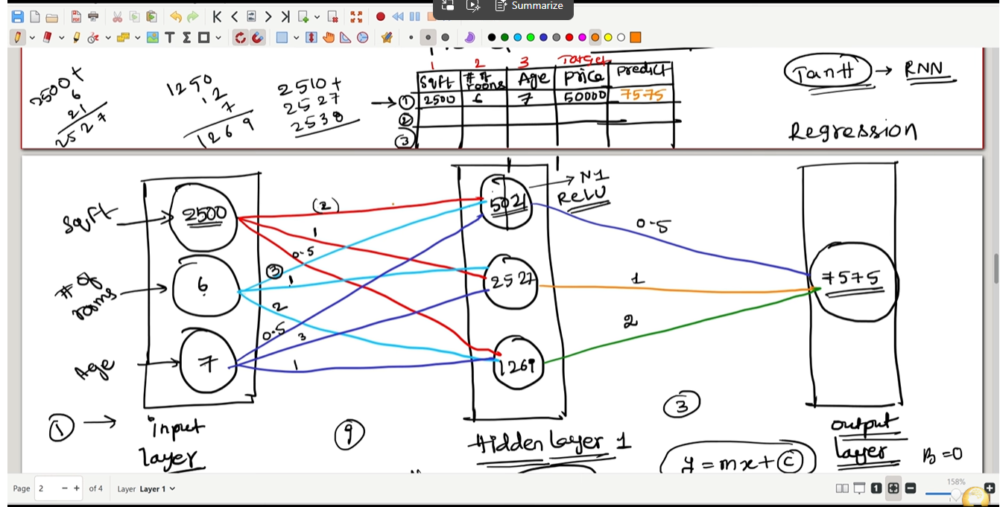

**Image lo idea:** One house row values ANN lo pass chesi price predict chestunnaru.

Input row:

```text
sqft = 2500
rooms = 6
age = 7
target price = 50000
predicted price = 7575
```

#### Step-by-step flow

1. Input layer lo three values enter avtayi.
2. Each value hidden layer neurons ki weights tho connect avtundi.
3. Hidden neuron weighted sum calculate chestundi.
4. Activation function apply chestundi.
5. Hidden layer output output neuron ki send avtundi.
6. Output layer predicted price istundi.

#### Line-by-line explanation

1. **`2500` in input neuron**  
   House square feet value.

2. **`6` in input neuron**  
   Number of rooms.

3. **`7` in input neuron**  
   House age.

4. **Colored lines with numbers**  
   These are weights/connections. Each input hidden neurons ki different importance tho vellutundi.

5. **Hidden neuron values like `5021`, `2527`, `1267`**  
   Weighted sum / activation output example values.

6. **Output `7575`**  
   Model predicted price.

7. **Target `50000`**  
   Actual price. Prediction wrong ga undi.

8. **Regression**  
   Price continuous number kabatti idi regression problem.

#### Important

Prediction first time wrong ravachu because weights random ga start avtayi.
Backpropagation valla weights update ayi prediction improve avtundi.

---

### Image 8: ReLU Activation Function

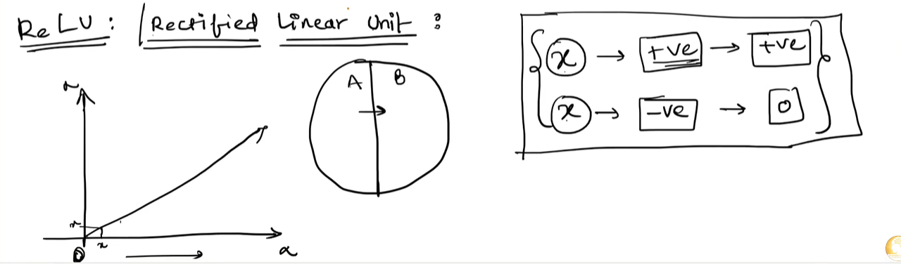

**ReLU full form:** Rectified Linear Unit.

ReLU formula:

```text
ReLU(x) = max(0, x)
```

Meaning:

- Input positive unte same positive value return chestundi.
- Input negative unte 0 return chestundi.

#### Line-by-line explanation

1. **Graph line from 0 upward**  
   Positive input values unchanged ga pass avtayi.

2. **Negative side flat at 0**  
   Negative values output 0 avtayi.

3. **`+ve -> +ve`**  
   Positive input positive output ga remain avtundi.

4. **`-ve -> 0`**  
   Negative input zero ga convert avtundi.

#### Why ReLU use chestam?

ReLU hidden layers lo popular because:

- Simple and fast.
- Vanishing gradient problem reduce chestundi.
- Sparse activation create chestundi.
- Deep networks train cheyyadaniki help chestundi.

#### Example

```text
ReLU(5) = 5
ReLU(0) = 0
ReLU(-3) = 0
```

---

### Image 9: Neuron Linear Relation and Transfer Information

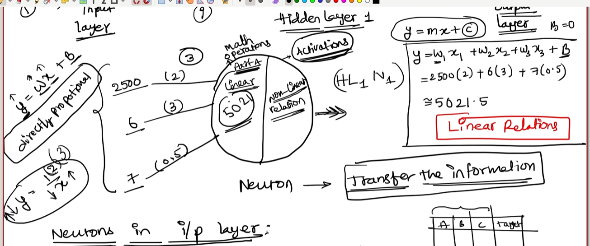

**Image lo formula:** `y = mx + c` and `y = w1x1 + w2x2 + w3x3 + b`

#### Meaning

Neuron first linear calculation chestundi.

For one input:

```text
y = mx + c
```

For multiple inputs:

```text
y = w1*x1 + w2*x2 + w3*x3 + b
```

Where:

- `x1, x2, x3` = input values
- `w1, w2, w3` = weights
- `b` = bias
- `y` = weighted sum

#### Image example calculation

```text
y = 2500(2) + 6(3) + 7(0.5)
y = 5000 + 18 + 3.5
y = 5021.5
```

#### Line-by-line explanation

1. **`direct proportion`**  
   Input and output madhya relation simple linear ga calculate chestunnaru.

2. **`w1x1 + w2x2 + w3x3 + b`**  
   Multiple input features weighted sum formula.

3. **Inputs `2500`, `6`, `7`**  
   House features: sqft, rooms, age.

4. **Weights `2`, `3`, `0.5`**  
   Each feature importance values.

5. **Output `5021.5`**  
   Hidden neuron weighted sum result.

6. **Activation**  
   Weighted sum taruvata activation apply chestaru to capture nonlinear relation.

7. **Transfer the information**  
   Neuron calculated information next layer ki send chestundi.

#### Important

Without activation function, layers stack chesina kuda mostly linear relation laga behave chestundi.
Activation function valla nonlinear learning possible avtundi.

---

### Image 10: Error Calculation for House Price Prediction

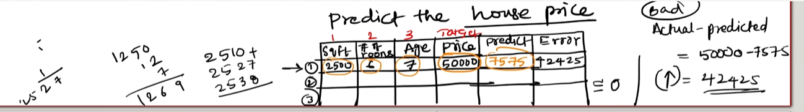

**Image lo idea:** Actual price and predicted price compare chesi error calculate chestunnaru.

Given:

```text
Actual price = 50000
Predicted price = 7575
```

Error:

```text
Error = Actual - Predicted
Error = 50000 - 7575
Error = 42425
```

#### Line-by-line explanation

1. **`Predict the house price`**  
   ANN output layer price prediction generate chestundi.

2. **`Target price = 50000`**  
   Actual value dataset lo already undi.

3. **`Predicted = 7575`**  
   Model current weights tho predicted value.

4. **`Error = Actual - predicted`**  
   Model mistake measure chestunnam.

5. **`50000 - 7575 = 42425`**  
   Prediction actual value kanna chala takkuva undi.

6. **`Goal ≈ 0`**  
   Training goal error ni as small as possible cheyyadam.

#### Why error needed?

Error lekunda model ki mistake teliyadu.
Error basis ga backpropagation weights update chestundi.

Simple flow:

```text
Prediction wrong -> Error calculate -> Backpropagation -> Weights update -> Better prediction
```

---

### Image 11: Backward Propagation and Weight Update

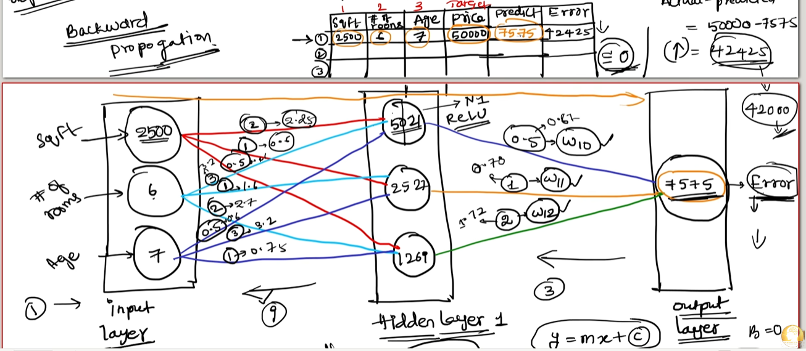

**Image lo main idea:**

Initial weights random ga untayi kabatti first prediction bad/wrong ga ravachu.
Example lo actual price `50000`, model predicted price `7575`.
So error chala high: `42425`.

Ippudu model objective:

```text
Error ni reduce cheyyali
```

Error reduce cheyyadaniki model **backward propagation** use chestundi.

---

#### Why first output bad ga vachindi?

Training start lo model ki correct weights teliyavu.
So weights random ga initialize chestam.

Example:

```text
w1 = random
w2 = random
w3 = random
```

Random weights means:

- sqft ki correct importance teliyadu
- rooms ki correct importance teliyadu
- age ki correct importance teliyadu

So first prediction:

```text
Predicted price = 7575
Actual price = 50000
Error = 42425
```

**Simple Telugu-English:** Model first time guess chestundi. Guess wrong ayithe error high avtundi.

---

#### Backward propagation enduku use chestam?

Backward propagation goal:

```text
Which weight error ki entha responsible?
```

Adi find chesi weights update chestundi.

Simple flow:

```text
Bad prediction -> Error calculate -> Error output layer nundi backward pass -> Weights adjust -> Error reduce
```

Image lo arrows backward direction lo unnayi because error information output layer nundi hidden layer/input side ki move avtundi.

---

#### Training loop complete flow

Training one-time process kaadu.
Forward and backward propagation repeated ga jarugutayi.

```text
1. Random weights initialize chestam
2. Forward propagation chestam
3. Bad prediction ravachu
4. Error calculate chestam
5. Backward propagation chestam
6. Weights update chestam
7. Updated weights tho again forward propagation chestam
8. Error previous kanna reduce avtunda ani check chestam
9. Error close to zero ayye varaku repeat chestam
```

Simple loop:

```text
Forward -> Error -> Backward -> Weight update -> Forward again -> Error reduce -> Repeat
```

**Important:** Goal error exactly zero every time avvali ani kaadu. Practically error **close to zero / minimum possible** avvali.

---

#### Line-by-line image explanation

1. **`Backward Propagation`**  
   Error ni reverse direction lo use chesi weights update cheyyadam.

2. **Input values `2500`, `6`, `7`**  
   House features: sqft, number of rooms, age.

3. **Hidden layer values `5021`, `2527`, `1267`**  
   Hidden neurons weighted calculations after applying weights/activation.

4. **Output `7575`**  
   Current model predicted price.

5. **Actual target `50000`**  
   Real house price.

6. **Error `42425`**  
   Actual - predicted. Model mistake high ga undi.

7. **Backward arrows**  
   Error information output nundi previous layers ki back ga vellutundi.

8. **Weights like `w10`, `w11`, `w12`**  
   Output layer side weights adjust cheyyali ani showing.

9. **New error example `42000`**  
   Weight update taruvata error little reduce ayindi ani idea.

10. **Repeat process**  
    Error gradually reduce avvadaniki forward/backward passes repeat chestam.

---

### Image 12: Objective, Gradient, and Weight Adjustment

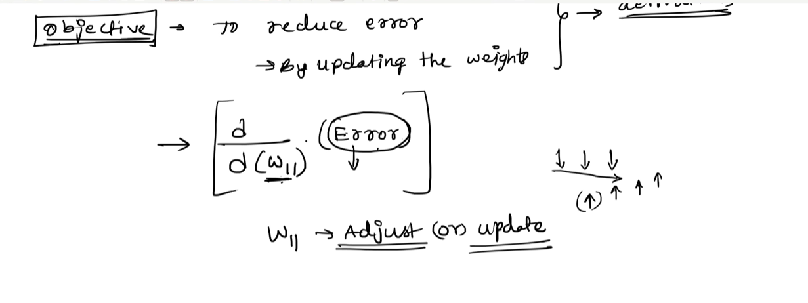

**Image lo main idea:**

Objective:

```text
To reduce error by updating the weight
```

Mathematically, weight update ki gradient use chestam.

Image lo:

```text
d(Error) / d(w11)
```

ani undi.

Meaning:

```text
w11 change chesthe error entha change avtundi?
```

---

#### Gradient ante enti?

Gradient ante slope/direction.
It tells:

- Weight increase cheyyala?
- Weight decrease cheyyala?
- Enta amount update cheyyala?

Simple Telugu-English:

```text
Gradient = error reduce cheyyadaniki weight ni ye direction lo move cheyyalo cheppe signal
```

---

#### Weight update simple formula

```text
new_weight = old_weight - learning_rate * gradient
```

Where:

- `old_weight` = current weight value
- `learning_rate` = update speed
- `gradient` = error direction signal
- `new_weight` = updated weight

#### Line-by-line explanation

1. **`Objective -> to reduce error`**  
   Model training main goal error/loss reduce cheyyadam.

2. **`By updating the weight`**  
   Error reduce avvadam weights correct ga update cheyyadam through jarugutundi.

3. **`d/d(w11)(Error)`**  
   Error w11 weight meeda ela depend avtundo derivative/gradient calculate chestunnam.

4. **`w11 -> adjust or update`**  
   Gradient direction batti w11 value ni update chestam.

5. **Small arrows/down-up drawing**  
   Error landscape lo correct direction lo move avvali ani indicate chestundi.

---

### Vanishing Gradient

Vanishing gradient ante gradient/update signal chala small ga ayipovadam.

Sometimes gradient value almost zero laga avtundi:

```text
gradient ≈ 0
```

Then weight update:

```text
new_weight = old_weight - learning_rate * 0
new_weight ≈ old_weight
```

Meaning:

```text
Weights almost update avvavu
Learning slow/stop avtundi
Information passing weak avtundi
```

Mee point: "sometimes we update with zero that eliminates the info passing from one to another"  
Correct technical meaning: update signal zero/near-zero ayithe previous layers ki useful learning signal velladu.
So earlier layers learn cheyyadam stop ayye chance untundi. Idi **vanishing gradient**.

#### Simple analogy

Teacher student mistake cheppali.
But feedback voice chala low ga undi student ki vinapadaledu.
Student improve avvadu.

Same way:

```text
Tiny gradient -> tiny/no weight update -> model learning slow
```

#### Why vanishing gradient happens?

Common reasons:

- Very deep networks
- Sigmoid/tanh activations repeatedly use cheyyadam
- Poor weight initialization
- Long sequence models lo old information weak avvadam

#### Effects

- Early layers learn cheyyavu
- Training slow avtundi
- Accuracy improve avvakapovachu
- Model stuck ayye chance untundi

---

### Exploding Gradient

Exploding gradient opposite problem.

Gradient value too large ga ayithe:

```text
gradient = very huge
```

Weight update too big avtundi:

```text
new_weight = old_weight - learning_rate * huge_gradient
```

Meaning:

```text
Weights sudden ga huge change avtayi
Training unstable avtundi
Loss increase avvachu
Model NaN/inf values produce cheyyachu
```

#### Simple analogy

Car steering small adjust cheyyali, but sudden ga full turn chesthe accident avvachu.
Same way gradient too large unte model weights dangerously jump chestayi.

#### Why exploding gradient happens?

- Very deep networks
- Large learning rate
- Poor weight initialization
- Recurrent networks lo repeated multiplication

#### Effects

- Loss unstable ga jump avtundi
- Model train avvakapovachu
- Weights very large avtayi
- Output meaningless ga ravachu

---

### Vanishing vs Exploding Gradient

| Topic | Vanishing Gradient | Exploding Gradient |
|---|---|---|
| Gradient size | Very small / near zero | Very large |
| Weight update | Almost no update | Too big update |
| Learning effect | Slow/stop | Unstable |
| Common symptom | Accuracy improve avvakapovadam | Loss suddenly huge/NaN |
| Simple meaning | Signal weak ayindi | Signal too strong ayindi |

---

### Batch Normalization

Batch Normalization ante neural network layers lo values ni normalize cheyyadam.

Simple ga:

```text
Layer input values -> normalize -> stable values -> next layer
```

Normalize ante values ni controlled range/distribution lo ki teesukovadam.

#### Why Batch Normalization use chestam?

Batch normalization helps:

- Training stable ga undadaniki
- Faster convergence ki
- Vanishing/exploding gradient effects reduce cheyyadaniki
- Higher learning rate use cheyyadaniki sometimes
- Overfitting slight ga reduce cheyyadaniki

#### Simple Telugu-English explanation

Hidden layer ki incoming values too large or too small ayithe training unstable avtundi.
Batch normalization aa values ni balanced range lo keep chestundi.

Example:

```text
Before BatchNorm: values = [1000, 5000, -3000]
After BatchNorm: values controlled distribution lo untayi
```

#### Where BatchNorm is used?

Usually:

```text
Dense/Conv layer -> Batch Normalization -> Activation Function
```

or sometimes:

```text
Dense/Conv layer -> Activation Function -> Batch Normalization
```

Common modern pattern depends on architecture, but main idea same: layer values stable ga keep cheyyadam.

---

### How to handle vanishing/exploding gradients?

| Problem | Handling Technique | Meaning |
|---|---|---|
| Vanishing gradient | ReLU/Leaky ReLU | Tiny gradients reduce cheyyadaniki |
| Vanishing gradient | Batch Normalization | Layer values stable ga keep cheyyadaniki |
| Vanishing gradient | Residual connections | Signal direct ga deeper layers ki pass avvadani ki |
| Exploding gradient | Gradient clipping | Gradient too large ayithe cap/limit cheyyadaniki |
| Exploding gradient | Lower learning rate | Weight update size reduce cheyyadaniki |
| Both | Good weight initialization | Training start better ga cheyyadaniki |

---

### Final Training Understanding

Complete story:

```text
Random weights -> bad output -> high error
High error -> backward propagation
Backward propagation -> gradients calculate
Gradients -> weights update
Updated weights -> again forward propagation
New prediction -> error compare
Repeat until error close to zero/minimum
```

But training lo gradient problems ravachu:

```text
Gradient too small -> vanishing gradient -> learning stops/slow
Gradient too large -> exploding gradient -> training unstable
Batch normalization -> values stable -> training smoother
```

**One-line summary:**

ANN first random weights valla bad output istundi; backpropagation error ni use chesi weights update chestundi; repeated forward/backward passes valla error reduce avtundi, but vanishing/exploding gradients avoid cheyyadaniki Batch Normalization, ReLU, clipping laanti techniques use chestam.

---

### Complete Forward Propagation Example From Images

House row:

```text
sqft = 2500
rooms = 6
age = 7
```

Weights for one hidden neuron:

```text
w1 = 2
w2 = 3
w3 = 0.5
b = 0
```

Calculation:

```text
weighted_sum = (2500 * 2) + (6 * 3) + (7 * 0.5) + 0
weighted_sum = 5000 + 18 + 3.5
weighted_sum = 5021.5
```

If ReLU activation:

```text
ReLU(5021.5) = 5021.5
```

Because value positive kabatti ReLU same value return chestundi.

---

### Complete Training Flow From These Images

```text
Step 1: Dataset row select chestam
Step 2: Independent columns input layer ki istam
Step 3: Weights apply chestam
Step 4: Hidden neuron weighted sum calculate chestundi
Step 5: Activation apply chestam
Step 6: Output layer prediction istundi
Step 7: Actual target tho compare chestam
Step 8: Error calculate chestam
Step 9: Backpropagation weights update chestundi
Step 10: Repeated training valla prediction improve avtundi
```

---

### Small Python Calculation for Image Example

```python
sqft = 2500  # House size input value.
rooms = 6  # Number of rooms input value.
age = 7  # House age input value.

w1 = 2  # sqft feature ki assigned weight.
w2 = 3  # rooms feature ki assigned weight.
w3 = 0.5  # age feature ki assigned weight.
bias = 0  # Extra adjustable value.

weighted_sum = (sqft * w1) + (rooms * w2) + (age * w3) + bias  # Neuron weighted sum calculate chestunnam.
relu_output = max(0, weighted_sum)  # ReLU activation apply chestunnam.

actual_price = 50000  # Dataset lo actual house price.
predicted_price = 7575  # Model output layer predicted price example.
error = actual_price - predicted_price  # Actual and predicted difference calculate chestunnam.

print(weighted_sum)  # Hidden neuron calculation result print chestunnam.
print(relu_output)  # ReLU output print chestunnam.
print(error)  # Prediction error print chestunnam.
```

#### Code line-by-line explanation

1. `sqft = 2500` -> House area input feature.
2. `rooms = 6` -> Rooms count input feature.
3. `age = 7` -> House age input feature.
4. `w1 = 2` -> sqft importance weight.
5. `w2 = 3` -> rooms importance weight.
6. `w3 = 0.5` -> age importance weight.
7. `bias = 0` -> neuron output adjust cheyyadaniki bias.
8. `weighted_sum = ...` -> neuron math operation.
9. `relu_output = max(0, weighted_sum)` -> negative values 0, positive values same.
10. `actual_price = 50000` -> real answer.
11. `predicted_price = 7575` -> model predicted answer.
12. `error = actual_price - predicted_price` -> model mistake.
13. `print(...)` lines -> results display cheyyadaniki.

---

### Final Summary Table

| Topic | Simple meaning |
|---|---|
| Input layer neurons | Independent columns count ki equal |
| Hidden layer neurons | Hyperparameter; manually choose/experiment |
| Output neurons regression | 1 neuron |
| Output neurons binary classification | 1 neuron with sigmoid |
| Output neurons multi-class classification | Number of categories/classes |
| Dense connections | Every neuron previous layer nundi next layer ki connect avtundi |
| Weights | Feature importance values; training lo update avtayi |
| Bias | Prediction adjust cheyyadaniki extra value |
| Activation | Nonlinear relation learn cheyyadaniki |
| ReLU | Positive same, negative zero |
| Forward propagation | Input -> hidden -> output prediction |
| Error | Actual - predicted |
| Backpropagation | Error basis ga weights update |
| Vanishing gradient | Gradient near zero ayyi weights update avvakapovadam |
| Exploding gradient | Gradient huge ayyi weights unstable ga update avvadam |
| Batch normalization | Layer values stable ga normalize cheyyadam |

---

## Quick Revision

- **Deep Learning** = Machine Learning lo neural networks use chese advanced technique.
- **Neural Network** = connected artificial neurons/layers collection.
- **ANN** = Artificial Neural Network; Deep Learning ki basic foundation.
- **ANN Architecture** = Input Layer -> Hidden Layers -> Output Layer.
- **Perceptron** = simplest neural network / basic decision-making neuron.
- **Deep Neural Network** = more than one hidden layer unna ANN.
- **Forward Propagation** = input nundi output varaku prediction generate cheyyadam.
- **Backward Propagation** = prediction error use chesi weights update cheyyadam.
- **Activation Function** = neuron output decide chesi non-linearity add cheyyadam.
- **Sigmoid** = raw score ni 0 to 1 probability ga convert chestundi; binary classification lo use chestam.
- **Softmax** = multiple class scores ni probabilities ga convert chestundi; highest probability class final prediction.
- **More layers caution** = useful layers help chestayi, but too many layers overfitting ki lead cheyyachu.
- **Vanishing Gradient** = gradient near zero ayyi information/learning signal weak avvadam.
- **Exploding Gradient** = gradient very large ayyi training unstable avvadam.
- **Batch Normalization** = layer values normalize chesi training stable and faster cheyyadam.
- **CNN** = images/videos lo visual patterns learn cheyyadaniki.
- **YOLO** = object detection kosam, object location + label identify cheyyadaniki.
- **RNN/LSTM** = sequence data like text, audio, time-series kosam.
- **Transformers** = modern text/LLM/translation/summarization models ki foundation.
- **Input layer neurons** = independent feature columns count ki equal.
- **Hidden layer neurons** = hyperparameter; experiment chesi choose cheyyali.
- **Output layer neurons** = regression ki 1, binary classification ki 1, multi-class ki classes count.
- **Dense connections** = previous layer neurons anni next layer neurons ki connect avvadam.
- **ReLU** = positive value same, negative value 0.
- **Error** = actual value and predicted value madhya difference.
- **DL need** = large data, complex patterns, images/text/audio laanti unstructured data handle cheyyadaniki.
- **ML** = feature engineering mostly human chestaru.
- **DL** = features model automatic ga learn chestundi.
- **ML best** = structured/tabular data.
- **DL best** = images, audio, text, video, large-scale data.

---

## One-line Summary

Deep Learning ante neural networks use chesi data nundi patterns automatic ga learn chese ML technique; large and complex data problems ki chala powerful.