# <span style="color:#0B7285;"><strong>Data Analysis with Python — Complete Guide</strong></span>

<p>
<span style="color:#2B8A3E;"><strong>Short Answer:</strong></span>
Data Analysis ki Python lo 4 main libraries: <strong>NumPy</strong> (math/arrays), <strong>Pandas</strong> (tables/data), <strong>Matplotlib</strong> (charts), <strong>Seaborn</strong> (beautiful stats charts). Ee 4 kalipi nerchukunte, data analysis 90% complete.
</p>

<p><span style="color:#C92A2A;"><strong>Important Note:</strong></span> Ee file lo unna code antha <strong>real ga run chesi verify chesam</strong> — Python 3.14.6, NumPy 2.4.6, Pandas 3.0.3, Matplotlib 3.11.0, Seaborn 0.13.2. Outputs kuda actual outputs. YouTube lo unna old tutorials Pandas 1.x version vi — konni cheyyi <strong>Pandas 3.0 lo pani cheyyavu</strong>. Aa traps section 8 lo chuddam.</p>

---

## <span style="color:#364FC7;"><strong>1) Data Analysis Ante Enti?</strong></span>

<strong>Data Analysis</strong> = raw data teesukoni, clean chesi, patterns kanukoni, business decision ki useful information ga marchadam.

Simple ga steps:

1. <strong>Collect</strong> — data teesukovadam (CSV, Excel, Database, API)
2. <strong>Clean</strong> — missing values, duplicates, wrong types fix cheyyadam
3. <strong>Explore</strong> — data ela undo chudadam (EDA)
4. <strong>Analyze</strong> — grouping, comparison, relationships kanukovadam
5. <strong>Visualize</strong> — charts through story cheppadam
6. <strong>Conclude</strong> — insights cheppadam

<p><span style="color:#E67700;"><strong>Reality Check:</strong></span> Real job lo <strong>80% time cleaning</strong> ki పోతుంది, 20% matrame actual analysis. Anduke Pandas cleaning part chaala important.</p>

### <strong>Real Life Analogy</strong>

- Raw data = market nunchi vachina vegetables (mud, damaged pieces tho)
- Cleaning = wash cheyyadam, bad pieces teeyyadam
- Analysis = cut chesi, measure cheyyadam
- Visualization = plate lo present cheyyadam
- Insight = "ee curry tasty ga undi" ane final conclusion

---

## <span style="color:#5F3DC4;"><strong>2) Ee Libraries Enduku? — Overview</strong></span>

| Library | Deni kosam | Simple ga cheppali ante |
|---|---|---|
| <strong>NumPy</strong> | Numbers, arrays, fast math | Foundation — anni libraries deeni meeda build ayyayi |
| <strong>Pandas</strong> | Tables (rows/columns), cleaning | Excel, kaani Python lo + chaala powerful |
| <strong>Matplotlib</strong> | Basic charts | Full control undi, kaani code ekkuva |
| <strong>Seaborn</strong> | Statistical charts | Takkuva code, andamaina charts |

### <strong>Kitchen Analogy</strong>

- <strong>NumPy</strong> = stove (base heat — anni deeni meeda pani chestay)
- <strong>Pandas</strong> = cutting board + vessels (actual work ikkade)
- <strong>Matplotlib</strong> = plain plate (meeru ela kavalante ala arrange cheyyachu)
- <strong>Seaborn</strong> = decorated plate (already design ready)

### <strong>Install Commands</strong>

```bash
pip install numpy pandas matplotlib seaborn
# leda conda tho
conda install numpy pandas matplotlib seaborn
```

### <strong>Standard Import Style</strong>

```python
import numpy as np
import pandas as pd
import matplotlib.pyplot as plt
import seaborn as sns
```

<p><span style="color:#C92A2A;"><strong>Main Point:</strong></span> Ee <code>np</code>, <code>pd</code>, <code>plt</code>, <code>sns</code> short names <strong>worldwide standard</strong>. Vere names pettakandi — interview lo, GitHub lo andaru ivi ne use chestaru.</p>

---

## <span style="color:#087F5B;"><strong>3) NumPy — Foundation Library</strong></span>

### <strong>3.1 NumPy Enduku? Python List Chalada?</strong>

Python list unna kada, marintha NumPy enduku? Rendu reasons: <strong>speed</strong> and <strong>memory</strong>.

```python
import numpy as np, time, sys

N = 1_000_000
lst = list(range(N))
arr = np.arange(N)

# Python list — prati element ki loop tirugutundi
t = time.perf_counter()
result1 = [x * 2 for x in lst]
print(f"list: {(time.perf_counter()-t)*1000:.1f} ms")

# NumPy — okka operation lo motham array
t = time.perf_counter()
result2 = arr * 2
print(f"numpy: {(time.perf_counter()-t)*1000:.1f} ms")
```

<strong>Real Output (verify chesam):</strong>

```
list: 83.1 ms
numpy: 4.4 ms
```

<p><span style="color:#2F9E44;"><strong>Result:</strong></span> NumPy <strong>~19x faster</strong>. Memory kuda: same 1 million numbers ki list <strong>34 MB</strong> teesukuntundi, NumPy array <strong>7 MB</strong> matrame (~4.5x takkuva).</p>

<strong>Enduku ee difference?</strong>

- Python list lo prati number oka <strong>separate object</strong> — memory lo chettha chedirina chotla untundi
- NumPy array lo numbers <strong>continuous memory block</strong> lo untay, anni same type
- Anduke CPU okesari bunch of numbers meeda operation cheyyagaladu (deenine <strong>vectorization</strong> antaru)

### <strong>3.2 Array Create Cheyyadam</strong>

Modati 1D array — idi basic starting point:

```python
import numpy as np

## create array using numpy
## create a 1D array
arr1 = np.array([1, 2, 3, 4, 5])
print(arr1)
print(type(arr1))
print(arr1.shape)
```

<strong>Real Output:</strong>

```
[1 2 3 4 5]
<class 'numpy.ndarray'>
(5,)
```

Ee 3 lines lo manam telusukunedi:

- <code>print(arr1)</code> → NumPy print chesetappudu <strong>commas undavu</strong>. Python list aithe `[1, 2, 3, 4, 5]` ani commas tho vachedi. Ee difference batti list a, array a ani chudochu.
- <code>type(arr1)</code> → <strong><code>numpy.ndarray</code></strong>. "ndarray" ante <strong>N-Dimensional Array</strong> — ante 1D, 2D, 3D, entha dimensions aina idhe class.
- <code>arr1.shape</code> → <strong><code>(5,)</code></strong>

<p><span style="color:#C92A2A;"><strong>Aa Comma Enduku? — Chaala Mandi Doubt:</strong></span> <code>(5,)</code> lo chivarilo comma chusi confuse avvakandi. Idi Python <strong>tuple</strong> — okate element unna tuple ki comma tappanisari. <code>(5)</code> ani rasthe adi just number 5 avutundi, tuple kaadu. So <code>(5,)</code> ante <strong>"1 dimension, andulo 5 elements"</strong>. 2D aithe <code>(2, 3)</code> ani rendu numbers vastay — appudu comma matter cheyyadu.</p>

<strong>shape vs ndim vs size — teda telusukondi:</strong>

| Attribute | Ante enti | `[1,2,3,4,5]` ki |
|---|---|---|
| `shape` | Prati dimension lo entha elements | `(5,)` |
| `ndim` | Entha dimensions unnayi | `1` |
| `size` | Motham entha elements | `5` |
| `dtype` | Data type | `int64` |

### <strong>3.3 2D Array — Nested List tho Create Cheyyadam</strong>

Reshape lekunda, <strong>direct ga</strong> 2D array create cheyyachu — <strong>list lopala list</strong> pettadam.

```python
arr2 = np.array([[1, 2, 3, 4, 5]])      # ← rendu brackets gamaninchandi
arr2.shape
```

<strong>Real Output:</strong>

```
(1, 5)
```

<p><span style="color:#2F9E44;"><strong>Connect Chesukondi:</strong></span> Section 3.5 lo <code>reshape(1, 5)</code> chuddam — dani <strong>result kuda exact ga idhe</strong>. Ante 2D array ki <strong>rendu daarulu</strong>: (1) 1D create chesi reshape cheyyadam, (2) modate double brackets tho direct ga raayadam. Meeku నచ్చినది vaadandi.</p>

<strong>Ippudu nijamaina 2D — rendu rows:</strong>

```python
arr2 = np.array([[1, 2, 3, 4, 5],
                 [2, 3, 4, 5, 6]])
print(arr2)
print(arr2.shape)
```

<strong>Real Output:</strong>

```
[[1 2 3 4 5]
 [2 3 4 5 6]]
(2, 5)
```

<strong>Idi ela chadavali:</strong>

- <strong>Outer bracket</strong> `[ ]` = motham array
- <strong>Lopala prati bracket</strong> = oka <strong>row</strong>
- Ikkada 2 inner lists unnayi → <strong>2 rows</strong>
- Prati inner list lo 5 numbers → <strong>5 columns</strong>
- Anduke shape = <strong>(2, 5)</strong> → <strong>(rows, columns)</strong>

```python
arr2.ndim        # 2      → ippudu 2 dimensions
arr2.size        # 10     → 2 × 5 = motham 10 elements
arr2.shape[0]    # 2      → rows count
arr2.shape[1]    # 5      → columns count

arr2[0]          # [1 2 3 4 5]   → modati row
arr2[1, 2]       # 4             → row 1, column 2
```

<p><span style="color:#E67700;"><strong>Gurthu Pettukondi:</strong></span> <code>shape</code> lo <strong>eppudu rows modata, columns tarvata</strong>. <code>(2, 5)</code> ante 2 rows 5 columns — <strong>5 rows 2 columns kaadu</strong>. Beginners ikkada tarachuga tappu chestaru. Excel lo lekka — mundu entha rows, tarvata entha columns.</p>

### <strong><span style="color:#C92A2A;">⚠️ print() vs Direct Output — Rendu Different ga Kanipistay</span></strong>

Jupyter lo idi chusi chaala mandi confuse avutaru:

```python
arr2 = np.array([[1,2,3,4,5],[2,3,4,5,6]])

arr2              # ← cell chivarilo variable name matrame
```

```
array([[1, 2, 3, 4, 5],
       [2, 3, 4, 5, 6]])
```

```python
print(arr2)       # ← print() vaadithe
```

```
[[1 2 3 4 5]
 [2 3 4 5 6]]
```

<p><span style="color:#C92A2A;"><strong>Difference Enti?</strong></span> Data <strong>okate</strong> — chupinche vidhanam matrame veru:</p>

| | Cell chivarilo variable | `print()` tho |
|---|---|---|
| Peru | <strong>repr</strong> (developer view) | <strong>str</strong> (human view) |
| `array(...)` word | Vastundi | Raadu |
| Commas | Vastay | <strong>Raavu</strong> |
| Eppudu useful | Type telusukovadaniki | Data chudadaniki |

<p><span style="color:#2F9E44;"><strong>Tip:</strong></span> <code>array(</code> word kanipisthe — adi <strong>NumPy array</strong> ani confirm. Commas tho brackets matrame kanipisthe adi <strong>Python list</strong> avvachu. Debug chesetappudu ee difference help chestundi.</p>

### <strong><span style="color:#C92A2A;">⚠️ Trap: Prati Row Same Length Undali</span></strong>

```python
np.array([[1, 2, 3],
          [4, 5]])        # ← modati row 3, rendo row 2
```

<strong>Real Error:</strong>

```
ValueError: setting an array element with a sequence.
The requested array has an inhomogeneous shape after 1 dimensions.
```

<p><span style="color:#C92A2A;"><strong>Enduku?</strong></span> "Inhomogeneous" ante <strong>samanam kaadu</strong> ani. NumPy array <strong>rectangle</strong> (dabba) laantidi — prati row lo <strong>same number of elements</strong> undali. Excel table lo oka row lo 3 cells, inko row lo 2 cells undadam kudaradu kada — ade lekka. Different lengths kavalante Python list vaadali, leda missing chota <code>np.nan</code> pettali.</p>

### <strong>Array Attributes — Anni Okate Chota</strong>

Ippudu 2D array telisindi kabatti, <strong>anni attributes okesari</strong> chuddam. Ee cell prati kotha array ki run chesthe, aa array gurinchi complete picture vastundi:

```python
arr = np.array([[1, 2, 3], [4, 5, 6]])

print("Array:\n", arr)
print("Shape:", arr.shape)
print("Number of dimensions:", arr.ndim)
print("Size (number of elements):", arr.size)
print("Data type:", arr.dtype)
print("Item size (in bytes):", arr.itemsize)
```

<strong>Real Output (mee Windows machine meeda run chesam):</strong>

```
Array:
 [[1 2 3]
 [4 5 6]]
Shape: (2, 3)
Number of dimensions: 2
Size (number of elements): 6
Data type: int64
Item size (in bytes): 8
```

<strong>Prati okkati ento:</strong>

| Attribute | Value | Ante enti |
|---|---|---|
| `shape` | `(2, 3)` | 2 rows, 3 columns |
| `ndim` | `2` | 2 dimensions (2D array) |
| `size` | `6` | Motham 6 numbers (2 × 3) |
| `dtype` | `int64` | Prati number integer, 64 bits |
| `itemsize` | `8` | <strong>Oka</strong> number ki 8 bytes memory |
| `nbytes` | `48` | Motham array memory (6 × 8) |

<p><span style="color:#2F9E44;"><strong>Lekka Kalisindi:</strong></span> <code>itemsize</code> = oka element ki entha bytes. <code>size × itemsize = nbytes</code> → <strong>6 × 8 = 48 bytes</strong>. 64 bits = 8 bytes, anduke <code>int64</code> ki itemsize 8. <code>int32</code> aithe 4 vastundi. Idi verify chesam.</p>

<p><span style="color:#C92A2A;"><strong>"May vary based on platform" — Deeni Artham:</strong></span> Konni tutorials lo "dtype platform batti maarutundi" ani rasi untundi. <strong>Nijam:</strong> <strong>NumPy 1.x</strong> lo Windows meeda default <code>int32</code> (itemsize 4), Linux/Mac meeda <code>int64</code> undedi. <strong>NumPy 2.0 nunchi Windows lo kuda <code>int64</code></strong> ni default chesaru. Meeru NumPy 2.4.6 vaadutunnaru, so <strong>meeku int64 ne vastundi</strong> — mee output lo adhe vachindi. Old tutorial lo int32 chusi confuse avvakandi.</p>

<p><span style="color:#E67700;"><strong>Enduku Ivi Muktyam:</strong></span> Pedda dataset lo <code>dtype</code> memory ni direct ga decide chestundi. 10 lakshala rows unna data <code>int64</code> lo 8 MB, <code>int32</code> lo 4 MB — <strong>sagam savings</strong>. Values chinnave aithe <code>df["col"].astype("int32")</code> chesi memory tagginchachu. Idi real job lo vaade optimization.</p>

### <strong><span style="color:#C92A2A;">⚠️ Trap: Array lo Anni Same Type Undali</span></strong>

Python list lo different types kalapachu. NumPy array lo <strong>kudaradu</strong> — anni okate type ki <strong>automatic ga convert</strong> avutay:

```python
np.array([1, 2.5]).dtype      # float64   ← int, float kalisthe → anni float
np.array([1, "a"]).dtype      # <U21      ← string kalisthe → anni STRING!
```

<p><span style="color:#C92A2A;"><strong>Danger:</strong></span> Rendo line lo <code>1</code> ane number kuda <strong>"1" ane text</strong> ga maripoyindi (<code>&lt;U21</code> ante Unicode string). Appudu <code>arr.mean()</code> lanti maths cheyyalem — error vastundi. CSV load chesinappudu oka column lo pొరపాటుగా text unte idhe jarugutundi. Anduke <strong>eppudu <code>dtype</code> check cheyyandi</strong>.</p>

<p><span style="color:#2F9E44;"><strong>Rule:</strong></span> NumPy <strong>"nashtam leni" (safe) direction</strong> lo convert chestundi — int → float → string. Data podupu avvakunda undataniki. Kaani meeku kavalsindi numbers aithe, ee automatic conversion problem — <code>pd.to_numeric(errors="coerce")</code> tho fix cheyyandi (section 5.3 lo chuddam).</p>

### <strong>Ready-Made Arrays — Values Type Cheyyakunda</strong>

Pedda array kavalante prati number type cheyyalema? Avasaram ledu — NumPy ready-made functions istundi.

```python
np.ones((3, 4))
```

<strong>Real Output:</strong>

```
array([[1., 1., 1., 1.],
       [1., 1., 1., 1.],
       [1., 1., 1., 1.]])
```

<code>(3, 4)</code> ichham → <strong>3 rows, 4 columns</strong> anni 1 tho nindipoyayi.

<p><span style="color:#C92A2A;"><strong>Aa Dot Enduku? — <code>1.</code> vs <code>1</code>:</strong></span> Output lo <code>1.</code> ani <strong>dot</strong> tho undi, <code>1</code> kaadu. Dot ante adi <strong>float</strong> (decimal number) ani artham — <code>1.</code> ante nijaniki <code>1.0</code>. <code>np.ones()</code> and <code>np.zeros()</code> <strong>by default float64</strong> istay, integers kaadu. Idi verify chesam: <code>np.ones((3,4)).dtype</code> → <code>float64</code>.</p>

<strong>Integers kavalante:</strong>

```python
np.ones((2, 3), dtype=int)
# array([[1, 1, 1],
#        [1, 1, 1]])     ← ippudu dots levu
```

<strong>Migatha ready-made functions:</strong>

```python
np.zeros((2, 3))         # anni 0 lu (float)
np.ones((3, 4))          # anni 1 lu (float)
np.full((2, 3), 7)       # anni 7 lu → [[7,7,7],[7,7,7]]
np.eye(3)                # identity matrix (kinda vivaram undi)
np.linspace(0, 1, 5)     # [0. 0.25 0.5 0.75 1.]  → 5 equal parts
np.random.rand(2, 3)     # 2x3 random numbers (0 to 1)
```

<p><span style="color:#2F9E44;"><strong>Real Use:</strong></span> <code>np.zeros()</code> tho khaali "dabba" create chesi, tarvata loop lo values fill chestaru. Deep learning lo weights initialize cheyyadaniki <code>np.ones()</code>, <code>np.random</code> vaadataru. Image processing lo black image ante motham <code>np.zeros()</code> ne.</p>

### <strong>Identity Matrix — <code>np.eye()</code></strong>

```python
## identity matrix
np.eye(3)
```

<strong>Real Output:</strong>

```
array([[1., 0., 0.],
       [0., 1., 0.],
       [0., 0., 1.]])
```

<p><span style="color:#C92A2A;"><strong>Identity Matrix Ante Enti?</strong></span> <strong>Diagonal</strong> lo (mundu-nunchi-venakaki gunta) anni <strong>1</strong>, migatha anni <strong>0</strong> unna square matrix. <code>np.eye(3)</code> ante <strong>3×3</strong> — meeru okate number ivvali chalu, square kabatti.</p>

<strong>Enduku "eye" ani peru?</strong> Maths lo identity matrix ni <strong>"I"</strong> ane letter tho rastaru. Aa "I" ni English lo palakithe <strong>"eye"</strong> — ade function peru. (Kannu tho sambandham ledu 😄)

<strong>Deeni special enti?</strong> Number 1 laantidi. <code>5 × 1 = 5</code> ela unnado, ala <strong>matrix × identity = ade matrix</strong>. Marchakunda ala ne untundi.

```python
np.eye(3).dtype       # float64   ← anduke dots (1.) kanipistunnayi
np.eye(3, dtype=int)  # dots lekunda kavalante
np.eye(2, 3)          # square kaakunda kuda cheyyachu → 2 rows, 3 columns
```

<p><span style="color:#E67700;"><strong>Ekkada Vaadataru:</strong></span> Linear algebra lo matrix inverse, equations solve cheyyadaniki. Machine Learning lo regularization formula lo. Beginner stage lo roju vaadaru — kaani interview lo "identity matrix ante enti" ani adagachu, so concept telisi undandi.</p>

### <strong><span style="color:#C92A2A;">⚠️ Trap: Rendu Brackets Tappanisari</span></strong>

```python
np.ones((3, 4))     # ✅ correct — shape oka tuple ga
np.ones(3, 4)       # ❌ TypeError
```

<strong>Real Error:</strong>

```
TypeError: Cannot interpret '4' as a data type
```

<p><span style="color:#C92A2A;"><strong>Enduku Ee Vintha Error?</strong></span> <code>np.ones(shape, dtype)</code> — rendo parameter <strong>dtype</strong>. So <code>np.ones(3, 4)</code> rasthe, NumPy anukuntundi "shape = 3, dtype = 4" ani. <code>4</code> ni data type ga marchalekapoyi aa error isthundi. Anduke shape ni <strong>okate tuple</strong> ga — <code>(3, 4)</code> — ivvali. Ade rendu brackets reason.</p>

<p><span style="color:#E67700;"><strong>Exception:</strong></span> 1D kavalante okate number ivvachu — <code>np.ones(3)</code> → <code>[1. 1. 1.]</code>. Rendu kanna ekkuva dimensions unnappude tuple tappanisari.</p>

### <strong>3.4 arange() — Range lo Numbers Generate Cheyyadam</strong>

```python
np.arange(0, 10, 2)
```

<strong>Real Output:</strong>

```
array([0, 2, 4, 6, 8])
```

<strong>3 parts:</strong> <code>np.arange(start, stop, step)</code>

- <strong>start</strong> = `0` → ikkada nunchi start
- <strong>stop</strong> = `10` → ikkada varaku (<strong>10 raadu!</strong>)
- <strong>step</strong> = `2` → prati sari 2 add cheyyi

So: 0, 2, 4, 6, 8 → tarvata 10 vastundi kaani <strong>stop reach ayindi kabatti aagipotundi</strong>.

<p><span style="color:#C92A2A;"><strong>Main Point — Stop Raadu:</strong></span> Idi Python <code>range()</code> laantide. <code>arange(0, 10, 2)</code> lo <strong>10 asalu raadu</strong>. 10 kuda kavalante <code>np.arange(0, 11, 2)</code> ani raayali. Ee "off by one" mistake beginners ki chaala common.</p>

<strong>Different vidhalu:</strong>

```python
np.arange(5)           # array([0, 1, 2, 3, 4])       → start=0, step=1 default
np.arange(1, 6)        # array([1, 2, 3, 4, 5])       → start ichham, step=1
np.arange(0, 10, 2)    # array([0, 2, 4, 6, 8])       → 3 parts
np.arange(0, 1, 0.25)  # array([0., 0.25, 0.5, 0.75]) → decimal step kuda works
```

<strong>arange vs linspace — teda:</strong>

| | `np.arange(0, 1, 0.25)` | `np.linspace(0, 1, 5)` |
|---|---|---|
| Meeru cheppedi | <strong>Step size</strong> (entha gap) | <strong>Entha numbers</strong> kavali |
| Result | `[0, 0.25, 0.5, 0.75]` | `[0, 0.25, 0.5, 0.75, 1.]` |
| Last value | <strong>Raadu</strong> | <strong>Vastundi</strong> |

<p><span style="color:#E67700;"><strong>Eppudu Edi?</strong></span> Gap entha undalo meeku telisthe <code>arange</code>. Motham entha points kavalo telisthe <code>linspace</code>. Charts ki x-axis values create chesetappudu <code>linspace</code> better — endukante last value kuda vastundi.</p>

### <strong>3.5 Reshape — Shape Marchadam</strong>

<strong>Reshape</strong> ante same data ni <strong>vere shape</strong> lo arrange cheyyadam. Data marchadu, arrangement matrame marutundi.

```python
arr2 = np.array([1, 2, 3, 4, 5])
arr2.reshape(1, 5)
```

<strong>Real Output:</strong>

```
array([[1, 2, 3, 4, 5]])
```

<p><span style="color:#E67700;"><strong>Double Brackets Gamaninchandi:</strong></span> Mundu <code>[1 2 3 4 5]</code> — <strong>okate bracket</strong> (1D). Ippudu <code>[[1, 2, 3, 4, 5]]</code> — <strong>rendu brackets</strong> (2D). Ante ippudu idi <strong>1 row, 5 columns</strong> unna matrix. Shape <code>(5,)</code> nunchi <code>(1, 5)</code> ki maarindi.</p>

<strong>Same 5 elements, different shapes:</strong>

```python
arr2.reshape(1, 5)    # [[1, 2, 3, 4, 5]]        → 1 row, 5 columns
arr2.reshape(5, 1)    # [[1], [2], [3], [4], [5]] → 5 rows, 1 column
```

<strong>`-1` Trick — NumPy ne calculate chesukuntundi:</strong>

```python
arr2.reshape(-1, 1)   # shape (5, 1)  ← rows entha kavalo NumPy chusukuntundi
arr2.reshape(1, -1)   # shape (1, 5)  ← columns entha kavalo NumPy chusukuntundi
```

<p><span style="color:#2F9E44;"><strong>Real Use:</strong></span> Machine Learning lo <code>reshape(-1, 1)</code> chaala vastundi. Scikit-learn ki input eppudu 2D kavali, kaani manaki 1D data untundi. Appudu <code>X.reshape(-1, 1)</code> chesi istaru. Meeru elements entha unnayo lekka pettakkarleru — <code>-1</code> pettandi chalu.</p>

### <strong><span style="color:#C92A2A;">⚠️ Trap: Reshape Original Array ni Marchadu</span></strong>

Idi chaala mandi miss ayye point:

```python
arr2 = np.array([1, 2, 3, 4, 5])
arr2.reshape(1, 5)        # output kanipistundi...

print(arr2)               # [1 2 3 4 5]      ← arr2 ala ne undi!
print(arr2.shape)         # (5,)             ← shape marale!
```

<p><span style="color:#C92A2A;"><strong>Enduku?</strong></span> <code>reshape()</code> <strong>kotha array return chestundi</strong> — original ni touch cheyyadu. Jupyter lo output kanipinchindi kada ani "ayipoyindi" anukuntam, kaani <code>arr2</code> lo emi marale. Idi Pandas <code>inplace=True</code> trap (section 8) laantide — <strong>assign back cheyyali</strong>.</p>

```python
# ✅ Correct — assign cheyyandi
arr2 = arr2.reshape(1, 5)
print(arr2.shape)         # (1, 5)  ← ippudu marindi

# leda kotha variable lo pettandi
arr_2d = arr2.reshape(1, 5)
```

<p><span style="color:#E67700;"><strong>Advanced Point (verify chesam):</strong></span> Reshape <strong>view</strong> return chestundi, copy kaadu — ante rendu arrays <strong>same memory</strong> share chestay. So kotha array lo value marchithe, <strong>original data kuda marutundi</strong>:</p>

```python
arr2 = np.array([1, 2, 3, 4, 5])
out = arr2.reshape(1, 5)
out[0, 0] = 99
print(arr2)        # [99  2  3  4  5]   ← arr2 kuda maarindi!
```

Ante: reshape <strong>shape</strong> ni marchadu (assign cheyyakapothe), kaani <strong>data</strong> ni share chestundi. Separate copy kavalante <code>arr2.reshape(1, 5).copy()</code> vaadandi.

### <strong><span style="color:#C92A2A;">⚠️ Trap: Reshape Error — Size Match Avvali</span></strong>

```python
arr2 = np.array([1, 2, 3, 4, 5])
arr2.reshape(1, 4)
```

<strong>Real Error:</strong>

```
ValueError: cannot reshape array of size 5 into shape (1,4)
```

<p><span style="color:#C92A2A;"><strong>Enduku Error?</strong></span> Manaki <strong>5 elements</strong> unnayi. <code>(1, 4)</code> ante 1 row × 4 columns = <strong>4 slots</strong> matrame. 5 items ni 4 boxes lo pettalem kada — anduke error. NumPy elementary ni podupu cheyyadu, elementary ni create kuda cheyyadu.</p>

<strong>Golden Rule:</strong>

```
rows × columns = total elements     ← ee lekka సరిపోవాలి

5 elements ki valid shapes:
  (1, 5)  → 1 × 5 = 5   ✅
  (5, 1)  → 5 × 1 = 5   ✅
  (5,)    → 5           ✅
  (1, 4)  → 1 × 4 = 4   ❌ ValueError
  (2, 3)  → 2 × 3 = 6   ❌ ValueError
```

<p><span style="color:#2F9E44;"><strong>Simple Analogy:</strong></span> 5 mandi students ni chairs lo kurchobettali. 1 row lo 5 chairs pedithe సరిపోతుంది. 1 row lo 4 chairs matrame pedithe — okaru nilabadali. NumPy ki adi accept kaadu, anduke error isthundi. Chairs count eppudu students count ki సమానంగా undali.</p>

<p><span style="color:#E67700;"><strong>Error Debug Cheyyadam:</strong></span> Ee error vasthe modata <code>arr.size</code> print cheyyandi — motham entha elements unnayo telustundi. Tarvata aa number ki <strong>factors</strong> emi unnayo chudandi. 12 elements aithe (2,6), (3,4), (6,2), (12,1), (1,12) — anni valid. 5 lanti <strong>prime number</strong> aithe (1,5) and (5,1) matrame possible.</p>

### <strong>Chaining — Rendu Functions Okate Line lo</strong>

NumPy functions <strong>array return chestay</strong>, kabatti vaatini <strong>vempu vempu (chain)</strong> ga kalapachu:

```python
np.arange(0, 10, 2).reshape(5, 1)
```

<strong>Real Output:</strong>

```
array([[0],
       [2],
       [4],
       [6],
       [8]])
```

<strong>Step by step emi jarigindi:</strong>

```
np.arange(0, 10, 2)      →  array([0, 2, 4, 6, 8])     shape (5,)   ← 1D
        .reshape(5, 1)   →  5 rows, 1 column            shape (5, 1) ← 2D
```

- Modata <code>arange</code> run avutundi → 5 elements unna 1D array
- Aa result <strong>meeda</strong> <code>reshape(5, 1)</code> run avutundi → column ga niluvuga marutundi
- Left nunchi right ki <strong>order lo</strong> execute avutundi

<p><span style="color:#2F9E44;"><strong>Size Check:</strong></span> 5 elements → <code>(5, 1)</code> ante 5 × 1 = 5. ✅ Match ayindi. <code>(2, 3)</code> ani try chesthe 2 × 3 = 6 kavali — <code>ValueError: cannot reshape array of size 5 into shape (2,3)</code> vastundi.</p>

<strong>Column vs Row — okate data, rendu vidhalu:</strong>

```python
np.arange(0, 10, 2).reshape(5, 1)   # niluvuga (column) → [[0],[2],[4],[6],[8]]
np.arange(0, 10, 2).reshape(1, 5)   # addamga (row)     → [[0, 2, 4, 6, 8]]
```

<p><span style="color:#E67700;"><strong>Enduku Column Vector Important:</strong></span> Machine Learning lo <code>(5, 1)</code> shape ante <strong>"5 samples, 1 feature"</strong>. Scikit-learn ki input eppudu 2D kavali. Anduke <code>X = data.reshape(-1, 1)</code> ane line ML code lo prati chota kanipistundi — 1D data ni model ki ivvagalige shape ki marchadam.</p>

<p><span style="color:#C92A2A;"><strong>Gurthu Pettukondi:</strong></span> Chaining lo kuda <strong>assign back rule</strong> vartistundi. <code>np.arange(0,10,2).reshape(5,1)</code> ani matrame rasthe output kanipistundi kaani <strong>eeda store kaadu</strong>. <code>arr = np.arange(0,10,2).reshape(5,1)</code> ani variable lo pettandi.</p>

### <strong>3.6 Indexing and Slicing</strong>

```python
a = np.array([10, 20, 30, 40, 50])

a[0]        # 10        → first element
a[-1]       # 50        → last element
a[1:4]      # [20 30 40]  → 1 nunchi 3 varaku (4 raadu)
a[:3]       # [10 20 30]  → modati 3
a[::2]      # [10 30 50]  → prati 2nd element
```

<strong>2D array lo — pedda example tho chuddam:</strong>

```python
arr = np.array([[1, 2, 3, 4],
                [5, 6, 7, 8],
                [9, 10, 11, 12]])
print("Array : \n", arr)
```

<strong>Real Output:</strong>

```
Array :
 [[ 1  2  3  4]
 [ 5  6  7  8]
 [ 9 10 11 12]]
```

Shape <code>(3, 4)</code> → <strong>3 rows, 4 columns</strong>. Position lekka ila untundi (index 0 nunchi start):

```
              col 0   col 1   col 2   col 3
    row 0  →    1       2       3       4
    row 1  →    5       6       7       8
    row 2  →    9      10      11      12
```

### <strong>Okate Element Teesukovadam</strong>

```python
arr[0][0]      # 1
arr[0, 0]      # 1     ← ide better style
```

<p><span style="color:#C92A2A;"><strong>Rendu Style lu — Edi Vaadali?</strong></span> <code>arr[0][0]</code> and <code>arr[0, 0]</code> rendu <strong>1</strong> ne istay. Kaani <strong>comma style better</strong>. Enduku ante <code>arr[0][0]</code> lo NumPy modata <code>arr[0]</code> ane <strong>kotha array</strong> create chesi, aa tarvata dani nunchi <code>[0]</code> teesukuntundi — <strong>rendu steps</strong>. <code>arr[0, 0]</code> aithe <strong>okate step</strong> lo direct ga velthundi. Pedda data lo speed difference vastundi, and slicing lo <code>[0][0]</code> style tarachuga tappu results istundi.</p>

### <strong>Rows Slice Cheyyadam</strong>

```python
arr[1:]
```

<strong>Real Output:</strong>

```
array([[ 5,  6,  7,  8],
       [ 9, 10, 11, 12]])
```

Row 1 nunchi <strong>chivari varaku</strong> anni rows. Columns gurinchi emi cheppaledu kabatti <strong>anni columns</strong> vastay.

```
    row 0  →    1       2       3       4      ← vadilesindi
    row 1  →   [5       6       7       8]     ← teesukundi
    row 2  →   [9      10      11      12]     ← teesukundi
```

### <strong>Rows + Columns Rendu Slice Cheyyadam</strong>

Comma <strong>mundu = rows</strong>, comma <strong>tarvata = columns</strong>.

```python
arr[1:, 2:]
```

<strong>Real Output:</strong>

```
array([[ 7,  8],
       [11, 12]])
```

<strong>Ela vachindi:</strong>

- <code>1:</code> → row 1 nunchi chivari varaku → rows 1, 2
- <code>2:</code> → column 2 nunchi chivari varaku → columns 2, 3
- Ee rendu <strong>kalise chota</strong> unna values

```
              col 0   col 1   col 2   col 3
    row 0  →    1       2       3       4
    row 1  →    5       6      [7       8]     ← ivi
    row 2  →    9      10     [11      12]     ← ivi
```

<strong>Inko example:</strong>

```python
arr[0:2, 2:]
```

<strong>Real Output:</strong>

```
[[3 4]
 [7 8]]
```

- <code>0:2</code> → rows 0, 1 (<strong>2 raadu</strong>)
- <code>2:</code> → columns 2, 3

```
              col 0   col 1   col 2   col 3
    row 0  →    1       2      [3       4]     ← ivi
    row 1  →    5       6      [7       8]     ← ivi
    row 2  →    9      10      11      12
```

<strong>Migatha useful patterns:</strong>

```python
arr[:, 1]        # [2 6 10]        → full column 1 (anni rows)
arr[-1]          # [9 10 11 12]    → chivari row
arr[:2, :2]      # [[1,2],[5,6]]   → mundu-yeda mula 2x2 block
arr[:, ::2]      # columns 0, 2 matrame
```

<p><span style="color:#E67700;"><strong>Gurthu Pettukondi:</strong></span> <code>:</code> okate pettina ante <strong>"anni"</strong> ani. <code>arr[:, 1]</code> ante "anni rows, column 1 matrame". Comma leni <code>arr[1:]</code> ante rows matrame — columns automatic ga anni vastay.</p>

<p><span style="color:#C92A2A;"><strong>⚠️ Trap: Slice ante VIEW — Copy Kaadu:</strong></span> Slice chesina array <strong>original tho same memory</strong> share chestundi. Slice lo value marchithe <strong>original kuda marutundi</strong>. Verify chesam:</p>

```python
v = arr[1:, 2:]
v[0, 0] = 99
print(arr)
# [[ 1  2  3  4]
#  [ 5  6 99  8]      ← arr lo kuda maarindi!
#  [ 9 10 11 12]]
```

Separate copy kavalante <code>arr[1:, 2:].copy()</code> vaadandi. Idi Pandas lo kuda ide problem — anduke <code>SettingWithCopyWarning</code> vastundi.

### <strong>Values Marchadam — Modify Elements</strong>

Index ni <strong>left side</strong> lo petti value assign chesthe, array <strong>direct ga marutundi</strong>.

```python
## Modify array elements
arr[0, 0] = 100
print(arr)
```

<strong>Real Output:</strong>

```
[[100   2   3   4]
 [  5   6   7   8]
 [  9  10  11  12]]
```

Row 0, column 0 lo unna <code>1</code> → <code>100</code> ayindi. Migatha anni ala ne unnayi.

<p><span style="color:#C92A2A;"><strong>Muktyamaina Difference:</strong></span> <code>reshape()</code>, <code>np.sqrt()</code> lanti functions <strong>kotha array return chestay</strong> — assign back cheyyali. Kaani <strong>index assignment</strong> (<code>arr[0,0] = 100</code>) <strong>direct ga original ni marustundi</strong> — <code>arr = arr[0,0]...</code> ani raayakkarledu. Ee teda gurthu pettukondi.</p>

<strong>Okesari chaala values marchachu:</strong>

```python
arr[1] = 0              # motham row 1 ni 0 chestundi → [0 0 0 0]
arr[:, 3] = [7, 8, 9]   # column 3 lo 3 values pettadam
arr[0:2, 0:2] = 99      # 2x2 block motham 99 → broadcasting
```

<p><span style="color:#2F9E44;"><strong>Gamaninchandi:</strong></span> <code>arr[1] = 0</code> lo okate number ichham, kaani <strong>motham row</strong> 0 ayindi — idi <strong>broadcasting</strong>. Block ki kuda ade — <code>arr[0:2, 0:2] = 99</code> ante aa 4 cells anni 99.</p>

<p><span style="color:#C92A2A;"><strong>⚠️ Trap: Decimal Value Pothundi:</strong></span> Array <code>int64</code> aithe, andulo <strong>float pettalem</strong> — NumPy dani <strong>truncate</strong> chestundi (round kaadu, direct ga decimal teesestundi). Verify chesam:</p>

```python
a = np.array([1, 2, 3])     # int64 array
a[0] = 3.9
print(a)                     # [3 2 3]   ← 3.9 kaadu, 4 kuda kaadu — 3!
```

Decimals kavalante array ni modate float ga create cheyyandi: <code>np.array([1.0, 2.0, 3.0])</code> leda <code>astype(float)</code>. Text pettalante ValueError vastundi.

<p><span style="color:#E67700;"><strong>Slice tho Marchetappudu Jagratha:</strong></span> Pai chusam kada — slice ante <strong>view</strong>. So slice lo value marchithe <strong>original kuda marutundi</strong>. Original ni protect cheyyalante modata <code>.copy()</code> teesukoni, dani meeda pani cheyyandi.</p>

### <strong>3.7 Boolean Masking — Chaala Important</strong>

Idi Pandas filtering ki base. Artham chesukovadam must. <strong>Rendu steps</strong> lo jarugutundi.

### <strong>Step 1: Condition → True/False Array</strong>

```python
## Logical operation
data = np.array([1, 2, 3, 4, 5, 6, 7, 8, 9, 10])

data > 5
```

<strong>Real Output:</strong>

```
array([False, False, False, False, False,  True,  True,  True,  True,
        True])
```

<p><span style="color:#2F9E44;"><strong>Gamaninchandi:</strong></span> Result <strong>numbers kaadu</strong> — <code>True</code>/<code>False</code> array. Size <strong>same</strong> (10 elements), prati position ki "ee condition nijama kaada" ane answer. Modati 5 values (1–5) 5 kanna peddavi kaavu → <code>False</code>. Migatha 5 (6–10) → <code>True</code>. Deenine <strong>mask</strong> antaru.</p>

### <strong>Step 2: Aa Mask ni Index lo Pettadam</strong>

```python
data[data > 5]
```

<strong>Real Output:</strong>

```
array([ 6,  7,  8,  9, 10])
```

<p><span style="color:#C92A2A;"><strong>Ela Jarigindi:</strong></span> <code>data[...]</code> lopala mask pettinappudu, NumPy <strong>True unna positions</strong> lo unna values matrame teesukuntundi. False unnavi vadilesthundi.</p>

```
data:     1      2      3      4      5      6     7     8     9     10
mask:   False  False  False  False  False  True  True  True  True  True
                                             ↓     ↓     ↓     ↓     ↓
result:                                      6     7     8     9     10
```

### <strong>Multiple Conditions — <code>&</code> and <code>|</code></strong>

```python
data[(data >= 5) & (data <= 8)]
```

<strong>Real Output:</strong>

```
array([5, 6, 7, 8])
```

Rendu conditions <strong>rendu nijam</strong> ayina values matrame — 5 nunchi 8 varaku.

```python
data[(data < 3) | (data > 8)]    # OR  → array([1, 2, 9, 10])
data[~(data > 5)]                # NOT → array([1, 2, 3, 4, 5])
```

| Symbol | Ante enti | Python lo normal ga |
|---|---|---|
| `&` | AND (rendu nijam) | `and` |
| `\|` | OR (edo okati) | `or` |
| `~` | NOT (adda tirugu) | `not` |

<p><span style="color:#C92A2A;"><strong>⚠️ Trap 1: <code>and</code> / <code>or</code> Pani Cheyyavu:</strong></span> Python lo normal ga <code>and</code> vaadatam kada — ikkada <strong>kudaradu</strong>.</p>

```python
data[data >= 5 and data <= 8]     # ❌
```

```
ValueError: The truth value of an array with more than one element is ambiguous.
Use a.any() or a.all()
```

<p><span style="color:#C92A2A;"><strong>Enduku?</strong></span> <code>and</code> ki <strong>okate</strong> True/False kavali. Kaani manam ichhedi <strong>10 True/False</strong> unna array. "Ee 10 lo ye di teesukovali?" ani NumPy ki artham kaadu — anduke "ambiguous" ani chepthundi. <code>&</code> aithe <strong>element-by-element</strong> compare chesthundi, adi manaki kavalsindi.</p>

<p><span style="color:#C92A2A;"><strong>⚠️ Trap 2: Brackets Tappanisari:</strong></span> Prati condition ni <strong>() lo</strong> pettali.</p>

```python
data[(data >= 5) & (data <= 8)]     # ✅ correct
data[data >= 5 & data <= 8]         # ❌ same ValueError
```

<p><span style="color:#E67700;"><strong>Enduku?</strong></span> Python lo <code>&</code> ki <strong>comparison kanna ekkuva priority</strong> undi. So brackets lekapothe Python modata <code>5 & data</code> ani chesthundi — manam anukunnadi kaadu. Brackets pettadam <strong>habit</strong> chesukondi.</p>

<strong>Migatha useful patterns:</strong>

```python
np.sum(data > 5)        # 5      → entha values condition satisfy chesayo (count)
np.any(data > 5)        # True   → kanisam okati unda?
np.all(data > 5)        # False  → anni unnaya?

d = data.copy()
d[d > 5] = 0            # condition satisfy ayina chota 0 pettadam
print(d)                # [1 2 3 4 5 0 0 0 0 0]

np.where(data > 5, "big", "small")   # condition batti rendu values
```

<p><span style="color:#2F9E44;"><strong>Pandas Connection:</strong></span> Ee concept exact ga Pandas lo kuda — <code>df[df["salary"] &gt; 50000]</code>, <code>df[(df["salary"] &gt; 50000) &amp; (df["city"] == "Hyd")]</code>. Same <code>&</code>, same brackets rule, same error. NumPy lo ikkada artham chesukunte, Pandas filtering (section 4.6) automatic ga vastundi.</p>

### <strong>3.8 Vectorization and Broadcasting</strong>

<strong>Vectorization</strong> = loop lekunda motham array meeda okesari operation.

```python
a = np.array([1, 2, 3, 4, 5])
a * 2        # [2 4 6 8 10]     ← loop avasaram ledu
a + 10       # [11 12 13 14 15]
a ** 2       # [1 4 9 16 25]
```

### <strong>Element-Wise Operations — Rendu Arrays Madhya</strong>

Rendu arrays meeda operation chesthe, <strong>same position lo unna elements</strong> madhya jarugutundi.

```python
arr1 = np.array([1, 2, 3, 4, 5])
arr2 = np.array([10, 20, 30, 40, 50])

### Element Wise addition
print("Addition:", arr1 + arr2)

## Element Wise Substraction
print("Substraction:", arr1 - arr2)

# Element-wise multiplication
print("Multiplication:", arr1 * arr2)

# Element-wise division
print("Division:", arr1 / arr2)
```

<strong>Real Output:</strong>

```
Addition: [11 22 33 44 55]
Substraction: [ -9 -18 -27 -36 -45]
Multiplication: [ 10  40  90 160 250]
Division: [0.1 0.1 0.1 0.1 0.1]
```

<strong>Ela jarigindi — position batti:</strong>

```
arr1:     1     2     3     4     5
arr2:    10    20    30    40    50
          ↓     ↓     ↓     ↓     ↓
  +:     11    22    33    44    55      ← 1+10, 2+20, 3+30, ...
  -:     -9   -18   -27   -36   -45      ← 1-10, 2-20, ...
  *:     10    40    90   160   250      ← 1*10, 2*20, ...
  /:    0.1   0.1   0.1   0.1   0.1      ← 1/10, 2/20, ...
```

<p><span style="color:#2F9E44;"><strong>Gamaninchandi:</strong></span> Division result <strong>decimals</strong> (<code>0.1</code>) ga vachindi — integers ivvakapoyina. NumPy division eppudu <strong>float64</strong> istundi, data podupu avvakunda undataniki. Migatha operations lo integers ne unnayi.</p>

<p><span style="color:#C92A2A;"><strong>Trap: <code>*</code> ante Matrix Multiplication KAADU:</strong></span> Maths lo matrix multiplication verre — NumPy lo <code>*</code> ante <strong>element-wise</strong> matrame. Nijamaina matrix/dot product kavalante <code>@</code> leda <code>np.dot()</code> vaadali: <code>arr1 @ arr2</code> → <strong>550</strong> (ante 1×10 + 2×20 + 3×30 + 4×40 + 5×50). Idi ML lo chaala vaadataru — gurthu pettukondi.</p>

<p><span style="color:#E67700;"><strong>Trap: Shapes Match Avvali:</strong></span> Rendu arrays <strong>same size</strong> undali (leda broadcasting rules follow avvali). <code>np.array([1,2,3]) + arr1</code> chesthe → <code>ValueError: operands could not be broadcast together with shapes (3,) (5,)</code>. Ee error vasthe modata rendu <code>.shape</code> lu print cheyyandi.</p>

<p><span style="color:#E67700;"><strong>Chinna Point:</strong></span> Zero tho divide chesthe Python error isthundi, kaani NumPy <code>inf</code> (infinity) isthundi + warning matrame. So results lo <code>inf</code> leda <code>nan</code> unnaya ani check cheyyandi.</p>

### <strong>Universal Functions (ufunc) — Maths Functions Motham Array Meeda</strong>

<strong>Universal function</strong> ante — <code>sqrt</code>, <code>log</code> lanti maths function ni <strong>prati element meeda</strong> automatic ga apply chese function. Loop asalu avasaram ledu.

```python
## Universal Function
arr = np.array([2, 3, 4, 5, 6])

## square root
print(np.sqrt(arr))

## Exponential
print(np.exp(arr))

## Sine
print(np.sin(arr))

## natural log
print(np.log(arr))
```

<strong>Real Output:</strong>

```
[1.41421356 1.73205081 2.         2.23606798 2.44948974]
[  7.3890561   20.08553692  54.59815003 148.4131591  403.42879349]
[ 0.90929743  0.14112001 -0.7568025  -0.95892427 -0.2794155 ]
[0.69314718 1.09861229 1.38629436 1.60943791 1.79175947]
```

<strong>Prati okkati ento:</strong>

| Function | Ante enti | `4` ki result |
|---|---|---|
| `np.sqrt()` | Square root (√) | `2.0` |
| `np.exp()` | e<sup>x</sup> (e ≈ 2.718) | `54.598` |
| `np.sin()` | Sine (radians lo) | `-0.7568` |
| `np.log()` | <strong>Natural</strong> log (base e) | `1.386` |
| `np.log10()` | Log base 10 | `0.602` |

<p><span style="color:#2F9E44;"><strong>Output lo Gamaninchandi:</strong></span> <code>sqrt(4)</code> place lo <code>2.</code> ani <strong>dot tho</strong> vachindi — ufunc results eppudu <strong>float64</strong>. Input <code>int64</code> ayina sare, output float. Verify chesam.</p>

<p><span style="color:#C92A2A;"><strong>Confusion: <code>log</code> ante Base 10 Kaadu:</strong></span> Calculator lo <code>log</code> ante base 10. NumPy lo <code>np.log()</code> ante <strong>natural log</strong> (base e). Anduke <code>np.log(4)</code> → <code>1.386</code>, <code>0.602</code> kaadu. Base 10 kavalante <code>np.log10()</code>, base 2 kavalante <code>np.log2()</code> vaadandi.</p>

<p><span style="color:#E67700;"><strong>Sine Radians lo:</strong></span> <code>np.sin()</code> degrees teesukodu, <strong>radians</strong> teesukuntundi. Degrees unte modata convert cheyyali: <code>np.sin(np.deg2rad(90))</code> → <code>1.0</code>.</p>

<strong>Migatha useful ufuncs:</strong>

```python
np.abs(arr)          # absolute value (minus teesestundi)
np.round(arr, 2)     # 2 decimals varaku round
np.floor(arr)        # kindaki round
np.ceil(arr)         # paiki round
np.power(arr, 3)     # cube
np.log2(arr)         # base 2 log
```

<p><span style="color:#C92A2A;"><strong>⚠️ Trap: Invalid Input ki Error Raadu:</strong></span> Python lo <code>math.log(0)</code> chesthe <strong>error</strong> vastundi. NumPy lo raadu — <code>np.log(0)</code> → <code>-inf</code>, <code>np.sqrt(-1)</code> → <code>nan</code>, warning matrame. Program aagadu, kaani <strong>results lo chettha values</strong> untay. Anduke tarvata <code>np.isnan(arr).sum()</code> tho check cheyyandi — lekapothe aa <code>nan</code> lu munduku prakruthi ga velli mee mean, model antha padu chestay.</p>

<p><span style="color:#2F9E44;"><strong>Real Use:</strong></span> Data lo oka column chaala <strong>skewed</strong> ga unte (konni values chaala peddavi) — <code>np.log()</code> apply chesi normal ga marustaru. Salary, population, price lanti data ki idi chaala common. Deenine <strong>log transformation</strong> antaru, ML lo roju vaadataru.</p>

<p><span style="color:#E67700;"><strong>Gurthu Pettukondi:</strong></span> Ufuncs kuda <strong>kotha array return chestay</strong> — original marchavu. <code>np.sqrt(arr)</code> ani matrame rasthe result podupu avutundi. <code>arr = np.sqrt(arr)</code> ani assign cheyyandi.</p>

<strong>Broadcasting</strong> = different shapes unna arrays ni NumPy automatic ga match chestundi.

```python
matrix = np.array([[1, 2, 3],
                   [4, 5, 6]])
row = np.array([10, 20, 30])

print(matrix + row)
# [[11 22 33]
#  [14 25 36]]
```

Ikkada `row` (1 row) ni NumPy rendu rows ki automatic ga apply chesindi. Manam loop raayaledu.

### <strong>3.9 Aggregations and Axis</strong>

```python
a = np.array([1, 2, 3, 4, 5])
a.sum()      # 15
a.mean()     # 3.0
a.std()      # 1.4142  → standard deviation
a.min(), a.max()   # 1, 5
```

<strong>Axis concept</strong> — 2D lo chaala confuse avutaru, idi gurthu pettukondi:

```python
m = np.array([[1, 2],
              [3, 4]])

m.sum(axis=0)   # [4 6]   → columns kindaki (vertical ga add)
m.sum(axis=1)   # [3 7]   → rows pakkaki (horizontal ga add)
```

<p><span style="color:#E67700;"><strong>Trick to Remember:</strong></span> <code>axis=0</code> ante <strong>rows collapse</strong> avutay (column-wise answer vastundi). <code>axis=1</code> ante <strong>columns collapse</strong> avutay (row-wise answer vastundi). Pandas lo kuda ide rule.</p>

### <strong>3.10 Statistical Concepts — Mean, Median, Std, Variance</strong>

```python
data = np.array([1, 2, 3, 4, 5, 6, 7, 8, 9, 10])

# Mean
mean = np.mean(data)
print("Mean:", mean)

# Median
median = np.median(data)
print("Median:", median)

# Standard deviation
std_dev = np.std(data)
print("Standard Deviation:", std_dev)

# Variance
variance = np.var(data)
print("Variance:", variance)
```

<strong>Real Output:</strong>

```
Mean: 5.5
Median: 5.5
Standard Deviation: 2.8722813232690143
Variance: 8.25
```

<strong>Prati okkati ento — simple ga:</strong>

| Concept | Ante enti | Ee data ki |
|---|---|---|
| <strong>Mean</strong> | Average (motham ÷ count) | `5.5` |
| <strong>Median</strong> | Sort chesi <strong>madhya</strong> value | `5.5` |
| <strong>Std</strong> | Data mean chuttu entha <strong>chedirindi</strong> | `2.87` |
| <strong>Variance</strong> | Std ki <strong>square</strong> | `8.25` |

<p><span style="color:#2F9E44;"><strong>Variance = Std²:</strong></span> Ee rendu separate concepts kaadu — <strong>2.8722... × 2.8722... = 8.25</strong>. Verify chesam. Variance maths formula lo vastundi, kaani <strong>std chadavadaniki easy</strong> — endukante std <strong>original units lo</strong> untundi (rupees data aithe std kuda rupees lo). Variance rupees² lo untundi, dani meaning cheppadam kastam.</p>

<strong>Mean vs Median — outlier unnappudu:</strong>

```python
np.mean([1, 2, 3, 4, 100])     # 22.0   ← 100 valla peragipoyindi
np.median([1, 2, 3, 4, 100])   # 3.0    ← nijamaina madhya value
```

<p><span style="color:#C92A2A;"><strong>Main Point:</strong></span> Oka pedda value (outlier) mean ni <strong>lagesthundi</strong>, median ni <strong>touch cheyyadu</strong>. Anduke salary, house price lanti data ki <strong>median better</strong>. News lo "average salary 50 lakhs" ani vinte — adi konthamandi CEO salaries valla ravochu. Median chuste nijam telustundi.</p>

<p><span style="color:#E67700;"><strong>Median Lekka:</strong></span> Data <strong>bethu (even)</strong> count aithe madhya rendu values ki average teesukuntundi. <code>[1,2,3,4]</code> → (2+3)/2 = <strong>2.5</strong>. Ee data lo 10 values unnayi kabatti (5+6)/2 = <strong>5.5</strong>.</p>

<p><span style="color:#C92A2A;"><strong>⚠️ Chaala Important Trap — NumPy std ≠ Pandas std:</strong></span> Same data ki rendu <strong>different answers</strong> istay! Verify chesam:</p>

```python
np.std(data)              # 2.8722813232690143   ← NumPy
pd.Series(data).std()     # 3.0276503540974917   ← Pandas
```

<p><span style="color:#C92A2A;"><strong>Enduku?</strong></span> <strong>NumPy</strong> default <strong>population</strong> std (<code>ddof=0</code>) — ante "ee data ye motham". <strong>Pandas</strong> default <strong>sample</strong> std (<code>ddof=1</code>) — ante "idi peddha population lo nunchi teesina sample". Sample aithe formula lo <code>n</code> place lo <code>n-1</code> vaadataru, anduke number koncham peddadi vastundi.</p>

```python
np.std(data, ddof=1)      # 3.0276503540974917  ← ippudu Pandas tho match
```

<p><span style="color:#2F9E44;"><strong>Ye Di Correct?</strong></span> Meeru data motham (entire population) analyze chesthunte NumPy default correct. Real world lo data eppudu <strong>sample</strong> ne — anduke <strong>statistics lo <code>ddof=1</code> ye standard</strong>. Report lo NumPy std, Pandas std kalipi rasthe numbers match kaavu, reviewer doubt padataru. Okate library vaadandi, leda <code>ddof</code> explicit ga ivvandi.</p>

### <strong>Normalization (Standardization) — Z-Score</strong>

```python
### statistical concepts--Normalization
## to have a mean of 0 and standard deviation of 1
data = np.array([1, 2, 3, 4, 5])

# Calculate the mean and standard deviation
mean = np.mean(data)
std_dev = np.std(data)

# Normalize the data
normalized_data = (data - mean) / std_dev
print("Normalized data:", normalized_data)
```

<strong>Real Output:</strong>

```
Normalized data: [-1.41421356 -0.70710678  0.          0.70710678  1.41421356]
```

<strong>Formula:</strong>

```
                value - mean
    z  =  ─────────────────────
           standard deviation
```

<strong>Step by step (mean = 3.0, std = 1.414):</strong>

```
value   value - mean      ÷ std        result
  1    →   1 - 3 = -2   →  -2/1.414  →  -1.414
  2    →   2 - 3 = -1   →  -1/1.414  →  -0.707
  3    →   3 - 3 =  0   →   0/1.414  →   0.0     ← mean value → sunna
  4    →   4 - 3 =  1   →   1/1.414  →   0.707
  5    →   5 - 3 =  2   →   2/1.414  →   1.414
```

<p><span style="color:#2F9E44;"><strong>Result Meaning:</strong></span> Normalize chesaka data ki <strong>mean = 0</strong>, <strong>std = 1</strong> avutundi (verify chesam). Prati number ippudu "mean nunchi enni std lu dooram" ani chepthundi. <code>-1.41</code> ante "mean kanna 1.41 std lu takkuva". <code>0.0</code> ante "sarigga mean daggara".</p>

<p><span style="color:#C92A2A;"><strong>Enduku Cheyyali? — Real Reason:</strong></span> Data lo <code>age</code> (25–60) and <code>salary</code> (30000–200000) columns unnayi anuko. Salary numbers <strong>vela rettu peddavi</strong>. Chaala ML models (KNN, SVM, Neural Networks, PCA) distance/size batti pani chestay — appudu salary <strong>domination</strong> chesthundi, age ni model పట్టించుకోదు. Normalize chesaka rendu columns <strong>same scale</strong> ki vastay, model rendintini samanam ga chustundi.</p>

<p><span style="color:#E67700;"><strong>Standardization vs Min-Max Normalization:</strong></span> Pai chesindi <strong>standardization</strong> (z-score) — mean 0, std 1, values -3 nunchi +3 madhya untay. Inko method <strong>min-max</strong> — <code>(data - min) / (max - min)</code> — values <strong>0 nunchi 1</strong> madhya vastay. Outliers unte z-score better, image pixels lanti fixed range data ki min-max better.</p>

<p><span style="color:#2F9E44;"><strong>Real Project lo:</strong></span> Ee formula manual ga raayakkarledu — scikit-learn lo <code>StandardScaler</code> undi. Kaani <strong>lopala jarigedi idhe</strong>. Formula telisthe, "scaling enduku, ela" ani interview lo cheppagalaru.</p>

---

## <span style="color:#1C7ED6;"><strong>4) Pandas — Main Working Tool</strong></span>

Data analyst job lo <strong>90% time Pandas tho ne</strong>. Idi manaki Excel lanti table ni Python lo istundi.

### <strong>Data Manipulation and Analysis with Pandas</strong>

Data science leda data-analysis project lo <strong>data manipulation</strong> and <strong>analysis</strong> rendu key tasks. Raw CSV, Excel, database, leda API data ni direct ga decision kosam use cheyyalem — missing values, duplicate rows, wrong data types, inconsistent text, and unnecessary columns untayi. Pandas ee table data ni clean, transform, summarize, and explore cheyyadaniki powerful functions istundi.

Simple workflow:

1. <strong>Load</strong> — <code>pd.read_csv()</code> tho data ni DataFrame lo teesukovadam
2. <strong>Inspect</strong> — <code>head()</code>, <code>info()</code>, <code>describe()</code> tho data ni ardham chesukovadam
3. <strong>Clean</strong> — missing values, duplicates, spaces, and wrong types fix cheyyadam
4. <strong>Transform</strong> — new columns create cheyyadam, dates convert cheyyadam, categories standardize cheyyadam
5. <strong>Analyze</strong> — filter, sort, <code>groupby()</code>, aggregation, and pivot tables tho patterns kanukkovadam
6. <strong>Communicate</strong> — charts and clear insights tho result ni explain cheyyadam

<p><span style="color:#2F9E44;"><strong>Main Idea:</strong></span> Pandas ni just Excel replacement laga chudakandi. Idi repeat cheyyagalige, auditable workflow istundi. Same cleaning and analysis steps ni code lo save cheste, next month kotha data vachina malli one-click lo run cheyyachu.</p>

```python
# Sales CSV ni DataFrame lo load chestundi
sales_dataframe = pd.read_csv("sales.csv")
# First five rows ni inspect chestundi
print(sales_dataframe.head())
# Columns, data types, and non-null counts ni chupistundi
sales_dataframe.info()
# Prati column lo missing values count ni chupistundi
print(sales_dataframe.isnull().sum())
# Duplicate rows remove chesi clean DataFrame create chestundi
clean_sales_dataframe = sales_dataframe.drop_duplicates()
# City-wise sales total ni calculate chestundi
city_sales_summary = clean_sales_dataframe.groupby("city")["sales"].sum()
# Highest sales unna city ni first lo chupistundi
print(city_sales_summary.sort_values(ascending=False))
```

<p><span style="color:#E67700;"><strong>Ee example lo flow:</strong></span> First data ni load chestam; next columns, data types, missing values check chestam; duplicates remove chestam; last lo city-wise total sales calculate chesi highest city ni identify chestam. <strong>Code rayadam kanna mundu data ni inspect cheyyadam</strong> ane habit Pandas lo most important.</p>

### <strong>4.1 Series vs DataFrame</strong>

| | Series | DataFrame |
|---|---|---|
| Ante enti | Single column | Full table (multiple columns) |
| Dimensions | 1D | 2D |
| Excel lo | Oka column | Oka sheet |

### <strong>Series — Modati Example</strong>

```python
## Series
## A Pandas Series is a one-dimensional array-like object
import pandas as pd

data = [1, 2, 3, 4, 5]
series = pd.Series(data)
print("Series \n", series)
```

<strong>Real Output:</strong>

```
Series
 0    1
1    2
2    3
3    4
4    5
dtype: int64
```

<p><span style="color:#C92A2A;"><strong>Rendu Columns Kanipistunnayi — Enduku?</strong></span> Manam <strong>5 numbers matrame</strong> ichham, kaani output lo <strong>rendu columns</strong> unnayi. Yeda vaipu unnadi <strong>index</strong> (position labels — 0, 1, 2, 3, 4), kudi vaipu <strong>values</strong> (mana data). Pandas automatic ga <strong>0 nunchi index</strong> add chestundi.</p>

```
    index    values
      0        1
      1        2
      2        3
      3        4
      4        5
             dtype: int64   ← anni int64 ani chivarilo cheptundi
```

<p><span style="color:#2F9E44;"><strong>Series ante:</strong></span> <strong>values + index</strong> kalipi. Ide NumPy array ki, Series ki <strong>main difference</strong> — NumPy lo position numbers matrame, Series lo <strong>labels pettukovachu</strong>.</p>

<strong>Series attributes:</strong>

```python
series.values      # array([1, 2, 3, 4, 5])   ← lopala NumPy array ne!
series.index       # RangeIndex(start=0, stop=5, step=1)
series.dtype       # int64
series.shape       # (5,)
type(series)       # <class 'pandas.Series'>
```

<p><span style="color:#E67700;"><strong>Muktyamaina Point:</strong></span> <code>series.values</code> chesthe <strong>NumPy array</strong> vastundi. Ante Pandas <strong>lopala NumPy ne vaadutundi</strong> — deeni meeda index and extra features add chesindi. Anduke section 3 lo nerchukunna anni NumPy concepts (vectorization, boolean masking) Pandas lo kuda pani chestay.</p>

### <strong>Sonta Index Pettukovadam</strong>

```python
s2 = pd.Series([10, 20, 30], index=["a", "b", "c"])
print(s2)
```

<strong>Real Output:</strong>

```
a    10
b    20
c    30
dtype: int64
```

```python
s2["a"]        # 10   ← label tho
s2.iloc[0]     # 10   ← position tho
```

<p><span style="color:#C92A2A;"><strong>Idi Enduku Powerful:</strong></span> NumPy lo <code>arr[0]</code> ani <strong>number</strong> tho matrame teesukogalam. Series lo <code>s2["a"]</code> ani <strong>peru</strong> tho teesukovachu. Real data lo — date, city name, student ID — ivi index ga pettukunte, data chaala easy ga access avutundi. Ade Pandas superpower.</p>

### <strong>Dictionary nunchi Series Create Cheyyadam</strong>

Index ni separate ga ivvakunda, <strong>dictionary</strong> ichhi kuda create cheyyachu:

```python
## Create a Series from dictionary
data = {"a": 1, "b": 2, "c": 3}
series_dict = pd.Series(data)
print(series_dict)
```

<strong>Real Output:</strong>

```
a    1
b    2
c    3
dtype: int64
```

<p><span style="color:#2F9E44;"><strong>Emi Jarigindi:</strong></span> Dictionary lo <strong>keys → index</strong> ayyayi, <strong>values → values</strong> ayyayi. Manam <code>index=</code> parameter ivvakkarledu — dictionary lone rendu unnayi kada. Idi <strong>chaala sulabhamaina daari</strong>.</p>

```
    dict:  {"a": 1,  "b": 2,  "c": 3}
             ↓  ↓     ↓  ↓     ↓  ↓
   index:    a        b        c
  values:       1        2        3
```

<strong>Compare — rendu daarulu okate result:</strong>

```python
pd.Series([1, 2, 3], index=["a", "b", "c"])    # list + index separate ga
pd.Series({"a": 1, "b": 2, "c": 3})            # dictionary tho okesari
```

<p><span style="color:#E67700;"><strong>Order Gurinchi:</strong></span> Modati Python versions lo dictionary order guarantee undedi kaadu. <strong>Python 3.7+ nunchi order preserve</strong> avutundi — meeru pettina order lone Series lo vastundi. Verify chesam: <code>{"z":1,"a":2,"m":3}</code> → index order <code>z, a, m</code> ne (alphabet sort kaadu).</p>

<strong>Malli dictionary ki marchali ante:</strong>

```python
series_dict.to_dict()      # {'a': 1, 'b': 2, 'c': 3}
```

<p><span style="color:#C92A2A;"><strong>Advanced Trick — Kavalsinavi Matrame:</strong></span> Dictionary tho paatu <code>index=</code> kuda ichhithe, Pandas <strong>aa keys matrame</strong> teesukuntundi:</p>

```python
pd.Series(data, index=["a", "c", "z"])
```

```
a    1.0
c    3.0
z    NaN      ← "z" dictionary lo ledu → NaN
dtype: float64
```

Ikkada <code>"b"</code> vadilesindi, <code>"z"</code> dictionary lo lekapovadam valla <code>NaN</code> vachindi — and <code>NaN</code> valla dtype <strong>float64</strong> ki maripoyindi (pai trap gurthundha?). Idi <strong>filter + reorder</strong> okesari cheyyadaniki useful.

<p><span style="color:#2F9E44;"><strong>Real Use:</strong></span> API nunchi JSON vachhinappudu adi Python dictionary ne. <code>pd.Series(json_data)</code> ani direct ga marchachu — separate ga index raayakkarledu.</p>

<strong>NumPy laage operations pani chestay:</strong>

```python
series * 2         # [2, 4, 6, 8, 10]   ← vectorization
series.mean()      # 3.0
series[series > 3] # boolean masking kuda!
```

<p><span style="color:#E67700;"><strong>⚠️ Chinna Trap:</strong></span> Series lo oka value missing (<code>None</code>/<code>NaN</code>) unte, <code>dtype</code> <strong>float64</strong> ki maripotundi — integers ichhina sare. <code>pd.Series([1, 2, None]).dtype</code> → <code>float64</code>. Enduku ante <code>NaN</code> ane concept float lo matrame undi. Anduke <code>df.info()</code> lo int column float ga kanipisthe — <strong>missing values unnayi</strong> ani artham.</p>

### <strong>DataFrame — Full Table</strong>

<strong>DataFrame ante enti? <code>df</code> ante enti?</strong>

<strong>DataFrame</strong> ante rows and columns unna 2D table — Excel sheet leda SQL table laga. Prati column oka feature (for example <code>name</code>, <code>sales</code>), prati row oka record (for example oka customer leda oka order). Pandas code lo DataFrame variable ki <code>df</code> ane short name vaadadam worldwide convention; <code>df</code> ane peru special keyword kaadu, just <strong>dataframe</strong> ki short form.

```python
# Full table ni df ane conventional variable lo store chestundi
df = pd.DataFrame({
    "name":   ["Ravi", "Sita", "Anil", "Kiran", "Divya", "Ravi"],
    "city":   ["Hyd", "Hyd", "Bglr", "Chennai", "Bglr", "Hyd"],
    "dept":   ["IT", "HR", "IT", "IT", "HR", "IT"],
    "age":    [25, 30, 35, 41, 29, 25],
    "salary": [50000, 62000, 45000, 90000, 58000, 50000],
})
```

<p><span style="color:#2F9E44;"><strong>Important:</strong></span> <code>df</code> badulu <code>sales_dataframe</code>, <code>students_dataframe</code> lanti descriptive name kuda pettachu. Learning examples lo <code>df</code> short ga untundi; real project lo multiple tables unte meaningful names use cheyyadam better.</p>

<p><span style="color:#2F9E44;"><strong>Relation:</strong></span> DataFrame lo nunchi oka column teesukunte, adi <strong>Series</strong> avutundi. <code>df["age"]</code> → Series. <code>df[["age", "salary"]]</code> → DataFrame (double brackets gamaninchandi).</p>

### <strong>Vidhanam 1: Dictionary of Lists</strong>

Idi <strong>chaala common</strong> way — prati <strong>key oka column</strong>, prati <strong>list aa column values</strong>.

```python
## Create a DataFrame from a dictionary of lists
data = {
    "Name": ["Krish", "John", "Jack"],
    "Age": [25, 30, 45],
    "City": ["Bangalore", "New York", "Florida"],
}
df = pd.DataFrame(data)
print(df)
print(type(df))
```

<strong>Real Output:</strong>

```
    Name  Age       City
0  Krish   25  Bangalore
1   John   30   New York
2   Jack   45    Florida
<class 'pandas.DataFrame'>
```

<p><span style="color:#2F9E44;"><strong>Ela Chadavali:</strong></span> Yeda vaipu <code>0, 1, 2</code> — adi <strong>index</strong> (Series laage automatic ga vachindi). Paina <code>Name, Age, City</code> — avi <strong>column names</strong> (dictionary keys). Ante DataFrame ante <strong>chaala Series lu pakkapakkana</strong> unnattu — anniti ki common index.</p>

```
        dict keys  →  column names
              ↓
        Name    Age    City
   0 │ Krish    25   Bangalore     ← prati list nunchi okko value
   1 │ John     30   New York
   2 │ Jack     45   Florida
   ↑
  index (automatic)
```

<p><span style="color:#C92A2A;"><strong>⚠️ Muktyam:</strong></span> Prati list <strong>same length</strong> undali. Oka list lo 3, inko dhaanilo 2 values unte → <code>ValueError: All arrays must be of the same length</code>. (NumPy 2D array lo unna rule ide — table rectangle ga undali.)</p>

### <strong>Vidhanam 2: List of Dictionaries</strong>

Ikkada <strong>prati dictionary oka row</strong>:

```python
## Create a Data frame From a List of Dictionaries
data = [
    {"Name": "Krish", "Age": 32, "City": "Bangalore"},
    {"Name": "John",  "Age": 34, "City": "Bangalore"},
    {"Name": "Bappy", "Age": 32, "City": "Bangalore"},
    {"Name": "JAck",  "Age": 32, "City": "Bangalore"},
]
df = pd.DataFrame(data)
print(df)
```

<strong>Real Output:</strong>

```
    Name  Age       City
0  Krish   32  Bangalore
1   John   34  Bangalore
2  Bappy   32  Bangalore
3   JAck   32  Bangalore
```

<p><span style="color:#E67700;"><strong>Rendintiki Teda:</strong></span> Result <strong>okate</strong> — kaani ye vidhanga alochistunnamo adi veru:</p>

| | Dictionary of Lists | List of Dictionaries |
|---|---|---|
| Prati item | Oka <strong>column</strong> | Oka <strong>row</strong> |
| Eppudu vaadali | Column-wise data unnappudu | <strong>API/JSON</strong> data ki |
| Missing key unte | ValueError | Aa chota <code>NaN</code> |

<p><span style="color:#2F9E44;"><strong>Real Use:</strong></span> API nunchi vache JSON eppudu <strong>list of dictionaries</strong> format lo ne untundi — <code>[{...}, {...}]</code>. Anduke web nunchi data teesukunnappudu <code>pd.DataFrame(response.json())</code> ani direct ga marchachu. Rendo vidhanam nerchukovadam chaala useful.</p>

### <strong>Data Access Cheyyadam — <code>data</code> vs <code>df</code></strong>

Jupyter lo raw dictionary print chesthe:

```python
data
# {'Name': ['Krish', 'John', 'Jack'],
#  'Age': [25, 30, 45],
#  'City': ['Bangalore', 'New York', 'Florida']}
```

Kaani DataFrame print chesthe <strong>andamaina table</strong> vastundi:

```python
df
```

| | Name | Age | City |
|---|---|---|---|
| 0 | Krish | 25 | Bangalore |
| 1 | John | 30 | New York |
| 2 | Jack | 45 | Florida |

<p><span style="color:#C92A2A;"><strong>Ide Pandas Value:</strong></span> Data okate — kaani dictionary lo <strong>lekka teeyalem</strong>, filter cheyyalem, sort cheyyalem. DataFrame ga marchaka <strong>anni operations</strong> vastay: <code>df.mean()</code>, <code>df.sort_values()</code>, <code>df[df["Age"] &gt; 30]</code>. Anduke modati step eppudu DataFrame ki marchadam.</p>

<p><span style="color:#E67700;"><strong>Jupyter Tip:</strong></span> Cell chivarilo <code>df</code> ani matrame rasthe <strong>table format</strong> (colors, borders tho) vastundi. <code>print(df)</code> rasthe <strong>plain text</strong> vastundi. Notebook lo chudataniki <code>df</code> better.</p>

### <strong>4.2 Data Load Cheyyadam</strong>

Pandas different sources nunchi data ni direct ga DataFrame lo load cheyyagaladu. Most readers <code>pd.read_...</code> pattern follow avutayi; output anni cases lo DataFrame ne.

| Source | Pandas method | Eppudu vaadali |
|---|---|---|
| CSV / TSV | <code>pd.read_csv()</code> | Most common exported data |
| Excel | <code>pd.read_excel()</code> | Business reports, multiple sheets |
| JSON | <code>pd.read_json()</code> | API responses, web data |
| SQL database | <code>pd.read_sql()</code> | Query result ni analysis ki teesukovadaniki |
| Parquet | <code>pd.read_parquet()</code> | Large analytics data; fast typed format |
| Pickle | <code>pd.read_pickle()</code> | Trusted Python workflow lo fast DataFrame restore |
| HTML table | <code>pd.read_html()</code> | Web page lo unna tables |
| Clipboard | <code>pd.read_clipboard()</code> | Excel table ni copy-paste chesi quick analysis |

```python
# CSV file ni DataFrame lo load chestundi
df = pd.read_csv("data.csv")
# Header leni remote CSV ni URL nunchi load chestundi
df = pd.read_csv(
    "https://archive.ics.uci.edu/ml/machine-learning-databases/wine/wine.data",
    header=None,
)
# Tab-separated file ni load chestundi
df = pd.read_csv("data.tsv", sep="\t")
# Excel first sheet ni load chestundi
df = pd.read_excel("sales.xlsx")
# Excel lo specified sheet ni load chestundi
df = pd.read_excel("sales.xlsx", sheet_name="January")
# JSON file leda API endpoint nunchi data ni load chestundi
df = pd.read_json("data.json")
# Database query result ni connection dwara DataFrame lo load chestundi
df = pd.read_sql("SELECT * FROM users", conn)
# Parquet analytics file ni load chestundi
df = pd.read_parquet("sales.parquet")
# Trusted Pickle file nunchi saved DataFrame ni restore chestundi
df = pd.read_pickle("sales_dataframe.pkl")
# Web page lo unna first HTML table ni load chestundi
df = pd.read_html("https://example.com/report")[0]
# Clipboard lo copy chesina table ni load chestundi
df = pd.read_clipboard()
```

<p><span style="color:#E67700;"><strong>Note:</strong></span> <code>read_excel()</code> ki Excel engine (usually <code>openpyxl</code>), <code>read_parquet()</code> ki Parquet engine (usually <code>pyarrow</code> leda <code>fastparquet</code>), and <code>read_sql()</code> ki valid database connection avasaram. Avi install/configure kakapothe Pandas clear error istundi.</p>

### <strong>CSV Load Chestunnappudu Important Options</strong>

```python
# Modati 1,000 rows and required columns matrame load chestundi
df = pd.read_csv("data.csv", nrows=1000, usecols=["date", "city", "sales"])
# Date column ni direct ga datetime ga parse chestundi
df = pd.read_csv("data.csv", parse_dates=["date"])
# Common missing-value markers ni NaN ga treat chestundi
df = pd.read_csv("data.csv", na_values=["", "NA", "N/A"])
# Semicolon-separated CSV ni correct delimiter tho load chestundi
df = pd.read_csv("data.csv", sep=";")
# Large CSV ni 100,000-row chunks ga read chestundi
csv_chunks = pd.read_csv("large_data.csv", chunksize=100_000)
```

<p><span style="color:#C92A2A;"><strong>Common problem:</strong></span> <code>head()</code> lo anni values okate column lo kanipiste delimiter wrong ayi undochu. Comma badulu semicolon aithe <code>sep=";"</code> vaadandi. Telugu/other special characters weird ga kanipiste file encoding telusukoni <code>encoding="utf-8"</code> specify cheyyandi.</p>

<p><span style="color:#E67700;"><strong><code>header=None</code> meaning:</strong></span> Wine dataset laanti file lo first row kuda actual data aithe column headings levu ani Pandas ki cheppali. <code>header=None</code> ivvakapothe Pandas first data row ni column names ga treat chesi lose chestundi. Tarvata readable names kavali ante <code>df.columns = ["class", "alcohol", "malic_acid", ...]</code> ani set cheyyachu.</p>

### <strong>API JSON and Excel Sheets</strong>

```python
# API endpoint nunchi JSON response ni DataFrame lo load chestundi
api_dataframe = pd.read_json("https://api.example.com/sales")
# Workbook lo unna sheet names anni ni dictionary ga load chestundi
all_sheets = pd.read_excel("sales.xlsx", sheet_name=None)
# January sheet ni dictionary nunchi access chestundi
january_dataframe = all_sheets["January"]
```

### <strong>JSON String Read and Write Cheyyadam</strong>

API nunchi file badulu JSON <strong>string</strong> ravachu. JSON string ni Python object ga parse chesi, Pandas DataFrame ga marchali. Nested list/dictionary unte <code>pd.json_normalize()</code> top-level fields ni clean columns ga convert chestundi.

```python
# JSON text ni Python dictionary ga parse cheyyadaniki json module ni import chestundi
import json

# Employee details and nested job profile unna JSON string ni define chestundi
json_text = '{"employee_name": "James", "email": "james@gmail.com", "job_profile": [{"title": "Team Lead", "title2": "Sr. Developer"}]}'
# JSON string ni Python dictionary ga convert chestundi
employee_record = json.loads(json_text)
# Dictionary ni one-row DataFrame ga normalize chestundi
employee_dataframe = pd.json_normalize(employee_record)
# Converted data ni preview chestundi
employee_dataframe.head()
```

<p><span style="color:#E67700;"><strong>Nested data note:</strong></span> Pai example lo <code>job_profile</code> list lopala undi. Daanilo unna job records ni separate rows ga kavali ante <code>pd.json_normalize(employee_record, record_path="job_profile", meta=["employee_name", "email"])</code> vaadandi. API JSON structure batti <code>read_json()</code> kanna <code>json_normalize()</code> better option avvachu.</p>

### <strong><code>to_json()</code> — DataFrame ni JSON ga Marchadam</strong>

<code>df.to_json()</code> DataFrame ni JSON string ga return chestundi. JSON API ki pampadaniki, file lo save cheyyadaniki, leda other application ki exchange cheyyadaniki useful.

```python
# Default columns-oriented JSON string ni return chestundi
columns_json = employee_dataframe.to_json()
# Index ni top-level keys ga unna JSON string ni return chestundi
index_json = employee_dataframe.to_json(orient="index")
# Prati row ni JSON object ga unna list ni return chestundi
records_json = employee_dataframe.to_json(orient="records")
```

| Orientation | JSON shape | Eppudu useful |
|---|---|---|
| Default (`columns`) | <code>{"column":{"0":"value"}}</code> | Pandas-oriented data exchange |
| <code>orient="index"</code> | <code>{"0":{"column":"value"}}</code> | Row index important unte |
| <code>orient="records"</code> | <code>[{"column":"value"}]</code> | REST APIs ki most common format |

<p><span style="color:#2F9E44;"><strong>API tip:</strong></span> Usually <code>orient="records"</code> use cheyyandi, because each DataFrame row oka JSON object ga untundi. Index business data kaakapothe <code>index=False</code> kuda ivvachu: <code>df.to_json(orient="records", index=False)</code>.</p>

<p><span style="color:#2F9E44;"><strong>Best practice:</strong></span> Source edaina sare load chesina ventane <code>df.head()</code>, <code>df.info()</code>, <code>df.dtypes</code>, and <code>df.isnull().sum()</code> run cheyyandi. Column names, types, and missing values correct ani confirm chesaka matrame cleaning leda analysis start cheyyandi.</p>

### <strong>4.3 First Look — Data Ela Undo Chudadam</strong>

Kotha data vachhaka <strong>eppudu ee 5 commands</strong> modata run cheyyali:

```python
df.head()       # modati 5 rows
df.tail()       # chivari 5 rows
df.shape        # (rows, columns) → (6, 5)
df.info()       # column names, types, missing values
df.describe()   # numeric columns ki statistics
```

### <strong><code>head()</code> and <code>tail()</code> — First and Last Rows</strong>

<code>head()</code> DataFrame lo <strong>modati rows</strong> ni chupistundi; <code>tail()</code> <strong>chivari rows</strong> ni chupistundi. Rendu methods default ga 5 rows return chestayi. Original DataFrame ni marchavu — just quick preview istayi.

```python
# Default ga modati 5 rows ni chupistundi
df.head()
# Modati 3 rows matrame chupistundi
df.head(3)
# Default ga chivari 5 rows ni chupistundi
df.tail()
# Chivari 2 rows matrame chupistundi
df.tail(2)
```

Example DataFrame:

| index | name | city | sales |
|---|---|---|---:|
| 0 | Anu | Hyd | 1200 |
| 1 | Ravi | Vizag | 950 |
| 2 | Sara | Hyd | 1500 |
| 3 | John | Pune | 800 |
| 4 | Kiran | Hyd | 1100 |
| 5 | Meera | Vizag | 1300 |

```python
# First 2 records ni preview chestundi
df.head(2)
```

```text
   name   city  sales
0   Anu    Hyd   1200
1  Ravi  Vizag    950
```

```python
# Last 2 records ni preview chestundi
df.tail(2)
```

```text
    name   city  sales
4  Kiran    Hyd   1100
5  Meera  Vizag   1300
```

<p><span style="color:#2F9E44;"><strong><code>head()</code> eppudu useful?</strong></span> File load chesaka column names correct aa, values columns lo sarigga align ayyaya, date/text format expected laga unda ani fast ga check cheyyadaniki. CSV lo delimiter wrong unte anni data oka column lo kanipistundi — <code>head()</code> tho immediate ga telustundi.</p>

<p><span style="color:#E67700;"><strong><code>tail()</code> eppudu useful?</strong></span> Last records complete ga unnaya, latest date varaku data vachinda, export chesina file end lo blank leda summary rows unnaya ani verify cheyyadaniki. Time-series data lo <code>tail()</code> latest observations ni check cheyyadaniki chaala useful.</p>

<p><span style="color:#C92A2A;"><strong>Important:</strong></span> <code>head()</code> and <code>tail()</code> data motham represent cheyyavu — avi first/last sample matrame. Middle lo unna issues miss avvachu. Anduke veetini <code>df.sample(5)</code>, <code>df.info()</code>, and <code>df.describe()</code> tho kalipi use cheyyandi.</p>

### <strong><code>df.dtypes</code> — Prati Column Data Type</strong>

<code>df.dtypes</code> DataFrame lo unna <strong>prati column data type</strong> ni Series laga chupistundi. Idi <code>info()</code> kanna short output; only types fast ga check cheyyali ante best.

```python
# Prati column data type ni chupistundi
print(df.dtypes)
```

```text
name      str
city      str
age     float64
salary  float64
dtype: object
```

Ee output meaning:

| Type | Meaning | Example use |
|---|---|---|
| <code>int64</code> | Whole numbers | quantity, age without missing values |
| <code>float64</code> | Decimal numbers, leda missing values unna numeric data | salary, price, rating |
| <code>str</code> | Text data | name, city, department |
| <code>bool</code> | True/False | is_active, purchased |
| <code>datetime64[ns]</code> | Date and time | order_date, created_at |

<p><span style="color:#E67700;"><strong>Age enduku <code>float64</code>?</strong></span> Age normal ga whole number aina, aa column lo missing value (<code>NaN</code>) unte Pandas traditional numeric representation lo integer + <code>NaN</code> ni hold cheyyadaniki <code>float64</code> ga convert chestundi. <code>25</code> badulu <code>25.0</code> kanipinchina reason ide.</p>

<p><span style="color:#C92A2A;"><strong>Enduku check cheyyali?</strong></span> Data type wrong unte operations fail avvachu leda wrong result istayi. Example ki <code>"1200"</code> text (<code>str</code>) aithe sales sum cheyyalem; date text aithe month-wise grouping sarigga cheyyalem. Load chesaka <code>df.dtypes</code> tho types check cheyyadam must.</p>

```python
# Text ga load aina sales column ni numeric type ki convert chestundi
df["sales"] = pd.to_numeric(df["sales"], errors="raise")
# Text date ni Pandas datetime type ki convert chestundi
df["order_date"] = pd.to_datetime(df["order_date"], errors="raise")
# Conversion taruvata types ni verify chestundi
print(df.dtypes)
```

<p><span style="color:#2F9E44;"><strong>Tip:</strong></span> <code>errors="raise"</code> invalid value unte clear error istundi; silent ga wrong data ni ignore cheyyadu. Data clean ayyaka matrame <code>astype()</code> tho final type conversion cheyyandi.</p>

<strong><code>df.info()</code> real output:</strong>

```
<class 'pandas.DataFrame'>
RangeIndex: 6 entries, 0 to 5
Data columns (total 4 columns):
 #   Column  Non-Null Count  Dtype
---  ------  --------------  -----
 0   name    6 non-null      str
 1   city    6 non-null      str
 2   age     5 non-null      float64
 3   salary  5 non-null      float64
dtypes: float64(2), str(2)
```

Deeni nunchi manam telusukunedi:
- Total 6 rows unnay
- `age` lo 5 non-null → ante <strong>1 missing value</strong> undi
- `age` float64 undi (int kaadu) — enduku ante missing value unte Pandas float chestundi

<p><span style="color:#C92A2A;"><strong>Pandas 3.0 Change:</strong></span> Ippudu text columns <code>str</code> ga chupistundi. Old versions lo <code>object</code> ani vachedi. Meeru YouTube lo <code>object</code> chusi, ikkada <code>str</code> vasthe — tappu ledu, version difference ade.</p>

<strong><code>df.describe()</code> real output:</strong>

```
             age        salary
count   5.000000      5.000000
mean   30.000000  59400.000000
std     6.557439  18215.378119
min    25.000000  45000.000000
25%    25.000000  50000.000000
50%    29.000000  50000.000000
75%    30.000000  62000.000000
max    41.000000  90000.000000
```

- <strong>count</strong> — entha values unnay (missing kaakunda)
- <strong>mean</strong> — average
- <strong>std</strong> — data entha spread ayyindo
- <strong>50%</strong> — median (middle value)
- <strong>min/max</strong> — chinnadi/peddadi

<p><span style="color:#E67700;"><strong>Analyst Tip:</strong></span> <code>mean</code> and <code>50%</code> (median) chaala difference unte, data lo <strong>outliers</strong> unnayi ani artham. Ikkada mean 30, median 29 — దగ్గరగా unnay, so pedda problem ledu.</p>

### <strong>Real Dataset lo <code>describe()</code> — Ela Chadavali</strong>

Chinna data lo kaakunda, <strong>nijamaina sales data</strong> (240 rows) lo describe ela untundo chuddam:

```
        Transaction ID   Units Sold    Unit Price   Total Revenue
count        240.00000   240.000000    240.000000      240.000000
mean       10120.50000     2.158333    236.395583      335.699375
std           69.42622     1.322454    429.446695      485.804469
min        10001.00000     1.000000      6.500000        6.500000
25%        10060.75000     1.000000     29.500000       62.965000
50%        10120.50000     2.000000     89.990000      179.970000
75%        10180.25000     3.000000    249.990000      399.225000
max        10240.00000    10.000000   3899.990000     3899.990000
```

<strong>Ee table nunchi 4 nimishalalo emi telustundi:</strong>

<p><span style="color:#C92A2A;"><strong>1. Data Chaala Skewed ga Undi:</strong></span> <code>Unit Price</code> chudandi — <strong>mean 236</strong>, kaani <strong>median (50%) 89.99</strong>. Mean median kanna <strong>2.6 rettu</strong> peddadi! Ante konni <strong>chaala ekkuva price</strong> unna products mean ni lagesthunnayi. <code>max 3899</code> chuste confirm — median kanna <strong>43 rettu</strong> peddadi.</p>

<p><span style="color:#C92A2A;"><strong>2. Std Mean Kanna Peddadi:</strong></span> <code>Unit Price</code> ki mean 236, <strong>std 429</strong>. Std mean kanna peddaga unte — data <strong>chaala chedirindi</strong> ani artham. Normal ga distribution lo idi jaragadu. Ee column ki <strong>log transformation</strong> (section 3.8 lo chusam) avasaram avvachu.</p>

<p><span style="color:#C92A2A;"><strong>3. Transaction ID ni Pattinchukokandi:</strong></span> Deeni mean 10120, std 69 — <strong>ee numbers ki artham ledu</strong>. Adi just ID, measurement kaadu. <code>describe()</code> numeric column anni chupistundi, kaani <strong>ID columns statistics waste</strong>. Analysis lo vaatini vadileyyandi.</p>

<p><span style="color:#C92A2A;"><strong>4. Missing Values Lev:</strong></span> Anni columns lo <code>count = 240</code> — anni same. Edaina column lo 240 kanna takkuva unte, <strong>akkada missing values</strong> unnayi ani వెంటనే telustundi. Idi <code>describe()</code> lo modata chudalsina row.</p>

<p><span style="color:#2F9E44;"><strong>Quartiles (25%, 50%, 75%) Ante:</strong></span> Data ni sort chesi <strong>4 samana bhagalu</strong> chesthe vache points. <code>25%</code> ante "25% data ee value kanna takkuva". <code>Units Sold</code> lo 25% = 1, 50% = 2, 75% = 3 → ante <strong>chaala orders 1–3 units</strong> ne. Kaani max 10 — konni bulk orders unnayi.</p>

<p><span style="color:#E67700;"><strong>Gurthu Pettukondi — <code>describe()</code> Checklist:</strong></span> (1) <code>count</code> anni same aa? → missing values. (2) <code>mean</code> vs <code>50%</code> → skew/outliers. (3) <code>std</code> mean kanna peddada? → chaala spread. (4) <code>min</code>/<code>max</code> logic ki సరిపోతున్నాయా? → age lo -5 leda 999 lanti tappu values. Ee 4 questions prati kotha dataset ki adagandi.</p>

### <strong>4.4 Column Selection</strong>

```python
df["age"]                  # oka column → Series
df[["name", "age"]]        # multiple columns → DataFrame
```

### <strong>4.5 loc vs iloc — Confusion Clear Cheyyadam</strong>

| | `loc` | `iloc` |
|---|---|---|
| Deeni tho | <strong>Label</strong> (name) | <strong>Index</strong> (position number) |
| Example | `df.loc[0, "name"]` | `df.iloc[0, 0]` |
| Slice lo last value | <strong>Include avutundi</strong> | Include kaadu |

```python
df.loc[0, "name"]      # 'Ravi'  ← row label 0, column name "name"
df.iloc[0, 0]          # 'Ravi'  ← row 0, column 0

df.loc[0:2]            # rows 0, 1, 2  ← 2 kuda vastundi
df.iloc[0:2]           # rows 0, 1     ← 2 raadu
```

<p><span style="color:#C92A2A;"><strong>Gurthu Pettukone Trick:</strong></span> <code>iloc</code> lo <strong>"i" = integer</strong> position. <code>loc</code> = <strong>label</strong>. Slice difference kuda gurthu unchukondi — idi interview lo adugutaru.</p>

### <strong>Column Teesukunte Series Vastundi</strong>

```python
df["Name"]
```

<strong>Real Output:</strong>

```
0    Krish
1     John
2     Jack
Name: Name, dtype: str
```

```python
type(df["Name"])      # <class 'pandas.Series'>
```

<p><span style="color:#2F9E44;"><strong>Confirm Ayindi:</strong></span> DataFrame lo nunchi <strong>oka column</strong> teesukunte adi <strong>Series</strong> — mundu chusina Series concept ide. Chivarilo <code>Name: Name</code> ani vastundi — modati "Name" ante <strong>Series peru</strong>, adi column name nunchi vachindi.</p>

### <strong>Row Teesukunte Kuda Series Ye</strong>

```python
df.loc[0]      # label 0 unna row
df.iloc[0]     # position 0 lo unna row
```

<strong>Real Output (rendintiki okate):</strong>

```
Name        Krish
Age            25
City    Bangalore
Name: 0, dtype: object
```

<p><span style="color:#C92A2A;"><strong>Ikkada Twist:</strong></span> Row kuda <strong>Series</strong> ye! Kaani ippudu <strong>index</strong> lo column names (<code>Name, Age, City</code>) unnayi, values aa row values. Chivarilo <code>Name: 0</code> ante <strong>ee Series peru 0</strong> (row label). <code>dtype: object</code> enduku ante — oke row lo text and numbers <strong>kalisi</strong> unnayi, so common type <code>object</code>.</p>

<p><span style="color:#E67700;"><strong>Ekkada Teda:</strong></span> Ee data lo index <code>0, 1, 2</code> ne kabatti <code>loc[0]</code> and <code>iloc[0]</code> <strong>okate</strong> result istunnayi. Kaani index <code>["a","b","c"]</code> ga unte — <code>loc["a"]</code> pani chesthundi, <code>loc[0]</code> <strong>error</strong> isthundi. Appudu teda telustundi.</p>

<p><span style="color:#C92A2A;"><strong>⚠️ PANDAS 3.0 BREAKING CHANGE — <code>df.iloc[0][1]</code>:</strong></span> Old tutorials lo ee style kanipistundi:</p>

```python
df.iloc[0][1]      # ❌ Pandas 3.0 lo ERROR
```

```
KeyError: 1
```

<p><span style="color:#C92A2A;"><strong>Enduku?</strong></span> <code>df.iloc[0]</code> modata <strong>row Series</strong> istundi — dani index <strong>column names</strong> (<code>Name, Age, City</code>), numbers kaadu. Aa tarvata <code>[1]</code> ani adigithe, Pandas <code>1</code> ane <strong>label</strong> vetukutundi — adi ledu kabatti <code>KeyError</code>. Old versions lo idi position ga treat chesi warning tho pani chesedi. <strong>Pandas 3.0 lo hard error.</strong></p>

```python
# ✅ Correct styles
df.iloc[0, 1]        # 25   ← okate step lo row 0, column 1
df.loc[0, "Age"]     # 25   ← label tho (chadavadaniki best)
df.at[0, "Age"]      # 25   ← okate value ki fastest
```

<p><span style="color:#2F9E44;"><strong>Rule:</strong></span> <strong>Rendu square brackets</strong> (<code>[0][1]</code>) kanipisthe adi <strong>chained indexing</strong> — Pandas lo eppudu avoid cheyyandi. Comma vaadandi: <code>[0, 1]</code>. Idi section 8 lo unna chained indexing trap ki same reason.</p>

### <strong><code>at</code> and <code>iat</code> — Okate Value Kavalante</strong>

<code>loc</code>/<code>iloc</code> lu rows, columns, slices anni handle chestay. Kaani meeku <strong>okate cell</strong> kavalante — <code>at</code> and <code>iat</code> unnayi, ivi <strong>faster</strong>.

```python
## Accessing a specified element
df.at[1, "Age"]        # 30
df.at[2, "Name"]       # 'Jack'

## Accessing a specified element using iat
df.iat[2, 2]           # 'Florida'
```

<strong>Real Output:</strong>

```
30
'Jack'
'Florida'
```

<p><span style="color:#2F9E44;"><strong>Gurthu Pettukovadam Easy:</strong></span> <code>loc</code> ↔ <code>at</code> rendu <strong>label</strong> tho. <code>iloc</code> ↔ <code>iat</code> rendu <strong>position</strong> tho ("i" = integer). <code>at</code>/<code>iat</code> lo <strong>okate value</strong> matrame — slices, multiple rows pani cheyyavu.</p>

| Kavalsindi | Label tho | Position tho |
|---|---|---|
| Okate cell | `df.at[1, "Age"]` | `df.iat[1, 1]` |
| Rows/columns/slices | `df.loc[...]` | `df.iloc[...]` |

<p><span style="color:#E67700;"><strong>iat Lekka:</strong></span> <code>df.iat[2, 2]</code> → row 2, column 2. Columns: <code>Name</code>=0, <code>Age</code>=1, <code>City</code>=2. So row 2 (Jack) lo City → <strong>'Florida'</strong>. Position lekka kabatti column peru telavakkarledu.</p>

<p><span style="color:#C92A2A;"><strong>Eppudu Vaadali:</strong></span> Loop lo laksha sarlu okate cell chadavali ante <code>at</code>/<code>iat</code> <strong>chaala fast</strong>. Normal ga <code>loc</code>/<code>iloc</code> chalu — avi flexible. Kaani <code>at</code> code chadavadaniki clear ga untundi: "naaku okate value kavali" ani chepthundi.</p>

### <strong>4.6 Filtering — Conditions Pettadam</strong>

```python
# Simple condition
df[df["salary"] > 50000]

# Multiple conditions
df[(df["salary"] > 50000) & (df["city"] == "Hyd")]    # AND
df[(df["city"] == "Hyd") | (df["city"] == "Bglr")]    # OR

# List lo unnaya ani check
df[df["city"].isin(["Hyd", "Bglr"])]

# Text search
df[df["name"].str.contains("Ra")]
```

<strong>Real output</strong> (`salary > 50000` AND `city == Hyd`):

```
   name city dept  age  salary
1  Sita  Hyd   HR   30   62000
```

<p><span style="color:#C92A2A;"><strong>Chaala Common Mistake:</strong></span> Python lo <code>and</code>, <code>or</code> vaadatam. Pandas lo <strong>tappakunda</strong> <code>&amp;</code> and <code>|</code> vaadali, and prati condition ni <strong>brackets lo</strong> pettali. Lekapothe error vastundi.</p>

### <strong>4.7 Data Manipulation — Add, Update, Remove</strong>

### <strong>Kotha Column Add Cheyyadam</strong>

<strong>List</strong> ichhi direct ga kotha column add cheyyachu:

```python
### Data Manipulation with Dataframe
df["Salary"] = [50000, 60000, 70000]
df
```

<strong>Real Output:</strong>

| | Name | Age | City | Salary |
|---|---|---|---|---|
| 0 | Krish | 25 | Bangalore | 50000 |
| 1 | John | 30 | New York | 60000 |
| 2 | Jack | 45 | Florida | 70000 |

<p><span style="color:#C92A2A;"><strong>Muktyam:</strong></span> List lo values count <strong>rows count</strong> tho match avvali. 3 rows unte 3 values ivvali — lekapothe <code>ValueError: Length of values does not match length of index</code>. Anni rows ki okate value kavalante direct ga ivvandi: <code>df["Country"] = "India"</code> — adi automatic ga anni rows ki vastundi (broadcasting).</p>

### <strong>Column Update Cheyyadam</strong>

```python
## Add age to the column
df["Age"] = df["Age"] + 1
df
```

<strong>Real Output:</strong>

| | Name | Age | City |
|---|---|---|---|
| 0 | Krish | <strong>26</strong> | Bangalore |
| 1 | John | <strong>31</strong> | New York |
| 2 | Jack | <strong>46</strong> | Florida |

<p><span style="color:#2F9E44;"><strong>Ela Pani Chesindi:</strong></span> <code>df["Age"] + 1</code> ante <strong>prati value ki</strong> 1 add — idi NumPy <strong>vectorization</strong> (section 3.8). Loop asalu raayaledu. Aa result ni malli <code>df["Age"]</code> ki assign chesam kabatti column <strong>update</strong> ayindi. Column already unte update, lekapothe kotha column create.</p>

### <strong>Column Rename Cheyyadam</strong>

Column peru unclear ga leda inconsistent ga unte <code>rename()</code> tho marchachu. <code>rename()</code> kotha DataFrame return chestundi, kabatti result ni <code>df</code> ki assign back cheyyali.

```python
# Date column peru ni clearer Sale Date ga marchi df lo save chestundi
df = df.rename(columns={"Date": "Sale Date"})
# Updated column names tho first rows ni preview chestundi
df.head()
```

<p><span style="color:#E67700;"><strong>Tip:</strong></span> Rename dictionary lo left side old column name, right side new column name. Oka kante ekkuva columns ni okesari marchachu: <code>df = df.rename(columns={"Date": "Sale Date", "Value": "Amount"})</code>.</p>

### <strong><span style="color:#C92A2A;">⚠️ Chaala Pedda Trap: <code>drop()</code> Permanent Kaadu</span></strong>

```python
## Remove a column
df.drop("Salary", axis=1)
```

Output lo <strong>Salary poyinattu</strong> kanipistundi:

| | Name | Age | City |
|---|---|---|---|
| 0 | Krish | 25 | Bangalore |
| 1 | John | 30 | New York |
| 2 | Jack | 45 | Florida |

Kaani tarvata <code>df</code> chuste:

| | Name | Age | City | Salary |
|---|---|---|---|---|
| 0 | Krish | 25 | Bangalore | 50000 |
| 1 | John | 30 | New York | 60000 |
| 2 | Jack | 45 | Florida | 70000 |

<p><span style="color:#C92A2A;"><strong>Salary malli vachesindi!</strong></span> Enduku ante <code>drop()</code> <strong>kotha DataFrame return chestundi</strong> — original ni touch cheyyadu. Idi <code>reshape()</code>, <code>np.sqrt()</code> laantide (section 3.5 lo chusam). Output kanipinchindi kada ani "delete ayipoyindi" anukoవద్దు.</p>

<strong>Rendu solutions:</strong>

```python
# ✅ Solution 1: assign back
df = df.drop("Salary", axis=1)

# ✅ Solution 2: inplace=True
df.drop("Salary", axis=1, inplace=True)
```

<p><span style="color:#2F9E44;"><strong>Rendu correct — kaani Solution 1 better.</strong></span> Enduku ante chaala Pandas developers <code>inplace</code> ni <strong>future lo teesesthamu</strong> ani anukuntunnaru, and assign-back style <strong>chaining</strong> ki pani chestundi: <code>df = df.drop(...).sort_values(...)</code>. Verify chesam — Pandas 3.0.3 lo <code>drop(inplace=True)</code> ippatiki <strong>సరిగ్గా pani chestundi</strong>, warning kuda raadu.</p>

### <strong>Row Remove Cheyyadam</strong>

```python
df.drop(0, inplace=True)
df
```

<strong>Real Output:</strong>

| | Name | Age | City |
|---|---|---|---|
| 1 | John | 31 | New York |
| 2 | Jack | 46 | Florida |

<p><span style="color:#E67700;"><strong>axis Teda — Chaala Important:</strong></span> <code>drop()</code> ki <strong>default <code>axis=0</code></strong> (rows). So <code>df.drop(0)</code> ante <strong>row label 0</strong> ni teeyyi. Column teeyyalante <strong>tappakunda <code>axis=1</code></strong> ivvali. Idi marchipothe — "column peru ichham kaani row error vastundi" ani confuse avutaru.</p>

```python
df.drop(0)                      # row 0 teeyyi        (axis=0 default)
df.drop("Salary", axis=1)       # Salary column teeyyi
df.drop(columns=["Salary"])     # ide, kaani clear ga — idi best style
df.drop([0, 1])                 # multiple rows
```

<p><span style="color:#C92A2A;"><strong>Row Drop Tarvata Index Gap:</strong></span> Row 0 teesaka index <code>1, 2</code> ga migilipoyindi — <strong>0 nunchi restart kaadu</strong>. Kotha ga 0,1,2 kavalante:</p>

```python
df = df.reset_index(drop=True)
```

<code>drop=True</code> ivvakapothe, paatha index oka <strong>kotha column</strong> ga add avutundi — adi manaki avasaram ledu.

### <strong>Migatha Add Methods</strong>

```python
# Direct calculation
df["bonus"] = df["salary"] * 0.10

# Value column lo prati value ni 2 tho multiply chesi New Value column create chestundi
df["New Value"] = df["Value"].apply(lambda value: value * 2)
# Result ni first rows lo preview chestundi
df.head()

# Condition tho — apply + lambda
df["level"] = df["salary"].apply(lambda s: "High" if s >= 60000 else "Normal")

# Multiple conditions — np.where
df["tag"] = np.where(df["salary"] > 60000, "Senior", "Junior")
```

<p><span style="color:#2F9E44;"><strong><code>apply(lambda ...)</code> meaning:</strong></span> <code>df["Value"]</code> ane Series lo prati value ni <code>lambda</code> function ki pampistundi. Ikkada <code>value * 2</code> result prati row ki calculate ayi <code>"New Value"</code> ane kotha column lo save avutundi.</p>

<p><span style="color:#E67700;"><strong>Simple maths ki better style:</strong></span> Pai image pattern correct, kaani simple multiplication ki Pandas vectorized operation faster and clearer: <code>df["New Value"] = df["Value"] * 2</code>. <code>apply(lambda ...)</code> ni conditions leda custom Python logic unnappudu use cheyyandi.</p>

<strong>Real output:</strong>

```
   name  salary   level
0  Ravi   50000  Normal
1  Sita   62000    High
2  Anil   45000  Normal
```

### <strong>4.8 Sorting and Counting</strong>

```python
df.sort_values("salary", ascending=False)      # peddha nunchi chinna
df.sort_values(["city", "salary"])             # rendu columns tho

df["city"].value_counts()      # prati city entha sarlu vachindo
df["city"].unique()            # unique values list
df["city"].nunique()           # entha unique values unnay
```

<strong><code>value_counts()</code> real output:</strong>

```
city
Hyd        3
Bglr       2
Chennai    1
Name: count, dtype: int64
```

---

## <span style="color:#862E9C;"><strong>5) Data Cleaning — Asalu Pani Ikkade</strong></span>

### <strong>5.1 Missing Values</strong>

Missing value ante oka cell lo value lekapovadam. CSV/Excel lo blank cell, Python lo <code>None</code>, leda numeric data lo <code>NaN</code> unte Pandas danini missing value ga treat chestundi.

<code>df.isnull()</code> (same as <code>df.isna()</code>) prati cell missing aa kaada ani <strong>True/False table</strong> return chestundi. Missing aithe <code>True</code>; value unte <code>False</code>.

```python
# Prati cell missing aa ani True/False table ni return chestundi
df.isnull()
# Prati column lo enni missing values unnayo count chestundi
df.isnull().sum()
# Edaina missing value unna rows ni True ga chupistundi
df.isnull().any(axis=1)
```

Output:

```
name      0
city      0
age       1        ← 1 missing
salary    1        ← 1 missing
```

<p><span style="color:#E67700;"><strong><code>sum()</code> ela count chestundi?</strong></span> Python lo <code>True = 1</code>, <code>False = 0</code> laga lekka chestundi. Anduke <code>isnull()</code> ichina True/False table meeda <code>sum()</code> chesthe, prati column lo enni blanks unnayo vastundi.</p>

```python
# Missing unna complete rows ni chudataniki boolean mask vaadutundi
rows_with_missing_values = df[df.isnull().any(axis=1)]
# Aa rows ni print chestundi
print(rows_with_missing_values)
```

<p><span style="color:#2F9E44;"><strong><code>axis=1</code> meaning:</strong></span> <code>any(axis=1)</code> prati <strong>row</strong> lo kanisam oka <code>True</code> unda ani check chestundi. Oka cell aina missing unte aa row <code>True</code> avutundi. <code>df[df.isnull().any(axis=1)]</code> ante “missing values unna rows matrame chupinchu.”</p>

<strong>Handle cheyyadaniki 3 options:</strong>

```python
# Option 1: Rows teesesadam (missing takkuva unte matrame)
df = df.dropna()                    # edaina missing unte aa row pouddi
df = df.dropna(subset=["salary"])   # salary missing unte matrame teeyyi

# Option 2: Value tho fill cheyyadam
# Anni numeric missing values ki zero meaningful aithe 0 tho fill chestundi
df = df.fillna(0)
df["age"] = df["age"].fillna(df["age"].mean())      # average tho
df["age"] = df["age"].fillna(df["age"].median())    # median tho (outliers unte better)
df["city"] = df["city"].fillna("Unknown")           # text ki
# Sales column lo missing values ni mean tho fill chesi kotha column create chestundi
df["sales_filled"] = df["sales"].fillna(df["sales"].mean())

# Option 3: Column ne teesesadam (80%+ missing unte)
df = df.drop(columns=["useless_column"])
```

<p><span style="color:#C92A2A;"><strong><code>fillna(0)</code> warning:</strong></span> Zero nijanga valid meaning unte matrame use cheyyandi — example, “sales jaragaledu” ante <code>0</code>. Age, salary, rating lanti columns ki blindly zero pedithe analysis distort avutundi. Aa cases lo mean/median leda domain-specific value better.</p>

<p><span style="color:#C92A2A;"><strong>Fill chesaka type change cheyyali ante:</strong></span> Missing values valla <code>Value</code> column <code>float64</code> ayyi undochu. Mean fill chesaka integer kavalante explicit ga kotha column create cheyyandi: <code>df["value_new"] = df["value"].fillna(df["value"].mean()).astype(int)</code>. Mean decimal ayithe <code>astype(int)</code> decimal part ni cut chestundi, kabatti business meaning ki adi correct aa ani first check cheyyandi.</p>

<p><span style="color:#E67700;"><strong>Ye Option Eppudu?</strong></span> Missing 5% kanna takkuva unte <code>dropna()</code> safe. 5–30% unte <code>fillna()</code> better. 50%+ unte aa column asalu useful kaadu — teesesukovadam melu. Outliers unnappudu <strong>mean kanna median better</strong>, endukante oka pedda value mean ni lagesthundi.</p>

### <strong>5.2 Duplicates</strong>

```python
df.duplicated().sum()          # entha duplicate rows unnayo → 1
df = df.drop_duplicates()      # teesesthundi
df = df.drop_duplicates(subset=["name"])   # name batti matrame check
```

### <strong>5.3 Data Type Fix Cheyyadam</strong>

```python
df["age"] = df["age"].astype(int)                    # float → int
df["date"] = pd.to_datetime(df["date"])              # text → date
df["salary"] = pd.to_numeric(df["salary"], errors="coerce")  # tappu unte NaN
```

<p><span style="color:#2F9E44;"><strong>Useful:</strong></span> <code>errors="coerce"</code> pettinappudu, convert avvani values <strong>NaN</strong> avutay — error raadu. Tarvata <code>isnull()</code> tho ye rows problem o chudochu.</p>

### <strong>5.4 Text Cleaning</strong>

```python
df["city"] = df["city"].str.strip()       # mundu venaka spaces teeyyi
df["city"] = df["city"].str.lower()       # anni small letters
df["city"] = df["city"].str.replace("-", " ")
```

<p><span style="color:#C92A2A;"><strong>Real Problem:</strong></span> "Hyd", "hyd", "Hyd " — ivi manaki oke city, kaani Pandas ki <strong>3 different values</strong>. Anduke <code>value_counts()</code> lo weird ga kanipisthe, modata <code>strip()</code> + <code>lower()</code> cheyyandi.</p>

---

## <span style="color:#0B7285;"><strong>6) GroupBy — Analysis Heart</strong></span>

GroupBy = <strong>Split → Apply → Combine</strong>.

- <strong>Split</strong>: data ni groups ga vidadeeyyi (city batti)
- <strong>Apply</strong>: prati group meeda calculation (mean, sum)
- <strong>Combine</strong>: results ni kalipi table ga ivvu

### <strong>Data Aggregation Ante Enti?</strong>

<strong>Aggregation</strong> ante chaala individual rows ni oka useful summary number leda summary table ga marchadam. Example: 1,000 sales rows nunchi total sales, average order value, minimum/maximum sale, leda region-wise sales summary kanukkovadam.

```python
# Sales column motham total ni calculate chestundi
df["sales"].sum()
# Sales column average ni calculate chestundi
df["sales"].mean()
# Lowest and highest sales values ni calculate chestundi
df["sales"].min()
df["sales"].max()
# Missing kaani sales values enni unnayo count chestundi
df["sales"].count()
```

<p><span style="color:#2F9E44;"><strong>Difference:</strong></span> Paina code motham DataFrame ki <strong>one summary value</strong> istundi. <code>groupby()</code> add chesthe prati category ki separate summary istundi — example, city-wise total sales leda department-wise average salary.</p>

```python
df.groupby("city")["salary"].mean()
```

<strong>Real output:</strong>

```
city
Bglr       51500.0
Chennai    90000.0
Hyd        54000.0
Name: salary, dtype: float64
```

### <strong>One Column and Multiple Columns tho Group Cheyyadam</strong>

```python
# Prati Product ki Value average ni calculate chestundi
grouped_mean = df.groupby("Product")["Value"].mean()
# Product-wise mean ni print chestundi
print(grouped_mean)

# Product and Region combination ki Value total ni calculate chestundi
grouped_sum = df.groupby(["Product", "Region"])["Value"].sum()
# Product-Region-wise total ni print chestundi
print(grouped_sum)
```

<p><span style="color:#2F9E44;"><strong>Difference:</strong></span> <code>groupby("Product")</code> lo Product1, Product2, Product3 ki oka summary row vastundi. <code>groupby(["Product", "Region"])</code> lo rendu columns combination batti groups avutayi — example, Product1-East and Product1-West separate summaries. Deenini <strong>multi-level grouping</strong> antaru.</p>

<strong>Multiple calculations okesari:</strong>

```python
df.groupby("dept").agg(
    avg_salary=("salary", "mean"),
    count=("salary", "size"),
)
```

<strong>Real output:</strong>

```
      avg_salary  count
dept
HR       60000.0      2
IT       58750.0      4
```

Common functions: `mean()`, `sum()`, `count()`, `size()`, `min()`, `max()`, `median()`, `std()`.

### <strong>Multiple Metrics tho Sales Summary</strong>

<code>agg()</code> vaadithe okate group ki multiple calculations chesi, readable column names ivvachu.

```python
# Region-wise total, average, smallest, largest sales, and record count ni calculate chestundi
region_sales_summary = df.groupby("region").agg(
    total_sales=("sales", "sum"),
    average_sales=("sales", "mean"),
    minimum_sales=("sales", "min"),
    maximum_sales=("sales", "max"),
    order_count=("sales", "size"),
)
# Highest total sales unna region ni first lo chupistundi
print(region_sales_summary.sort_values("total_sales", ascending=False))
```

<p><span style="color:#E67700;"><strong>Read cheyyadam:</strong></span> <code>("sales", "sum")</code> lo first <code>"sales"</code> source column; second <code>"sum"</code> calculation. Left side <code>total_sales</code> output column name. Ee named aggregation style report lo clean ga untundi.</p>

<strong>Image lo unna short <code>agg()</code> style:</strong>

```python
# Prati Region ki Value mean, total, and non-missing count ni calculate chestundi
grouped_agg = df.groupby("Region")["Value"].agg(["mean", "sum", "count"])
# Aggregated table ni notebook lo display chestundi
grouped_agg
```

<p><span style="color:#E67700;"><strong>Rendu <code>agg()</code> styles correct:</strong></span> <code>agg(["mean", "sum", "count"])</code> quick exploration ki convenient. <code>total_sales=("sales", "sum")</code> lanti named aggregation final report ki better, endukante output columns clear names tho untayi.</p>

<p><span style="color:#E67700;"><strong>count vs size:</strong></span> <code>count()</code> missing values ni <strong>lekka pettadu</strong>, <code>size()</code> anni rows ni lekka pedutundi. Missing unnappudu ee rendu different answers istay.</p>

### <strong>Pivot Table — Excel lanti</strong>

```python
pd.pivot_table(df, values="salary", index="city", columns="dept", aggfunc="mean")
```

<strong>Real output:</strong>

```
dept          HR       IT
city
Bglr     58000.0  45000.0
Chennai      NaN  90000.0
Hyd      62000.0  50000.0
```

`NaN` ante aa combination data lo asalu ledu (Chennai lo HR employee ledu).

---

## <span style="color:#5F3DC4;"><strong>7) Merge / Join — Rendu Tables Kalapadam</strong></span>

<strong>Merge</strong> ante common column (key) batti rendu DataFrames ni kalapadam — SQL JOIN laantidi. Ikkada <code>Key</code> common column; aa key match ayina row values oka table lo kalustayi.

```python
# First DataFrame lo Key and Value1 columns ni create chestundi
df1 = pd.DataFrame({"Key": ["A", "B", "C"], "Value1": [1, 2, 3]})
# Second DataFrame lo Key and Value2 columns ni create chestundi
df2 = pd.DataFrame({"Key": ["A", "B", "D"], "Value2": [4, 5, 6]})
```

### <strong>Inner Join — Rendu DataFrames lo Match Ayinavi Matrame</strong>

```python
# Rendu DataFrames lo common Key unna rows ni matrame kalupthundi
pd.merge(df1, df2, on="Key", how="inner")
```

| Key | Value1 | Value2 |
|---|---:|---:|
| A | 1 | 4 |
| B | 2 | 5 |

<p><span style="color:#2F9E44;"><strong>Result:</strong></span> <code>A</code>, <code>B</code> rendu tables lo unnayi kabatti vachayi. <code>C</code> only <code>df1</code> lo, <code>D</code> only <code>df2</code> lo unnayi kabatti inner join lo raavu. <code>how="inner"</code> default, kabatti omit chesina same result.</p>

### <strong>Outer Join — Rendu DataFrames lo Unna Anni Keys</strong>

```python
# Rendu DataFrames lo unna anni Keys ni kalupthundi
pd.merge(df1, df2, on="Key", how="outer")
```

| Key | Value1 | Value2 |
|---|---:|---:|
| A | 1.0 | 4.0 |
| B | 2.0 | 5.0 |
| C | 3.0 | NaN |
| D | NaN | 6.0 |

### <strong>Left and Right Join</strong>

```python
# Left DataFrame df1 lo unna anni keys ni preserve chestundi
pd.merge(df1, df2, on="Key", how="left")
# Right DataFrame df2 lo unna anni keys ni preserve chestundi
pd.merge(df1, df2, on="Key", how="right")
```

<p><span style="color:#E67700;"><strong>Left join:</strong></span> <code>df1</code> keys <code>A, B, C</code> anni vastayi; <code>C</code> ki <code>df2</code> lo match ledu kabatti <code>Value2 = NaN</code>. <strong>Right join:</strong> <code>df2</code> keys <code>A, B, D</code> anni vastayi; <code>D</code> ki <code>df1</code> lo match ledu kabatti <code>Value1 = NaN</code>.</p>

<p><span style="color:#C92A2A;"><strong><code>NaN</code> enduku?</strong></span> Merge lo key oka side lo matrame unte, inko DataFrame nunchi value dorakadu. Pandas aa missing cell ni <code>NaN</code> ga chupistundi. Integer column lo <code>NaN</code> vachinanduku output <code>1</code> badulu <code>1.0</code> laga float ga kanipinchachu.</p>

### <strong>Real Example — City ki State Add Cheyyadam</strong>

```python
# City and State mapping DataFrame ni create chestundi
states = pd.DataFrame({
    "city": ["Hyd", "Bglr", "Chennai"],
    "state": ["TS", "KA", "TN"],
})

# Employee DataFrame ki city batti state column ni add chestundi
pd.merge(df, states, on="city", how="left")
```

<strong>Real output:</strong>

```
   name  city state
0  Ravi   Hyd    TS
1  Sita   Hyd    TS
2  Anil  Bglr    KA
```

<strong>4 Join Types:</strong>

| `how` | Ante enti |
|---|---|
| `inner` | Rendu tables lo unna rows matrame (default) |
| `left` | Left table anni rows + match ayina right data |
| `right` | Right table anni rows |
| `outer` | Rendu tables anni rows |

<strong>Concat — kinda/pakkana attach cheyyadam:</strong>

```python
pd.concat([df1, df2])              # rows kinda add (stack)
pd.concat([df1, df2], axis=1)      # columns pakkana add
```

<p><span style="color:#C92A2A;"><strong>Merge vs Concat:</strong></span> <code>merge</code> = common column batti <strong>match</strong> chesi kalupu (SQL JOIN lanti). <code>concat</code> = simple ga <strong>attach</strong> cheyyadam, matching ledu.</p>

---

## <span style="color:#C92A2A;"><strong>8) Pandas 3.0 Traps — Old Tutorials Follow Ayye Mundu Chadavandi</strong></span>

Idi <strong>chaala important section</strong>. YouTube tutorials Pandas 1.x lo chesaru. Meeru Pandas 3.0 vaadutunnaru.

### <strong>Trap 1: `inplace=True` — Silent ga Fail Avutundi</strong>

```python
# ❌ Old tutorial style — PANDAS 3.0 LO PANI CHEYYADU
df["age"].fillna(df["age"].mean(), inplace=True)
```

<p><span style="color:#C92A2A;"><strong>Verify Chesam:</strong></span> Ee line run chesthe <strong>error raadu</strong>, kaani <code>ChainedAssignmentError</code> warning vastundi and <strong>data asalu change kaadu</strong>. Nulls ala ne untay! Idi chaala danger — meeru cleaning chesanu anukuntaru, kaani jaragadu.</p>

```python
# ✅ Correct style — eppudu ide vaadandi
df["age"] = df["age"].fillna(df["age"].mean())
```

<p><span style="color:#E67700;"><strong>Kaani Jagratha — Anni <code>inplace</code> lu Cheddavi Kaavu:</strong></span> Ee trap <strong>column select chesi</strong> vaadinappude vastundi. <strong>DataFrame meeda direct ga</strong> vaadithe ippatiki sarigga pani chestundi:</p>

```python
# ❌ Column select chesi → SILENT FAIL
df["age"].fillna(0, inplace=True)          # data marchadu!

# ✅ DataFrame meeda direct ga → pani chestundi
df.drop("Salary", axis=1, inplace=True)    # verify chesam, warning kuda raadu
df.reset_index(drop=True, inplace=True)
```

<p><span style="color:#C92A2A;"><strong>Teda Enti?</strong></span> <code>df["age"]</code> ani rasinappudu Pandas oka <strong>temporary copy</strong> istundi. Daani meeda <code>inplace</code> chesthe — aa temporary copy marutundi, <strong>original <code>df</code> kaadu</strong>. Adi <strong>chained assignment</strong>. <code>df.drop(...)</code> lo <strong>df ne direct ga</strong> vaadutunnam kabatti problem ledu.</p>

<strong>Simple Rule:</strong> <code>[</code>brackets<code>]</code> tarvata <code>inplace</code> unte — <strong>danger</strong>. <code>df.</code> tarvata direct ga unte — <strong>safe</strong>. Confusion avakunda undalante <strong>eppudu assign back</strong> cheyyandi (<code>df = df.drop(...)</code>) — adi anni chotla pani chestundi.

### <strong>Trap 2: Chained Indexing</strong>

```python
# ❌ Tappu — rendu brackets separate ga
df[df["city"] == "Hyd"]["salary"] = 99999      # pani cheyyadu

# ✅ Correct — loc tho okesari
df.loc[df["city"] == "Hyd", "salary"] = 99999
```

### <strong>Trap 3: `corr()` lo Text Columns</strong>

```python
# ❌ Text columns unte error
df.corr()

# ✅ Numeric columns matrame teesuko
df.corr(numeric_only=True)
```

### <strong>Trap 4: `get_dummies` Ippudu bool Istundi</strong>

```python
pd.get_dummies(df["dept"]).dtypes
# {'HR': bool, 'IT': bool}     ← old versions lo int (0/1) vachedi
```

Model ki int kavalante: `pd.get_dummies(df["dept"], dtype=int)`

### <strong>Trap 5: `object` vs `str` dtype</strong>

Pandas 3.0 lo text columns `str` ga chupistundi (mundu `object`). Tutorial lo `object` chusi confuse avvakandi — same thing.

```python
df["Name"].dtype
# Tutorial lo : object
# Meeku       : str          ← rendu okate artham
```

### <strong>Trap 6: <code>df.iloc[0][1]</code> — Ippudu Hard Error</strong>

```python
df.iloc[0][1]      # ❌ KeyError: 1
```

Tutorial lo idi <strong>pani chesedi</strong> (warning tho). Pandas 3.0 lo <strong>error</strong>. Comma vaadandi:

```python
df.iloc[0, 1]      # ✅
df.loc[0, "Age"]   # ✅ inka better
```

### <strong>Trap 7: <code>type()</code> Output Marindi</strong>

```python
type(df)
# Tutorial lo : <class 'pandas.core.frame.DataFrame'>
# Meeku       : <class 'pandas.DataFrame'>

type(series)
# Tutorial lo : <class 'pandas.core.series.Series'>
# Meeku       : <class 'pandas.Series'>
```

Peru chinnaga chesaru anthe — <strong>same class</strong>. Meeru tappu emi cheyyaledu.

<p><span style="color:#2F9E44;"><strong>Ee 3 Traps ki Common Point:</strong></span> Course video lo instructor machine lo <strong>Pandas 2.x</strong> undi. Mee system lo <strong>3.0.3</strong> undi (anaconda, learnAi/venv — rendintilo kuda). So <code>object</code>/<code>str</code>, <code>type()</code> peru — ee chinna తేడాలు normal. Kaani <code>iloc[0][1]</code> lanti vi <strong>nijam ga aagipotay</strong> — appudu ee section chudandi.</p>

---

## <span style="color:#1C7ED6;"><strong>9) Matplotlib — Charts Basics</strong></span>

### <strong>Basic Line Plot</strong>

<code>plt.plot(x, y)</code> lo <code>x</code> values horizontal axis lo, <code>y</code> values vertical axis lo plot avutayi. Rendu lists same length undali — prati position oka point, example <code>(1, 1)</code>, <code>(2, 4)</code>, <code>(3, 9)</code>.

```python
# Matplotlib plotting module ni plt short name tho import chestundi
import matplotlib.pyplot as plt

# X-axis values ni define chestundi
x = [1, 2, 3, 4, 5]
# X values squares ni Y-axis values ga define chestundi
y = [1, 4, 9, 16, 25]
# X and Y points ni line tho connect chesi plot create chestundi
plt.plot(x, y)
# Horizontal axis ki clear label ni set chestundi
plt.xlabel("X axis")
# Vertical axis ki clear label ni set chestundi
plt.ylabel("Y axis")
# Chart purpose ni title ga set chestundi
plt.title("Basic Line Plot")
# Chart window leda notebook output lo plot ni render chestundi
plt.show()
```

<strong>Output plot:</strong>

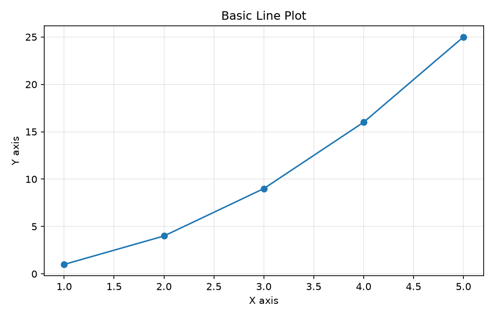

<p><span style="color:#E67700;"><strong><code>Line2D</code> output:</strong></span> Notebook cell lo <code>plt.plot(x, y)</code> last line ga unte <code>[&lt;matplotlib.lines.Line2D ...&gt;]</code> ani object kanipinchachu. Adi error kaadu — Matplotlib create chesina line object. <code>plt.show()</code> ni chivarilo add chesthe chart clear ga display avutundi.</p>

### <strong>Line Color and Style Marchadam</strong>

<code>plt.plot()</code> lo keyword arguments tho line appearance customize cheyyachu.

```python
# X and Y data ni red dashed line ga plot chestundi
plt.plot(x, y, color="red", linestyle="--")
# Styled plot ni display chestundi
plt.show()
```

<strong>Output plot:</strong>

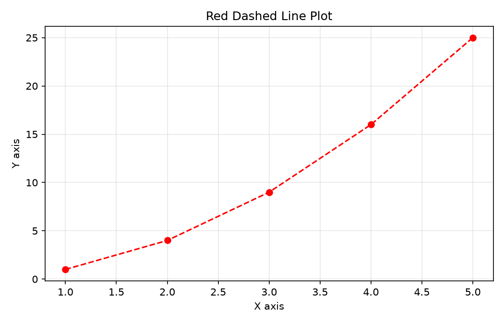

<p><span style="color:#2F9E44;"><strong>Meaning:</strong></span> <code>color="red"</code> line ni red ga chestundi. <code>linestyle="--"</code> dashed line istundi. Common styles: <code>"-"</code> solid (default), <code>"--"</code> dashed, <code>":"</code> dotted, <code>"-."</code> dash-dot. Short style kuda rayachu: <code>plt.plot(x, y, "r--")</code>, kaani full keyword style beginners ki clear ga untundi.</p>

### <strong>Complete Line Customization</strong>

```python
# Red dashed line, circular markers, thicker line, and larger markers tho plot chestundi
plt.plot(
    x,
    y,
    color="red",
    linestyle="--",
    marker="o",
    linewidth=3,
    markersize=9,
)
# Light grid lines ni add chesi values read cheyyadam easy chestundi
plt.grid(True, alpha=0.3)
# Customized chart ni display chestundi
plt.show()
```

<strong>Output plot:</strong>

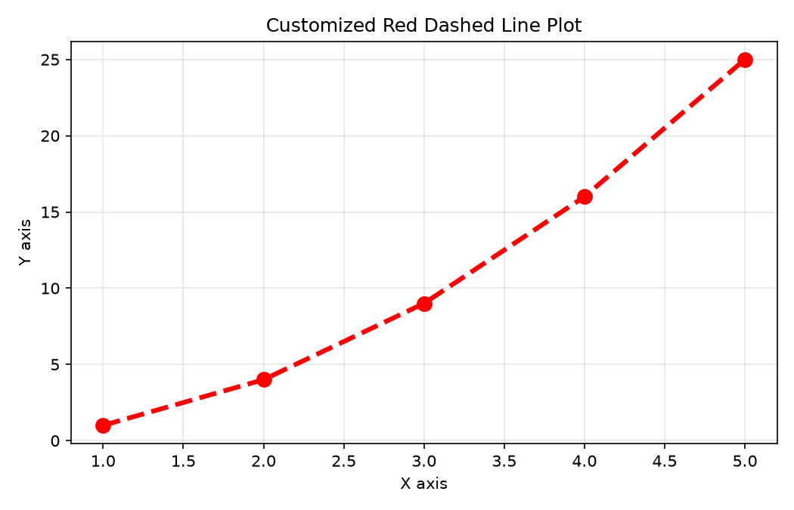

<p><span style="color:#2F9E44;"><strong>Parameters:</strong></span> <code>marker="o"</code> prati data point ki circle pedutundi. <code>linewidth=3</code> line thickness ni set chestundi (default 1.5 kanna bold). <code>markersize=9</code> circles ni pedda ga chestundi. <code>plt.grid(True, alpha=0.3)</code> light grid lines add chestundi, values estimate cheyyadam easy avutundi; <code>alpha</code> grid transparency ni control chestundi. Important points highlight cheyyali ante markers, presentation chart lo visibility kosam thicker line useful.</p>

```python
import matplotlib.pyplot as plt

plt.plot([1, 2, 3], [10, 20, 15], marker="o")
plt.title("Sales Trend")
plt.xlabel("Month")
plt.ylabel("Sales")
plt.show()
```

<strong>Main chart types:</strong>

```python
plt.plot(x, y)          # line chart   → trend chupinchadaniki (time data)
plt.bar(x, y)           # bar chart    → categories compare cheyyadaniki
plt.scatter(x, y)       # scatter      → rendu numbers relationship
plt.hist(data, bins=20) # histogram    → distribution (data ela spread ayyindo)
plt.pie(values)         # pie chart    → parts of whole
```

### <strong>Main Chart Types — Examples and Outputs</strong>

```python
# Month labels and sales values ni define chestundi
months = ["Jan", "Feb", "Mar", "Apr", "May"]
sales = [12, 18, 15, 22, 28]

# Time/order batti sales trend ni line chart ga draw chestundi
plt.plot(months, sales, marker="o", color="royalblue")
plt.title("Monthly Sales Trend")
plt.xlabel("Month")
plt.ylabel("Sales")
plt.grid(True, axis="y", alpha=0.3)
plt.show()
```

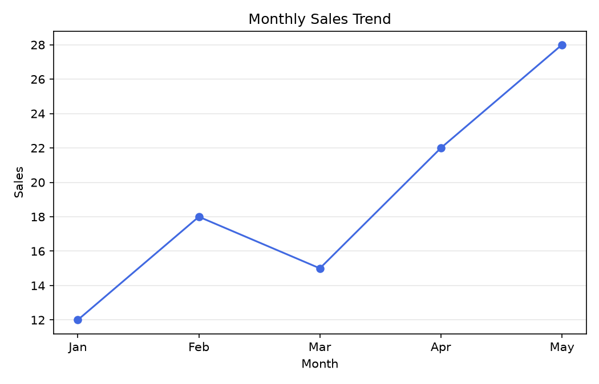

```python
# Prati month sales ni bar height tho compare chestundi
plt.bar(months, sales, color="teal")
plt.title("Monthly Sales Comparison")
plt.xlabel("Month")
plt.ylabel("Sales")
plt.grid(True, axis="y", alpha=0.3)
plt.show()
```

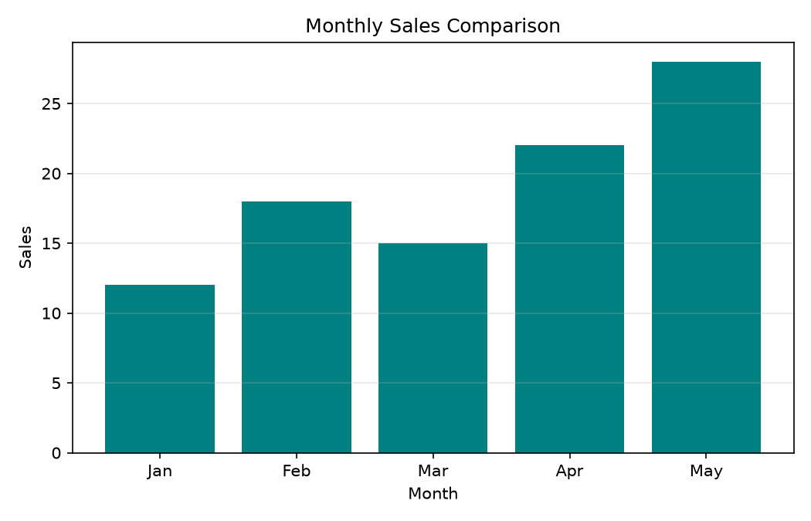

### <strong>Simple Category Bar Plot</strong>

<code>plt.bar(categories, values)</code> lo prati category ki oka vertical bar vastundi. Bar height aa category value ni represent chestundi, kabatti categories madhya comparison ki idi best chart.

```python
# Category labels ni define chestundi
categories = ["A", "B", "C", "D", "E"]
# Prati category ki corresponding values ni define chestundi
values = [5, 7, 3, 8, 6]
# Categories and values ni purple vertical bars ga draw chestundi
plt.bar(categories, values, color="purple")
# Chart title and axis labels ni set chestundi
plt.title("Category Values")
plt.xlabel("Category")
plt.ylabel("Value")
# Value comparison easy avvadaniki horizontal grid ni add chestundi
plt.grid(True, axis="y", alpha=0.3)
# Bar chart ni display chestundi
plt.show()
```

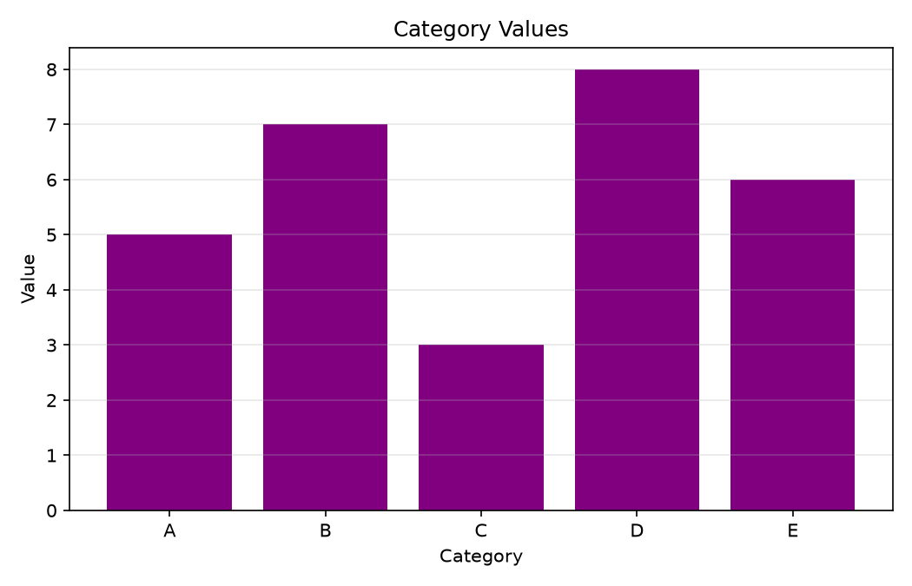

<p><span style="color:#2F9E44;"><strong>Ee data lo insight:</strong></span> Category <code>D</code> highest value <code>8</code>; <code>C</code> lowest value <code>3</code>. Bar chart chuste ee comparison immediate ga kanipistundi.</p>

```python
# Ad spend and customer count relationship ni points ga draw chestundi
ad_spend = [3, 5, 4, 7, 9]
customers = [120, 150, 135, 180, 210]
plt.scatter(ad_spend, customers, color="darkorange", s=70)
plt.title("Ad Spend vs Customers")
plt.xlabel("Ad Spend ($k)")
plt.ylabel("Customers")
plt.grid(True, alpha=0.3)
plt.show()
```

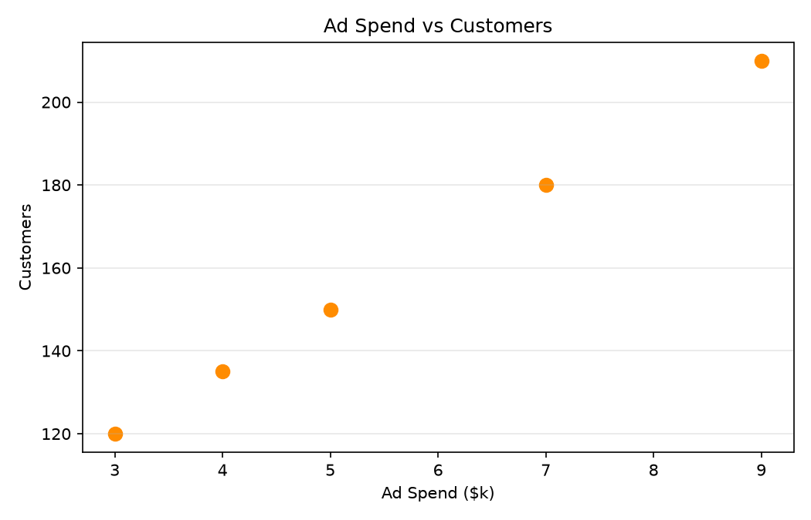

### <strong>Basic Scatter Plot with <code>x</code> Markers</strong>

Scatter plot lo line connect avvadu; prati <code>(x, y)</code> pair oka separate point ga vastundi. Rendu numeric variables madhya relationship unda ani chudataniki use chestam.

```python
# X-axis numeric values ni define chestundi
x = [1, 2, 3, 4, 5]
# Y-axis numeric values ni define chestundi
y = [2, 3, 4, 5, 6]
# Prati x-y pair ni blue x-shaped marker ga draw chestundi
plt.scatter(x, y, color="blue", marker="x")
# Chart title and axis labels ni set chestundi
plt.title("Basic Scatter Plot")
plt.xlabel("X axis")
plt.ylabel("Y axis")
# Points location read cheyyadaniki grid ni add chestundi
plt.grid(True, alpha=0.3)
# Scatter plot ni display chestundi
plt.show()
```

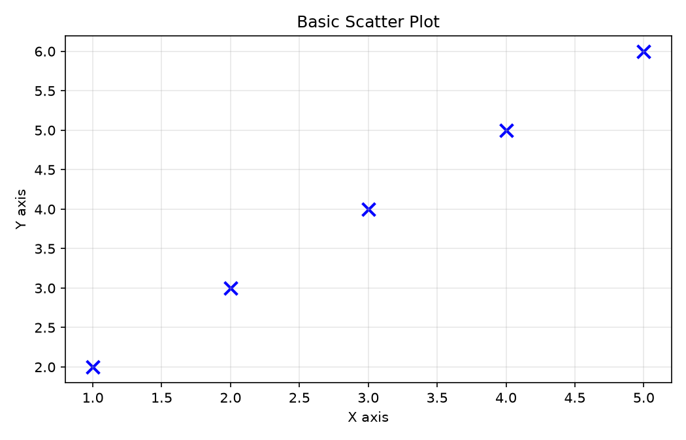

<p><span style="color:#2F9E44;"><strong>Ee plot meaning:</strong></span> X periginappudu Y kuda perugutundi, so ee sample lo positive relationship undi. <code>marker="x"</code> points ni x shape lo chupistundi; common alternatives <code>"o"</code> circle, <code>"s"</code> square, <code>"^"</code> triangle.</p>

<p><span style="color:#E67700;"><strong><code>PathCollection</code> output:</strong></span> Notebook lo <code>plt.scatter(...)</code> last expression ga unte <code>&lt;matplotlib.collections.PathCollection ...&gt;</code> ani kanipinchachu. Adi error kaadu — Matplotlib create chesina scatter-points object. <code>plt.show()</code> taruvata graph display avutundi.</p>

```python
# Individual customer ratings distribution ni bins lo count chestundi
ratings = [3, 4, 5, 4, 2, 5, 3, 4, 4, 5, 1, 3, 4, 2, 5]
plt.hist(ratings, bins=5, color="mediumpurple", edgecolor="black")
plt.title("Customer Rating Distribution")
plt.xlabel("Rating")
plt.ylabel("Frequency")
plt.grid(True, axis="y", alpha=0.3)
plt.show()
```

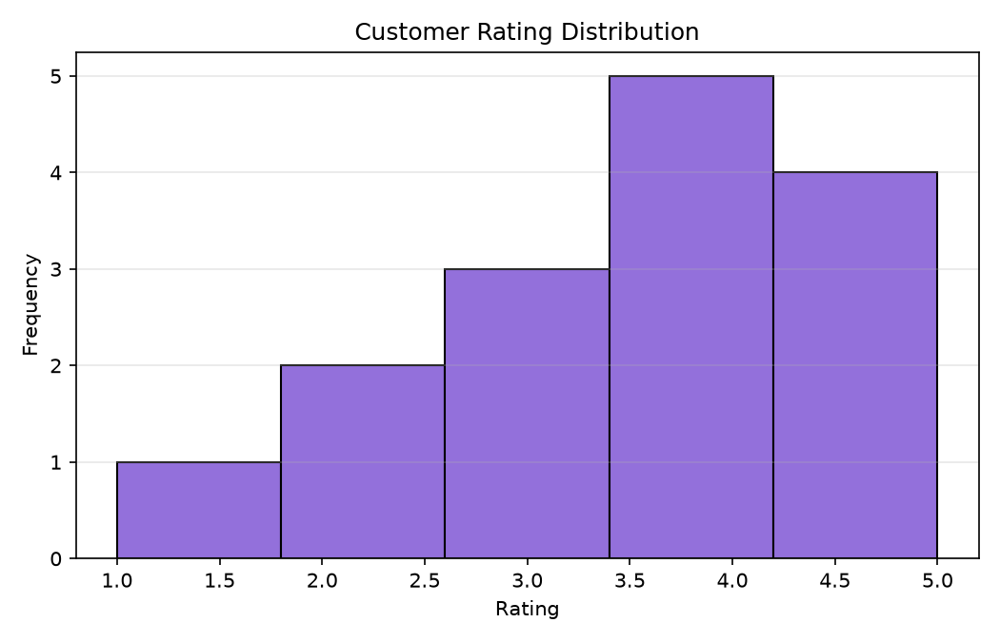

### <strong>Histogram — Distribution ni Ardham Chesukovadam</strong>

Histogram oka numeric dataset lo values ela spread ayyayo chupistundi. Data ni <strong>bins</strong> (small value ranges) ga divide chesi, prati bin lo enni data points unnayo bar height ga chupistundi.

```text
ratings: [1, 2, 2, 3, 3, 3, 4, 4, 4, 4, 5, 5, 5]

bin/range     count     graph lo meaning
1 to <2         1       rating 1 unna records
2 to <3         2       rating 2 unna records
3 to <4         3       rating 3 unna records
4 to <5         4       rating 4 unna records
5               3       rating 5 unna records
```

<p><span style="color:#2F9E44;"><strong>Axes meaning:</strong></span> X-axis lo actual numeric values/ranges untayi (ikkada ratings); Y-axis lo <strong>frequency</strong>, ante aa range lo enni observations unnayo, untundi. Tall bar ante aa range lo values ekkuva unnayi.</p>

<p><span style="color:#E67700;"><strong><code>bins=5</code> meaning:</strong></span> Entire value range ni 5 equal intervals ga divide cheyyamani Matplotlib ki cheptundi. Bins takkuva unte graph over-simplified ga untundi; bins ekkuva unte noisy ga untundi. Dataset size and value range batti 10, 20, 30 lanti values try chesi meaningful view select cheyyandi.</p>

<strong>Screenshot Sample and Output:</strong>

```python
# Repeated numeric values unna sample data ni define chestundi
data = [1, 2, 2, 3, 3, 3, 4, 4, 4, 4, 5, 5, 5, 5, 5]
# Data distribution ni 5 orange bins and black borders tho draw chestundi
plt.hist(data, bins=5, color="orange", edgecolor="black")
# Histogram title and axis labels ni set chestundi
plt.title("Sample Data Distribution")
plt.xlabel("Value")
plt.ylabel("Frequency")
# Frequency bars ni clear ga read cheyyadaniki horizontal grid ni add chestundi
plt.grid(True, axis="y", alpha=0.3)
# Histogram ni display chestundi
plt.show()
```

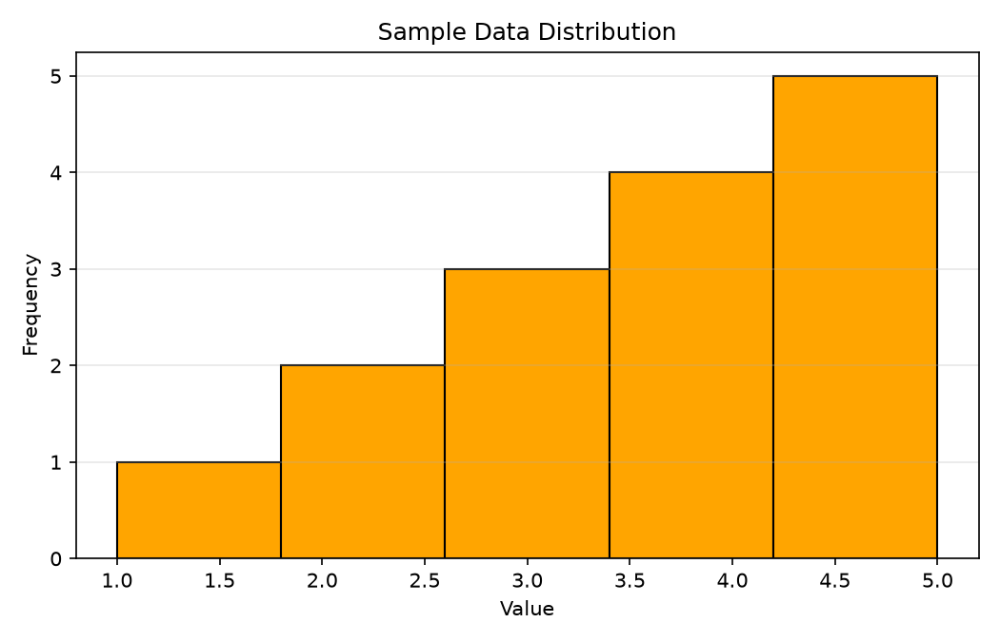

<p><span style="color:#2F9E44;"><strong>Ee plot lo:</strong></span> 1 okasari, 2 rendu sarlu, 3 moodu sarlu, 4 nalugu sarlu, 5 aidu sarlu vachayi. Kabatti left nunchi right ki bars gradually perugutayi. <code>edgecolor="black"</code> prati bin boundary ni clear ga chupistundi.</p>

<p><span style="color:#C92A2A;"><strong>Histogram vs bar chart:</strong></span> Histogram <strong>continuous numeric data</strong> (salary, age, marks, ratings) distribution kosam. Bar chart <strong>separate categories</strong> (city, product, department) comparison kosam. Histogram bars normally touch avutayi because bins continuous ranges; bar-chart bars madhya gap untundi.</p>

<p><span style="color:#2F9E44;"><strong>What to look for:</strong></span> Center/high bars → common value range; left/right long tail → skewness; separate peaks → possible different groups; far-away small bars → possible outliers. Histogram chusaka mean, median, and outliers ni further check cheyyandi.</p>

```python
# Region labels and sales share values ni define chestundi
regions = ["East", "North", "South", "West"]
region_sales = [35, 25, 20, 20]
plt.pie(region_sales, labels=regions, autopct="%1.0f%%", startangle=90)
plt.title("Regional Sales Share")
plt.show()
```

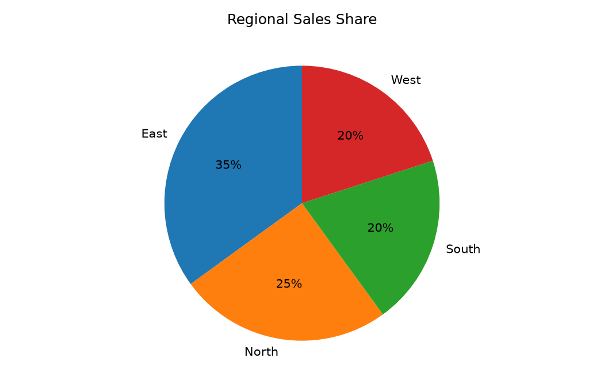

<p><span style="color:#2F9E44;"><strong>Chart selection:</strong></span> Trend/time data ki line chart; categories amount compare cheyyadaniki bar chart; rendu numeric values relationship ki scatter plot; oka numeric column distribution ki histogram; total lo shares simple ga chupinchadaniki pie chart. Pie chart lo categories ekkuva unte labels clutter avutayi — appudu bar chart better.</p>

### <strong>Multiple Plots — <code>subplot()</code> Detailed Explanation</strong>

Oka figure lo multiple charts pakka pakkana leda paina-kindha chupinchalante <code>plt.subplot(rows, columns, position)</code> vaadali. Screenshot lo <code>plt.subplot(1, 2, 1)</code> ante <strong>1 row, 2 columns</strong> layout lo <strong>first</strong> chart area select cheyyadam. <code>plt.subplot(1, 2, 2)</code> ante ade layout lo second chart area select cheyyadam.

```python
# X-axis values ni define chestundi
x = [1, 2, 3, 4, 5]
# First chart ki square values ni define chestundi
y1 = [1, 4, 9, 16, 25]
# Second chart ki linear values ni define chestundi
y2 = [1, 2, 3, 4, 5]

# Rendu plots kosam 9-inch width, 5-inch height figure ni create chestundi
plt.figure(figsize=(9, 5))

# 1 row x 2 columns layout lo first plot position ni select chestundi
plt.subplot(1, 2, 1)
# First position lo x vs y1 green line ni draw chestundi
plt.plot(x, y1, color="green")
# First plot title ni set chestundi
plt.title("Plot 1")
# First plot axes labels ni set chestundi
plt.xlabel("X axis")
plt.ylabel("Y1 axis")
# First plot ki light grid ni add chestundi
plt.grid(True, alpha=0.3)

# 1 row x 2 columns layout lo second plot position ni select chestundi
plt.subplot(1, 2, 2)
# Second position lo x vs y2 green line ni draw chestundi
plt.plot(x, y2, color="green")
# Second plot title ni set chestundi
plt.title("Plot 2")
# Second plot axes labels ni set chestundi
plt.xlabel("X axis")
plt.ylabel("Y2 axis")
# Second plot ki light grid ni add chestundi
plt.grid(True, alpha=0.3)

# Labels overlap avvakunda spacing ni automatic ga adjust chestundi
plt.tight_layout()
# Rendu plots unna figure ni display chestundi
plt.show()
```

<strong>Output plot:</strong>

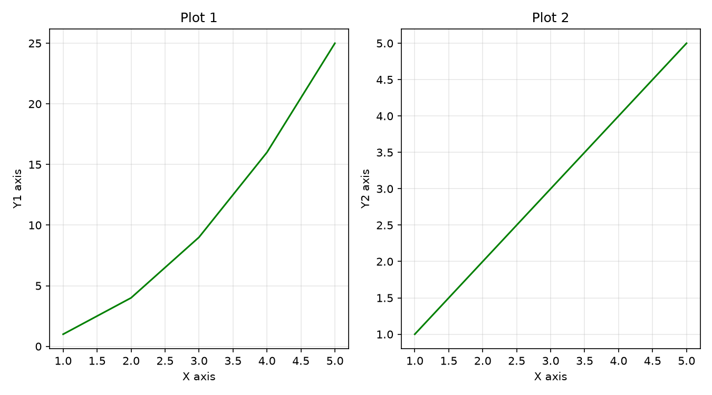

| Code | Meaning |
|---|---|
| <code>plt.figure(figsize=(9, 5))</code> | Whole canvas size: width 9, height 5 inches |
| <code>plt.subplot(1, 2, 1)</code> | 1 row, 2 columns lo first chart |
| <code>plt.subplot(1, 2, 2)</code> | 1 row, 2 columns lo second chart |
| <code>plt.tight_layout()</code> | Titles and labels overlap avvakunda spacing adjust chestundi |

<p><span style="color:#C92A2A;"><strong>Screenshot correction:</strong></span> Second plot lo <code>plt.plot(y1, x)</code> ani unte axes reverse avutayi and <code>y2</code> unused aipothundi. Rendu datasets compare cheyyalante correct code <code>plt.plot(x, y2, color="green")</code>.</p>

<p><span style="color:#E67700;"><strong><code>Text(0.5, 1.0, "Plot 1")</code> output:</strong></span> Notebook lo <code>plt.title("Plot 1")</code> last expression ga unte title object representation print avvachu. Adi error kaadu. <code>plt.show()</code> chivarilo pettadam valla graph ne main output ga chustaru.</p>

<strong>Subplots — okate figure lo multiple charts:</strong>

```python
fig, ax = plt.subplots(1, 2, figsize=(10, 4))    # 1 row, 2 columns

ax[0].plot([1, 2, 3], [10, 20, 15], marker="o")
ax[0].set_title("Line")

ax[1].bar(["A", "B"], [5, 9])
ax[1].set_title("Bar")

plt.tight_layout()      # overlap avvakunda space adjust chestundi
plt.savefig("chart.png", dpi=150)
plt.show()
```

<p><span style="color:#E67700;"><strong>Gamaninchandi:</strong></span> <code>plt.title()</code> vs <code>ax.set_title()</code> — <code>plt</code> vaadutunnappudu <code>title()</code>, <code>ax</code> (subplot) vaadutunnappudu <code>set_title()</code>. Idi common confusion. <code>tight_layout()</code> eppudu chivarilo pettandi.</p>

---

## <span style="color:#087F5B;"><strong>10) Seaborn — Andamaina Statistical Charts</strong></span>

### <strong>Data Visualization With Seaborn</strong>

Seaborn anedi <strong>Matplotlib meeda build ayina Python visualization library</strong>. Attractive and informative <strong>statistical graphics</strong> ni high-level interface tho create cheyyadaniki use avutundi. Matplotlib lo manual ga colors, legends, category groups set cheyyalsina work ni Seaborn chala varaku automatic ga chestundi.

Mukhyanga Pandas DataFrame (`df`) tho Seaborn direct ga work avutundi: <code>data=df</code> ani ichi, column names ni <code>x</code>, <code>y</code>, <code>hue</code> lo pass chesthe saripothundi. Kabatti distributions, category comparisons, correlations, and variable relationships lanti complex visualizations ni few lines of code lo clear ga create cheyyachu.

<p><span style="color:#2F9E44;"><strong>Simple ga:</strong></span> Matplotlib = full control; Seaborn = statistical charts ki sensible defaults + takkuva code. Seaborn plot create chesina tarvata title, labels, grid lanti final customization kosam <code>matplotlib.pyplot</code> ni kalipi vaadochu.</p>

### <strong>Basic Plotting With Seaborn — Built-in <code>tips</code> Dataset</strong>

Seaborn lo <code>sns.load_dataset("tips")</code> ane ready-made practice dataset undi. Idi restaurant bills and tips data ni DataFrame ga istundi: <code>total_bill</code> = bill amount, <code>tip</code> = tip amount, <code>sex</code>/<code>smoker</code>/<code>day</code>/<code>time</code> = categories, <code>size</code> = table lo unna people count. Real CSV lekapoyina plotting practice cheyyadaniki useful.

```python
# Seaborn library ni sns ane short name tho import chestundi
import seaborn as sns

# Restaurant bills and tips unna built-in dataset ni DataFrame ga load chestundi
tips = sns.load_dataset("tips")
# First five rows ni display chesi columns and values ni inspect chestundi
print(tips.head())
```

<p><span style="color:#E67700;"><strong>Note:</strong></span> <code>load_dataset()</code> practice/learning kosam. Real project lo <code>pd.read_csv()</code>, <code>pd.read_excel()</code>, database, leda API nunchi mee actual DataFrame ni load chesi ade <code>data=...</code> argument ki pass chestaru.</p>

#### <strong>Scatter Plot — Total Bill vs Tip</strong>

```python
# Matplotlib pyplot ni title, labels, grid, show kosam import chestundi
import matplotlib.pyplot as plt

# Total bill and tip madhya prati restaurant visit relationship ni plot chestundi
sns.scatterplot(data=tips, x="total_bill", y="tip")
# Plot title ni set chestundi
plt.title("Scatter Plot of Total Bill vs Tip")
# X-axis label ni clear ga set chestundi
plt.xlabel("Total bill ($)")
# Y-axis label ni clear ga set chestundi
plt.ylabel("Tip ($)")
# Values ni easy ga chadavadaniki light grid ni add chestundi
plt.grid(True, alpha=0.3)
# Complete chart ni screen lo display chestundi
plt.show()
```

<strong>Output plot:</strong>

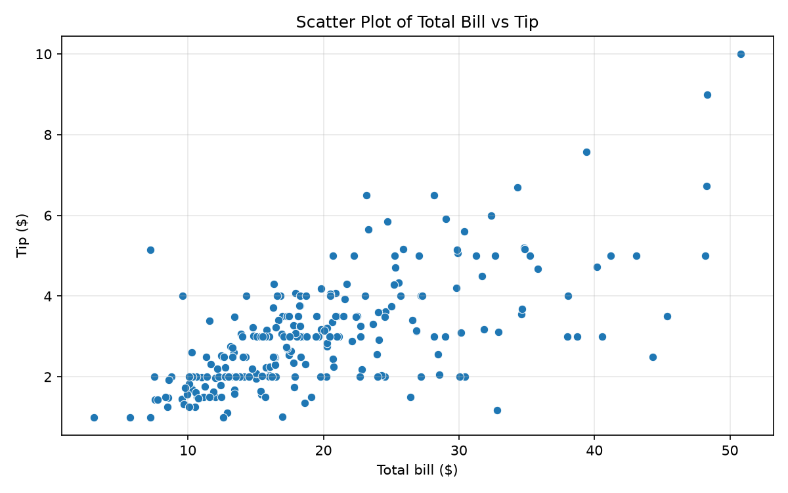

Prati dot oka restaurant bill. Right side ki vellinappudu bills ekkuva avutayi; mostly dots kuda painaki velladam valla total bill perigithe tip kuda generally perugutundi ani kanipistundi. Kaani idi <strong>correlation</strong> matrame — bill valla tip compulsory ga perigindi ani causation prove cheyyadu.

#### <strong>Line Plot — Total Bill by Party Size</strong>

```python
# Same party size rows ni mean total bill ga aggregate chesi line plot chestundi
sns.lineplot(data=tips, x="size", y="total_bill", estimator="mean", errorbar=None, marker="o")
# Plot title ni set chestundi
plt.title("Average Total Bill by Party Size")
# X-axis label ni set chestundi
plt.xlabel("Party size")
# Y-axis label ni set chestundi
plt.ylabel("Average total bill ($)")
# Values ni easy ga compare cheyyadaniki light grid ni add chestundi
plt.grid(True, alpha=0.3)
# Complete chart ni screen lo display chestundi
plt.show()
```

<strong>Output plot:</strong>

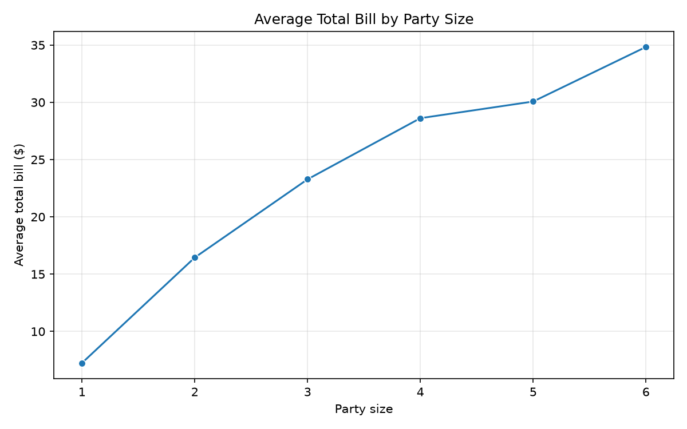

Screenshot lo <code>sns.lineplot(x="size", y="total_bill", data=tips)</code> ani simple ga rayachu. Kaani oka <code>size</code> ki chala rows untayi; Seaborn default ga aa rows ni mean chesi line draw chestundi. Anduke ikkada <code>estimator="mean"</code> explicit ga rasam; <code>errorbar=None</code> confidence interval band ni hide chesi beginner ki main trend clear ga chupistundi.

#### <strong>KDE Plot — Smooth Total-Bill Distribution</strong>

KDE ante <strong>Kernel Density Estimation</strong>. Histogram lo bars untayi; KDE ade numeric data distribution ni smooth curve ga estimate chestundi. Curve peak unna place lo observations ekkuva unnayi ani artham.

```python
# Total bill values distribution ni smooth curve and filled area ga draw chestundi
sns.kdeplot(data=tips, x="total_bill", fill=True)
# Plot title ni set chestundi
plt.title("KDE Plot of Total Bill")
# X-axis label ni set chestundi
plt.xlabel("Total bill ($)")
# Y-axis lo density ani set chestundi, idi record count kaadu
plt.ylabel("Density")
# Curve values ni easy ga chadavadaniki light grid ni add chestundi
plt.grid(True, alpha=0.3)
# Complete chart ni screen lo display chestundi
plt.show()
```

<strong>Output plot:</strong>

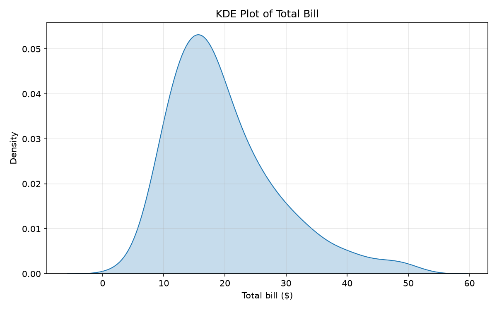

Ee plot lo curve roughly <code>$15-$20</code> daggara peak avutundi, ante aa range lo bills ekkuva unnayi. Right side long tail undadam valla konni high-value bills kuda unnayi ani telustundi. Y-axis <strong>Density</strong>, count kaadu; curve kinda total area always 1 untundi.

<p><span style="color:#E67700;"><strong>Version note:</strong></span> Screenshot lo <code>sns.kdeplot(tips["total_bill"], shade=True)</code> valid older Seaborn syntax. Seaborn 0.13+ lo recommended syntax <code>sns.kdeplot(data=tips, x="total_bill", fill=True)</code>. <code>fill=True</code> anedi old <code>shade=True</code> replacement.</p>

### <strong>Pair Plot — Multiple Numeric Columns Oke Sari</strong>

<code>sns.pairplot()</code> oka numeric column pair ki relationship ni scatter plot ga, diagonal lo prati column distribution ni chupistundi. EDA starting lo multiple variables madhya patterns, clusters, and possible relationships fast ga kanipettadaniki idi chala popular.

```python
# Bill, tip, party size madhya pairwise relationships ni time colors tho draw chestundi
pair_grid = sns.pairplot(
    tips,
    vars=["total_bill", "tip", "size"],
    hue="time",
    corner=True,
    diag_kind="hist",
)
# Figure ki overall title ni add chestundi
pair_grid.figure.suptitle("Pair Plot: Restaurant Bill, Tip, and Party Size", y=1.02)
# Pair plot ni screen lo display chestundi
plt.show()
```

<strong>Output plot:</strong>

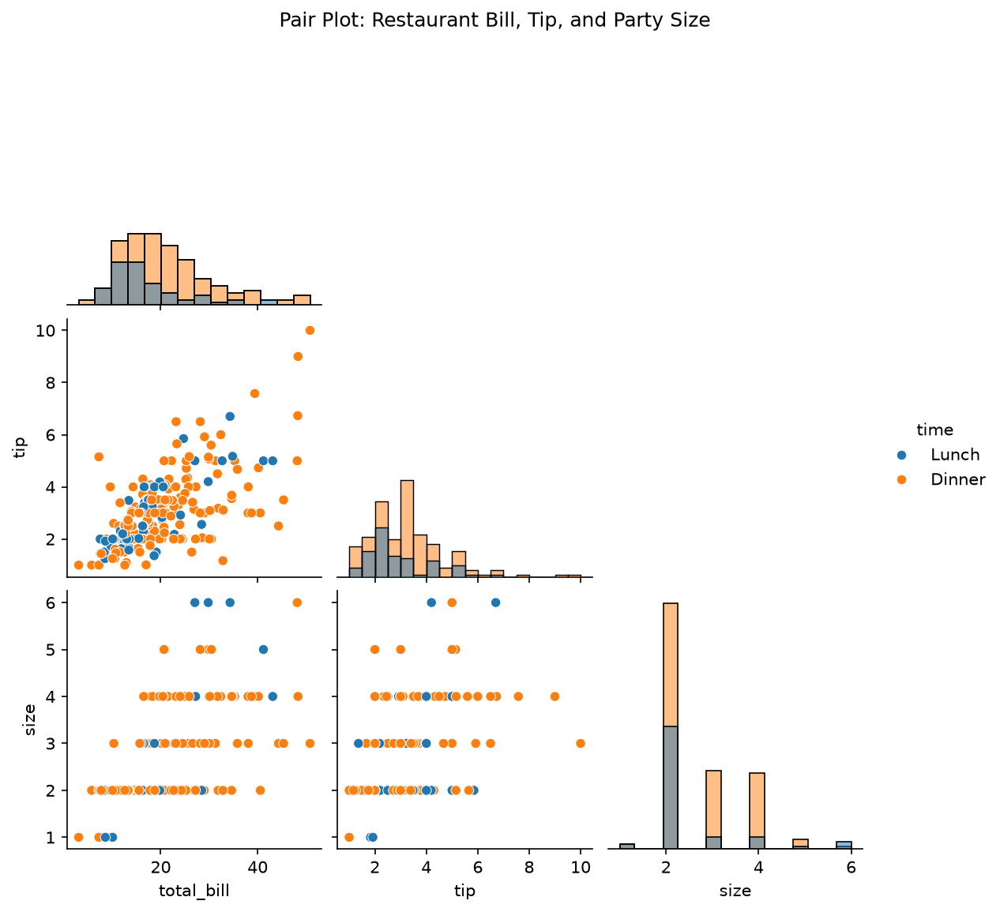

<code>corner=True</code> duplicate half ni hide chesi chart compact ga chestundi. <code>hue="time"</code> lunch and dinner records ki separate colors istundi. Chala columns unte pair plot slow/cluttered avutundi, kabatti 3-5 important numeric columns matrame select cheyyandi.

### <strong>Heatmap — Correlation Matrix ni Colors lo Choodadam</strong>

Heatmap lo each cell rendu numeric columns madhya correlation ni chupistundi. Value <code>+1</code> daggara unte same direction relationship, <code>-1</code> daggara unte opposite direction relationship, <code>0</code> daggara unte linear relationship takkuva.

```python
# Important numeric columns correlation matrix ni calculate chestundi
correlation_data = tips[["total_bill", "tip", "size"]].corr()
# Correlation values ni annotated color-grid ga draw chestundi
sns.heatmap(
    correlation_data,
    annot=True,
    fmt=".2f",
    cmap="coolwarm",
    vmin=-1,
    vmax=1,
    square=True,
)
# Plot title ni set chestundi
plt.title("Correlation Heatmap: Tips Dataset")
# Complete chart ni screen lo display chestundi
plt.show()
```

<strong>Output plot:</strong>

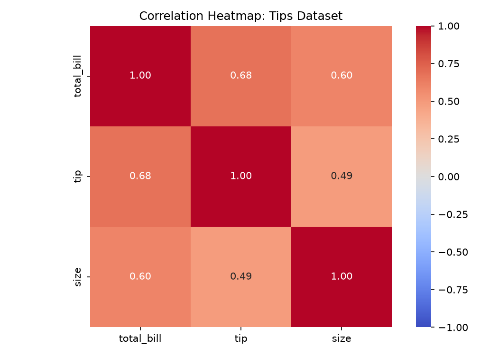

<code>annot=True</code> each cell lo exact value rastundi; <code>vmin=-1</code>, <code>vmax=1</code> fixed scale maintain chestayi, kabatti heatmaps ni fair ga compare cheyyachu. Correlation causation kaadu — strong value dorikina business/domain reason verify cheyyali.

### <strong>Most-Used Seaborn EDA Plots</strong>

#### <strong>Histogram — Values Distribution</strong>

```python
# Total bill distribution ni bars and smooth KDE curve tho draw chestundi
sns.histplot(data=tips, x="total_bill", bins=15, kde=True)
# Plot title ni set chestundi
plt.title("Distribution of Total Bills")
# X-axis label ni set chestundi
plt.xlabel("Total bill ($)")
# Y-axis label ni count ani set chestundi
plt.ylabel("Number of visits")
# Horizontal grid ni add chestundi
plt.grid(True, axis="y", alpha=0.3)
# Complete chart ni screen lo display chestundi
plt.show()
```

<strong>Output plot:</strong>

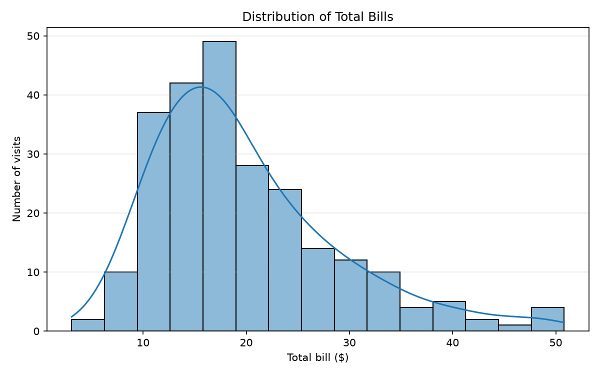

Histogram distribution shape, skewness, and common bill ranges ni chupistundi. <code>bins</code ekkuva unte detail ekkuva, kaani noise kuda ekkuva; <code>kde=True</code smooth trend ni add chestundi.

#### <strong>Box Plot — Spread and Outliers</strong>

```python
# Prati day total-bill spread and outliers ni box plot lo compare chestundi
sns.boxplot(data=tips, x="day", y="total_bill", order=["Thur", "Fri", "Sat", "Sun"])
# Plot title ni set chestundi
plt.title("Total Bill Spread by Day")
# X-axis label ni set chestundi
plt.xlabel("Day")
# Y-axis label ni set chestundi
plt.ylabel("Total bill ($)")
# Horizontal grid ni add chestundi
plt.grid(True, axis="y", alpha=0.3)
# Complete chart ni screen lo display chestundi
plt.show()
```

<strong>Output plot:</strong>

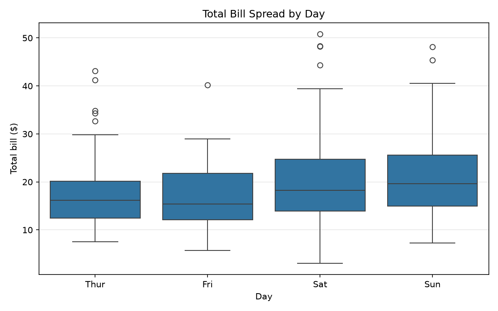

Box middle line = median; box = middle 50% values; whiskers bayata dots = possible outliers. Saturday/Sunday bills spread ni weekday-to-weekday compare cheyyadaniki perfect.

#### <strong>Count Plot — Category Frequency</strong>

```python
# Prati day enni restaurant visits unnayo bar count ga draw chestundi
sns.countplot(data=tips, x="day", order=["Thur", "Fri", "Sat", "Sun"])
# Plot title ni set chestundi
plt.title("Number of Restaurant Visits by Day")
# X-axis label ni set chestundi
plt.xlabel("Day")
# Y-axis label ni set chestundi
plt.ylabel("Number of visits")
# Horizontal grid ni add chestundi
plt.grid(True, axis="y", alpha=0.3)
# Complete chart ni screen lo display chestundi
plt.show()
```

<strong>Output plot:</strong>

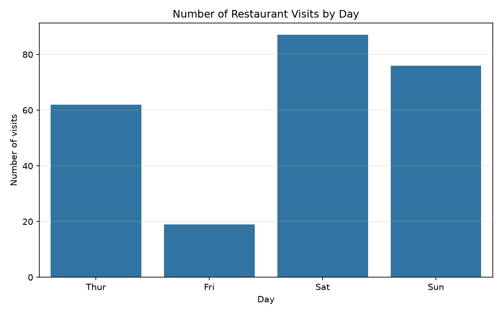

<code>countplot()</code> categorical column ki frequency ni automatic ga count chestundi; separate <code>groupby().size()</code avasaram ledu. Amount/sales sum compare cheyyalante count plot kaadu — <code>sns.barplot(..., estimator="sum")</code> leda mundu aggregation vaadali.

### <strong>Matplotlib vs Seaborn — Difference</strong>

| Feature | Matplotlib | Seaborn |
|---|---|---|
| Level | Low-level plotting library; full manual control | High-level statistical visualization library built on Matplotlib |
| Input style | Lists, NumPy arrays, leda values direct ga pass chestaru | Pandas DataFrame + column names direct ga pass chestaru |
| Default look | Basic; colors, style, legend, labels manual ga improve cheyyali | Attractive themes, palettes, and sensible defaults automatic ga vastayi |
| Statistical charts | Possible, kaani aggregation/grouping manual work ekkuva | `histplot`, `boxplot`, `violinplot`, `heatmap`, `pairplot` lanti charts ready |
| Categories | Prati group ni manual ga plot cheyyali | `hue`, `style`, `size` tho category groups easy ga visualise chestaru |
| Best use | Exact customization, special annotations, custom layouts | Fast EDA and DataFrame-based statistical analysis |

<p><span style="color:#364FC7;"><strong>Best practice:</strong></span> Seaborn tho plot fast ga create cheyyandi; tarvata <code>plt.title()</code>, <code>plt.xlabel()</code>, <code>plt.grid()</code>, <code>plt.savefig()</code> lanti Matplotlib commands tho polish cheyyandi. Rendu competitors kaavu — Seaborn, Matplotlib paina ne run avutundi.</p>

```python
# Seaborn visualization library ni sns ane short name tho import chestundi
import seaborn as sns

# Salary distribution and smooth density curve ni draw chestundi
sns.histplot(data=df, x="salary", bins=5, kde=True)
# Department-wise salary spread and outliers ni compare chestundi
sns.boxplot(data=df, x="dept", y="salary")
# Prati city lo enni records unnayo count chestundi
sns.countplot(data=df, x="city")
# Age-salary relationship ni department color groups tho chupistundi
sns.scatterplot(data=df, x="age", y="salary", hue="dept")
# Numeric columns correlation values ni colored grid lo chupistundi
sns.heatmap(df.corr(numeric_only=True), annot=True, cmap="coolwarm")
# Age and salary madhya pairwise relationship ni okesari chupistundi
sns.pairplot(df[["age", "salary"]])
```

<p><span style="color:#2F9E44;"><strong>Verified:</strong></span> Ee 6 plots anni run chesi check chesam — Seaborn 0.13.2 lo correct ga pani chestunnay.</p>

### <strong>`hue` — Seaborn Superpower</strong>

`hue="dept"` pettinappudu, prati department ki <strong>different color</strong> automatic ga vastundi. Matplotlib lo idi cheyyalante 10 lines code raayali.

### <strong>Ye Chart Eppudu Vaadali?</strong>

| Meeru telusukovalanukunedi | Chart | Function |
|---|---|---|
| Oka column ela spread ayyindi | Histogram | `sns.histplot()` |
| Groups compare cheyyali | Box plot | `sns.boxplot()` |
| Category counts | Count plot | `sns.countplot()` |
| Rendu numbers relationship | Scatter | `sns.scatterplot()` |
| Anni columns relationships | Heatmap | `sns.heatmap()` |
| Time meeda trend | Line | `sns.lineplot()` |

<p><span style="color:#C92A2A;"><strong>Box Plot Enduku Important:</strong></span> Box plot lo box venaka unna <strong>dots = outliers</strong>. Data lo unusual values unnayo ledo instant ga telustundi. Cleaning ki idi first tool.</p>

### <strong>Heatmap Chadavadam</strong>

Correlation `-1` nunchi `+1` varaku untundi:

- <strong>+1 daggara</strong> → okati perigithe rendodi kuda perugutundi (age ↑ salary ↑)
- <strong>0 daggara</strong> → sambandham ledu
- <strong>-1 daggara</strong> → okati perigithe rendodi taggutundi

Mana data lo `age` and `salary` correlation <strong>0.71</strong> — ante age ekkuva unte salary kuda ekkuva ane strong relation undi.

---

## <span style="color:#364FC7;"><strong>11) Complete EDA Workflow — Start to End</strong></span>

Real project lo ee order lo cheyyandi:

```python
import numpy as np, pandas as pd
import matplotlib.pyplot as plt, seaborn as sns

# ---------- STEP 1: Load ----------
df = pd.read_csv("data.csv")

# ---------- STEP 2: First Look ----------
print(df.shape)          # entha peddha data
print(df.head())         # ela untundi
df.info()                # types + missing
print(df.describe())     # statistics

# ---------- STEP 3: Problems Kanukovadam ----------
print(df.isnull().sum())       # missing values
print(df.duplicated().sum())   # duplicates
for col in df.select_dtypes(include="object").columns:
    print(col, df[col].nunique(), "unique values")

# ---------- STEP 4: Cleaning ----------
df = df.drop_duplicates()
df["age"] = df["age"].fillna(df["age"].median())
df["city"] = df["city"].str.strip().str.lower()

# ---------- STEP 5: Analysis ----------
print(df.groupby("city")["salary"].mean().sort_values(ascending=False))
print(df["dept"].value_counts())

# ---------- STEP 6: Visualization ----------
fig, ax = plt.subplots(2, 2, figsize=(12, 8))
sns.histplot(data=df, x="salary", kde=True, ax=ax[0, 0])
sns.boxplot(data=df, x="dept", y="salary", ax=ax[0, 1])
sns.countplot(data=df, x="city", ax=ax[1, 0])
sns.heatmap(df.corr(numeric_only=True), annot=True, cmap="coolwarm", ax=ax[1, 1])
plt.tight_layout()
plt.show()

# ---------- STEP 7: Save ----------
df.to_csv("cleaned_data.csv", index=False)
```

<p><span style="color:#E67700;"><strong>Chinna Tip:</strong></span> <code>to_csv()</code> lo <strong>eppudu</strong> <code>index=False</code> pettandi. Lekapothe prati sari save chesinappudu oka extra "Unnamed: 0" column add avutu potundi.</p>

### <strong>CSV File ga Export Cheyyadam</strong>

<code>to_csv()</code> DataFrame ni CSV file ga write chestundi. Image lo unna <code>df.to_csv("wine.csv")</code> valid, kaani default ga DataFrame index kuda file lo save avutundi. Usually index business data kaadu kabatti <code>index=False</code> use cheyyadam best.

```python
# DataFrame ni wine.csv ane file ga save chestundi, index kuda include avutundi
df.to_csv("wine.csv")
# DataFrame ni clean CSV ga save chestundi, index include cheyyadu
df.to_csv("wine.csv", index=False)
# Existing CSV overwrite kakunda file already unte error raise chestundi
df.to_csv("wine.csv", index=False, mode="x")
```

<p><span style="color:#2F9E44;"><strong>Verify:</strong></span> Save chesaka <code>saved_dataframe = pd.read_csv("wine.csv")</code> ani malli load chesi <code>saved_dataframe.head()</code> check cheyyandi. Export lo columns, row count, and special characters correct ga unnaya ani confirm cheyyachu.</p>

### <strong>Pickle lo DataFrame Save and Restore Cheyyadam</strong>

Pickle Pandas DataFrame ni Python-specific binary format lo save chestundi. CSV lo data types, index, complex objects maripovachu; Pickle lo avi mostly preserve avutayi, kabatti same trusted Python project lo temporary cache leda intermediate DataFrame save cheyyadaniki fast ga untundi.

```python
# Excel file ni DataFrame lo load chestundi
df_excel = pd.read_excel("data.xlsx")
# DataFrame ni Pickle binary file ga save chestundi
df_excel.to_pickle("df_excel.pkl")
# Trusted Pickle file nunchi DataFrame ni malli load chestundi
restored_excel_dataframe = pd.read_pickle("df_excel.pkl")
# Restored DataFrame ni verify cheyyadaniki first rows ni chupistundi
print(restored_excel_dataframe.head())
```

<p><span style="color:#C92A2A;"><strong>Security rule:</strong></span> <strong>Unknown leda untrusted Pickle files ni eppudu load cheyyakandi.</strong> <code>pd.read_pickle()</code> malicious Python code run cheyagaladu. Meeru create chesina leda trusted source nunchi vachina <code>.pkl</code>/<code>.pickle</code files matrame use cheyyandi. Data sharing kosam CSV, Parquet, leda JSON safer and more portable.</p>

<p><span style="color:#E67700;"><strong>File name tip:</strong></span> Image lo <code>to_pickle("df_excel")</code> extension lekunda pani chestundi. Kaani <code>"df_excel.pkl"</code> ani extension pettadam better — file format immediate ga telustundi.</p>

---

## <span style="color:#862E9C;"><strong>12) Common Mistakes — Ivi Cheyyakandi</strong></span>

| ❌ Tappu | ✅ Correct | Enduku |
|---|---|---|
| `df[df.a > 1]["b"] = 5` | `df.loc[df.a > 1, "b"] = 5` | Chained indexing pani cheyyadu |
| `df["a"].fillna(0, inplace=True)` | `df["a"] = df["a"].fillna(0)` | Pandas 3.0 lo silent fail |
| `df[(a) and (b)]` | `df[(a) & (b)]` | Pandas ki `&` kavali |
| `for i in range(len(df))` | Vectorized operation | Loop 100x slow |
| `df.corr()` | `df.corr(numeric_only=True)` | Text columns error |
| `df.to_csv("f.csv")` | `df.to_csv("f.csv", index=False)` | Extra column add avutundi |
| Cleaning lekunda direct plotting | Modata `isnull()`, `describe()` | Tappu charts vastay |

<p><span style="color:#C92A2A;"><strong>Biggest Mistake:</strong></span> <strong>Loop vaadatam.</strong> Pandas/NumPy lo <code>for</code> loop raasthe, aa library entire purpose waste. Eppudu vectorized operations (<code>apply</code>, <code>np.where</code>, direct column math) vaadandi — 20x+ fast.</p>

---

## <span style="color:#0B7285;"><strong>13) Quick Cheat Sheet</strong></span>

```python
# ---------- LOAD ----------
df = pd.read_csv("file.csv")

# ---------- EXPLORE ----------
df.head() / df.tail() / df.sample(5)
df.shape / df.info() / df.describe()
df.columns / df.dtypes
df["col"].value_counts() / df["col"].unique()

# ---------- SELECT ----------
df["col"]                    # Series
df[["a", "b"]]               # DataFrame
df.loc[0, "name"]            # label tho
df.iloc[0, 0]                # position tho

# ---------- FILTER ----------
df[df["a"] > 10]
df[(df["a"] > 10) & (df["b"] == "x")]
df[df["a"].isin([1, 2, 3])]

# ---------- CLEAN ----------
df.isnull().sum()
df = df.dropna()
df["a"] = df["a"].fillna(df["a"].median())
df = df.drop_duplicates()
df["a"] = df["a"].astype(int)
df["s"] = df["s"].str.strip().str.lower()

# ---------- TRANSFORM ----------
df["new"] = df["a"] * 2
df["cat"] = df["a"].apply(lambda x: "High" if x > 10 else "Low")
df["cat"] = np.where(df["a"] > 10, "High", "Low")

# ---------- ANALYZE ----------
df.groupby("city")["salary"].mean()
df.groupby("dept").agg(avg=("salary", "mean"), n=("salary", "size"))
pd.pivot_table(df, values="salary", index="city", columns="dept")
df.sort_values("salary", ascending=False)
df.corr(numeric_only=True)

# ---------- COMBINE ----------
pd.merge(df1, df2, on="id", how="left")
pd.concat([df1, df2])

# ---------- PLOT ----------
sns.histplot(data=df, x="salary", kde=True)
sns.boxplot(data=df, x="dept", y="salary")
sns.scatterplot(data=df, x="age", y="salary", hue="dept")
sns.heatmap(df.corr(numeric_only=True), annot=True)
plt.tight_layout(); plt.show()

# ---------- SAVE ----------
df.to_csv("clean.csv", index=False)
```

---

## <span style="color:#0B7285;"><strong>14) Summary</strong></span>

```
NUMPY — Foundation
  Arrays = fast + memory efficient (19x fast, 4.5x takkuva memory)
  type() → numpy.ndarray | shape (5,) lo comma = tuple
  2D create → [[1,2,3],[4,5,6]] nested list (prati row same length)
  shape = (rows, columns) — eppudu rows modata
  arange(start, stop, step) → stop RAADU | linspace → stop vastundi
  Attributes: shape, ndim, size, dtype, itemsize, nbytes
  size × itemsize = nbytes | int64 = 8 bytes, int32 = 4 bytes
  Array lo anni SAME type (int + str kalisthe anni string avutay!)
  zeros/ones/full/eye → ready-made arrays (default float: 1. )
  np.eye(3) → identity matrix (diagonal 1, migatha 0)
  np.ones((3,4)) → shape oka tuple ga, rendu brackets tappanisari
  Chaining → np.arange(0,10,2).reshape(5,1) okate line lo
  print() → commas raavu | cell output → array(...) tho commas
  reshape → rows × columns = total elements (match avvali)
  reshape assign back cheyyali (original marchadu!)
  reshape(-1, 1) → NumPy ne lekka chesukuntundi (ML lo common)
  Vectorization → loop lekunda motham array meeda operation
  Element-wise: arr1+arr2, arr1*arr2 → same position batti
  `*` = element-wise, `@` = matrix/dot product (veru!)
  ufuncs: sqrt/exp/sin/log → prati element meeda, result float
  np.log() = natural log (base e), log10() veru
  np.log(0) → -inf, np.sqrt(-1) → nan (error raadu!)
  Broadcasting → different shapes automatic match
  2D slicing → arr[rows, columns] (comma mundu rows, tarvata columns)
  arr[0,0] better than arr[0][0] (okate step)
  Slice = VIEW, marchithe original kuda marutundi (.copy() vaadandi)
  arr[0,0]=100 → direct modify (assign back akkarledu)
  int array lo float pettithe truncate (3.9 → 3)
  Boolean masking → 2 steps: condition → mask, mask → filter
  data[data>5] | data[(data>=5) & (data<=8)]
  and/or PANI CHEYYAVU → & | ~ vaadali + brackets must
  np.sum(mask)=count | np.any | np.all | np.where
  axis=0 → columns kindaki | axis=1 → rows pakkaki
  mean/median/std/var → variance = std²
  Outlier unte mean paadu, median safe
  NumPy std (ddof=0) ≠ Pandas std (ddof=1) — 2.87 vs 3.03!
  Normalization: (data - mean) / std → mean 0, std 1
  Enduku: different scale columns ni same scale ki (ML ki must)

PANDAS — Main Tool
  Series = 1 column | DataFrame = full table
  DataFrame create: dict of lists (column-wise) | list of dicts (row-wise)
  df["col"] → Series | df.loc[0] / df.iloc[0] → row kuda Series
  df.iloc[0][1] → KeyError! df.iloc[0,1] vaadali
  at/iat → okate cell (at=label, iat=position) — fastest
  df["New"]=[...] → add | df["Age"]=df["Age"]+1 → update
  drop() PERMANENT KAADU → df = df.drop(...) cheyyali
  drop default axis=0 (rows) — column ki axis=1 must
  df["col"].fillna(inplace=True) ❌ | df.drop(inplace=True) ✅
  describe(): count same? mean vs 50%? std peddada? min/max logic?
  Series = values + INDEX (NumPy ki ledu, idhe difference)
  series.values → lopala NumPy array ne
  index=["a","b"] → sonta labels pettukovachu
  pd.Series(dict) → keys index avutay, values values
  dict + index= kalipithe → aa keys matrame (leni vi NaN)
  None unte int dtype → float64 avutundi
  read_csv() → load
  head/shape/info/describe → first look (eppudu ee 4)
  loc = label | iloc = position
  Filter → df[(cond1) & (cond2)]  ← brackets + & must
  groupby → split-apply-combine
  merge → tables kalapadam (inner/left/right/outer)

CLEANING — 80% of the work
  isnull().sum()      → missing entha
  fillna()            → median (outliers unte) / mean
  drop_duplicates()   → duplicates
  astype()            → type fix
  str.strip().lower() → text clean

MATPLOTLIB — Full control
  plot/bar/scatter/hist/pie
  subplots() → multiple charts okate figure lo
  tight_layout() chivarilo

SEABORN — Takkuva code, andamaina charts
  histplot → distribution
  boxplot  → outliers
  countplot→ counts
  scatterplot + hue → relationships
  heatmap  → correlations

PANDAS 3.0 TRAPS (important!)
  inplace=True         → silent fail, assign back cheyyandi
  chained indexing     → .loc vaadandi
  corr()               → numeric_only=True
  get_dummies          → ippudu bool (dtype=int pettandi)
  object dtype         → ippudu str ani chupistundi
  df.iloc[0][1]        → KeyError (comma vaadandi)
  type(df)             → pandas.DataFrame (core.frame kaadu)
```

<p><span style="color:#364FC7;"><strong>Bottom Line:</strong></span> Data analysis ante <strong>fancy models kaadu</strong> — data ni clean cheyyadam, sarigga chudadam, correct questions adagadam. NumPy speed istundi, Pandas heavy lifting chestundi, Matplotlib/Seaborn story cheptay. Ee 4 lo <strong>Pandas meeda 70% time</strong> pettandi — job lo roju vaadedi ade. Prati kotha dataset ki <code>head()</code>, <code>info()</code>, <code>describe()</code>, <code>isnull().sum()</code> — ee 4 commands tho start cheyyandi, appudu data meeku matladutundi. 📊</p>

---

*Ee file lo Data Analysis process, NumPy arrays/shape/reshape/vectorization/broadcasting, Pandas Series-DataFrame/selection/filtering/cleaning/groupby/merge, Pandas 3.0 traps, Matplotlib basics, Seaborn statistical plots, complete EDA workflow, common mistakes, cheat sheet cover chesam. Code antha Python 3.14.6 + NumPy 2.4.6 + Pandas 3.0.3 + Seaborn 0.13.2 meeda run chesi verify chesam.*
