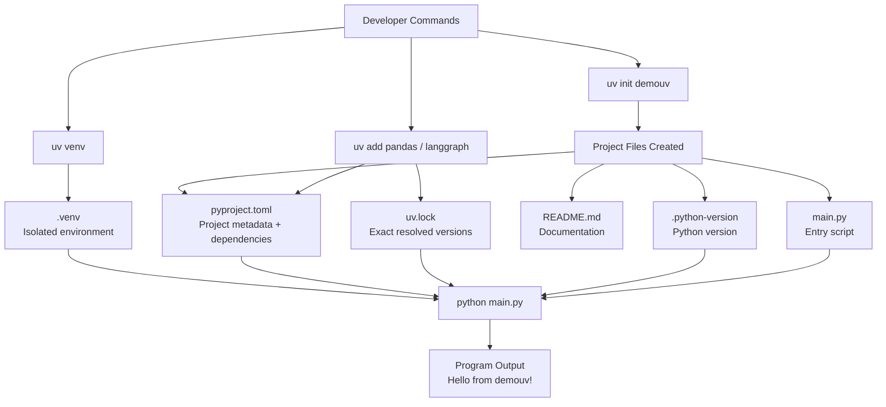

# demouv Project Guide (Simple English + Telugu Mix)

Ee README lo mana project lo unna prati file enti, avi okadani okati ela connect avuthayo complete ga explain chesthanu.

---

## 1) Project Purpose

Idi UV-based Python project.
Main goal:
- project structure clean ga maintain cheyyadam
- dependencies ni proper ga lock cheyyadam
- future lo LangGraph based app ki base ready ga unchadam

Ippudu current app output simple ga "Hello from demouv!" print chesthundi, kani architecture scalable way lo set ayyindi.

---

## 2) Files and What They Do

### .python-version

Ee file lo Python version pin chestham.
Current value: 3.14

Enduku useful?
- Team and machine change aina same Python version use cheyyadaniki
- "naa system lo work avuthundi, nee system lo kaadu" problems taggadaniki

---

### pyproject.toml

Idi project heart/config file.
Dantlo important sections:
- project name
- version
- python requirement
- dependencies list
- README reference

Current ga dependencies lo pandas, langgraph and longchain entries unnayi.

Ee file role:
- UV ki "project ki em packages kavali" ani chepthundi
- install/update time lo source-of-truth laga panichesthundi

---

### uv.lock

Ee file auto-generated lock file.

Idi em chesthundi?
- exact resolved package versions store chesthundi
- reproducible installs istundi
- different systems lo same dependency graph maintain chesthundi

Simple ga: pyproject.toml "what we need" ani chepthundi.
uv.lock "exact ga emi install ayyindi" ani fix chesthundi.

---

### main.py

Idi runtime entry script.

Current flow:
1. main() function define chestham
2. print("Hello from demouv!") run chestham
3. if __name__ == "__main__" block lo direct execution handle chestham

Future lo ikkadnunchi LangGraph workflow, agents, nodes call cheyyachu.

---

### README.md

Idi documentation file.

Indulo:
- project structure explain chestham
- commands and usage document chestham
- team ki onboarding easy chestham

---

### .venv folder

Idi virtual environment folder (uv venv create chesinappudu vastundi).

Indulo:
- project-specific python executable
- installed packages
- activation scripts

Benefit:
- global python ni disturb cheyyakunda isolated setup.

---

## 3) File-to-File Connection (How They Work Together)

Step by step data flow:

1. `.python-version` python version define chesthundi
2. `pyproject.toml` dependencies and project metadata define chesthundi
3. `uv add <package>` run chesthe `pyproject.toml` update avuthundi
4. UV resolver exact versions lock chesi `uv.lock` update chesthundi
5. `uv venv` and install commands `.venv` ni prepare chesthayi
6. `python main.py` active `.venv` context lo script run chesthundi

Ante: config -> lock -> environment -> execution ane clear chain untundi.

---

## 4) Command Flow (What Happens After Each Command)

### Initialize Project

```bash
uv init demouv
```

After running:
- demouv folder create avuthundi
- starter files generate avuthayi (pyproject.toml, main.py, README.md, .python-version)

### Go to Project Folder

```bash
cd demouv
```

After running:
- terminal working directory demouv ki maruthundi

### Create Virtual Environment

```bash
uv venv
```

After running:
- .venv folder create avuthundi
- project isolated runtime ready avuthundi

### Activate Environment (PowerShell)

```bash
.venv\Scripts\activate
```

After running:
- terminal prompt lo environment prefix kanipisthundi
- app and installs active env lo jaruguthayi

Example prompt:

```text
PS C:\learnAi\KrishAI\demouv> .venv\Scripts\activate
(demouv) PS C:\learnAi\KrishAI\demouv>
```

### Add Dependency Example

```bash
uv add pandas
uv add langgraph
```

After running:
- package install avuthundi
- pyproject.toml dependency list update avuthundi
- uv.lock resolve ayi refresh avuthundi

### Run Script

```bash
python main.py
```

After running:
- app execute avuthundi
- "Hello from demouv!" print chesthundi

### Deactivate

```bash
deactivate
```

After running:
- virtual environment nundi bayataki vastharu
- terminal normal context ki return avuthundi

---

## 5) Architecture Diagram (Simple)



	### 5.1) Architecture Diagram (Beginner View)

	#### Setup Flow

	```mermaid
	flowchart LR
		A[uv init demouv] --> B[Project files create]
		B --> C[uv venv]
		C --> D[.venv ready]
		D --> E[activate]
		E --> F[uv add pandas / langgraph]
		F --> G[pyproject.toml update]
		F --> H[uv.lock update]
	```

	#### Runtime Flow

	```mermaid
	flowchart LR
		A[User runs python main.py] --> B[Python from .venv]
		B --> C[Reads project deps from lock/config]
		C --> D[Executes main.py]
		D --> E[Output in terminal]
	```

	Simple ga cheppali ante:
	- Setup phase lo project + environment + dependencies ready chestham.
	- Runtime phase lo active environment nundi script run avuthundi.

---

## 6) One-Line Mental Model

`.python-version` chepthundi: "ye Python use cheyyali"

`pyproject.toml` chepthundi: "ye packages kavali"

`uv.lock` chepthundi: "exact versions ivi"

`.venv` provide chesthundi: "isolated environment"

`main.py` run chesthundi: "actual app logic"

---

## 6.1) Why Multiple Environments?

Simple answer: different projects ki different package versions kavachu, kabatti separate environments use chestham.

### Main reasons

1. Dependency conflicts avoid cheyyadaniki
- Project A ki `pandas` old version kavachu.
- Project B ki latest `pandas` kavachu.
- Same global Python lo install chesthe clash ravachu.

2. Project isolation kosam
- Oka project lo changes chesina, inko project break avvadu.

3. Reproducible setup kosam
- Team members andariki almost same environment setup vastundi.
- "Naa laptop lo run avuthundi, nee system lo kaadu" issue tagguthundi.

4. Easy cleanup and control
- Project complete ayyaka environment deactivate/delete cheyyachu.
- Global Python clean ga untundi.

### Quick example

- `demouv` project: `.venv` + LangGraph stack
- another DS project: separate env + NumPy/Pandas specific versions

Ila separate ga unte rendu projects independent ga stable ga run avuthayi.

---

## 7) Small Note

If package name typo unte install/import issues ravachu.
Example: `longchain` and `langchain` different names. Dependency names verify chesi use cheyyadam best.
