# Machine Learning Complete Guide

Machine Learning ni simple ga cheppalante:

**Machine Learning = data nundi patterns nerchukoni predictions or decisions cheyyadam**

---

## Recommended Concept Order

Nuvvu beginner aithe ee concepts ni ila order lo nerchukunte easy ga ardham avuthundi:

1. Machine Learning ante enti?
2. Data, Pattern, Prediction
3. Real-life ML examples
4. Features and Labels
5. Train set, Test set, Validation set
6. Supervised vs Unsupervised Learning
7. Regression vs Classification
8. Data Cleaning
9. Feature Scaling
10. Common Algorithms
11. Overfitting vs Underfitting
12. Evaluation Metrics
13. Feature Engineering
14. Hyperparameters
15. Cross Validation
16. Real Project Flow

### Beginner learning flow in one line

**Basics -> Data -> Train/Test -> Types of ML -> Algorithms -> Metrics -> Improvement -> Projects**

---

## Beginner Explanation: ML ni Kid ki cheppinattu

Nuvvu oka chinna pillavadi ki Machine Learning explain chesthunnaav ani imagine cheyyi.

### Very simple meaning

Machine Learning ante:

**computer ki direct rules rayakunda, examples chupinchi nerpinchadam**

School lo teacher ela chestharu?

- 2 + 2 = 4
- 3 + 3 = 6
- 4 + 4 = 8

Ila chala examples chupisthe, student pattern ardham chesukuntadu.

Machine Learning lo kuda same idea.
Computer ki examples istam.
Adi aa examples nundi pattern learn chesi, new input vachinappudu answer chepthundi.

### ML and normal programming difference

#### Normal programming

Manam computer ki rules direct ga cheptham.

Example:

```text
if marks >= 35:
	pass
else:
	fail
```

#### Machine Learning

Manam direct rule rayamu.
Instead, past student data istam:

- study hours
- attendance
- previous marks
- final result

Computer antundi:
"Sare, nenu pattern kanukunta. Future student pass avuthada ani nenu predict chestha."

### ML ekkada use avuthundi? Real life lo

#### 1. YouTube recommendations

Nuvvu ekkuva ga tech videos chusthe, YouTube malli tech videos chupisthundi.

Enduku?

Because system chusindi:
- nuvvu emi click chesthunnaav
- emi ekkuva time watch chesthunnaav
- emi skip chesthunnaav

Aa data batti system learn ayi next recommended videos istundi.

#### 2. Google Maps traffic prediction

Maps app chepthundi:
- ee road lo traffic ekkuva undi
- ee route fast untundi

Idi random kaadu.
Past and current data chusi predict chestundi.

#### 3. Spam mail detection

Gmail chala mails ni chusi nerchukundi:
- konni words spam lo ekkuva untayi
- suspicious links untayi
- unknown senders untaru

Aa pattern batti new email spam aa kaada ani guess chestundi.

---

## ML lo 3 main words first ardham chesuko

### 1. Data

Data ante information.

Examples:
- student marks
- customer age
- salary
- house size
- email text

### 2. Pattern

Pattern ante repeated relationship.

Example:
- ekkuva study hours unna students pass ayye chance ekkuva
- salary ekkuva unna customers konni products konachu

### 3. Prediction

Prediction ante future or unknown case meeda guess.

Example:
- ee house price entha?
- ee mail spam aa?
- ee customer buy chesthada?

---

## ML ni human learning tho compare cheddam

### Human learning

Pillavadu dog ni 10 times chusthadu.
Teacher antaru: "idi dog"

Tarvata kotha dog image chupisthe pillavadu antadu:
"idi kuda dog anukunta"

### ML learning

Computer ki thousands dog images chupistam.
Labels kuda istam: dog / not dog.

Tarvata new image ichinappudu computer predict chestundi:
"dog"

Same concept.

---

## ML model ante enti?

Model ante nerchukunna brain laanti system.

Simple ga:

- Data teacher laga panichestundi
- Training learning process laga untundi
- Model student brain laga untundi
- Prediction answer laga untundi

### School analogy

- Examples = textbook problems
- Training = practice
- Model = student
- Test data = final exam

If student just memorize chesthe exam lo new questions ki fail avvachu.
Ade overfitting concept ki base idea.

---

## ML project complete ga em chestham?

Kid-level ga chala simple steps:

1. Problem choose chestham
2. Data collect chestham
3. Data clean chestham
4. Model ki nerpistham
5. Correct ga nerchukundha check chestham
6. New data meeda test chestham
7. Real app lo use chestham

### House price example

Problem:
- ee house cost entha predict cheyyali

Data:
- area
- bedrooms
- location
- old selling price

Model learning:
- big house usually high price
- good location price ekkuva

Prediction:
- new house price estimate

---

## Real-time examples by problem type

### A. Regression example

Question:
- house price entha?
- tomorrow temperature entha?

Output:
- one number

### B. Classification example

Question:
- spam aa not spam aa?
- pass aa fail aa?
- disease unda leda?

Output:
- category / class

### C. Clustering example

Question:
- similar customers evaru?
- shopping behavior batti groups enti?

Output:
- groups

---

## Enduku data quality chala important?

Simple example:

Nuvvu oka student ni wrong examples tho nerpithe, answer wrong ostundi.

Machine Learning lo kuda:

- wrong data
- incomplete data
- dirty data

unte model poor ga nerchukuntundi.

Anduke people antaru:

**Garbage in -> Garbage out**

Meaning:
- bad data isthe bad result vastundi

---

## 2. Machine Learning End-to-End Flow

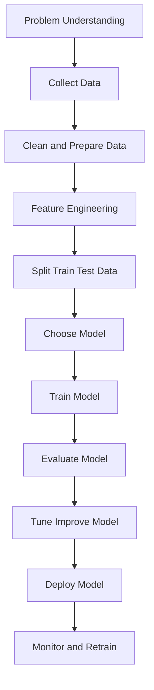

Simple flow line:

**Problem -> Data -> Cleaning -> Features -> Train -> Evaluate -> Improve -> Deploy -> Monitor**

---

## 3. Machine Learning Architecture Diagram

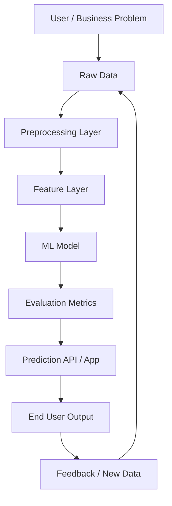

### Architecture simple ga artham chesukovali ante

1. User/business problem start point
2. Data collect chestham
3. Data clean chestham
4. Useful features create chestham
5. Model train chestham
6. Metrics tho check chestham
7. App/API lo use chestham
8. New feedback tho model ni improve chestham

---

## 4. ML Project lo Common Steps

### Step 1: Problem define cheyyadam

Mundhu task enti ani clear ga define cheyyali.

Examples:
- House price estimate cheyyala?
- Customer purchase chesthada predict cheyyala?
- Email spam aa kaada classify cheyyala?

### Step 2: Data collect cheyyadam

Data sources:
- CSV files
- Excel files
- Database
- API
- User logs
- Sensors

### Step 3: Data cleaning

Data usually clean ga undadu.

Fix cheyyalsina problems:
- Missing values
- Duplicate rows
- Wrong data types
- Outliers
- Empty columns
- Inconsistent labels

### Step 4: Feature engineering

Feature ante model ki ivvadaniki useful input column.

Examples:
- Date nundi year, month extract cheyyadam
- Age group create cheyyadam
- Salary range create cheyyadam
- Text ni numbers ga convert cheyyadam

### Step 5: Train/Test split

Model ni same data meeda test cheyyakudadhu.

Usually:
- 80% training
- 20% testing

### Training set and Test set ni kid-style lo artham chesukundam

Idi chala important topic.
Machine Learning lo beginners mostly ikkade confuse avtharu.

Simple ga:

- **Training set** = model nerchukune material
- **Test set** = model actual ga nerchukundha leda ani check chese exam

### School example

Nuvvu exam ki prepare avthunnav ani imagine cheyyi.

Teacher mundhu practice questions istaru.
Nuvvu aa questions solve chesi pattern nerchukuntav.

Ivi:
- training questions

Tarvata final exam lo kotha questions vastayi.
Teacher chustharu:
- nuvvu nijanga concept ardham chesukunnava?
- leka practice questions maatrame memorize chesava?

Aa final exam questions:
- test set

### Why separate sets are needed?

Suppose same practice questions ni exam lo kuda icharu ante?

Student full marks techina, actually concept ardham ayindha leda teliyadu.

ML lo kuda same.

If model ni same data meeda train chesi same data meeda test chesthe:
- result fake ga chala good ga kanipisthundi
- kani real new data meeda fail avvachu

Anduke training set and test set separate ga pettali.

### Very simple real-time example

Suppose mee daggara 100 customer records unnayi.

Each record lo:
- Age
- Salary
- Purchased or not

Ippudu:
- 80 records model ki nerpistam -> training set
- remaining 20 records model ki chupinchakunda pakkana pettukuntam -> test set

Model training time lo first 80 records nundi pattern nerchukuntundi.

Example ga ila think chestundi:
- high salary + certain age group customers konachu
- low salary customers maybe konakapovachu

Tarvata aa 20 unseen records meeda predict cheyyamani adugutham.

Appude manaki actual ga telustundi:
- model new data meeda work chesthunda?

### Training set ante exact ga em chestham?

Training set lo:
- input features istam
- correct output kuda istam
- model pattern learn chestundi

Example:

| Age | Salary | Purchased |
|---|---|---|
| 25 | 30000 | 0 |
| 40 | 70000 | 1 |
| 35 | 50000 | 1 |

Ivi chusi model relation learn chestundi.

### Test set ante exact ga em chestham?

Test set lo kuda input untundi.
Kani model ki answer already chupinchakudadhu during training.

Model ki just features istam:
- Age
- Salary

Then adi predict chestundi:
- Purchased = 1 or 0

Tarvata actual answer tho compare chestham.

### Easy mental model

- Training set = tuition class
- Test set = final exam

### Model good aa kaada ela telustundi?

#### Case 1: Training score high, Test score also high
- Model baaga nerchukundi
- Good sign

#### Case 2: Training score high, Test score low
- Model memorize chesindi
- Idi overfitting

#### Case 3: Training score low, Test score also low
- Model sarigga nerchukoledu
- Idi underfitting

### Bias-Variance Tradeoff (Detailed)

Ippudu ee topic ni simple ga deep ga ardham chesukundam.

#### Definitions

1. Bias:
- model chala simple ga undi true pattern ni miss ayite adhi bias.
- usually underfitting ki lead avtundi.

2. Variance:
- model chala sensitive ga undi training data lo noise ni kuda nerchukunte adhi variance.
- usually overfitting ki lead avtundi.

3. Tradeoff:
- bias tagginchali ante model complexity penchali.
- kani complexity ekkuva ayite variance peruguthundi.
- anduke renditi madhya balanced point kavali.

#### What is Tradeoff? (Very clear)

Tradeoff ante:
- oka side improve chesthe inko side koncham compromise avvadam.

Bias-Variance context lo:
- model ni simple ga unchithe bias peruguthundi, variance tagguthundi.
- model ni complex ga chesthe bias tagguthundi, variance peruguthundi.
- so exact goal: "best balance point" dorakadam.

Simple sentence:
**Tradeoff = okati gain avvadam kosam inkokati koncham lose avvadam, final ga total result better ga undela balance cheyyadam.**

Everyday analogy:
- Bike speed chala ekkuva pedithe time save avtundi kani safety risk peruguthundi.
- Speed chala takkuva pedithe safety better kani time ekkuva padtundi.
- Madhya balanced speed choose cheyyadam = tradeoff decision.

#### Why this happens?

Model chala simple unte:
- important bends/patterns capture cheyyadu
- train and test errors rendu high ga untayi
- high bias

Model chala complex unte:
- training data almost perfect fit chestundi
- kani new data meeda performance drop avtundi
- high variance

#### Error formula intuition

Generalization error ni approximately ila think cheyyachu:

$$
  ext{Test Error} \approx \text{Bias}^2 + \text{Variance} + \text{Irreducible Noise}
$$

Meaning:
- goal bias only minimize cheyyadam kaadu
- goal variance only minimize cheyyadam kaadu
- total error minimize ayye sweet spot find cheyyadam

#### Easy graph intuition (mental image)

- x-axis: model complexity
- y-axis: error
- bias curve complexity perigite taggutundi
- variance curve complexity perigite perugutundi
- test error curve U-shape laga untundi
- U bottom point = best tradeoff

#### Real-world example (House Price)

Case A (high bias):
- model only area use chestundi
- rooms, location ignore chestundi
- predictions rough ga untayi

Case B (high variance):
- model too many complex terms use chestundi
- training data ni memorize chestundi
- new houses ki poor predictions

Case C (balanced):
- meaningful features + proper regularization
- train/test gap takkuva
- better generalization

#### Train-Test pattern batti identify cheyyadam

1. Train high error + Test high error:
- high bias (underfitting)

2. Train low error + Test high error:
- high variance (overfitting)

3. Train low error + Test low error and close:
- good balance

#### How to reduce High Bias

- model complexity penchandi
- better features add cheyyandi
- training time increase cheyyandi
- too strong regularization unte koncham tagginchandi

#### How to reduce High Variance

- regularization (L1/L2) penchandi
- model simplify cheyyandi
- more training data collect cheyyandi
- early stopping vadandi
- bagging / random forest laanti methods use cheyyandi
- cross-validation tho tune cheyyandi

#### Kid analogy

Bias student:
- 2 questions matrame practice chesi exam ki veltadu
- easy ga miss avtadu

Variance student:
- only old paper memorize chestadu
- question style marite confuse avtadu

Balanced student:
- concepts ardham chesukoni practice chestadu
- new questions ki kuda answer cheyyagaladu

One-line memory:

**High bias = model too rigid, High variance = model too sensitive, Best ML = balanced learner.**

#### More simple examples (easy way)

##### Example 1: Tuition vs Exam

- High bias student:
  only basic 2 formulas telusu, difficult questions attempt cheyyaledu.
  Result: practice test and final test rendu lo low marks.

- High variance student:
  previous year questions matrame memorize chesadu.
  Result: practice test lo high marks, final lo question pattern marite marks drop.

- Balanced student:
  concept + practice rendu chesadu.
  Result: practice and final marks stable and good.

##### Example 2: Cricket practice

- High bias:
  batsman only straight ball practice chesadu.
  spin or bouncer vachinappudu fail.

- High variance:
  one specific bowler style ki matrame over-train ayadu.
  new bowler vachinappudu adjust avvaledu.

- Balanced:
  different bowlers, different conditions practice chesadu.

##### Example 3: House price ML model

- High bias model:
  only area use chestundi.
  bedrooms, location ignore chestundi.

- High variance model:
  too many complex rules petti training houses ni memorize chestundi.
  new house meeda wrong prediction.

- Balanced model:
  useful features + regularization.

##### Example 4: Spam filter

- High bias:
  only "free" word chusi spam decide chestundi.
  chala real spam miss avvachu.

- High variance:
  training mail lo chinna chinna words kuda overfit chestundi.
  new legit mails ni spam ani mark cheyyachu.

- Balanced:
  enough features, proper threshold, good validation.

##### Example 5: Shopping recommendation

- High bias:
  user previous one purchase ni base chesi same category matrame suggest chestundi.

- High variance:
  recent 1-2 clicks ni over-weight chesi unstable recommendations istundi.

- Balanced:
  long-term taste + recent behavior combine chestundi.

#### Quick mini-table

| Situation | High Bias sign | High Variance sign |
|---|---|---|
| Exam | easy kuda wrong | mock lo top, final lo drop |
| ML train/test | train high error | train low, test high |
| Recommendation | boring same suggestions | daily unpredictable suggestions |

#### Super simple memory trick

- Bias ekkuva -> "model chala simple"
- Variance ekkuva -> "model chala moody"
- Best model -> "concept ardham chesina student" la stable ga untundi

### Common split ratios

Usually people use:
- 80% train / 20% test
- 70% train / 30% test
- 75% train / 25% test

Data size batti choose chestharu.

### Validation set kuda untunda?

Yes, konni projects lo 3 parts untayi:

- Training set
- Validation set
- Test set

#### Simple meaning

- Training set = learn cheyyadaniki
- Validation set = settings compare cheyyadaniki
- Test set = final exam

Example split:
- 70% train
- 15% validation
- 15% test


### Why test set must be unseen?

Enduku unseen undali ante:

Model ki mundhe answer teliste genuine performance measure cheyyalem.

Same old questions malli adagadam laanti di.

### Practical ML example

House price prediction lo:

Training set lo:
- area
- bedrooms
- location
- old price

Model relation nerchukuntundi.

Test set lo:
- kotha houses details istam
- model price predict chestundi
- actual market price tho compare chestham

### One-line summary

**Training set model ni nerpisthundi. Test set model nijanga nerchukundha leda ani check chestundi.**

### Example code

```python
from sklearn.model_selection import train_test_split

X = [[20, 20000], [25, 30000], [35, 50000], [45, 80000], [50, 90000]]
y = [0, 0, 1, 1, 1]

X_train, X_test, y_train, y_test = train_test_split(
	X, y, test_size=0.2, random_state=42
)

print("Training set:", X_train)
print("Test set:", X_test)
print("Training labels:", y_train)
print("Test labels:", y_test)
```

### Output meaning

- `X_train` -> model training kosam inputs
- `X_test` -> model testing kosam unseen inputs
- `y_train` -> training answers
- `y_test` -> testing actual answers

### Step 6: Model train cheyyadam

Algorithm ni select chesi model ni fit chestham.

### Step 7: Evaluate cheyyadam

Prediction quality batti metrics use chestham.

### Step 8: Improve cheyyadam

- Better features
- Better algorithm
- Hyperparameter tuning

### Step 9: Deploy cheyyadam

Model ni app/API/backend lo use chestham.

### Step 10: Monitor cheyyadam

Real-world data change ayithe model performance taggachu. Appudu retrain cheyyali.

---

## 5. Types of Machine Learning

Machine Learning ni mostly 3 main types ga divide chestharu.

**Label ante enti?** Label ante oka data point ki correct answer or output (example: oka email "spam" or "not spam" ane tag). Idi manam model ki nerpinche target value.

**Types of labels:**
- **Categorical (discrete) label:** fixed classes lo untundi. Example: "spam" / "not spam", "cat" / "dog", "pass" / "fail". Idi classification lo vadatam.
- **Continuous (numeric) label:** oka number value untundi. Example: house price 5000000, temperature 32.5, salary 45000. Idi regression lo vadatam.

**Algorithm ante enti?** Algorithm ante oka step-by-step method (recipe laga) which data nundi pattern nerchukoni model ni build chestundi. Example: Linear Regression, KNN, Random Forest ivi anni algorithms. Manam problem type batti correct algorithm choose chestham.

**Supervised ante enti? (Definition)** Labeled data (input + correct answer/label) tho model ni train chese ML type. Manam model ki questions and answers rendu istam, so adi relation nerchukoni kotha input ki answer predict chestundi.

**Unsupervised ante enti? (Definition)** Labels lekunda, only input data tho model ni train chese ML type. Answers ivvamu, so model self ga data lo hidden patterns and groups (clusters) kanukuntundi.

**Algorithms and their connection:**
- **Supervised algorithms** (labeled data meeda pani chestai): Linear Regression, Ridge, Lasso, KNN, Naive Bayes, SVM, Decision Tree, Random Forest, Logistic Regression, Boosting models. Ivi label nunchi learn cheyyadam valla supervised lo untai.
- **Unsupervised algorithms** (label leni data meeda pani chestai): K-Means Clustering, Hierarchical Clustering, PCA, DBSCAN. Ivi label lekunda groups/structure kanukuntai, so unsupervised lo untai.
- Ade algorithm rendu chota rakpovachu: label unte supervised, label lekapothe unsupervised. Problem lo label undha ledha ane daani batti connection decide avuthundi.

### 5.1 Supervised Learning

Input + correct output rendu untayi.

**Data + Label concept:** ikkada prathi data (input) ki oka label (correct answer) untundi, so model data-to-label relation ni nerchukuntundi.

Example:
- House size, location -> house price
- Email text -> spam or not spam

#### Supervised learning two main tasks

**Label type batti eppudu edi vadali?**
- **Label continuous (numeric) aithe -> Regression** vadatam. Example: price, temperature, salary lantivi predict cheyyali ante.
- **Label categorical (discrete/class) aithe -> Classification** vadatam. Example: spam/not spam, pass/fail lantivi predict cheyyali ante.

##### A. Regression

Output continuous value.

Label type: continuous (numeric values unapudu e model use chestam).

Examples:
- House price prediction
- Salary prediction
- Temperature prediction

**Regression algorithms (numerical label kosam):**
- Linear Regression
- Ridge Regression
- Lasso Regression

##### B. Classification

Output categories or classes.

Label type: categorical values unapudu e model use chestam(discrete/class).

Examples:
- Spam / Not Spam
- Pass / Fail
- Disease / No Disease

**Classification algorithms (categorical label kosam):**
- KNN (K-Nearest Neighbors)
- Naive Bayes
- SVM (Support Vector Machine)
- Decision Trees
- Random Forest
- Logistic Regression
- Boosting models -> ADA Boost, Gradient Boosting, XG Boosting

#### Supervised Algorithms Quick Summary

Prathi algorithm ki full detail (Enti, Enduku, Eppudu, Example, code) section 8 "Common Machine Learning Algorithms" lo undi. Ikkada oka quick one-line summary:

- **Linear Regression:** numeric value predict cheyyadaniki straight-line model. (Detail: section 8.1)
- **Ridge Regression:** Linear Regression + L2 penalty, overfitting control. (Detail: section 8.9)
- **Lasso Regression:** Linear Regression + L1 penalty, feature selection kuda chestundi. (Detail: section 8.10)
- **KNN:** daggara unna neighbors chusi class assign chestundi. (Detail: section 8.5)
- **Naive Bayes:** probability base text/spam classifier. (Detail: section 8.11)
- **SVM:** classes ni best boundary tho separate chestundi. (Detail: section 8.6)
- **Decision Tree:** yes/no questions tho decision. (Detail: section 8.3)
- **Random Forest:** chala trees vote chesi final answer. (Detail: section 8.4)
- **Logistic Regression:** binary classification + probability. (Detail: section 8.2)
- **Boosting (ADA/Gradient/XGBoost):** weak models kalipi high accuracy. (Detail: section 8.12)

#### Right algorithm eppudu choose cheyyali? (Quick Guide)

- Label **numeric** and simple trend -> **Linear Regression**.
- Numeric but features ekkuva/overfitting -> **Ridge** or **Lasso** (Lasso feature selection kuda chestundi).
- Label **categorical** and small data + similarity -> **KNN**.
- Text/spam data -> **Naive Bayes**.
- Clear boundary + high dimension -> **SVM**.
- Explainable rules kavali -> **Decision Tree**.
- Strong all-round accuracy -> **Random Forest**.
- Simple binary classification + probability -> **Logistic Regression**.
- Maximum accuracy on tabular data -> **Boosting (XGBoost)**.

---

### 5.2 Unsupervised Learning

Input data untundi, kani correct labels undavu.

**Data + Label concept:** ikkada data untundi kani labels undavu, so model self ga data lo patterns and relations ni kanukoni groups chestundi.

Goal:
- Similar groups identify cheyyadam
- Hidden structure kanukovadam

Examples:
- Customer segmentation
- Similar products grouping
- Anomaly detection

---

### 5.3 Reinforcement Learning

Agent action chestundi, reward or penalty vasthundi.

Examples:
- Game playing AI
- Robot movement
- Self-driving decision making concepts

Simple ga:

**Try -> Feedback -> Improve**

---

## 6. Supervised Learning Detailed Flow

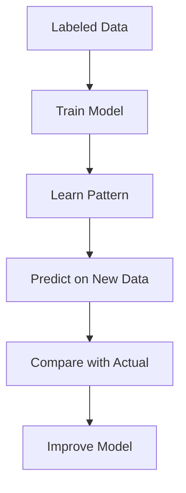

Example:

Student data:
- Study hours
- Attendance
- Previous marks

Target:
- Pass or Fail

Model ee patterns ni nerchukoni kotha student pass avuthada ani predict chestundi.

---

## 7. Unsupervised Learning Detailed Flow

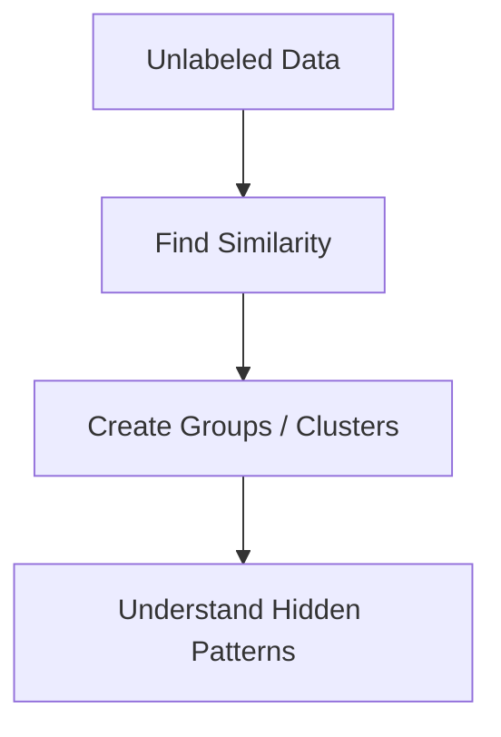

Example:

Shopping app lo customers ni purchase behavior batti groups ga divide cheyyachu:
- Budget shoppers
- Premium shoppers
- Frequent buyers

---

## 8. Common Machine Learning Algorithms

## 8.1 Linear Regression

Use:
- Continuous number predict cheyyadaniki

Example:
- Area batti house price predict cheyyadam

Simple idea:
- Data points madhya best-fit line find chestundi

Equation form:

`y = mx + c`

Where:
- `x` = input
- `y` = output
- `m` = slope
- `c` = intercept

### Example

```python
from sklearn.linear_model import LinearRegression

X = [[1000], [1200], [1500], [1800]]
y = [20, 24, 30, 36]

model = LinearRegression()
model.fit(X, y)

prediction = model.predict([[1600]])
print(prediction)
```

### Linear Regression Full Detail

> **Agenda (ee section lo em nerchukuntam):**
> 1. What is Linear Regression?
> 2. Purpose of Linear Regression
> 3. Assumptions of Linear Regression
> 4. How does Linear Regression work?
> 5. What is Gradient Descent?
> 6. Evaluation Metrics of Linear Regression
> 7. Bias-Variance Tradeoff (Underfitting and Overfitting)

---

#### 1. What is Linear Regression? (Idi enti?)

> **Main Point:** rendu vishayala (input and output) madhya unna relation ni oka straight line tho cheppadam.

- **Simple meaning:** rendu vishayala madhya (two things) unna relation ni oka straight line tho cheppadam.
- **Kid example:** nuvvu ekkuva hours chaduvithe, ekkuva marks vasthai. Study hours penchithe marks perugutai. Ee "hours penchithe marks perugutundi" ane straight relation ne Linear Regression pattukuntundi.
- **Line ante enti?** graph paper meeda oka natta (straight) geeta. Aa geeta anni points madhyalo balance ga vellutundi.
- **Formula:** `y = mx + c`
  - `x` = input (study hours)
  - `y` = output (marks)
  - `m` = slope (oka hour penchithe marks entha perugutai)
  - `c` = intercept (0 hours chadivina base marks)
- **Story:** oka pillavadu ni "1 hour chadivithe 10 marks, 2 hours aithe 20 marks" ani chusi, "5 hours aithe entha marks?" ani guess cheyyadam = Linear Regression.

##### Real House Price Example (Table nundi)

Ee table lo 7 houses data undi. Manam house price ni predict cheyyali. (Size and price thousands/lakhs lo unnai.)

| # | Size (sqft) | Rooms | Age of House | House Price (Lakhs) |
|---|---|---|---|---|
| 1 | 12 | 5 | 3 | 40 |
| 2 | 15 | 8 | 2 | 50 |
| 3 | 7 | 3 | 10 | 25 |
| 4 | 6 | 3 | 14 | 22 |
| 5 | 25 | 10 | 3 | 75 |
| 6 | 30 | 15 | 1 | 80 |
| 7 | 18 | 9 | 2 | 60 |

> **Main Point:** **Size, Rooms, Age = inputs (X)**, **House Price = target (y)**. Inputs batti target numeric value ni predict chestam.

- **Independent columns (X):** Size, Rooms, Age of House. Ivi input features (manam ichchevi).
- **Target / Dependent column (y):** House Price. Idi predict cheyyalsina numeric value.
- **Kid explanation:** pedda size, ekkuva rooms unte price ekkuva (rows 5, 6 chudu -> 75, 80). Chinna size, ekkuva age unte price takkuva (rows 3, 4 chudu -> 25, 22). Ee pattern ni Linear Regression nerchukuni, kotha house (size, rooms, age) ichchinapudu price predict chestundi.
- **Enduku Linear Regression:** house price oka numerical value, so numeric predict cheyyadaniki Linear Regression correct choice.
- **Formula ee example ki:** `price = m1*size + m2*rooms + m3*age + c` (multiple inputs unnapudu prathi input ki oka slope untundi).

```python
from sklearn.linear_model import LinearRegression

# columns: size, rooms, age
X = [[12, 5, 3], [15, 8, 2], [7, 3, 10], [6, 3, 14], [25, 10, 3], [30, 15, 1], [18, 9, 2]]
y = [40, 50, 25, 22, 75, 80, 60]  # house price in lakhs

model = LinearRegression()
model.fit(X, y)

# kotha house: size=20, rooms=9, age=4
prediction = model.predict([[20, 9, 4]])
print("Predicted house price (lakhs):", prediction)
```

##### Simple Linear Regression (Oka input tho)

> **Main Point:** oka input column tho (only size) house price predict cheste, danini **Simple Linear Regression** antaru. One input, one straight line.

- **Simple vs Multiple:**
  - **Simple Linear Regression:** oka input feature matrame. Example: only **size** tho price predict. Formula: `price = m*size + c`.
  - **Multiple Linear Regression:** rendu or ekkuva inputs. Example: size + rooms + age tho price predict (pai example). Formula: `price = m1*size + m2*rooms + m3*age + c`.

- **Ee example lo:** size (sqft) ni x-axis lo, house price ni y-axis lo petti, anni points ki daggara ga oka best-fit line (model) geestham. Ee line ye manam vethuke **objective** (goal).

- **Graph (size vs house price, model line):**

  ```text
  house price (y, lakhs)
     ^
  110|                                          o (test: size=40 -> price ~110)
     |                                       .-
  80 |                              o     .-
     |                           .-
  60 |                    o   .-
  50 |               o .-  o
  40 |          o .-
  20 |     o .-
  10 | .-
     +----------------------------------------------> size (x, sqft)
        5   10   15   20   25   30   35   40
  ```

  (o = actual data points, .- = best-fit model line)

- **Training data (model nerchukune data):**

| Size (sqft) | House Price (Lakhs) |
|---|---|
| 12 | 40 |
| 15 | 50 |
| 7 | 25 |
| 6 | 22 |
| 25 | 75 |
| 30 | 80 |
| 18 | 60 |

- **Test data (model ni check chese kotha input):** size = **40**. Model line follow chesi predict chestundi -> price approx **110 lakhs**. (Training data lo 40 ledu, kani line extend chesi model guess chestundi.)

- **Kid explanation:** dots (houses) anni oka slope lo perugutunnayi. Manam oka scale (line) geesi, aa line meeda "40 sqft ekkada untundo" chusi, daniki corresponding price (110) chaduvutham. Ade simple linear regression prediction.

```python
from sklearn.linear_model import LinearRegression

# only one input: size
X = [[12], [15], [7], [6], [25], [30], [18]]
y = [40, 50, 25, 22, 75, 80, 60]  # house price in lakhs

model = LinearRegression()
model.fit(X, y)

# test data: size = 40
prediction = model.predict([[40]])
print("Predicted price for 40 sqft (lakhs):", prediction)
```

##### Best Fit Line ante enti? (Detailed)

> **Main Point:** anni data points ki mottham daggara ga (least total error) unde straight line ne **best fit line** antaru. Idi model.

- **Best fit line ante enti?**
  - Graph lo data points (houses) chelli chedari untai. Vati madhyalo geesina oka straight line, ye line ayite anni points ki average ga daggara ga untundo, ade **best fit line** (or regression line).
  - Ee line ye manam predict cheyyadaniki vadataam. `price = m*size + c` lo `m` (slope) and `c` (intercept) ee line ni define chestai.

- **Enduku best fit "line" (curve kaadu)?**
  - Linear Regression assume chestundi relation straight ga untundi ani. So oka straight line tho relation ni represent chestundi.

- **Error (residual) ante enti?**
  - Prathi actual point and line meeda unde predicted value madhya gap ne **error** or **residual** antaru.
  - `error = actual price - predicted price`.
  - Example: actual house price 50, kani line meeda predicted 47 aithe, error = 50 - 47 = 3.

  ```text
  price
     ^        o  actual point (50)
     |        |  <- error (gap = 3)
     |        x  predicted point on line (47)
     |      .-
     |   .-
     +----------------> size
  ```

- **Best fit line ni ela finalise chestham? (Least Squares Method)**
  1. Model konni different lines try chestundi (different `m`, `c` values).
  2. Prathi line ki, anni points errors ni teesukuntundi.
  3. Ee errors ni **square** chestundi (negative and positive cancel avvakunda, and pedda errors ni ekkuva punish cheyyadaniki).
  4. Anni squared errors ni add chestundi -> danini **SSE (Sum of Squared Errors)** or **cost** antaru.
  5. Ye line ki ee total squared error **anniti kante takkuva** (minimum) untundo, ade **best fit line**.
  - Ee method ni **Least Squares Method** (or Ordinary Least Squares, OLS) antaru. "Least squares" ante "smallest squared error".

- **Formula (simple form):**
  - Slope: `m = sum((x - x_mean) * (y - y_mean)) / sum((x - x_mean)^2)`
  - Intercept: `c = y_mean - m * x_mean`
  - Ee formulas use chesi sklearn automatic ga best `m` and `c` compute chestundi.

##### Error and SSE Worked Example (Table nundi)

> **Main Point:** `Error = y_actual - y_pred`. Anni errors square chesi add cheste `SSE (Sum of Squares of Error)` vastundi. SSE takkuva unte line manchidi.

- **Error formula:** `Error = y_actual - y_pred` (actual price minus model predicted price).

- **Table (prathi house ki actual, predicted, error):**

| # | House Price (y_actual) | y_pred (model) | Error (y_actual - y_pred) |
|---|---|---|---|
| 1 | 40 | 29 | 11 |
| 2 | 50 | 35 | 15 |
| 3 | 25 | 19 | 6 |
| 4 | 22 | 17 | 5 |
| 5 | 75 | 55 | 20 |
| 6 | 40 | 60 | -20 |
| 7 | 60 | 41 | 19 |

- **Enduku errors ni just add cheyyakudadu? (cancellation problem):**
  - Plain errors add cheste: `11 + 15 + 6 + 5 + 20 + (-20) + 19`.
  - Row 5 error `+20` and Row 6 error `-20` okadanni okati cancel chesukuntai.
  - So positive and negative errors kalisi total ni chinnaga (misleading) chupistai. Nijamga model row 5, row 6 lo 20 choppuna tappu chesindi, kani sum lo adi kanipinchadu.

- **Enduku squaring? (Why we square the error):**
  1. **Negative signs pothai:** square chesthe `(-20)^2 = 400` positive avutundi. So positive/negative cancel avvadu. Prathi error count avutundi.
  2. **Pedda errors ni ekkuva punish chestundi:** `20^2 = 400` kani `5^2 = 25`. Pedda tappulu (20) ni model ekkuva seriously teesukuntundi, so big mistakes ni tagginchadaniki try chestundi.
  3. **Smooth math:** squared function calculus (gradient descent) ki easy ga pani chestundi.

- **SSE formula:** `SSE = sum( (y_actual - y_pred)^2 )` for all rows. (Sum of Squares of Error.)

- **SSE ee example ki:**
  - `= 11^2 + 15^2 + 6^2 + 5^2 + 20^2 + (-20)^2 + 19^2`
  - `= 121 + 225 + 36 + 25 + 400 + 400 + 361`
  - `= 1568`.
  - Ee SSE (1568) ni minimum chese `m`, `c` values ye best fit line. Vere line try chesthe SSE marutundi; ye line ki SSE smallest o ade best.

- **Kid explanation:** errors ni just add cheste, oka student oka subject lo +20 marks extra, inko subject lo -20 marks takkuva vesthe, total lo "0 tappu" laga kanipistundi - kani nijamga rendu subjects lo tappu chesadu. Anduke square chesi (sign teesi) prathi tappu ni count chestham.

##### SSE vs MSE vs RMSE (Evaluation Metrics Detail)

> **Main Point:** SSE, MSE, RMSE anni "model entha tappu chesindi" ani cheppe error measures. Chinna value = better model. RMSE actual units lo cheptundi, so most useful.

**Enduku ee metrics kavali?** Model train ayyaka, "idi entha manchidi?" ani number tho cheppali. Just chusi cheppalem. So error ni oka single number ga measure chestham. Ee number batti rendu models compare kuda cheyyachu.

**1. SSE (Sum of Squares of Error)**

- **Enti:** anni rows squared errors ni add cheyyadam.
- **Formula:** `SSE = sum( (y_actual - y_pred)^2 )`
- **Problem:** rows ekkuva aithe SSE automatic ga pedda avutundi (100 rows unte 7 rows kanna pedda number). So different-size datasets compare cheyyadam kastam. Anduke average teesukuntam -> MSE.
- **Our example:** SSE = 1568.

**2. MSE (Mean Squared Error) = Average Squared Error**

- **Enti:** SSE ni total rows (`n`) tho divide chesi average teesukovadam.
- **Enduku:** dataset size effect teesesi, "per row average tappu (squared)" ni istundi. So different datasets fair ga compare cheyyachu.
- **Formula:** `MSE = SSE / n = sum( (y_actual - y_pred)^2 ) / n`
- **Our example:** `MSE = 1568 / 7 = 224`.
- **Problem:** errors ni square chesam kabatti, MSE units kuda squared avutayi (price lakhs^2 laantidi), so directly artham cheyyadam kastam. Anduke square root teesukuntam -> RMSE.

**3. RMSE (Root Mean Squared Error)**

- **Enti:** MSE ki square root.
- **Enduku:** square root teesthe units malli original (price lakhs) ki vastayi. So "model average ga entha lakhs tappu padutondi" ani direct ga artham avutundi.
- **Formula:** `RMSE = sqrt(MSE) = sqrt( sum( (y_actual - y_pred)^2 ) / n )`
- **Our example:** `RMSE = sqrt(224) = 14.97` (approx). Ante model average ga sumaru 15 lakhs tappu chestundi.

**Quick compare table:**

| Metric | Formula | Our value | Units | Use |
|---|---|---|---|---|
| SSE | sum((actual-pred)^2) | 1568 | squared | total error |
| MSE | SSE / n | 224 | squared | average error (dataset compare) |
| RMSE | sqrt(MSE) | 14.97 | original (lakhs) | real-world error, easy to read |

**Kid explanation:** SSE ante "andari tappula mottham". MSE ante "sagatuna prati okkadi tappu (kani square lo)". RMSE ante aa square ni theesi malli normal marks lo cheppadam. RMSE 15 ante "average ga 15 lakhs tappu" - ee number chinnaga unte model manchidi.

**Code:**

```python
from sklearn.metrics import mean_squared_error
import numpy as np

y_actual = [40, 50, 25, 22, 75, 40, 60]
y_pred   = [29, 35, 19, 17, 55, 60, 41]

mse = mean_squared_error(y_actual, y_pred)
rmse = np.sqrt(mse)

print("MSE:", mse)
print("RMSE:", rmse)
```

- **Gradient Descent tho kuda finalise cheyyachu:**
  - Chinna data ki least squares formula direct ga best line istundi.
  - Pedda data / complex models ki, **Gradient Descent** vadi (cost ni step by step taggistu) best `m`, `c` ki cheruthaam. (Detail section 5 lo undi.)

- **Kid explanation (rope story):** imagine anni houses chukkalu board meeda pins laga unnayi. Nuvvu oka straight rope (thread) teesukoni, aa pins madhyalo pedataav. Rope ni pins anni daggaraga unde la adjust chestav - konni pins paina, konni kinda, kani mottham gap chinnaga undela. Aa final rope position ye best fit line.

- **Best fit line manchidi ani ela telustundi?**
  - Total error (SSE) chinnaga unte line manchidi.
  - **R2 score** 1 ki daggara unte line data ni baaga fit ayindi. (Metrics section 6 lo undi.)

##### Line Equation, Slope and Intercept (Detailed)

> **Main Point:** Linear Regression ante oka **best fit line** help tho **numerical value** ni predict chese process. Aa line ni `y = mx + c` equation define chestundi.

- **Line equation:** `y = m*x + c`
  - `y` = output (house price) - predict cheyyalsindi.
  - `x` = input (size in sqft).
  - `m` = **slope** (line entha steep ga peruguthundo).
  - `c` = **y-intercept** (x = 0 unnapudu y value, i.e., line y-axis ni ekkada touch chestundo).

- **Slope (m) ante enti?**
  - x oka unit penchithe, y entha marutundo cheppedi.
  - **Formula:** `slope (m) = (y2 - y1) / (x2 - x1)` - line meeda rendu points teesukoni calculate chestham.

- **Worked example (graph nundi):** line meeda rendu points:
  - Point 1: `x1 = 15`, `y1 = 20`
  - Point 2: `x2 = 20`, `y2 = 30`
  - Slope `m = (y2 - y1) / (x2 - x1) = (30 - 20) / (20 - 15) = 10 / 5 = 2`.

- **Slope = 2 ante artham enti?**
  - `x` -> 1 unit penchithe, `y` -> 2 units peruguthundi.
  - Ee example lo: size 1 sqft penchithe, house price 2 (lakhs) peruguthundi.
  - Slope positive (2) ante line paiki (upward) veltundi. Slope negative aithe line kindaki veltundi.

- **y-intercept (c) ante enti?**
  - Line y-axis ni ekkada cross chestundo aa value. Ante `x = 0` unnapudu `y` entha.
  - Example: size 0 unnapudu base price (real ga size 0 undakapoina, line start point ni cheptundi).

- **Ee graph lo y-intercept = 5 (ela vachchindi?):**
  - Graph lo best fit line ni left vypu chusthe, adi y-axis (x = 0 line) ni **5** daggara touch chestundi.
  - Ante size = 0 unnapudu, line prakaram price = 5. Ade **y-intercept c = 5**.
  - Graph nundi direct ga chadavachu: line ekkada y-axis ni cross chestundo (x = 0 point), aa y value ye intercept. Ikkada adi 5.

- **Graph (y-intercept = 5 chudandi):**

  ```text
  house price (y, lakhs)
     ^
  30 |                     x  (x2=20, y2=30)
     |                  .-
  20 |            x  .-      (x1=15, y1=20)
     |          .-
  10 |       .-
   5 |----.-   <- line y-axis ni ikkada (x=0) touch chestundi => intercept = 5
     | .-
     +----|----|----|----|----> size (x, sqft)
     0    5   10   15   20
  ```

- **Line equation ee graph ki:** slope `m = 2`, intercept `c = 5`, so:
  - `price = 2*size + 5`.
  - Check: size = 15 aithe `price = 2*15 + 5 = 35` (line meeda point; actual dot 20 daggara undi, endukante dots line meeda exact ga undavu, line average best fit).

- **Full prediction example:** `price = 2*size + 5`.
  - size = 40 aithe: `price = 2*40 + 5 = 80 + 5 = 85` (lakhs).

- **Kid explanation (steps/metlu):** slope ante metla laantidi. Slope 2 ante "oka adugu munduku (x = 1) vesthe, rendu metlu paiki (y = 2)". Slope ekkuva aithe metlu steep (nikkaga), takkuva aithe metlu flat (parichi).
  - **Intercept kid ga:** metlu ekkadi nundi start ayyayo (ground level) ade intercept. Ikkada metlu 5 daggara start ayyayi.

##### Slope and Intercept - Full Deep Dive (Enduku kavali, anni details)

> **Main Point:** slope and intercept rendu kalisi best fit line ni fix chestai. Slope = line ela move avutundo (direction and steepness), intercept = line ekkada start avutundo (starting value). Ee rendu telisthe ye kotha input ki ayina output predict cheyyavachu.

**A. Enduku slope and intercept rendu kavali?**

- Line ni fully define cheyyadaniki rendu vishayalu kavali:
  1. Line **ekkada start** avutundi? -> **intercept (c)**.
  2. Line **ela valuthundi** (direction and steepness)? -> **slope (m)**.
- Ee rendu lekapothe manam line geeyalem, so prediction cheyyalem. `y = m*x + c` lo `m` and `c` telisthe chalu, ye `x` ki ayina `y` compute cheyyavachu.
- **Real ardham:** model "nerchukuntundi" ante actually best `m` and `c` values ni kanukovadam. Training complete ante = correct slope and intercept dorikayi ani.

**B. Slope (m) - anni details**

- **Ardham:** input (x) oka unit penchithe, output (y) entha marutundo cheppe rate. "x meeda y entha depend ayindo" ani strength.
- **Sign (direction):**
  - **Positive slope (m > 0):** x penchithe y peruguthundi (line paiki). Example: size penchithe price peruguthundi.
  - **Negative slope (m < 0):** x penchithe y taggutundi (line kindaki). Example: age of house penchithe price taggutundi.
  - **Zero slope (m = 0):** x maarina y maaradu (flat line). Ante aa input output ni effect cheyyadu.
- **Magnitude (steepness):** value pedda (|m| ekkuva) aithe line steep (fast change). Value chinna aithe line flat (slow change). Example: m = 5 ante size 1 penchithe price 5 perugutundi (fast), m = 0.5 ante price 0.5 matrame (slow).
- **Units:** slope units = `y units / x units`. Ee example lo `lakhs / sqft` (oka sqft penchithe entha lakhs perugutundo).
- **Multiple features lo:** prathi input ki separate slope untundi (`m1, m2, m3...`). Prathi slope aa oka feature effect ni cheptundi (migta features constant unte). Vatini **coefficients** or **weights** antaru.

**C. y-intercept (c) - anni details**

- **Ardham:** `x = 0` unnapudu `y` value. Line y-axis ni ekkada touch chestundo adi.
- **Enduku useful:** line ki oka **base/starting value** istundi. Slope matrame unte line origin (0,0) nundi start avali, kani real data ala undadu. Intercept line ni up/down shift chesi correct position ki teesukostundi.
- **Real-world lo interpret:** oka sari intercept ki direct meaning untundi (size 0 base price), oka sari physical ga meaning undadu (size 0 house undadu), kani line ni correct ga fit cheyyadaniki maths ki avasaram.
- **Intercept lekapothe (c = 0):** line always origin nundi vellali ani force chestham, appudu fit poor avvachu. Anduke intercept freedom istundi.

**D. Model slope and intercept ni ela nerchukuntundi?**

- Training lo model different `m`, `c` combinations try chesi, ye combination SSE (total squared error) ni minimum chestundo aa `m`, `c` ni final chestundi (Least Squares or Gradient Descent).
- sklearn lo:
  - `model.coef_` -> slope(s) `m`.
  - `model.intercept_` -> intercept `c`.

```python
from sklearn.linear_model import LinearRegression

X = [[12], [15], [7], [6], [25], [30], [18]]  # size
y = [40, 50, 25, 22, 75, 80, 60]              # price

model = LinearRegression()
model.fit(X, y)

print("Slope (m):", model.coef_[0])       # x oka unit penchithe y entha marutundo
print("Intercept (c):", model.intercept_) # x = 0 unnapudu y value
```

**E. Ela okati lekunda okati pani cheyyadu (kid example):**

- **Slope matrame (intercept lekunda):** oka bus speed telusu (slope) kani ekkadi nundi start ayindo teliyadu (intercept). Appudu 2 hours tarvata bus ekkada untundo cheppalem.
- **Intercept matrame (slope lekunda):** bus start point telusu kani speed teliyadu, so tarvata ekkada untundo cheppalem.
- **Rendu unte:** start point (intercept) + speed (slope) telisthe, ye time ki ayina bus position cheppagalam. Ade line rendintitho complete avutundi.

**F. Quick summary table:**

| Concept | Symbol | Ardham | Real example | Lekapothe |
|---|---|---|---|---|
| Slope | m | x 1 unit penchithe y entha marutundo | size +1 -> price +2 | change rate teliyadu |
| Intercept | c | x = 0 unnapudu y value | size 0 base price = 5 | line start point teliyadu |

---

#### 2. Purpose of Linear Regression (Enduku vadatam?)

> **Main Point:** oka number (continuous value) ni old data batti predict cheyyadam.

- **Main purpose:** oka number (continuous value) ni predict cheyyadam.
- **Enduku kavali:** future or unknown value ni old data batti guess cheyyadaniki.
- **Kid examples:**
  - Study hours batti exam marks predict.
  - House area batti house price predict.
  - Roju entha aadithe (practice) entha runs vasthayo predict.
- **One line:** "input penchithe output ela marutundi" ani telusukoni, kotha input ki output cheppadame purpose.

---

#### 3. Assumptions of Linear Regression (Konni rules/nammakalu)

> **Main Point:** data neat ga, straight ga unte Linear Regression baaga pani chestundi.

Linear Regression baaga pani cheyyali ante konni conditions kavali. Ivi kid words lo:

- **Straight-line relation:** input and output madhya nijamga straight relation undali (curve kaadu). Example: hours penchithe marks steady ga peragali.
  - **Rule:** prathi independent column (X) target column (y) tho linear ga undali.
  - **Example (House Price vs Age):** graph lo y-axis = house price, x-axis = age of house. Rendu types linear relations okay:
    - **Positive (+ve) linear:** oka value penchithe target kuda peruguthundi (example: size penchithe price peruguthundi).
    - **Negative (-ve) linear:** oka value penchithe target taggutundi (example: age of house penchithe price taggutundi).
  - Ee rendu straight-line trends ni Linear Regression handle chestundi. Kani relation curve/zigzag aithe (straight kaadu), Linear Regression sarigga fit avvadu.

  Graph (house price vs age):

  ```text
  house price (y)
     ^
     |\           /  +ve linear (value penchithe price perugutundi)
     | \         /
     |  \       /
     |   \     /
     |    \   /
     |     \ /
     |      X   <- rendu lines cross ayye point
     |     / \
     |    /   \
     |   /     \
     |  /       \   -ve linear (age penchithe price taggutundi)
     | /         \
     +-------------------> age (x)
        1   5   10   15
  ```
- **Points too much scatter avvakudadu:** data points line chuttu daggara undali, chala chelli chedari (spread) undakudadu.
- **Errors balanced ga undali:** konni points line paina, konni kinda, kani overall balance ga undali.
- **No multicollinearity between independent columns:** rendu independent columns (X) okadaniki okati chala correlated ga undakudadu.
  - **Ardham:** oka independent column penchithe inko independent column kuda same laga marithe (highly correlated), danini **multicollinearity** antaru. Idi model ni confuse chestundi.
  - **Example:** house data lo "size" penchithe "# of rooms" kuda penchithe, ee rendu columns almost same information istunnayi. Appudu model ki "price meeda size effect enta, rooms effect enta" ani separate cheyyadam kastam avutundi.
  - **Graph (size vs rooms - correlated aithe idi kanipistundi):**

  ```text
  # of rooms (y)
     ^
     |                 /
     |               /
     |             /
     |           /
     |         /
     |       /
     |     /   <- size penchithe rooms kuda perugutundi (strong correlation = multicollinearity)
     |   /
     | /
     +-------------------> size (x)
  ```

  - **Fix ela?** correlated columns lo okati matrame unchadam, or Ridge/Lasso lantivi vadatam.
  - **Kid explanation (twins story):** imagine class lo iddaru twins (Ravi and Ram) unnaru, vallu eppudu same answer chepthaaru. Teacher oka question adigithe, iddaru "10" ane chepthaaru. Ippudu teacher ki "sari answer Ravi valla vachchinda, Ram valla vachchinda?" ani teliyadu, endukante iddaru same cheppevaaru. Ade multicollinearity - rendu columns same information istunte, model ki "ye column valla result vachchindo" separate cheyyadam kastam.
  - **Inko kid example (ice cream and sunglasses):** oka shop lo roju ice creams and sunglasses sales chuddam. Endakala (summer) ekkuva unte, rendu kuda ekkuva ammudu potai. So "ice cream sales" and "sunglasses sales" rendu together peruguthai (correlated). Manam sunglasses sales predict cheyyadaniki ice cream sales use chesthe, nijamga behind unde reason "heat", kani rendu columns same laga move avvadam valla model confuse avutundi.
  - **Simple ga:** iddaru always kalisi move ayithe, evaru nijam ga important o cheppadam kastam. Anduke okate unchadam manchidi.
- **One input inko input ni copy cheyyakudadu:** rendu inputs almost same aithe (height in cm and height in inches), confusion vastundi. Idi multicollinearity ke oka extreme example.
- **No autocorrelation between errors:** oka row error inko row error tho correlated ga undakudadu. (Error ante actual value and predicted value madhya gap.)
  - **Ardham:** prathi prediction error independent ga undali. Oka error batti next error ni guess cheyyagaligithe, danini **autocorrelation** antaru. Idi mostly time-series data lo (rojuvaari, nelavaari data) vastundi.
  - **Example:** oka shop roju sales predict chesthunnam. Ee roju model tappu ga "ekkuva" predict cheste, repu, aa tarvata roju kuda "ekkuva" ye predict chesthu potundi. Ila errors oka pattern lo follow ayithe, adi autocorrelation. Model konni hidden trends (festival season, weekend effect) miss chesindi ani artham.
  - **Graph (errors time tho pattern lo unte autocorrelation):**

  ```text
  error
     ^
     |    _          _
     |   / \        / \
     |  /   \      /   \
     | /     \    /     \      <- errors oka wave/pattern lo repeat (autocorrelation - bad)
     |/       \  /       \
     +---------\/---------\----> time (day 1, 2, 3, ...)
  ```

  Correct case lo errors ila random ga (pattern lekunda) chelli chedari undali:

  ```text
  error
     ^
     |   .      .        .
     |      .        .        .
     | .        .  .      .
     |    .  .       .  .
     +----------------------------> time
       (random scatter = no autocorrelation - good)
  ```

  - **Kid explanation (class noise story):** imagine class lo teacher lekapothe, oka pillavadu matladithe, pakkana unnavadu kuda matladtaadu, tarvata inkokadu... noise oka wave laga spread avutundi. Prathi student "silent ga" (independent ga) undali, kani okadi behavior inkokadi ni effect chesthe adi autocorrelation. Model lo kuda oka error next error ni effect cheyyakudadu.
  - **Inko kid example (dominoes):** dominoes line lo okati padithe, next di kuda padutundi, aa tarvata di kuda. Ila okati inkodanini push chesthe adi autocorrelation. Manaki kavalsindi separate coins laga - okati padina next di padakudadu.
  - **Fix ela?** time-based features add cheyyadam, lag features vadatam, or time-series models (ARIMA lantivi) vadatam.
- **Kid line:** "data neat ga, straight ga unte Linear Regression happy ga pani chestundi. Data chaotic aithe adi confuse avutundi."

---

#### 4. How does Linear Regression work? (Ela pani chestundi?)

> **Main Point:** best-fit line kosam error (gap) ni koddi koddi ga taggistu line ni adjust chestundi.

Step by step, kid style:

1. **Points pettu:** graph meeda anni data points (hours vs marks) pedatam.
2. **Oka line geestundi:** model oka straight line try chestundi.
3. **Error chustundi:** prathi point and line madhya gap (dooram) entha undo chustundi. Ee gap ne "error" antaru.
4. **Line ni sarichestundi:** gap ekkuva unte, line ni konchem move chesi, gap taggistundi.
5. **Best line:** anni points ki daggara ga unna best line dorikina varaku repeat chestundi.

- **Kid example:** oka rope (thread) ni anni chukkalu madhyalo laagi, andariki daggaraga unde varaku adjust cheyyadam laantidi.
- **Error measure:** gaps ni square chesi kaluputaru (chinna value baagundi). Danini "cost" antaru. Cost taggithe line manchidi.

---

#### 5. What is Gradient Descent? (Best line ela vethukutundi?)

> **Main Point:** cost (error) ni step by step taggistu, best `m` and `c` values ki cherukune method.

- **Problem:** best line kosam `m` and `c` values correct ga set cheyyali. Ela?
- **Gradient Descent ante:** cost (error) ni slowly slowly tagginchukuntu, best `m` and `c` ki cherukune method.
- **Kid example (konda digadam):** nuvvu oka konda (hill) paina unnav, kinda (bottom) ki cherali. Kallu moosukoni, prathi step lo "ekkada digithe kinda ki vellutano" akkade adugu pedatav. Slowly bottom ki cheruthav. Ade Gradient Descent - error hill lo bottom (lowest error) ki cheradam.
- **Learning rate:** prathi step entha peddaga veyyalo cheppedi.
  - Chinna steps -> slow kani safe.
  - Pedda steps -> fast kani bottom ni miss avvachu (daati povachu).
- **Repeat:** step by step error taggutu, best line dorukutundi.

##### Gradient Descent - Step Size Full Detail (Whiteboard nundi)

> **Main Point:** Gradient Descent oka **U-shape (bowl) curve** (MSE vs m) meeda step by step digutu, error minimum ye ye point ki (best `m`) cherukune process. Prathi adugu size ni **step size (learning rate)** antaru.

- **Graph ardham (bowl / parabola):**
  - **Y-axis = MSE (error).** Peiki pothe error ekkuva, kindaki pothe error takkuva.
  - **X-axis = m (slope) value** (0, 1, 2, 3, ... 18).
  - Curve U-shape (bowl laantidi). Bowl **bottom** point daggara error minimum. Aa bottom ki correspond ayye `m` ye best slope.
  - Ee example lo: start `m = 18` (curve top-left, high error) nundi start chesi, adugulu vestu bottom (error lowest) daggariki jaruthundi.

- **Graph (MSE vs m - bowl shape, step by step digadam):**

  ```text
  MSE (error)
     ^
  high|  o (start: m=18, error ekkuva)
      |   \
      |    \  o  <- step 1 (m taggindi, error taggindi)
      |     \  \
      |      \  o  <- step 2
      |       \  \
      |        \  o  <- step 3 (adugulu chinna avutunnai bottom daggara)
      |         \  \
      |          \ o o  <- steps 4,5 (bottom daggara slow)
   low|___________\_o_______________
      +----------------------------------> m (slope)
        2   4   6   8  10  12  14  16  18
                    ^
                    |
              best m (bottom = MSE minimum)
  ```

  (o = prathi step lo m position. Start high error nundi, adugulu vestu bottom = lowest error ki cheruthundi. Bottom daggara adugulu chinna avutunnai.)

- **Step size = 1 ante (image lo):**
  - Prathi iteration lo `m` value ni oka fixed amount (step) tho update chestham.
  - Chinna chinna hops (arc adugulu) ga curve meeda kindaki digutundi - image lo aa small loops ade.

- **Process step by step:**
  1. Random ga oka `m` teesuko (image lo `m = 18`).
  2. Aa point daggara error (MSE) entha undo, slope (direction) ye vypu digutundo chudu.
  3. `m` ni aa direction lo oka step move chey (error tagge vypu).
  4. Malli error compute chey. Inka bottom ki raledu ante malli step vey.
  5. Error almost maaradaniki ready ainapudu (bottom) aapey. Ade best `m`.

- **Update rule (simple ga):** `m_new = m_old - (learning_rate * slope_of_error)`.
  - `learning_rate` = step size. Idi peddada, chinnada ane daani meeda antha depend avutundi.

**Enduku SMALL (chinna) step size kavali? (Detail):**

- **Pedda step size aithe (over-shoot problem):**
  - Adugu chala pedda aithe bottom ni daati avatali vypu velthav (miss). Malli venakki, malli munduki - curve lo **jump chestu untav**, bottom ki settle avvavu.
  - Konni sarlu error taggakunda **perigipotundi** (diverge) - model ekkada fix avvadu.
  - Kid: metla kindaki digetappudu chala pedda gantulu vesthe, adugu tappi kindaki padipotav (bottom miss).
- **Chinna step size aithe (safe kani slow):**
  - Prathi adugu chinnadi, so bottom ni miss avvakunda **slow ga, steady ga** cheruthav.
  - Accurate ga lowest error point daggara aaguthav (stable).
  - Downside: chala chinna aithe **time ekkuva** padutundi (chala iterations kavali).
- **Anduke balance (sweet spot):** step size chala pedda vaddu (miss avutundi), chala chinna vaddu (slow). Madhyalo oka manchi value (example 0.01, 0.1) vadataru.
  - Kid line: adugulu "chinnavi kani continuous" ga vesthe, safe ga bottom (best answer) ki cheruthav.

**Chinna example (m nunchi prediction):**

- Best slope dorikaka: `m = 2`, intercept `c = 0` (ee example lo).
- Line: `y = 2*x + 0` => `y_pred = 2x`.
- **Error = y_actual - y_pred.** Ee error ni prathi step lo taggistu, MSE bottom (minimum) ki cherukovadam ye Gradient Descent goal.

---

#### 6. Evaluation Metrics of Linear Regression (Line entha manchido ela telustundi?)

> **Main Point:** MAE, MSE, RMSE takkuva unte, R2 score 1 ki daggara unte model manchidi.

Model prediction correct aa kaada measure cheyyadaniki numbers vadataru:

- **MAE (Mean Absolute Error):** prediction and actual madhya average tappu (gap). Chinna aithe manchidi.
  - Kid: "average ga entha marks tappu ga cheppanu" ane number.
- **MSE (Mean Squared Error):** gaps ni square chesi average. Pedda tappulu ni ekkuva punish chestundi.
- **RMSE (Root MSE):** MSE ki square root. Actual units lo error cheptundi (marks lo).
- **R2 Score (R squared):** model data ni entha baaga explain chesindo cheptundi. 0 to 1 madhya.
  - 1 ki daggara -> chala manchi model.
  - 0 ki daggara -> weak model.
  - Kid: "10 lo nenu 9 saarlu correct" laanti score.

---

#### 7. Bias-Variance Tradeoff (Underfitting and Overfitting)

> **Main Point:** chala simple -> underfit, chala memorize -> overfit. Middle balance model best.

Ee concept ni iddaru students tho cheptha:

- **Underfitting (chala simple, bias ekkuva):**
  - Model sarigga nerchukoledu. Line chala simple.
  - Kid: oka student concept ardham chesukokunda, practice lo kuda tappu, exam lo kuda tappu.
  - Result: training tappu, test kuda tappu.
- **Overfitting (chala complex, variance ekkuva):**
  - Model training data ni memorize chestundi, kani kotha data ki fail.
  - Kid: oka student answers ni batti (memorize) pattadu, kani exam lo kotha question vasthe fail.
  - Result: training super, test poor.
- **Good fit (balance):**
  - Model main pattern nerchukuntundi, kotha data meeda kuda baaga pani chestundi.
  - Kid: concept ardham chesukoni, kotha questions kuda solve chese student.
- **Tradeoff ante:** bias takkuva chesthe variance ekkuva avutundi, variance takkuva chesthe bias perugutundi. Rendinti madhya balance kavali. Ade "tradeoff".
- **Kid summary:** "chala simple aithe underfit, chala midimelam (over smart memorize) aithe overfit. Middle balance manchidi."

---

#### Full mini-story to remember

Oka pillavadu roju entha hours chadivithe entha marks vasthayo chustham (data). Oka straight line geesi (linear regression), aa line ni gradient descent tho best ga adjust chestham. Tarvata metrics (MAE, R2) tho line entha correct ani chustham. Line chala simple aithe underfit, chala memorize aithe overfit, so balance line best.

---

## 8.2 Logistic Regression

Name regression laga untundi, kani mostly classification ki use chestharu.

Example:
- User buy chesthada leda?
- Disease unda leda?

Output usually probability laga ostundi:
- 0 to 1 madhya

Example:
- 0.90 -> high chance of yes
- 0.10 -> low chance of yes

### Example

```python
from sklearn.linear_model import LogisticRegression

X = [[22], [25], [47], [52]]
y = [0, 0, 1, 1]

model = LogisticRegression()
model.fit(X, y)

prediction = model.predict([[40]])
print(prediction)
```

---

## 8.3 Decision Tree

Decision tree human decision style laga panichestundi.

Example:

`Age > 30?`
- Yes -> Salary > 50K?
- No -> another branch

Use cases:
- Classification
- Regression

Advantages:
- Easy to understand
- Explainable

Disadvantage:
- Overfitting chance ekkuva

> **Full detail:** Root node selection, Entropy/Information Gain, Gini Impurity, Play Tennis worked example — anni **"Decision Tree — Algorithm 4"** section lo unnai (SVM tarvata).

---

## 8.4 Random Forest

Random forest = chala decision trees kalipi final decision tiskovadam.

Use:
- Better accuracy
- Less overfitting than single tree

Simple idea:
- Multiple trees vote chestayi
- Final result majority or average base meeda untundi

---

## 8.5 K-Nearest Neighbors (KNN)

Simple idea:
- Kotha point ki daggara unna nearest points evaro chusi class decide chestundi

Example:
- New customer similar ga unna old customers ni chusi classification

Disadvantage:
- Large data meeda slow avvachu

---

## 8.6 Support Vector Machine (SVM)

SVM main idea:
- Classes ni best boundary tho separate cheyyadam

**Key terms:**
- **Hyperplane:** classes ni separate chese boundary line (2D lo line, higher dimensions lo plane).
- **Support Vectors:** hyperplane ki chala daggara unna data points — ee points matrame boundary position ni decide chestai (migilina points ni ignore cheyyachu).
- **Margin:** hyperplane nundi daggara support vectors varaku unna distance. SVM ee margin ni **maximum** ga chese best hyperplane ni vethukutundi (margin ekkuva unte, kotha data meeda model confident ga classify chestundi).

Use:
- Classification problems

Best when:
- Clear margin separation unte

---

## 8.7 K-Means Clustering

Unsupervised learning algorithm.

Goal:
- Similar data points ni clusters ga group cheyyadam

Example:
- Customers ni 3 groups ga divide cheyyadam

Flow:
1. K choose chestham
2. Random centers pick chestham
3. Points ni nearest center ki assign chestham
4. Centers update chestham
5. Repeat until stable

---

## 8.8 PCA (Principal Component Analysis)

PCA dimensionality reduction technique.

Simple ga:
- Features ekkuva unte important information maintain chesi dimensions tagginchadam

Use:
- Visualization
- Speed improvement
- Noise reduction

---

## 8.9 Ridge Regression

> **Regularization ante enti?** Model weights (coefficients) chala pedda avvakunda, cost function ki oka extra **penalty** add chesi control cheyyadam. Weights chinnaga unte model simple avutundi, overfitting takkuva avutundi.

- **Enti:** Linear Regression + oka penalty (L2 regularization) add chesina version.
- **Enduku kavali:** model overfit avvakunda control cheyyadaniki, especially features ekkuva unnapudu.
- **Eppudu use cheyyali:** features chala unnapudu, or features madhya correlation (multicollinearity) unnapudu.
- **Example:** 50 features tho house price predict chesthunte, Ridge weights ni chinnaga unchi overfitting taggistundi.

---

## 8.10 Lasso Regression

- **Enti:** Linear Regression + L1 penalty. Idi konni feature weights ni exact 0 chestundi.
- **Enduku kavali:** unnecessary features ni auto ga remove chesi, important features ni matrame unchadaniki (feature selection).
- **Eppudu use cheyyali:** chala features unnapudu, and avatilo konni matrame useful ani anukunnapudu.
- **Example:** 100 features unte, Lasso only 10 important features ni unchi migilinavi 0 chestundi.

---

## 8.11 Naive Bayes

- **Enti:** probability (Bayes theorem) base meeda pani chese classifier. Features independent ani assume chestundi.
- **Enduku kavali:** fast, chala text data meeda baaga pani chestundi.
- **Eppudu use cheyyali:** text classification, spam detection, sentiment analysis lantivi.
- **Example:** email lo "free", "offer", "win" words unte spam probability ekkuva ani predict cheyyadam.

---

## 8.12 Boosting Models (ADA, Gradient, XG Boosting)

- **Enti:** weak models (mostly small trees) ni sequence lo train chesi, previous mistakes ni next model correct chestundi.
- **Enduku kavali:** chala high accuracy kavali anapudu, competitions lo top results istayi.
- **Eppudu use cheyyali:** structured/tabular data meeda best performance kavali anapudu.
- **Example:** XGBoost tho customer churn prediction, prathi step lo errors ni fix chesi accuracy penchadam.

---

## 9. Features and Labels

ML lo two important words:

### Features

Input columns

Examples:
- age
- salary
- experience

### Label / Target

Predict cheyyalsina output

Examples:
- bought/not bought
- house price
- spam/not spam

### Example table idea

| Age | Salary | Purchased |
|---|---|---|
| 25 | 30000 | 0 |

---

# K-Nearest Neighbors (K-NN)

K-NN ante oka **simple, powerful classification (and regression) algorithm**. Idea chala easy: **"nee chuttu unna daggari neighbors ela unnaro, nuvvu kuda alane untaav"** — friends batti person ni guess cheyyadam laantidi.

> **`K = Hyperparameter`** — enni neighbors (K value) chudalo manam **mundu decide chestham** (model nerchukodu). Example: K=3 ante **3 daggari points** chusi decide cheyyadam.
>
> **K eppudu positive integer** (K = 1, 2, 3, 4, ...) — negative leda decimal (0.5, -2) values allow avvavu. Enni neighbors chudalo count kabatti, **whole positive number** matrame untundi.

---

## Example Dataset (Loan Eligibility)

Whiteboard lo unna data — **Credit Score** and **Income** batti oka person ki **Loan eligible** aa kaadaa ani predict cheyyadam.

| # | Credit Score | Income (Lakhs) | Loan Eligible |
|:-:|:------------:|:--------------:|:-------------:|
| 1 | 600 | 5.5 | No |
| 2 | 720 | 12.5 | Yes |
| 3 | 810 | 15 | Yes |
| 4 | 550 | 5 | No |
| 5 | 650 | 7.5 | No |
| 6 | 750 | 13 | Yes |
| 7 | 700 | 10 | Yes |

- **Independent variables (Features / X):** `Credit Score`, `Income` — ivi manam input ga isthe.
- **Target (Label / y):** `Loan Eligible` — idi predict cheyyalsina answer.
- **`Loan Eligible` = Categorical** (Yes / No) → so idi **Classification** problem.

### Kid Analogy
- Kotha person vasthe → **credit score** and **income** chusi, **similar (daggari) people** ela unnaro chudadam.
- Aa daggari people **ekkuva mandi "Yes"** ante → kotha person ki kuda **"Yes"**.
- Ekkuva mandi **"No"** ante → **"No"**. Idi "majority vote".

---

## Ee Section lo Nerchukune 4 Topics (Agenda)

Whiteboard lo raasina agenda — ee order lo K-NN complete ga nerchukuntham:

1. **What is Agenda of K-NN?** — K-NN enti, enduku vadatam (basic idea).
2. **Working Principle (step by step)** — K-NN internally ela pani chestundo, step by step.
3. **Model Evaluation Techniques** — model entha baaga chesindo ela measure cheyyali (accuracy, confusion matrix, etc.).
4. **Practical Implementation** — Python (scikit-learn) tho real code lo K-NN apply cheyyadam.

---

## 1. Agenda of K-NN (Basic Idea)

- **Enti:** K-NN oka **supervised learning** algorithm. Labelled data (answers telisina data) tho train avutundi.
- **Enduku vadatam:** oka kotha point ye **class** (category) ki chendutundo predict cheyyadaniki.
- **Core idea:** *"Similar things stay close together"* — oka laanti points **daggara** untai. So daggari neighbors chusi decide cheyyachu.
- **Lazy learner:** K-NN **train time lo em nerchukodu** — anni data ni just **gurthu pettukuntundi** (store). Actual pani **prediction time lo** jarugutundi (distances calculate chesi).

> **Classification + Regression:** K-NN rendintiki work avutundi — Classification lo **majority vote**, Regression lo **average** teeskuntundi.

---

## 2. Working Principle (Step by Step)

### Step 1: Preparing the Data (Scatter Plot lo chudadam)

Mundu mana data ni oka **graph (scatter plot)** meeda pedatam — prathi person oka **point** avutundi:

- **X-axis (horizontal)** = `Credit Score` (500, 550, 600, 650, 700, 750...).
- **Y-axis (vertical)** = `Income (Lakhs)` (5, 7, 9, 11, 13, 15...).
- **Prathi point color** = class (Loan Eligible):
  - 🔴 **Red points** = **No** (loan raadu) — takkuva credit score + takkuva income.
  - 🟣 **Purple points** = **Yes** (loan vastundi) — ekkuva credit score + ekkuva income.

```
Income (L)
  15 |                          🟣  🟣
  13 |                       🟣
  11 |                    🟣
   9 |
   7 |            🔴 🔴
   5 |        🔴
     +----------------------------------→ Credit Score
       500  550  600  650  700  750
```

**Idi chusi emi ardham avutundi?**
- **Left-bottom** (takkuva score, takkuva income) → **🔴 No** group.
- **Right-top** (ekkuva score, ekkuva income) → **🟣 Yes** group.
- Rendu groups **separate ga** (daggari daggari) untai → K-NN ki idi perfect. Kotha point ye group daggara padite, ade class.

> **Enduku ee step mukhyam:** Data ni visualize chesthe, **groups ela unnai**, **overlap undaa**, **outliers unnaya** ani telustundi. K-NN "daggari points" batti pani chestundi kabatti, ee spatial view chala help avutundi.

---

### Step 2: Calculate Distance (Test data ki training data tho)

Ippudu manaki **kotha 2 people** vachcharu, vaari **Loan Eligible?** ani teliyadu — vaallani **Test data** antam:

| | Credit Score | Income (Lakhs) | Loan Eligible |
|:-:|:------------:|:--------------:|:-------------:|
| **t1** | 730 | 18 | ? |
| **t2** | 660 | 8 | ? |

> **Idea:** Test data lo unna **prathi row**, training data lo unna **prathi row** tho **distance calculate chestundi**. Ala prathi test point ki, **anni 7 training points** ki entha daggara undo telustundi.

#### Euclidean Distance Formula

Rendu points (`p` and `q`) madhya distance kanukkovadaniki:

$$D(p, q) = \sqrt{\sum_{i=1}^{n} (p_i - q_i)^2}$$

- **`p`, `q`** — rendu points (example: oka training row, oka test row).
- **`n`** — features count (ikkada n=2: Credit Score, Income).
- **`(p_i - q_i)^2`** — prathi feature lo difference ni **square** cheyyadam (negative poyi, big differences ni penalize cheyyadaniki).
- **`√`** — anni squared differences ni add chesi, **square root** teeskovadam — idi actual "straight-line distance".

#### Worked Example: Test1 (730, 18) vs anni 7 Training rows

**Training row 1** (Credit Score=600, Income=5.5) vs **Test1** (730, 18):

$$D(Tr_1, Te_1) = \sqrt{(600-730)^2 + (5.5-18)^2} = 130.6$$

Ade formula ni migilina **6 training rows** ki kuda apply chesthe:

| Training Row | (Credit Score, Income) | Distance from Test1 |
|:-------------:|:-----------------------:|:--------------------:|
| Tr1 | (600, 5.5) | 130.60 |
| Tr2 | (720, 12.5) | 11.41 |
| Tr3 | (810, 15) | 80.06 |
| Tr4 | (550, 5) | 180.47 |
| Tr5 | (650, 7.5) | 80.64 |
| Tr6 | (750, 13) | 20.62 |
| Tr7 | (700, 10) | 31.05 |

#### Final Table (Distance column add chesaka)

Ee distances ni original training table lo **kotha column** ga add chesthe:

| # | Credit Score | Income (Lakhs) | Loan Eligible | Dist (from Test1) |
|:-:|:------------:|:---------------:|:--------------:|:------------------:|
| 1 | 600 | 5.5 | No | 130.6 |
| 2 | 720 | 12.5 | Yes | 11.41 |
| 3 | 810 | 15 | Yes | 80.06 |
| 4 | 550 | 5 | No | 180.47 |
| 5 | 650 | 7.5 | No | 80.64 |
| 6 | 750 | 13 | Yes | 20.62 |
| 7 | 700 | 10 | Yes | 31.05 |

**Idi chusi emi cheyyali?** — ee **Dist** column ni **chinna nunchi pedda** ki sort cheyyi (Step 3 — Sort cheyyi). Chinna distance unna row ye Test1 ki **daggari neighbor**. Row 2 (Dist=11.41) **most daggari** — so K=3 tho chusthe, top 3 daggari rows (Row 2, Row 6, Row 7 — anni **Yes**) → Test1 ki prediction = **Yes**.

> Ade process **Test2 (660, 8)** ki kuda repeat cheyyali — separate ga anni training rows tho distance calculate chesi, daggari K neighbors batti predict cheyyali.

---

### Step 3: Sort by Ascending Order (Rank ivvadam)

Anni 7 distances ni **ascending order** lo (chinna nunchi pedda ki) arrange chesthe, prathi row ki oka **Rank** vastundi:

| # | Credit Score | Income (Lakhs) | Loan Eligible | Dist | Rank |
|:-:|:------------:|:---------------:|:--------------:|:-----:|:----:|
| 1 | 600 | 5.5 | No | 130.6 | 6 |
| 2 | 720 | 12.5 | Yes | 11.41 | **1** |
| 3 | 810 | 15 | Yes | 80.06 | 4 |
| 4 | 550 | 5 | No | 180 | 7 |
| 5 | 650 | 7.5 | No | 80.64 | 5 |
| 6 | 750 | 13 | Yes | 20 | **2** |
| 7 | 700 | 10 | Yes | 31 | **3** |

- **Rank 1** = chinna-most distance (Row 2, Dist=11.41) → Test1 ki **most daggari** neighbor.
- **Rank 7** = pedda-most distance (Row 4, Dist=180) → Test1 ki **most far** point.
- Idi chesthe, ye rows Test1 ki daggara unnayo, ye rows dooram unnayo clean ga telustundi.

### Step 4: Top K Nearest Neighbors ni teeskovadam

- **K → Top K Nearest Neighbors (values)** — Rank prakaram, **modati K rows** ni teeskuni, migilinavi ignore chestham.
- Ikkada **K = 3** ani decide chesukunnam (circle chesina value).
- So **Rank 1, 2, 3** unna rows matrame teeskuntam:

| Rank | Row | Loan Eligible |
|:----:|:---:|:--------------:|
| 1 | Row 2 (720, 12.5) | Yes |
| 2 | Row 6 (750, 13) | Yes |
| 3 | Row 7 (700, 10) | Yes |

### Majority Voting (Tree diagram tho)

Ee top-K (K=3) neighbors ni **classes prakaram group** chesi, ye class ki **ekkuva votes** vachaayo chuddam:

```
              (K = 3)
                |
        --------------------
        |                   |
      Yes                   No
    (3 votes)             (0 votes)
```

- **3 neighbors lo → anni 3 "Yes"** class ki veltaayi, **"No" ki 0 votes**.
- **Majority vote = Yes** (3 > 0) → so final prediction = **Yes**.
- Idi **majority voting** ani antaru — K neighbors ni classes prakaram split chesi, **ekkuva vote vachina class** ni final answer ga teeskovadam.

- Ee top-3 lo **anni "Yes"** → majority vote = **Yes** → Test1 (730, 18) ki prediction = **Loan Eligible: Yes** ✅.

---

## Importance of K Value (Enduku K chala mukhyam?)

K-NN lo **K** ye **most important hyperparameter** — idi wrong ga pettesthe, model tappu ga predict chestundi. Enduku mukhyamo, ela choose cheyyalo chuddam:

### K enduku important?

1. **Model behavior ni control chestundi** — K value batti model **simple** (smooth) or **complex** (sensitive) avutundi.
2. **Overfitting vs Underfitting decide chestundi** — chinna K = overfitting risk, pedda K = underfitting risk.
3. **Noise/Outliers ni handle cheyyadam** — correct K unte, oka-two wrong/noisy points model ni confuse cheyyavu.
4. **Accuracy meeda direct effect** — different K values tho accuracy maarutundi, so best K select cheyyadam model performance ki key.

### K chinna unte (Example: K = 1)

- Kevalam **1 nearest neighbor** matrame chusi decide chestundi.
- **Chala sensitive** — daggarlo unna oka **outlier/noise point** unte, ade wrong ga follow chestundi.
- **Overfitting** avvachu — training data ni **exact ga gurthu pettukuntundi** (memorize), kani kotha (unseen) data meeda baaga perform cheyyadu.

### K pedda unte (Example: K = 15, chala pedda)

- Chala **ekkuva neighbors** ni kaluputundi — decision **over-smooth** avutundi.
- **Underfitting** avvachu — chinna, important patterns ni **miss** chestundi, anni points ni okate laaga treat chestundi.
- Different classes madhya **boundary blur** aipotundi — accuracy takkuva avvachu.

### K ni ela choose cheyyali? (How to choose K)

1. **Odd number pettadam better** (K = 3, 5, 7, ...) — classification lo **tie (equal vote)** raakunda undataniki. Example: K=2 lo 1 vote "Yes", 1 vote "No" aithe decide cheyyalem — kabatti **K ni odd ga pettadam** ee tie problem ni avoid chestundi.
2. **sqrt(n) rule (thumb rule)** — total training samples (`n`) ki **square root** ni approximate K ga teesukovadam common practice. Example: n=100 aithe, K ≈ 10 (odd ki round: 9 or 11).
3. **Cross-Validation tho test cheyyadam** — different K values (3, 5, 7, 9...) tho model run chesi, **best accuracy/lowest error** icche K ni select cheyyadam — ide **most reliable** method.
4. **Dataset size batti decide cheyyadam:**
   - **Chinna dataset** → chinna K (3, 5) — ekkuva neighbors teesukunte migilina anni points dooram ainaa kuda kalipesukuntundi.
   - **Pedda dataset** → koncham pedda K (7, 9, 11) — noise ni better handle chestundi.
5. **Domain knowledge** — data lo entha noise unde, classes entha clear ga separate ga unnayo batti kuda judge cheyyachu.

### Kid Analogy (K value)

- **K=1** = friend group lo **oka friend ni matrame** adagadam — aa okka friend tappu chepthe, nuvvu kuda tappu decision teeskuntaav.
- **K=15** = **mothaम class ni** adagadam — ekkuva mandi confuse aithe, correct answer dilute aipotundi.
- **K=3, 5 (balanced)** = **konchem mandi close friends ni** adagadam — accurate kuda, fair kuda.

> **Quick Rule:** Confusion unte, **odd K** tho start cheyyandi (K=5 common default), tarvata **Cross-Validation** tho best K ni fine-tune cheyyandi.

---

## 3. Model Evaluation Techniques

K-NN model entha baaga predict chestundo measure cheyyadaniki (classification):

- **Accuracy** — total predictions lo enni correct: $\frac{correct}{total}$.
- **Confusion Matrix** — actual vs predicted table (True/False Positives & Negatives).
- **Precision** — model "Yes" ani cheppinavi lo entha **nijamga Yes**.
- **Recall** — nijamga "Yes" unna vaatilo entha model **pattukundi**.
- **F1-Score** — Precision and Recall rendintini balance chese single score.
- **Train-Test Split / Cross Validation** — data ni train + test ga vibhajinchi, unseen data meeda check cheyyadam (data leakage avoid).

> **Feature Scaling MUST:** K-NN **distance** meeda depend avutundi. Credit Score (600-810) and Income (5-15) chala different scales lo unnai → **StandardScaler / MinMaxScaler** tho scale cheyyakapothe, pedda number (Credit Score) dominate chestundi. So **scaling mandatory**.

---

## 4. Practical Implementation (Python + scikit-learn)

```python
import numpy as np
import pandas as pd
from sklearn.model_selection import train_test_split
from sklearn.preprocessing import StandardScaler
from sklearn.neighbors import KNeighborsClassifier
from sklearn.metrics import accuracy_score, confusion_matrix, classification_report

# Step 1: Whiteboard dataset
data = {
    "CreditScore": [600, 720, 810, 550, 650, 750, 700],
    "Income":      [5.5, 12.5, 15, 5, 7.5, 13, 10],
    "LoanEligible":["No", "Yes", "Yes", "No", "No", "Yes", "Yes"]
}
df = pd.DataFrame(data)

# Step 2: Features (X) and Target (y)
X = df[["CreditScore", "Income"]]
y = df["LoanEligible"]

# Step 3: Train-Test split
X_train, X_test, y_train, y_test = train_test_split(
    X, y, test_size=0.3, random_state=42
)

# Step 4: Feature Scaling (K-NN ki MUST - distance based)
sc = StandardScaler()
X_train = sc.fit_transform(X_train)   # train meeda fit + transform
X_test  = sc.transform(X_test)        # test meeda transform only

# Step 5: K-NN model (K = 3)
model = KNeighborsClassifier(n_neighbors=3)
model.fit(X_train, y_train)

# Step 6: Predictions
y_pred = model.predict(X_test)

# Step 7: Evaluation
print("Accuracy:", accuracy_score(y_test, y_pred))
print("\nConfusion Matrix:\n", confusion_matrix(y_test, y_pred))
print("\nReport:\n", classification_report(y_test, y_pred))

# Step 8: Kotha person ki predict cheyyadam
new_person = sc.transform([[690, 9]])   # Credit Score=690, Income=9
print("Loan Eligible?", model.predict(new_person)[0])
```

### Code lo prathi step enduku?
- **`StandardScaler`** — features ni same scale loki (K-NN distance fair ga undadaniki).
- **`KNeighborsClassifier(n_neighbors=3)`** — K=3 tho model create.
- **`fit(X_train, y_train)`** — training data store cheyyadam (lazy learner).
- **`predict(X_test)`** — test points ki daggari 3 neighbors chusi majority vote.
- **`new_person`** — kotha input ni kuda **same scaler** tho transform chesi predict.

---

## K-NN — Quick Summary (Gurthu pettuko)

| Point | Value |
|-------|-------|
| **Type** | Supervised (Classification + Regression) |
| **Idea** | Daggari K neighbors chusi majority vote / average |
| **K** | Hyperparameter (manam set chestham, odd number better) |
| **Distance** | Euclidean (mostly) |
| **Scaling** | **MUST** (distance based algorithm) |
| **Learning** | Lazy learner (train lo store, predict lo work) |
| **Best for** | Chinna/medium datasets, clear patterns |
| **Weakness** | Pedda data lo **slow** (anni distances calculate cheyyali) |

> **Final gurthu:** K-NN = *"Cheppu nee friends evaru, nuvvu evaru ani cheptaa."* Daggari neighbors batti decide — simple kani effective.

| 40 | 80000 | 1 |

Ikkada:
- Features = Age, Salary
- Label = Purchased

---

# Support Vector Machine (SVM) — Algorithm 3

SVM (full form: **Support Vector Machine**) ante oka **powerful classification algorithm** (regression ki kuda vadatam, kani mostly **classification** ki famous). Idi mana third major algorithm deep-dive (Linear Regression, K-NN tarvata).

> **SVM main idea (oka line lo):** rendu classes ni separate chese **best boundary (line/plane)** ni kanukkovadam — aa boundary rendu groups ki **maximum gap (margin)** icche laaga undali.

---

## Data ela untundi? (2 Types)

SVM ni ardham chesukovadaniki, mundu **data ela untundo** telusukovali. Data rendu rakalu:

### 1. Linearly Separable (Straight line tho separate avuthundi)

- Rendu classes ni **oka straight line** (2D lo line, 3D lo plane) tho **clean ga separate cheyyagalam**.
- Line ki oka vaipu oka class, inko vaipu inko class — **overlap ledu**.

```
Feature 2
   ^
   |   +  +          (class A = "+" points, top-left lo group)
   |  + + +      /
   |   + +      /
   |          /   <- oka straight line rendu groups ni clean ga separate chestundi
   |        /
   |       /   x  x      (class B = "x" points, bottom-right lo group)
   |      /  x  x  x
   |     /    x  x
   +----------------------> Feature 1
```

- **Ikkada:** oka straight line geesi, "+" class ni "x" class nunchi fully separate cheyyachu. Idi **Linearly Separable**.
- **SVM ee case lo direct ga best line (hyperplane)** ni kanukkuntundi.

### 2. Non-Linearly Separable (Straight line tho separate avvadu)

- Classes **mix ayipoyi** untai — **oka straight line tho separate cheyyalemu**.
- Points ala scatter ayyi untai ki, ye straight line geesina, rendu vaipula rendu classes kalisi untai.

```
Feature 2
   ^
   |      x   +  x
   |    +  x + x  +      <- "+" and "x" points mixed ga unnayi
   |   x  +  x  +  x        straight line tho clean ga separate cheyyalemu
   |    +  x  +  x
   |      x  +  x
   +----------------------> Feature 1
```

- **Ikkada:** ye straight line geesina, rendu vaipula "+" and "x" rendu untai — clean separation possible kaadu. Idi **Non-Linearly Separable**.
- **Ee case lo SVM oka trick vadutundi** — **Kernel trick** (data ni higher dimension loki teeskuni velli, akkada straight line/plane tho separate cheyyadam). Kernel details tarvata section lo.

---

## Straight Line (Hyperplane) enti?

- Whiteboard lo "straight line" ani raasindi — SVM lo ee separating line ni **Hyperplane** antaru.
- **2D data** (2 features) → hyperplane oka **line**.
- **3D data** (3 features) → hyperplane oka **plane** (flat sheet).
- **More dimensions** → hyperplane oka **higher-dimensional flat surface** (imagine cheyyadam kastam, kani math same).

Ee terms (Hyperplane, Support Vectors, Margin) gurinchi detail "8.6 Support Vector Machine (SVM)" section lo unnai — akkada refer cheyyi.

---

## Enduku "best" line? (Multiple lines possible)

Linearly separable data lo, rendu classes ni separate chese lines **chala undachu** (infinite). Kani SVM **oke best line** ni enchukuntundi:

- **Best line = rendu classes madhya maximum gap (margin) icche line.**
- Margin ekkuva unte → kotha (unseen) data vachina, model **confident ga, correct ga** classify chestundi.
- Margin takkuva (line oka class ki chala daggara) unte → chinna change tho kuda misclassify avvachu.

**Kid Analogy:**
- Rendu warring groups (students) madhyalo oka **rope (line)** veyyali anuko.
- Rope ni oka group ki chala daggara veste, aa group anger avuthundi (risky).
- Rope ni **rendu groups ki equal distance (madhyalo)** veste, adi **fair and safe** — ade SVM chese pani (maximum margin).

---

## Working Principle (W.P) — Step by Step

> **Agenda (goal):** *"Draw a straight line with **max distance** between data."* — ante rendu classes ni separate chese line ni geeyadam, kani aa line rendu groups ki **maximum gap** icche laaga undali.

SVM internally ela aa best line ni kanukkuntundo, **4 steps** lo chuddam. (Whiteboard lo linearly separable example — "+" class top-left, "x" class bottom-right.)

### Step 1: Identify the closest data points from BOTH classes

- Rendu classes lo, oka daaniki inko class **chala daggara unna points** ni gurthinchadam.
- Ee **closest / border-lo unna points** ni **Support Vectors** antaru (SVM peru ikkade nunchi vachindi!).
- Migilina (lopala, deep-lo unna) points important kaadu — **border points matrame** line position ni decide chestai.

```
Feature 2 (y)
   ^
   |   x  x  x
   |  x  x  x
   |   x  (X)  <- "x" class lo closest point (support vector, circled)
   |        \
   |         \        (P) <- "+" class lo closest point (support vector, circled)
   |          + + +
   |         + + + +
   +--------------------------> Feature 1 (x)
```

### Step 2: Draw parallel straight lines passing through those two points (boundaries)

- Step 1 lo dorikina **rendu closest points (support vectors)** gunda, **rendu parallel straight lines** geeyadam.
- Ee rendu lines = **boundaries** (margin edges). Oka line "+" class border ni touch chestundi, inko line "x" class border ni.
- Rendu lines **parallel** (same slope) ga untai.

```
Feature 2 (y)
   ^          line_A (x-class boundary)
   |   x  x  /
   |  x  x  /  x
   |   x  (X)             <- boundary line_A support vector (x-class) gunda velthundi
   |      /  \
   |     /    \ line_B (+-class boundary)
   |    /   (P)           <- boundary line_B support vector (+-class) gunda velthundi
   |   /    + + +
   |  /    + + + +
   +--------------------------> Feature 1 (x)
```

### Step 3: Calculate distance between the parallel lines, choose the pair with MAX distance

- Ala parallel boundary lines **chala jodi (pairs)** geeyachu (different support-vector jodilu tho).
- Prathi jodi ki, aa **rendu parallel lines madhya distance (D)** ni calculate cheyyadam.
- **Ye jodi lines madhya distance (D) maximum undo**, aa jodi ni SVM **enchukuntundi**.
- Ee **D = margin width** (rendu boundaries madhya total gap).

```
Feature 2 (y)
   ^        line_A
   |   x  x /
   |  x  x /              <- upper boundary (x-class)
   |   x (X)
   |     /  ^
   |    /   | D  (distance between the 2 parallel boundaries = margin)
   |   /    v
   |  / (P)               <- lower boundary (+-class)
   | /   + + +   line_B
   |/   + + + +
   +--------------------------> Feature 1 (x)

   Different support-vector pairs -> different D. SVM picks the pair with the LARGEST D.
```

### Step 4: The final decision line = middle of the margin (D / 2)

- Best jodi (max D) dorikaka, **actual separating line (hyperplane)** ni **rendu boundaries madhyalo** — exactly **D/2** distance lo — geeyadam.
- Ee middle line ye **final decision boundary** — kotha point vasthe, ee line ki **ye vaipu padithe** aa class ani predict.
- Rendu boundaries ki **equal distance (D/2)** lo undadam valla, margin **rendu vaipula equal** — idi max-margin classifier.

```
Feature 2 (y)
   ^        line_A (upper boundary)
   |   x  x /
   |  x  x / /  decision line (middle, at D/2 from each boundary)
   |   x (X)/
   |     / /  ^
   |    / /   | D/2   <- decision line to each boundary = D/2 (equal both sides)
   |   / /    v
   |  /(P)/
   | / +/+ +   line_B (lower boundary)
   |/  /+ + +
   +--------------------------> Feature 1 (x)
```

**Summary (4 steps oka chota):**

| Step | Pani (what happens) |
|:----:|---------------------|
| 1 | Rendu classes nunchi **closest points** (support vectors) identify cheyyadam |
| 2 | Aa points gunda **parallel boundary lines** geeyadam |
| 3 | Boundaries madhya **distance (D)** calc chesi, **max D** unna jodi enchukovadam |
| 4 | **D/2** — middle lo final **decision line (hyperplane)** geeyadam |

> **Oka line lo working principle:** *support vectors → parallel boundaries → max gap (D) → middle line (D/2) = best classifier.*

---

## Kernel Trick — Non-Linearly Separable data ni handle cheyyadam

Paina 4 steps anni **linearly separable** data ki (straight line tho separate cheyyagalige data). Kani konni sarlu data **non-linearly separable** — ye straight line geesina separate cheyyalemu. Alaanti time lo SVM oka clever trick vadutundi: **Kernel Trick**.

### Problem: Non-linearly separable data (straight line pani cheyyadu)

- Whiteboard example: **"x" class middle lo** (oka circle laaga group), and **"+" class chuttu** (outside) untai.
- Idi 2D lo — ye straight line geesina, circle lopala "x", bayata "+" — rendu kalisipotai. **Straight line saripodu.**

```
Feature 2 (y = Height)
   ^
   |    +  +  +  +
   |  +   x  x  x   +
   |  +  x  x  x  x  +      <- "x" class MIDDLE lo (circle laaga), "+" class chuttu
   |  +   x  x  x   +          ye straight line geesina separate cheyyalemu
   |    +  +  +  +
   +--------------------------> Feature 1 (x = width)
```

### Idea: 2-D → 3-D (oka kotha dimension add cheyyadam)

- **Kernel trick** ante: data ni **higher dimension** loki teeskuni vellayadam — akkada adi **linearly separable** avuthundi.
- Whiteboard lo dimensions:
  - **x → width**
  - **y → Height**
  - **z → Depth** (kotha 3rd dimension = "**Space**")
- 2D lo circle laaga unna data ni, **3rd dimension (z = depth)** add chesi 3D loki teeste — "x" points (middle) **paiki (or kindaki) lift** ayyi, "+" points nunchi **separate** ayipotai.

```
   2-D (flat, non-separable)          3-D (z = depth add chesaka, separable)
   +  +  +  +                                 z (depth)
 +   x x x   +                                 ^        . . +  +      <- "+" points kinda level lo
 +  x x x x  +      --- kernel --->            |      x  x  x         <- "x" points paiki lift ayyayi
 +   x x x   +        (add z)                  |   ___________  <- oka FLAT PLANE tho rendu ni separate cheyyachu
   +  +  +  +                                  +---------------------> (x, y plane)
```

- Ippudu 3D lo, oka **flat plane** (2D hyperplane) tho "x" and "+" ni **clean ga separate cheyyachu** — ante data 3D lo **linearly separable** ayipoyindi.

### Full flow (whiteboard prakaram)

```
2-D data (non-separable)
     |  kernel trick (add "space"/depth dimension)
     v
3-D data (now linearly separable)
     |  apply the 4 steps (support vectors -> boundaries -> max D -> D/2)
     v
best separating plane in 3-D
     |  bring the boundary back down
     v
3-D  ->  2-D  (2D lo adi oka CURVE/circle laaga kanipisthundi)
```

- **Step-by-step:**
  1. **2-D → 3-D:** kernel tho kotha dimension (space/depth) add cheyyadam.
  2. **3-D lo linearly separable** ayindi → **4 steps** (mundu nerchukunna working principle) apply cheyyadam.
  3. Best separating **plane** (3D hyperplane) dorukutundi.
  4. Aa boundary ni malli **3-D → 2-D** loki tecchi chuste, adi 2D lo oka **curve (circle laaga)** kanipisthundi — original "x" middle, "+" outside ni chuttu separate chestundi.

### "Kernel Trick" enduku "trick"?

- Nijam ga anni points ni higher dimension loki convert chesi, akkada calculations cheyyadam **chala costly** (time + memory).
- **Kernel function** oka **math shortcut** — actual ga higher dimension coordinates compute cheyyakundane, "higher dimension lo distance/dot product entha untundo" **direct ga** calculate chestundi.
- Anduke deeni "**trick**" antaru — **higher dimension benefit vasthundi, kani higher dimension cost undadu.**
- Common kernels: **Linear, Polynomial, RBF (Radial Basis Function / Gaussian)**. RBF chala popular (circle/complex shapes ki baaga pani chestundi).

> **Oka line lo Kernel Trick:** *straight line pani cheyyani data ni, oka kotha dimension loki teeskuni velli akkada straight plane tho separate chesi, malli venakki teeskuravadam — costly math lekunda.*

---

## SVM Hyperparameters (C and gamma)

**Hyperparameters** = model training **mundu** manam set chese settings (model vaatini nerchukodu — manam ivvali). SVM lo tune cheyyalsina main **2 hyperparameters: `C` and `gamma`.** Rendu kalisi **bias-variance tradeoff** ni control chestai.

### 1. `C` — Penalty for misclassification

- `C` cheppedi: model **misclassification (tappu classify)** ni entha strict ga treat chestundo — ante tappulaki entha **penalty** pettalo.
- **Small C (example `C = 0.01`):** penalty **takkuva** → konni points tappu ga classify aina paravaledu → **wide margin, soft boundary** → too simple → **underfit** risk.
- **Large C (example `C = 100`):** penalty **ekkuva** → prathi point correct ga classify cheyyali ani force → **narrow margin, hard boundary** → training data ki chala tight → **overfit** risk.

```
C = 0.01  (low penalty)        C = 100  (high penalty)
soft margin, misses allowed    hard margin, every point matters
  x x | + +                       x x|+ +
  x x | + +   <- wide gap         x x|+ +   <- narrow gap, boundary hugs points
   (underfit side)                 (overfit side)
```

### 2. `gamma` — Decision Boundary shape (handle)

- `gamma` cheppedi: **oka single training point** decision boundary ni **entha dooram varaku influence** chestundo — ante boundary entha **curvy/wiggly** ga untundo. (Mostly **RBF kernel** tho vadatam.)
- **Small gamma (example `gamma = 0.01`):** prathi point ki **far-reaching, broad influence** → boundary **smooth, almost straight** → too simple → **underfit**.
- **Large gamma (example `gamma = 10`):** prathi point ki **chinna, local influence** → boundary **chala wiggly** (prathi point chuttu tightly wrap avuthundi) → **overfit**.

```
gamma = 0.01 (smooth)          gamma = 10 (wiggly)
  ______                          _/\__/\_
 /  smooth boundary              /  tightly wraps each point \
(underfit)                      (overfit)
```

### Bias-Variance Tradeoff connection

- Rendu `C` and `gamma` **bias-variance tradeoff** ni handle chestai:
  - **Chinna C / chinna gamma** → **high bias → underfit** (too simple, training and test rendu poor).
  - **Pedda C / pedda gamma** → **high variance → overfit** (training super, kotha data meeda fail).
  - **Middle (balanced) values** → best **generalization** (kotha data meeda kuda baaga pani chestundi).
- Correct `C`, `gamma` ni guess cheyyakunda, **Grid Search / Cross-Validation** tho tune chestham (mundu "Hyperparameters" and "Cross Validation" sections lo chusam).

### Summary Table

| Hyperparameter | Chinna value | Pedda value |
|----------------|--------------|-------------|
| **C** (penalty) | `0.01` → soft margin, tolerant → **underfit** | `100` → hard margin, strict → **overfit** |
| **gamma** (boundary) | `0.01` → smooth boundary → **underfit** | `10` → wiggly boundary → **overfit** |

> **Gurthu:** `C` = "tappulaki entha penalty", `gamma` = "boundary entha curvy". Rendintini **balance** chesthe best model. Next: **Practical** (scikit-learn code lo `SVC(C=..., gamma=..., kernel='rbf')`).

---

## Quick Summary (SVM Intro)

| Point | Value |
|-------|-------|
| **Full form** | Support Vector Machine |
| **Type** | Supervised (mostly Classification) |
| **Idea** | Classes ni max-margin hyperplane tho separate cheyyadam |
| **Linearly Separable** | Straight line tho clean separation possible |
| **Non-Linearly Separable** | Straight line saripodu → Kernel trick kavali |
| **Boundary** | Hyperplane (2D=line, 3D=plane) |
| **Best when** | Clear margin/gap between classes unnappudu |

> **Final gurthu:** SVM = *"Rendu classes madhyalo, maximum gap icche best line (hyperplane) geeyadam."* Data linearly separable aithe direct line, kaakapothe kernel trick.

---

# Decision Tree — Algorithm 4

Decision Tree ante **yes/no (question by question)** series use chesi final decision ki reach avvadam. SVM laaga line geeyadu — **questions adugutu** data ni chinna chinna groups ga vidagottutundi.

> **Main idea (oka line lo):** *"Data ni best ga separate chese question ni mundu adigi, step by step chinna groups ga vidagotti, chivarilo answer (Yes/No) ivvadam."*

Simple ga:
- **root** nundi start avtundi
- oka **feature ni question laaga** adugutundi
- answer batti **branch** lo next ki velthundi
- finally **leaf node** lo class/output istundi

### Prathi split lo em jarugutundi?

Decision Tree lo prathi split:
- data ni **better ga separate** cheyyali
- **similar records** ni same branch lo pettaali
- ante prathi split tarvata group **"pure"** (okate answer) ki daggara avvali

---

## Play Tennis Dataset (Whiteboard example)

Ee data lo **weather conditions** batti *"aa roju tennis aaduthara?"* ani predict cheyyali.

| # | Outlook | Temperature | Humidity | Wind | **PlayTennis** (Target) |
|:-:|---------|-------------|----------|------|:-----------------------:|
| 1 | Sunny | Hot | High | Weak | No |
| 2 | Sunny | Hot | High | Strong | No |
| 3 | Overcast | Hot | High | Weak | Yes |
| 4 | Rain | Mild | High | Weak | Yes |
| 5 | Rain | Cool | Normal | Weak | Yes |
| 6 | Rain | Cool | Normal | Strong | No |
| 7 | Overcast | Cool | Normal | Strong | Yes |
| 8 | Sunny | Mild | High | Weak | No |
| 9 | Sunny | Cool | Normal | Weak | Yes |
| 10 | Rain | Mild | Normal | Weak | Yes |

- **Independent variables (Features / X):** `Outlook`, `Temperature`, `Humidity`, `Wind`.
- **Target (Label / y):** `PlayTennis` — whiteboard lo **red circle** chesindi ide. Idi predict cheyyalsina answer.
- `PlayTennis` = **Yes / No** (categorical) → so idi **Classification** problem.
- **Total rows = 10** → **6 Yes**, **4 No**.

> **Gurthu:** anni features **categorical** (Sunny/Rain, Hot/Cool, High/Normal, Weak/Strong). Decision Tree ki **feature scaling avasaram ledu** — distance meeda kaadu, **questions** meeda pani chestundi.

---

## Tree Flow (Diagram)

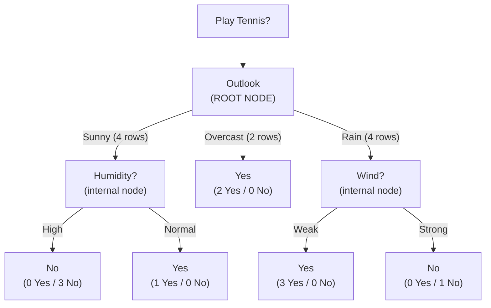

### Tree Terminology (Whiteboard annotations)

| Term | Ee example lo | Meaning |
|------|---------------|---------|
| **Root Node** | `Outlook` | Tree lo **modati (first) question**. Motham data ikkade start avtundi. |
| **Branch** | `Sunny`, `Overcast`, `Rain` | Question ki **answer paths** (edges). Prathi branch data ni oka vaipuki teeskeltundi. |
| **Internal / Decision Node** | `Humidity?`, `Wind?` | Madhyalo unna **inko question**. Inka split avvali ani ardham. |
| **Leaf Node (Target)** | `Yes` / `No` boxes | **Final answer** ichche node. Ikkada question undadu — idi target value. |
| **Depth** | ikkada **2** | Root nunchi longest leaf varaku enni questions unnayo. |

### Branch lo enni rows veltayi? (Whiteboard lo circle chesina numbers)

`Outlook` root question adigithe, 10 rows ila **3 branches** ga vidipothayi:

| Branch | Rows | Which rows | Yes / No | Status |
|--------|:----:|------------|:--------:|--------|
| **Sunny** | **4** | 1, 2, 8, 9 | 1 Yes / 3 No | mixed → inka question kavali |
| **Overcast** | **2** | 3, 7 | 2 Yes / 0 No | **pure** → direct leaf **Yes** |
| **Rain** | **4** | 4, 5, 6, 10 | 3 Yes / 1 No | mixed → inka question kavali |

> **`Overcast` enduku direct answer?** Aa branch lo unna **rendu rows kuda "Yes"** — mixing ledu. Idi **pure node**. Pure ayipoyaka inka question adagatam waste, so **direct leaf** ga marchestham.

### Migilina branches ni malli split cheyyadam

- **Sunny (4 rows)** ni `Humidity?` tho split:
  - `High` → rows 1, 2, 8 → anni **No** → leaf **No** (0 Yes / 3 No) ✅ pure
  - `Normal` → row 9 → **Yes** → leaf **Yes** (1 Yes / 0 No) ✅ pure
- **Rain (4 rows)** ni `Wind?` tho split:
  - `Weak` → rows 4, 5, 10 → anni **Yes** → leaf **Yes** (3 Yes / 0 No) ✅ pure
  - `Strong` → row 6 → **No** → leaf **No** (0 Yes / 1 No) ✅ pure

**Anni leaves pure ayyayi → tree aagipotundi (stop).** Ide "training complete".

### Tree ni rules ga chadavadam (If-Else form)

```text
IF Outlook = Overcast                      -> Yes
IF Outlook = Sunny  AND Humidity = High    -> No
IF Outlook = Sunny  AND Humidity = Normal  -> Yes
IF Outlook = Rain   AND Wind     = Weak    -> Yes
IF Outlook = Rain   AND Wind     = Strong  -> No
```

> Idi Decision Tree **biggest advantage** — model ni **plain English rules** ga chadavachu. Anduke "explainable model" antaru.

---

## Root Node Selection (Chala Important)

### Root node enduku important?

Root node ante tree lo **first question**. Idi **most important split**, enduku ante:

1. **Motham data ikkade divide avtundi** — first split correct aithe, migilina pani easy.
2. **Whole tree structure root meeda depend avtundi** — root marithe, kinda unna tree motham marutundi.
3. **Wrong root select chesthe** — tree **deep** (chala levels) avtundi, rules complicated avtai, **overfitting** and accuracy problem vastundi.
4. **Correct root select chesthe** — tree **chinnaga (shallow)**, simple ga, fast ga untundi.

**Kid analogy:** Nuvvu oka person ni guess cheyyali (20 questions game).
- Modati question *"Aa person peru lo 'a' undaa?"* — idi weak question, pedda help ledu.
- Modati question *"Aa person magavaadaa/aadadaa?"* — idi **half mandini ventane** teesestundi. Idi **strong root question**.

**Inko analogy (filter):** Root node = **first filter**.
- First filter lo rough ga separate chesthe → later questions easy.
- First filter bad ga unte → later tree chala complicated avtundi.

### Root node ela select chestaru?

Decision Tree algorithm **anni features ni try chesi** (Outlook, Temperature, Humidity, Wind), prathi daaniki *"idi root aithe data entha clean ga split avtundi?"* ani **score** calculate chestundi. **Best score** unna feature root avtundi.

Rendu common criteria (measures):

| Criterion | Ela pani chestundi | Best value |
|-----------|--------------------|------------|
| **Entropy → Information Gain** | Data lo unna **confusion (impurity)** entha thaggindo measure chestundi | **Information Gain ekkuva** unna feature = root (ID3 algorithm) |
| **Gini Impurity** | Random ga oka row ni tappuga label chese **chance** entha undo | **Gini ekkuva thaggithe (impurity takkuva)** = root (CART / sklearn default) |

### Entropy ante enti? (Confusion measure)

**Entropy = group lo entha "mixing / confusion" undo cheppe number.**

$$Entropy = -\sum p_i \log_2(p_i)$$

- **Entropy = 0** → group **pure** (anni okate answer). Example: 4 Yes / 0 No → **0** (no confusion).
- **Entropy = 1** → group **fully mixed** (perfect 50-50). Example: 2 Yes / 2 No → **1** (max confusion).
- Madhyalo unte → partially mixed.

**Kid explanation:** oka box lo **anni red balls** unte, "next ball ye color?" ani cheppadam easy → confusion **0**. Box lo **half red, half blue** unte → confusion **max (1)**.

### Information Gain ante enti?

$$Information\ Gain = Entropy(parent) - Weighted\ Entropy(children)$$

Ante: *"Ee question adigina tarvata confusion **entha thaggindi**?"* — **ekkuva thaggithe ee question better.**

---

## Worked Example — Play Tennis data tho root node kanukkovadam

### Step 1: Parent entropy (split cheyyaka mundu)

Motham 10 rows → **6 Yes, 4 No**.

$$Entropy(parent) = -\frac{6}{10}\log_2\frac{6}{10} - \frac{4}{10}\log_2\frac{4}{10}$$

- `= -(0.6 × -0.737) - (0.4 × -1.322)`
- `= 0.442 + 0.529`
- **`= 0.971`** ← starting confusion (dadapu max, ante data baaga mixed).

### Step 2: Prathi feature ki split chesi entropy chudadam

**Option A: `Outlook` ni root ga pedithe**

| Branch | Rows | Yes/No | Entropy |
|--------|:----:|:------:|:-------:|
| Sunny | 4 | 1 Y / 3 N | 0.811 |
| Overcast | 2 | 2 Y / 0 N | **0.000** (pure!) |
| Rain | 4 | 3 Y / 1 N | 0.811 |

Weighted entropy = rows count batti average:

- `= (4/10 × 0.811) + (2/10 × 0.000) + (4/10 × 0.811)`
- `= 0.325 + 0 + 0.325 = 0.649`

**Information Gain(Outlook) = 0.971 − 0.649 = `0.322`** ✅

**Option B: `Humidity` ni root ga pedithe**

| Branch | Rows | Yes/No | Entropy |
|--------|:----:|:------:|:-------:|
| High | 5 | 2 Y / 3 N | 0.971 |
| Normal | 5 | 4 Y / 1 N | 0.722 |

- Weighted = `(5/10 × 0.971) + (5/10 × 0.722)` = `0.486 + 0.361` = `0.846`
- **Information Gain(Humidity) = 0.971 − 0.846 = `0.125`**

**Option C: `Temperature` ni root ga pedithe**

| Branch | Rows | Yes/No | Entropy |
|--------|:----:|:------:|:-------:|
| Hot | 3 | 1 Y / 2 N | 0.918 |
| Mild | 3 | 2 Y / 1 N | 0.918 |
| Cool | 4 | 3 Y / 1 N | 0.811 |

- Weighted = `0.876` → **Information Gain(Temperature) = `0.095`**

**Option D: `Wind` ni root ga pedithe**

| Branch | Rows | Yes/No | Entropy |
|--------|:----:|:------:|:-------:|
| Weak | 7 | 5 Y / 2 N | 0.863 |
| Strong | 3 | 1 Y / 2 N | 0.918 |

- Weighted = `0.880` → **Information Gain(Wind) = `0.091`**

### Step 3: Winner ni select cheyyadam

| Feature | Weighted Entropy | **Information Gain** | Rank |
|---------|:----------------:|:--------------------:|:----:|
| **`Outlook`** | 0.649 | **0.322** | 🥇 **1 (ROOT)** |
| `Humidity` | 0.846 | 0.125 | 2 |
| `Temperature` | 0.876 | 0.095 | 3 |
| `Wind` | 0.880 | 0.091 | 4 |

> **Result:** `Outlook` ki **Information Gain highest (0.322)** → so **`Outlook` = Root Node**. Ee reason valle whiteboard diagram lo root lo `Outlook` undi!

**Enduku `Outlook` gelichindi?** Enduku ante `Outlook = Overcast` branch **fully pure** (2 Yes / 0 No, entropy = 0) — okka question tho ne 2 rows ki answer fix ayipoyindi. Migilina features lo **e branch kuda pure kaadu** — anni branches lo Yes/No mixed ga unnayi.

### Same example — Gini Impurity tho

$$Gini = 1 - \sum p_i^2$$

- **Parent Gini:** `1 − (0.6)² − (0.4)²` = `1 − 0.36 − 0.16` = **`0.48`**
- **Outlook:** Sunny `0.375`, Overcast `0.000`, Rain `0.375` → weighted `0.300` → **gain = `0.180`** 🥇
- **Humidity:** High `0.480`, Normal `0.320` → weighted `0.400` → gain = `0.080`
- **Temperature:** weighted `0.417` → gain = `0.063`
- **Wind:** weighted `0.419` → gain = `0.061`

> **Gini kuda `Outlook` ne root ga chepthundi.** Rendu methods mostly **same answer** istai — Gini calculate cheyyadam fast (log ledu), anduke **sklearn default = `gini`**.

### Ee process ni repeat cheyyadam (Recursion)

Root fix ayyaka, **prathi branch ki same process malli** jarugutundi:

1. `Sunny` branch (4 rows) lo migilina features (`Temperature`, `Humidity`, `Wind`) ni compare → **`Humidity`** best → adi aa branch node.
2. `Rain` branch (4 rows) lo compare → **`Wind`** best → adi aa branch node.
3. `Overcast` branch already **pure** → **stop**, leaf ga marchadam.

**Stop eppudu avtundi?**
- Node **pure** ayipoyindi (anni okate class), **or**
- Features anni already vaadesam, **or**
- `max_depth` / `min_samples_split` limit reach ayindi.

### Mini intuition (formula lekunda)

10 rows lo 5 Yes, 5 No unnai anuko. Oka question adigaka:

```text
GOOD root question:              BAD root question:
   left  = 5 Yes / 0 No             left  = 3 Yes / 2 No
   right = 0 Yes / 5 No             right = 2 Yes / 3 No
   -> rendu sides PURE              -> rendu sides inka MIXED
   -> confusion 0, pani ayipoyindi  -> inka chala questions kavali
```

**Rule:** oka side **mostly Yes**, inko side **mostly No** vasthe → adi **good root**. Rendu sides lo Yes/No **mix** ga unte → **bad root**.

---

## Prediction — Kotha row vasthe ela answer istundi?

Kotha day: **Outlook = Rain, Temperature = Mild, Humidity = High, Wind = Strong**

```text
Start -> Outlook? = Rain      -> Rain branch loki
      -> Wind?    = Strong    -> Strong branch loki
      -> LEAF     = No
```

**Prediction: `No` (tennis aadaru).**

- Gamanika: `Temperature` and `Humidity` ee prediction lo **vaadanu** — Rain path lo aa questions ravu. Tree **avasaramaina questions matrame** adugutundi.

---

## Final Leaves (Summary)

| Path | Leaf | Counts |
|------|:----:|:------:|
| `Outlook = Overcast` | **Yes** | 2 Yes / 0 No |
| `Outlook = Sunny` → `Humidity = High` | **No** | 0 Yes / 3 No |
| `Outlook = Sunny` → `Humidity = Normal` | **Yes** | 1 Yes / 0 No |
| `Outlook = Rain` → `Wind = Weak` | **Yes** | 3 Yes / 0 No |
| `Outlook = Rain` → `Wind = Strong` | **No** | 0 Yes / 1 No |

---

## ⚠️ Main Disadvantage — **Decision Trees are prone to overfit**

> **Whiteboard point:** *"Decision Trees are prone to overfit"* — idi Decision Tree yokka **biggest disadvantage**.

**Overfit ante enti (quick recall):** model training data ni **baaga baaga memorize** chesi, **kotha (unseen) data meeda fail** avvadam.
- Training accuracy → **chala ekkuva** (dadapu 100%)
- Test accuracy → **takkuva**
- Ee **gap** ye overfitting signal.

---

### 🔍 WHY? — Decision Trees enduku overfit avthai (5 reasons)

#### Reason 1: Tree **"pure" ayye varaku aagadu** (main reason)

Idi **most important reason**. Default ga Decision Tree ki **stop cheyyadaniki limit ledu** — prathi leaf **pure** (anni okate class) ayye varaku **splits chestune untundi**.

- Impurity `> 0` unnanta varaku → *"inko question adugutha"*
- Chivariki prathi leaf lo **1 or 2 rows** matrame migulutai
- **1 row ki oka rule** ante adi **learning kaadu — memorizing**

```text
Correct learning:            Overfitting (memorizing):
  "Rain + Strong -> No"        "Rain + Strong + Mild + Humidity=Normal
   (30 rows batti nerchindi)     + Day=Tuesday -> No"  (1 row batti!)
   -> general rule ✅            -> aa okka row ki matrame rule ❌
```

#### Reason 2: **Noise / wrong rows ni kuda rule ga marchestundi**

- Data lo oka row **tappu ga label** ayindi anuko (mistake / noise).
- Normal model adi **ignore** cheyyali.
- Kani tree *"ee row kuda pure ga separate cheyyali"* ani, aa **okka row kosam prathyekam ga oka branch** create chestundi.
- Aa branch **nijamaina pattern kaadu** — kevalam **noise** ni gurthu pettukunnadi.

#### Reason 3: **Greedy algorithm** — munduki chuudadu

- Tree prathi step lo **"ippudu best split edi?"** ani matrame chustundi (greedy).
- *"Ee split valla tarvata tree entha complicated avtundi?"* ani **alochinchadu**.
- So local ga correct decisions teeskuntu, **globally chala pedda, complicated tree** ni build chestundi.

#### Reason 4: **Enni splits ayina cheyyagaladu** (no natural limit)

- Linear Regression ki oka **line** matrame — adi entha ayina complicated avvadu (limited flexibility).
- Kani Decision Tree **entha deep ayina** vellagaladu → **unlimited flexibility**.
- Flexibility ekkuva = **variance ekkuva** = **overfit chance ekkuva**.

#### Reason 5: **Jagged (unancha) boundary**

- Deep tree yokka decision boundary **prathi point chuttu tightly wrap** avtundi.

```text
Good (general) boundary:        Overfit boundary (deep tree):
    ___________                     _|‾|__|‾‾|_|‾|_
   /           \                   | prathi point ni    |
  |  class A    |                  | separate ga wrap   |
   \___________/                   |_chestundi__________|
   -> smooth, kotha data OK        -> kotha point vasthe tappu
```

---

### 📊 Mana Play Tennis example lone overfitting evidence

Mana tree lo ee leaves chudandi:

| Leaf | Rows aa leaf lo | Problem? |
|------|:---------------:|----------|
| `Sunny → Humidity = Normal` → **Yes** | **1 row** (row 9) | ⚠️ **okka row** batti rule! |
| `Rain → Wind = Strong` → **No** | **1 row** (row 6) | ⚠️ **okka row** batti rule! |
| `Sunny → Humidity = High` → **No** | 3 rows | ✅ koncham better |

- *"Rain + Strong Wind aithe tennis aadaru"* — ee rule **okka roju data** batti nerchukunnadi!
- Nijam ga rain + strong wind lo evaro aadi undachu — kani mana tree **"eppudu No"** ani **gudlu moosukuni** cheptundi.
- **Idi exactly overfitting** — chinna data batti **too confident** rule.

---

### 🧪 Real Proof (numbers tho) — sklearn experiment

Breast Cancer dataset (569 rows) meeda **same data**, kevalam **tree depth** matrame maarchi test chesam:

| Setting | Depth | Leaves | Train Accuracy | Test Accuracy | **Gap** |
|---------|:-----:|:------:|:--------------:|:-------------:|:-------:|
| **No limit (default)** | 7 | 16 | **1.000** (100%!) | 0.942 | **0.058** ❌ |
| `max_depth=4` | 4 | 12 | 0.995 | 0.953 | 0.042 |
| `max_depth=3` | 3 | 8 | 0.970 | **0.965** | **0.005** ✅ |
| `min_samples_leaf=5` | 5 | 12 | 0.980 | **0.971** | 0.009 ✅ |

**Ee table nunchi em ardham avtundi?**

1. **No limit tree → training accuracy `1.000` (100%)** — ante **prathi training row ni correct** ga cheppindi. Idi *"model super"* kaadu — idi **memorization warning sign** ⚠️.
2. Kani aa same tree **test meeda `0.942`** matrame — **shallow tree (`0.965`) kanna takkuva!**
3. **Chinna tree (depth 3), pedda tree (depth 7) kanna kotha data meeda BETTER.** Idi overfitting ki **clear proof**.
4. **Gap `0.058` → `0.005`** ki thaggindi — ante model **generalize** avtundi.

> **Key insight:** Training accuracy 100% vasthe **santhoshapadaku** — mostly adi **overfitting** signal. Eppudu **test accuracy** ni chudu.

```python
from sklearn.datasets import load_breast_cancer
from sklearn.model_selection import train_test_split
from sklearn.tree import DecisionTreeClassifier
from sklearn.metrics import accuracy_score

X, y = load_breast_cancer(return_X_y=True)
X_train, X_test, y_train, y_test = train_test_split(X, y, test_size=0.3, random_state=42)

# Tree 1: limit ledu -> OVERFIT
big = DecisionTreeClassifier(random_state=42).fit(X_train, y_train)
print("Full tree  -> train:", accuracy_score(y_train, big.predict(X_train)),
      "test:", accuracy_score(y_test, big.predict(X_test)))

# Tree 2: depth limit -> BETTER
small = DecisionTreeClassifier(max_depth=3, random_state=42).fit(X_train, y_train)
print("Depth 3    -> train:", accuracy_score(y_train, small.predict(X_train)),
      "test:", accuracy_score(y_test, small.predict(X_test)))
```

---

### ✅ Overfitting ni ela aapali? (Solutions)

| Solution | Ela pani chestundi |
|----------|--------------------|
| **`max_depth`** set cheyyadam | Tree ni **konni levels ki** aapesthundi (most common fix) |
| **`min_samples_leaf`** | Leaf lo **kanisam N rows** undali — 1-row rules raavu |
| **`min_samples_split`** | Node lo N rows unte ne split cheyyi |
| **Pruning** (`ccp_alpha`) | Mundu **full tree** penchi, tarvata **useless branches ni kattirinchadam** |
| **Cross Validation** | Best `max_depth` ni **guess kaakunda**, test chesi kanukkovadam |
| **🌲 Random Forest** | **Chala trees** build chesi **vote** teeskovadam — **best solution** |

> **Enduku Random Forest best fix?** Oka tree tappu cheyyachu (overfit). Kani **100 trees** different ga overfit avtai, and vaati **average/vote** teeskunte aa tappulu **cancel** ayipotai. Idi *"okkariki adagakunda, 100 mandini adigi majority teeskovadam"*. (Detail: section 8.4)

> **Ee reason valle Random Forest, XGBoost lantivi puttayi** — anni **Decision Tree base** meeda kattinave, kani **overfitting problem ni fix** chesthu.

---

## Decision Tree Hyperparameters (Overfitting control)

| Hyperparameter | Meaning | Chinna value | Pedda value |
|----------------|---------|--------------|-------------|
| `criterion` | Split measure | `'gini'` (fast, default) | `'entropy'` (information gain) |
| `max_depth` | Tree entha lothu vellocho | **underfit** (too simple) | **overfit** (memorize) |
| `min_samples_split` | Split cheyyadaniki kaavalsina min rows | overfit | underfit |
| `min_samples_leaf` | Leaf lo undalsina min rows | overfit | underfit |

- **Pruning** = penchina tree lo unnecessary branches ni **kattirinchadam** (trim), overfitting thaggadaniki.
- Deep tree = prathi row ni gurthu pettukuntundi (**overfit**) → training 100%, test poor.

---

## Practical Implementation (Python + scikit-learn)

```python
import pandas as pd
from sklearn.tree import DecisionTreeClassifier, export_text
from sklearn.metrics import accuracy_score

# Step 1: Whiteboard dataset
data = {
    "Outlook":     ["Sunny","Sunny","Overcast","Rain","Rain","Rain","Overcast","Sunny","Sunny","Rain"],
    "Temperature": ["Hot","Hot","Hot","Mild","Cool","Cool","Cool","Mild","Cool","Mild"],
    "Humidity":    ["High","High","High","High","Normal","Normal","Normal","High","Normal","Normal"],
    "Wind":        ["Weak","Strong","Weak","Weak","Weak","Strong","Strong","Weak","Weak","Weak"],
    "PlayTennis":  ["No","No","Yes","Yes","Yes","No","Yes","No","Yes","Yes"],
}
df = pd.DataFrame(data)

# Step 2: Categorical text ni numbers ga marchadam (one-hot encoding)
X = pd.get_dummies(df[["Outlook", "Temperature", "Humidity", "Wind"]])
y = df["PlayTennis"]

# Step 3: Model (entropy = information gain, whiteboard logic)
model = DecisionTreeClassifier(criterion="entropy", random_state=42)
model.fit(X, y)

# Step 4: Tree ni rules ga print cheyyadam
print(export_text(model, feature_names=list(X.columns)))

# Step 5: Ye features important ayyayo chudadam
importance = pd.Series(model.feature_importances_, index=X.columns)
print("\nFeature importance:\n", importance.sort_values(ascending=False).head())

# Step 6: Kotha day ki predict cheyyadam
new_day = pd.DataFrame([{
    "Outlook": "Rain", "Temperature": "Mild", "Humidity": "High", "Wind": "Strong"
}])
new_X = pd.get_dummies(new_day).reindex(columns=X.columns, fill_value=0)
print("\nPlay Tennis?", model.predict(new_X)[0])
```

### Actual Output (ee code run cheste)

```text
|--- Outlook_Sunny <= 0.50
|   |--- Wind_Weak <= 0.50
|   |   |--- Outlook_Overcast <= 0.50
|   |   |   |--- class: No
|   |   |--- Outlook_Overcast >  0.50
|   |   |   |--- class: Yes
|   |--- Wind_Weak >  0.50
|   |   |--- class: Yes
|--- Outlook_Sunny >  0.50
|   |--- Humidity_High <= 0.50
|   |   |--- class: Yes
|   |--- Humidity_High >  0.50
|   |   |--- class: No

Feature importance:
 Humidity_High       0.334220
Outlook_Sunny       0.264098
Outlook_Overcast    0.205984
Wind_Weak           0.195698
Outlook_Rain        0.000000

Play Tennis? No
```

- **Root node = `Outlook_Sunny`** → ante **`Outlook`** ye root ✅ (manam paina Information Gain tho calculate chesindi correct ani proof).
- **Prediction = `No`** → manam manual ga chesina walkthrough (Rain → Strong → No) tho **exact ga match ayyindi** ✅.
- `Outlook = Sunny` aithe → `Humidity` question, `Wind = Weak` aithe → direct `Yes` — whiteboard tree logic ne.

### Code lo prathi step enduku?
- **`get_dummies`** — sklearn ki text panicheyyadu, so categories ni 0/1 columns ga marchali.
- **`criterion="entropy"`** — manam paina chesina Information Gain method ne vaadutundi (`"gini"` default).
- **`export_text`** — tree ni **if-else rules** ga chupistundi (root node ye feature o **modati line lo** kanipistundi).
- **`feature_importances_`** — ye feature entha useful ani score. (Gamanika: idi feature **motham** contribution — root node ni telusukovadaniki `export_text` modati line chudadam correct way.)
- **Scaling ledu** — Decision Tree ki scaling avasaram ledu (splits meeda pani chestundi, distance meeda kaadu).

> **Important note (whiteboard tree vs sklearn tree):** Whiteboard lo `Outlook` ni **3 branches** (Sunny / Overcast / Rain) ga split chesam — idi **multi-way split** (ID3 style). Kani **sklearn eppudu binary (2-way) splits** matrame chestundi, and one-hot encoding valla `Outlook_Sunny = 0 or 1` laaga questions adugutundi. So **shape koncham different** ga kanipistundi, kani **rules and final answers same**.

---

## Advantages and Weakness

### Enduku Decision Tree? (Advantages)

- **Easy to understand** — tree ni chusi direct ga ardham avtundi (visual).
- **Explainable** — if-else rules ga chadavachu ("enduku ee answer icchindi" ani cheppachu).
- **Feature scaling avasaram ledu** — StandardScaler/MinMaxScaler avasaram ledu.
- **Categorical + numerical** rendu types data ki work avtundi.
- **Missing values / outliers** ni koncham baaga tolerate chestundi (distance based kaadu kabatti).
- **Non-linear relations** ni handle chestundi (SVM kernel laanti trick avasaram ledu).

### Weakness

- **⚠️ Overfitting avvachu (BIGGEST disadvantage)** — tree **pure ayye varaku** splits chestune, training data ni memorize chestundi. (Full "why" explanation paina **"Main Disadvantage"** section lo undi.)
  - Fix: **pruning**, `max_depth`, `min_samples_leaf`, **Random Forest**.
- **Unstable** — data lo chinna change vachina, tree structure motham marochu (high variance).
  - Fix: **Random Forest** (chala trees vote chestai — section 8.4).
- **Biased towards features with many categories** — ekkuva unique values unna column ni root ga select chese tendency.
- **Greedy** — prathi step lo local best chustundi, globally best tree guarantee ledu.

> **Short summary:** Decision Tree = *"Best question ni root ga adigi, question by question data ni pure groups ga vidagotti, leaf node lo final answer ivvadam."* Root node = **highest Information Gain (or lowest Gini)** unna feature.

---

## Decision Tree — Quick Summary (Gurthu pettuko)

| Point | Value |
|-------|-------|
| **Type** | Supervised (Classification + Regression) |
| **Idea** | Questions adugutu data ni pure groups ga split cheyyadam |
| **Root Node** | Modati question — **best split** unna feature (`Outlook`) |
| **Branch** | Question ki answer path (`Sunny`, `Overcast`, `Rain`) |
| **Leaf Node** | Final answer (target) — `Yes` / `No` |
| **Split criteria** | **Information Gain** (entropy) or **Gini Impurity** |
| **Best root rule** | IG **highest** / Gini **lowest** |
| **Scaling** | **Avasaram ledu** (distance based kaadu) |
| **Stop eppudu** | Node pure ayinapudu, or `max_depth` reach ayinapudu |
| **⚠️ Main Weakness** | **Prone to OVERFIT** (pure ayye varaku split chestundi) |
| **Overfit signal** | Train accuracy ~100%, test accuracy takkuva |
| **Fix** | `max_depth`, `min_samples_leaf`, Pruning, or **Random Forest** |

> **Final gurthu:** Decision Tree = *"Correct root question adigithe, migilina pani sagam ayipoyinatte."*

---

## 10. Training, Validation, Testing

### Training Data

Model learn cheyyadaniki use chestham.

### Validation Data

Settings compare cheyyadaniki use chestham.

### Test Data

Final ga unbiased performance check cheyyadaniki use chestham.

### Why separate sets?

Same exam questions mundhe chupinchi exam pedithe real skill teliyadu.
Ade logic ikkada.

---

## 11. Overfitting, Underfitting and Bias-Variance

## Underfitting

Model very simple ga untundi.
Data patterns proper ga learn cheyyadu.

Result:
- Train performance bad
- Test performance bad

## Overfitting

Model training data ni too much memorize chestundi.

Result:
- Train performance excellent
- Test performance poor

## Good fit

Model main patterns learn chesi new data meeda kuda baaga work cheyyali.

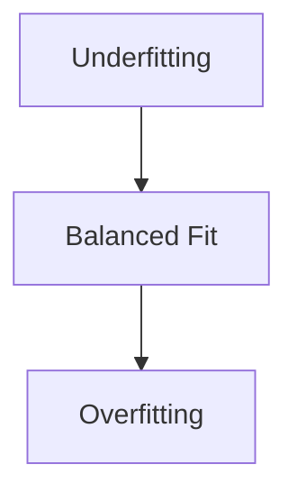

### Bias and Variance (same topic connection)

Overfitting and underfitting behind unde reason ye Bias and Variance.

#### Bias

Too many wrong assumptions.
Model simple ga undi patterns miss chesthundi.
- High bias -> **Underfitting** (train and test rendu bad).

#### Variance

Training data changes ki too sensitive ga untundi.
Model overfit avvachu.
- High variance -> **Overfitting** (train good, test poor).

#### Bias-Variance Tradeoff

Target:
- bias-variance balance maintain cheyyadam
- bias takkuva chesthe variance perugutundi, variance takkuva chesthe bias perugutundi, so middle balance best.

---

## 12. Evaluation Metrics

Metrics problem type batti change avuthayi.

## 12.1 Classification Metrics

### Confusion Matrix Terms (TP, TN, FP, FN)

Ee 4 terms anni classification metrics ki base. Prathi prediction ni rendu things tho compare chestham: **Actual** (nijam) vs **Predicted** (model cheppindi).

- **TP (True Positive):** Actual **Yes**, model predicted **Yes** — correct.
- **TN (True Negative):** Actual **No**, model predicted **No** — correct.
- **FP (False Positive):** Actual **No**, kani model **Yes** ani wrong ga predict chesindi.
- **FN (False Negative):** Actual **Yes**, kani model **No** ani wrong ga miss chesindi.

### Accuracy

Correct predictions / total predictions

$$Accuracy = \frac{TP + TN}{TP + TN + FP + FN}$$

### Precision

Positive ani cheppina vatilo entha correct?

$$Precision = \frac{TP}{TP + FP}$$

### Recall

Actual positives lo entha capture chesam?

$$Recall = \frac{TP}{TP + FN}$$

### F1-score

Precision and recall balance metric (harmonic mean).

$$F1 = 2 \times \frac{Precision \times Recall}{Precision + Recall}$$

### Confusion Matrix

Shows:
- True Positive
- True Negative
- False Positive
- False Negative

Ee 4 values ni oka 2x2 table (rows = actual, columns = predicted) laaga arrange chesthe, adi **Confusion Matrix**.

### Example use case

Disease detection lo recall important avvachu.
Spam filter lo precision kuda important avvachu.

---

## 12.2 Regression Metrics

### MAE

Average absolute error

### MSE

Squared error average

### RMSE

Square root of MSE

### R² Score

Model data variation ni entha explain chestundo chepthundi.

---

## 13. Data Preprocessing

Data preprocessing chala important.
Bad data unte good model kuda fail avvachu.

### Common preprocessing tasks

#### Missing value handling
- remove cheyyachu
- mean/median/mode fill cheyyachu

#### Encoding categorical data
- **label encoding:** category ni oka number ga marchadam (example: Low=0, Medium=1, High=2). Categories madhya **order/rank** unnappudu (ordinal data) bagundi.
- **one-hot encoding:** prathi category ki separate 0/1 column create cheyyadam (example: City_Hyd, City_Chennai). Categories madhya order lekapothe (nominal data) idi correct choice — order lekunda direct numbers (0,1,2) isthe model wrong ranking assume chestundi.

#### Feature scaling

Feature scaling anedi chala important preprocessing step.

Simple ga:

**Different size lo unna numbers ni same range or same scale lo ki teesukuravadam ni feature scaling antaru.**

### Kid-style explanation

Suppose 2 students ni compare chesthunnaav:
- one student height centimeters lo undi
- inko student weight kilograms lo undi

Now numbers ila unnayi ani assume cheyyi:
- Height = 170
- Weight = 55

Inko feature salary aithe:
- Salary = 50000

Ippudu machine ki inputs ichinappudu problem enti ante:
- Age maybe 25
- Salary maybe 50000

Salary number chala pedda value kabatti model ki adhe ekkuva important ani feel avvachu, even if actually age kuda important ayina.

Anduke all features ni balanced range lo ki teesukuravalsi untundi.

### Very simple real-life analogy

Nuvvu race conduct chesthunnaav ani imagine cheyyi.

One person meters lo run chesthunnadu.
Inko person kilometers lo distance chepthunnadu.

Direct ga compare chesthe confusion ostundi.
First same unit lo ki convert cheyyali.

ML lo scaling kuda exactly ade idea.

### Why feature scaling needed?

Suppose customer purchase prediction lo 2 features unnayi:
- Age = 25
- Salary = 60000

Without scaling:
- model salary ni chala pedda number ani ekkuva importance ivvachu

With scaling:
- age and salary balanced ga consider cheyyadaniki help chestundi

### Eppudu feature scaling important?

Especially useful for:
- KNN
- SVM
- Logistic Regression
- Linear Regression (some workflows lo helpful)
- Neural Networks
- K-Means clustering
- PCA

### Eppudu less important?

Tree-based models lo usually scaling compulsory kaadu:
- Decision Tree
- Random Forest
- XGBoost

Because avi splits meeda work chestayi, distance meeda kaadu.

### Main two methods

### 1. Standardization

Data ni mean 0 and standard deviation 1 range around ki convert chestundi.

Simple ga:
- center around 0
- spread normalize chestundi

Formula:

`z = (x - mean) / standard deviation`

Where:
- `x` = current value
- `mean` = average value
- `standard deviation` = values entha spread ayyayyo chupinche measure

Use when:
- normal/distributed data meeda often useful
- many ML algorithms lo common default choice

### Standardization worked example

Suppose ages unnayi:

`[20, 30, 40]`

Assume:
- mean = 30
- standard deviation = 10

Now `x = 20` ki standardization apply chesthe:

`z = (20 - 30) / 10`

`z = -10 / 10`

`z = -1`

`x = 40` ki:

`z = (40 - 30) / 10 = 1`

So roughly scaled values ila untayi:
- 20 -> -1
- 30 -> 0
- 40 -> 1

Meaning:
- mean value 30 center point ayindi
- danikanna thakkuva values negative side ki vellayi
- ekkuva values positive side ki vellayi

### Standardization code example

```python
from sklearn.preprocessing import StandardScaler

data = [[20], [30], [40]]

scaler = StandardScaler()
scaled_data = scaler.fit_transform(data)

print(scaled_data)
```

### 2. Normalization

Data ni usually 0 to 1 range lo ki convert chestundi.

Formula idea:

`x_new = (x - min) / (max - min)`

Where:
- `x` = current value
- `min` = smallest value
- `max` = biggest value

Use when:
- fixed bounded range kavali
- deep learning / distance-based methods lo konni cases lo useful

### Normalization worked example

Same values use cheddam:

`[20, 30, 40]`

Ikkada:
- min = 20
- max = 40

Now `x = 30` ki normalization apply chesthe:

`x_new = (30 - 20) / (40 - 20)`

`x_new = 10 / 20`

`x_new = 0.5`

Other values:
- 20 -> 0
- 30 -> 0.5
- 40 -> 1

Meaning:
- smallest value 0 ayindi
- largest value 1 ayindi
- middle value 0.5 ayindi

### Normalization code example

```python
from sklearn.preprocessing import MinMaxScaler

data = [[20], [30], [40]]

scaler = MinMaxScaler()
scaled_data = scaler.fit_transform(data)

print(scaled_data)
```

### Easy difference

- Standardization -> values around 0 ki shift chestundi
- Normalization -> values ni 0 to 1 madhya compress chestundi

### Quick memory trick

- **Standardization** = center around 0
- **Normalization** = squeeze into 0 to 1 range

### Real example without scaling

| Age | Salary |
|---|---|
| 20 | 20000 |
| 30 | 50000 |
| 40 | 90000 |

Ikkada salary values age kanna chala pedda range lo unnayi.

Model distance-based algorithm aithe salary influence ekkuva undachu.

### Real example after scaling idea

| Age_scaled | Salary_scaled |
|---|---|
| small balanced value | small balanced value |
| small balanced value | small balanced value |
| small balanced value | small balanced value |

Ippudu model rendu features ni more fairly compare chestundi.

### Feature scaling end-to-end flow

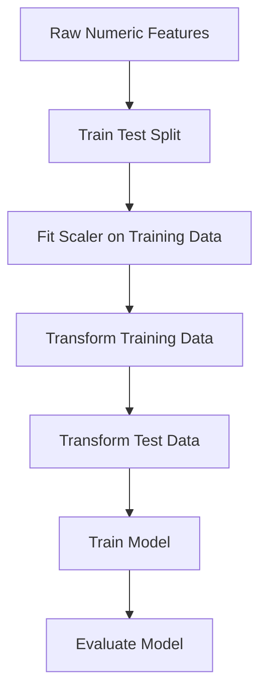

### Very important rule

Scaler ni **training data meeda maatrame fit** cheyyali.

Wrong way:
- full dataset meeda fit cheyyadam

Right way:
- training data meeda fit
- test data meeda same scaler apply

Enduku?

Because test data information mundhe use chesthe data leakage avvachu.

### Example with StandardScaler

```python
from sklearn.model_selection import train_test_split
from sklearn.preprocessing import StandardScaler

X = [[20, 20000], [25, 30000], [35, 50000], [45, 80000], [50, 90000]]
y = [0, 0, 1, 1, 1]

X_train, X_test, y_train, y_test = train_test_split(
	X, y, test_size=0.2, random_state=42
)

scaler = StandardScaler()
X_train_scaled = scaler.fit_transform(X_train)
X_test_scaled = scaler.transform(X_test)

print("Original training data:", X_train)
print("Scaled training data:\n", X_train_scaled)
print("Scaled test data:\n", X_test_scaled)
```

### Example with MinMaxScaler (Normalization)

```python
from sklearn.preprocessing import MinMaxScaler

X = [[20, 20000], [25, 30000], [35, 50000], [45, 80000], [50, 90000]]

scaler = MinMaxScaler()
X_scaled = scaler.fit_transform(X)

print(X_scaled)
```

### One more simple mental model

Feature scaling ante classroom lo andaru students ni same type bench meeda kuchobettadam laanti di.

Different heights unna pillalu unna, classroom compare/sit/manage cheyyadaniki proper arrangement chestharu.

ML lo features different scales lo unna, model ki easy ga compare cheyyadaniki scaling chestham.

### When beginners make mistakes

1. Scaling avasaram unna algorithms lo scaling skip chestharu
2. Train/test split mundhe scaling chestharu
3. Test data meeda kuda fit chestharu
4. Tree models ki unnecessary tension padatharu

### One-line summary

**Feature scaling ante features ni same scale lo ki teesukuravadam, so model vatini fair ga compare cheyyagaladu.**

### Small combined preprocessing example

```python
from sklearn.model_selection import train_test_split
from sklearn.preprocessing import StandardScaler

X = [[20, 20000], [25, 30000], [35, 50000], [45, 80000]]
y = [0, 0, 1, 1]

X_train, X_test, y_train, y_test = train_test_split(X, y, test_size=0.25, random_state=42)

scaler = StandardScaler()
X_train_scaled = scaler.fit_transform(X_train)
X_test_scaled = scaler.transform(X_test)

print(X_train_scaled)
```

---

## 14. Feature Engineering

Feature engineering ante raw data nundi better inputs create cheyyadam.

Examples:
- DOB nundi age create cheyyadam
- address nundi city extract cheyyadam
- timestamp nundi hour/month/day extract cheyyadam
- transaction count create cheyyadam

Good features = better model chance.

---

## 15. Hyperparameters

Hyperparameters ante model training mundhe manam set chese settings.

Examples:
- Decision tree depth
- KNN lo `k`
- Learning rate
- Number of estimators

Veetini tuning chesi performance improve cheyyachu.

Methods:
- **Grid Search:** possible hyperparameter values anni combinations ni systematic ga try chesi, best combination ni kanukkovadam. Thorough kani slow (values ekkuva unte chala time padutundi).
- **Random Search:** anni combinations try cheyyakunda, random ga konni combinations select chesi try cheyyadam. Grid Search kanna fast, chala time large search spaces ki better.

---

## 16. Cross Validation

Single train/test split meeda depend kakunda multiple splits lo model evaluate cheyyadam.

Benefit:
- More reliable performance estimate

Example:
- 5-fold cross validation

Data ni 5 parts ga divide chestham.
4 parts training, 1 part testing.
I process repeat chestham.

---

## 17. Practical Example: Social Network Ads style problem

Mee folder lo `Social_Network_Ads.csv` undi kabatti ila think cheyyachu.

Problem:
- User age and salary batti ad/product purchase chesthada predict cheyyali

Possible features:
- Age
- EstimatedSalary

Label:
- Purchased

### End-to-end flow

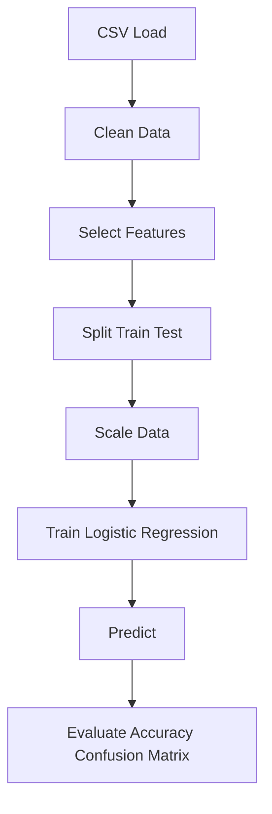

### Example code

```python
import pandas as pd
from sklearn.model_selection import train_test_split
from sklearn.preprocessing import StandardScaler
from sklearn.linear_model import LogisticRegression
from sklearn.metrics import accuracy_score, confusion_matrix

df = pd.read_csv("Social_Network_Ads.csv")

X = df[["Age", "EstimatedSalary"]]
y = df["Purchased"]

X_train, X_test, y_train, y_test = train_test_split(X, y, test_size=0.25, random_state=42)

scaler = StandardScaler()
X_train = scaler.fit_transform(X_train)
X_test = scaler.transform(X_test)

model = LogisticRegression()
model.fit(X_train, y_train)

y_pred = model.predict(X_test)

print("Accuracy:", accuracy_score(y_test, y_pred))
print("Confusion Matrix:\n", confusion_matrix(y_test, y_pred))
```

---

## 18. ML Libraries You Should Know

### NumPy
- numerical arrays and math

### Pandas
- data loading and cleaning

### Matplotlib / Seaborn
- visualization

### scikit-learn
- classical ML algorithms and preprocessing

### PyTorch
- deep learning

### XGBoost
- boosting models

---

## 19. Common Mistakes Beginners Chestharu

1. Data cleaning skip cheyyadam
2. Train and test data mix cheyyadam
3. Overfitting ni ignore cheyyadam
4. Wrong metric use cheyyadam
5. Feature scaling avasaram unna place lo cheyyakapovadam
6. Imbalanced data ni ignore cheyyadam — **imbalanced data** ante oka class rows chala ekkuva, inko class rows chala takkuva unte (example: 950 "No Disease" vs 50 "Disease"). Ala unte model majority class ni matrame nerchukuni, accuracy high ga kanipinchina minority class ni sarigga predict cheyyaledu.
7. Business problem ardham kakunda direct algorithm run cheyyadam

---

## 20. When to Use Which Model?

### Continuous value predict cheyyali ante
- Linear Regression
- Random Forest Regressor

### Binary classification ante
- Logistic Regression
- Decision Tree
- Random Forest
- SVM

### Grouping cheyyali ante
- K-Means

### Dimensions reduce cheyyali ante
- PCA

### Complex text/image problems ante
- Deep Learning models

---

## 21. Machine Learning vs Deep Learning vs Generative AI

### Machine Learning
- structured data meeda chala use avuthundi

### Deep Learning
- images, audio, text lo complex patterns handle chestundi

### Generative AI
- kotha content create chestundi
  - text
  - image
  - code

Simple ga:

**ML -> predict**

**Deep Learning -> complex patterns learn**

**GenAI -> create**

---

## 22. Final Learning Roadmap for ML Only

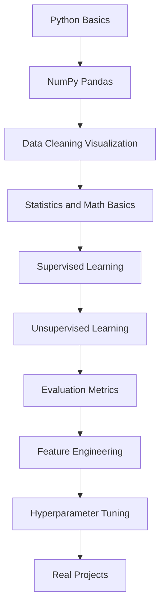

Simple order:

1. Python
2. NumPy + Pandas
3. Data cleaning + visualization
4. Statistics basics
5. Regression + Classification
6. Clustering + PCA
7. Metrics
8. Feature engineering
9. Tuning
10. Real projects

---

## 23. Final Summary

Machine Learning lo most important enti ante:

- Problem ni correct ga define cheyyali
- Good data collect cheyyali
- Data clean cheyyali
- Correct features select cheyyali
- Suitable algorithm use cheyyali
- Proper metrics tho evaluate cheyyali
- Real-world lo deploy chesi monitor cheyyali

One-line ga:

**Good data + good features + correct algorithm + proper evaluation = good ML system**

---

## 24. Interview-style Short Definitions

### Machine Learning
Data nundi learn chesi predictions or decisions cheyyadam.

### Feature
Model ki input column.

### Label
Predict cheyyalsina target output.

### Overfitting
Training data ni memorize chesi new data meeda fail avvadam.

### Underfitting
Data patterns ni sarigga learn cheyyakapovadam.

### Regression
Continuous value predict cheyyadam.

### Classification
Category/class predict cheyyadam.

### Clustering
Similar data ni groups ga divide cheyyadam.

### Evaluation Metric
Model performance ni measure cheyyadaniki use chese value.


---

## GINI Index (Gini Impurity) — Decision Tree lo Split Select Cheyyataniki

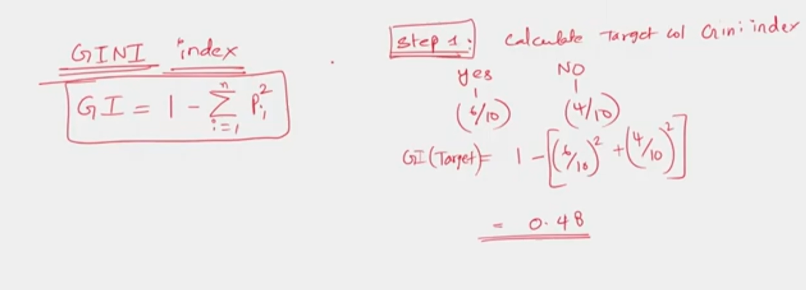

### GINI Index Ante Enti?

**GINI Index** (Gini Impurity) = oka node lo **impurity** (mixture) enta undo cheppedi.

Simple ga cheppalante:

- Oka bag lo anni same color balls unte → **pure** → GI = 0
- Bag lo anni different color balls unte → **impure** → GI = 0.5 (maximum)

Decision Tree **best split** choose cheyyataniki GINI use chesthundi — **least impurity unna column** ni select chesthundi.

---

### Formula

```
GI = 1 - Σ (Pi)²
         i=1
```

- `Pi` = class i probability (aa class fraction)
- Anni classes ki (Pi)² calculate chesi, anni add chesi, 1 nundi minus cheyyi

**Range:** 0 (pure) to 0.5 (most impure — binary classification)

---

### Example — Weather Dataset

Oka dataset lo 10 records unnay:
- **Yes (Play):** 6 records
- **No (Don't Play):** 4 records

---

### Step 1: Target Column Gini Index Calculate Cheyyi


```
Yes = 6/10
No  = 4/10

GI(Target) = 1 - [(6/10)² + (4/10)²]
           = 1 - [0.36 + 0.16]
           = 1 - 0.52
           = 0.48
```

**Meaning:** Target column lo 0.48 impurity undi — chala mixed undi, pure kaadu.

---

### Step 2: Outlook Column — Prathi Value Ki Gini Calculate Cheyyi

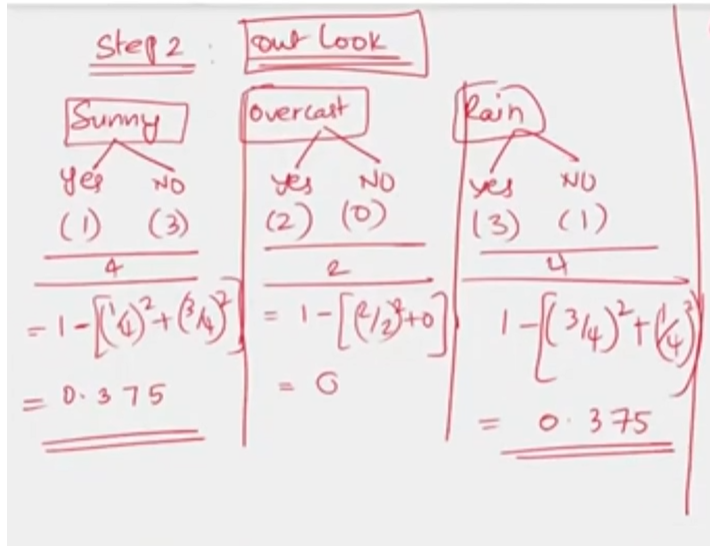

Outlook column lo 3 values unnay: **Sunny, Overcast, Rain**

#### Sunny (4 records total):
- Yes: 1, No: 3

```
GI(Sunny) = 1 - [(1/4)² + (3/4)²]
          = 1 - [0.0625 + 0.5625]
          = 1 - 0.625
          = 0.375
```

#### Overcast (2 records total):
- Yes: 2, No: 0

```
GI(Overcast) = 1 - [(2/2)² + (0/2)²]
             = 1 - [1 + 0]
             = 1 - 1
             = 0
```

**Perfectly pure!** Overcast lo anni records Yes — GI = 0.

#### Rain (4 records total):
- Yes: 3, No: 1

```
GI(Rain) = 1 - [(3/4)² + (1/4)²]
         = 1 - [0.5625 + 0.0625]
         = 1 - 0.625
         = 0.375
```

---

### Step 3: Weighted Gini of Outlook Column Calculate Cheyyi

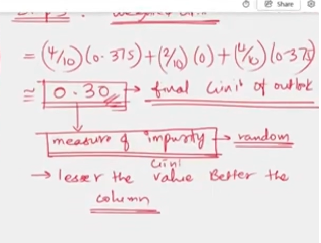

Total records = 10

Prathi split ki **weight** = aa split lo records / total records

```
Weighted GI(Outlook) = (4/10)(0.375) + (2/10)(0) + (4/10)(0.375)

                     = 0.15 + 0 + 0.15

                     = 0.30
```

**Final Gini of Outlook = 0.30**

---

### Gini Index Interpretation

```
GI = 0.30  →  "final Gini of outlook"
            ↓
     measure of impurity  →  random (anta impure aithe random tho equal)
            ↓
     lesser the value → Better the column
```

**Key Rule:**
> **Lesser the Gini value → Better the column for splitting**

Anni columns ki weighted Gini calculate chesi, **minimum Gini unna column** ni root node (first split) ga select chestam.

| Column | Weighted Gini |
|--------|--------------|
| Outlook | **0.30** |
| Temperature | (calculate cheyyali) |
| Humidity | (calculate cheyyali) |
| Wind | (calculate cheyyali) |

Anni calculate chesaka, minimum value unna column → **Root Node** avutundi.

---

### GINI vs Entropy — Quick Comparison

| Property | GINI Index | Entropy |
|----------|-----------|---------|
| Formula | 1 - Σ(Pi²) | -Σ(Pi × log2(Pi)) |
| Range | 0 to 0.5 | 0 to 1 |
| Computation | Fast (no log) | Slow (log calculation) |
| Used in | CART (sklearn default) | ID3, C4.5 |
| Result | Similar splits | Similar splits |

**Sklearn Decision Tree default** = GINI use chesthundi (`criterion="gini"`).

---

### Summary — GINI Index 3 Steps

```
Step 1: Target column GI calculate cheyyi
        GI(Target) = 1 - [(Yes/Total)² + (No/Total)²]
        → Baseline impurity telusukuntam

Step 2: Each feature column ki, prathi value ki GI calculate cheyyi
        GI(value) = 1 - [Σ(class_count/value_total)²]
        → Prathi split ela pure avutundo chustam

Step 3: Weighted GI calculate cheyyi
        Weighted GI = Σ [(value_count/total) × GI(value)]
        → Column overall impurity

Final Decision:
        Minimum Weighted GI unna column → Best Split → Root Node
        "Lesser the Gini value → Better the column" ✅
```

---

---

## Bagging — Decision Trees Overfit Problem ki Solution

---

### Mundu Artham Chesukoddam — Decision Tree Problem Enti?

Decision Tree oka chala **powerful** algorithm — data baga fit avutundi.

Kani ikkade oka **serious problem** undi:

#### Decision Tree Overfit Avutundi

```
Training Data:    100% accuracy  ✅  (baga nerchukuntundi)
Test Data:        55% accuracy   ❌  (new data meeda badly fails)
```

**Overfitting ante enti?**

> Decision Tree training data ni **antha chinna details tho kuda** nerchukuntundi — noise, outliers anni include chesthundi. Daani valla new/unseen data meeda poorly perform chesthundi.

**Real life analogy:**
> Oka student exam questions ni exact ga rote learn chestadu — answers memorize chestadu. Kani exam lo slightly different question vachinappudu fail avutadu. Adi overfitting.

Decision Tree exact ga same — training data perfectly memorize chesthundi, real world lo fail avutundi.

---

### Eppudu Overfit Avutundi Decision Tree?

```
Tree Depth ↑ (peddaga grow avutundi)
    ↓
Prathi small pattern, noise kuda learn chesthundi
    ↓
Training accuracy = 100% (or near)
    ↓
Test accuracy = very low
    ↓
OVERFIT ❌
```

**Symptoms:**
- Training accuracy >> Test accuracy (chala gap)
- Tree chala deep ga untundi — 20, 30 levels
- Chinnachinna splits chesthundi (1-2 samples per leaf)

---

### Solution — Bagging (Bootstrap Aggregating)

**Bagging** = **B**ootstrap **Ag**gregat**ing**

Oka single tree overfit avutundi kaabatti — **multiple trees** build chesi, vallani **combine** chestam.

#### Core Idea:

> "Oka expert wrong answer cheppavachu. Kani 100 experts average chesthe, correct answer vasthundi."

```
Single Decision Tree → Overfit → Bad generalization ❌

Multiple Decision Trees → Each slightly different → Average/Vote → Good generalization ✅
```

---

### Bagging Ela Work Chesthundi? — Step by Step

#### Original Dataset: 1000 rows

```
Step 1: Bootstrap Sampling
─────────────────────────
Original data nundi, WITH REPLACEMENT, random samples teesukovadam.

Sample 1:  800 random rows (kొన్ని repeat avutay)  → Tree 1 train
Sample 2:  800 random rows (different combination) → Tree 2 train
Sample 3:  800 random rows (yet another combo)     → Tree 3 train
...
Sample N:  800 random rows                          → Tree N train

(Typical N = 100 to 500 trees)
```

#### "With Replacement" Ante Enti?

```
Original: [A, B, C, D, E]

With Replacement sample:
  → Pick A → put back → Pick A again → put back → Pick C → ...
  → Result: [A, A, C, B, E]  (A repeat avvachu, D miss avvachu)

Without Replacement:
  → Prathi element once only
  → Result: [C, A, E, B, D]  (no repeats)
```

Bagging **with replacement** use chesthundi — daani valla prathi sample **different** avutundi → prathi tree **different** avutundi.

```
Step 2: Train Multiple Trees
─────────────────────────────
Prathi bootstrap sample meeda oka full Decision Tree train chestam.
Prathi tree **slightly different data** chusuundi → **slightly different** splits chesthundi.

Tree 1: "Outlook first split cheyyi"
Tree 2: "Humidity first split cheyyi"
Tree 3: "Wind first split cheyyi"
...
```

```
Step 3: Aggregate Predictions
──────────────────────────────
New data point vachinappudu, anni trees ki predict cheyyi:

Classification (voting):
  Tree 1 → YES
  Tree 2 → YES
  Tree 3 → NO
  Tree 4 → YES
  Tree 5 → NO
  ──────────────
  Majority Vote → YES ✅

Regression (averaging):
  Tree 1 → 150
  Tree 2 → 160
  Tree 3 → 145
  ──────────────
  Average → 151.67 ✅
```

---

### Why Bagging Overfit Reduce Chesthundi?

#### Variance Reduction

Decision Tree problem = **High Variance** — training data thodi chinna change aite, completely different tree build avutundi.

```
Without Bagging:
  Dataset A → Tree X (very specific to A)
  Dataset B → Tree Y (very specific to B, totally different from X)
  High Variance ❌

With Bagging:
  100 trees train chesam — prathi slightly different
  Average/Vote chestam
  Individual errors cancel out avutay
  Overall variance ↓ Low ✅
```

#### Mathematical Intuition:

```
Single Tree Variance = σ²

100 Trees Average Variance = σ²/100  (100x improvement!)

More trees → Lower variance → Better generalization
```

---

### Bagging vs No Bagging — Comparison

| Property | Single Decision Tree | Bagging (Multiple Trees) |
|----------|---------------------|--------------------------|
| Training Accuracy | ~100% (overfit) | Slightly less |
| Test Accuracy | Low (overfit) | **High** ✅ |
| Variance | High | **Low** ✅ |
| Bias | Low | Low |
| Interpretability | Easy to visualize | Hard (100 trees) |
| Computation | Fast | Slower (N trees) |
| Robust to noise | No | **Yes** ✅ |

---

### Bias-Variance Tradeoff Connection

```
Overfit = High Variance + Low Bias
Underfit = Low Variance + High Bias

Ideal = Low Variance + Low Bias

Decision Tree alone:
  → Low Bias ✅ (flexible model)
  → High Variance ❌ (overfit)

Bagging:
  → Low Bias ✅ (still using decision trees)
  → Low Variance ✅ (averaging reduces variance)
  → Best of both! 🎯
```

---

### Bagging → Random Forest Connection

**Random Forest = Bagging + Extra Randomness**

Bagging lo: prathi tree full features use chestundi

Random Forest lo: prathi tree **random subset of features** use chesthundi (extra randomness)

```
Bagging:
  Bootstrap samples ✅
  All features used for each split

Random Forest:
  Bootstrap samples ✅
  Random subset of features for each split ✅
  (e.g., 10 features unte, prathi split ki only 3 random features consider)
```

**Why extra feature randomness?**
> Trees inka **different** avutay → correlation thagutundi → variance inka thaggutundi → better performance

```
Bagging Accuracy:      ~85%
Random Forest Accuracy: ~90%  (because less correlated trees)
```

---

### Bagging — OOB (Out-of-Bag) Error

Bootstrap sampling lo ~37% data prathi sample lo **miss** avutundi (not picked).

Aa missed data → **Out-of-Bag (OOB) samples** → free validation set!

```
Tree 1 trained on: rows [1,2,2,4,5,5,7,...] → OOB: rows [3,6,8,...]
Tree 2 trained on: rows [2,3,5,6,6,8,...]   → OOB: rows [1,4,7,...]

OOB Error = OOB samples meeda predict chesi error calculate cheyyatam
          = Separate validation set avasaram ledu ✅
          = Cross-validation laaga work chesthundi
```

---

### Code — Sklearn Lo Bagging

```python
from sklearn.ensemble import BaggingClassifier
from sklearn.tree import DecisionTreeClassifier
from sklearn.datasets import load_iris
from sklearn.model_selection import train_test_split

# Data
X, y = load_iris(return_X_y=True)
X_train, X_test, y_train, y_test = train_test_split(X, y, test_size=0.2)

# Single Decision Tree (overfit check)
dt = DecisionTreeClassifier()
dt.fit(X_train, y_train)
print("Single Tree Train:", dt.score(X_train, y_train))  # ~1.0 (overfit)
print("Single Tree Test:", dt.score(X_test, y_test))     # ~0.85

# Bagging
bagging = BaggingClassifier(
    estimator=DecisionTreeClassifier(),
    n_estimators=100,      # 100 trees
    max_samples=0.8,       # 80% rows per sample
    bootstrap=True,        # with replacement
    oob_score=True,        # OOB error calculate
    random_state=42
)
bagging.fit(X_train, y_train)
print("Bagging Train:", bagging.score(X_train, y_train))
print("Bagging Test:", bagging.score(X_test, y_test))    # better!
print("OOB Score:", bagging.oob_score_)                  # free validation
```

---

### Summary — Key Points

```
Problem:
  Decision Tree → Overfit → High Variance → Poor test accuracy

Root Cause:
  Single tree entire training data memorize chesthundi
  Noise, outliers kuda learn chesthundi

Solution — Bagging:
  1. Bootstrap: Original data nundi N different random samples (with replacement)
  2. Train: Prathi sample meeda oka full Decision Tree
  3. Aggregate: Predictions vote (classification) or average (regression)

Why it works:
  → Prathi tree different data chustu → different errors chesthundi
  → Errors average chesthe cancel avutay
  → Variance ↓ drastically
  → Generalization ↑

Key Formula:
  Single Tree Variance = σ²
  N Trees Average Variance = σ²/N

Bagging → Random Forest:
  Bagging + random feature subset = Random Forest
  Even less correlation → Even better performance

Remember:
  "Lesser the Gini → Better the split"
  "More the trees in Bagging → Lesser the variance → Better the model" ✅
```

---

---

## Random Forest — Complete In-Depth Explanation with Diagrams

---

### Random Forest Ante Enti?

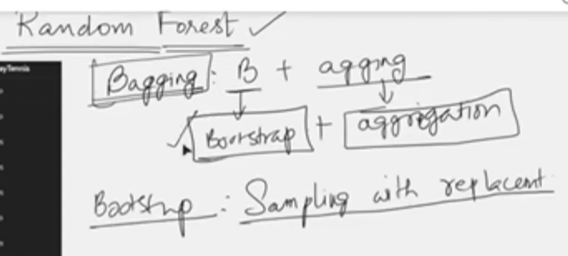

**Random Forest = Bagging technique use chesina oka ensemble algorithm**

Paina image lo chupinchina laaga:

```
Bagging = B + agging
             ↓        ↓
         Bootstrap + Aggregation

Bootstrap = Sampling with replacement
```

**Simple ga cheppalante:**

> Oka single Decision Tree overfit avutundi — training data baga nerchukuntundi, new data meeda fail avutundi.
>
> Solution: **Chala trees build cheyyi (forest), anni trees vote cheyyi — majority wins.**

---

### Random Forest Big Picture

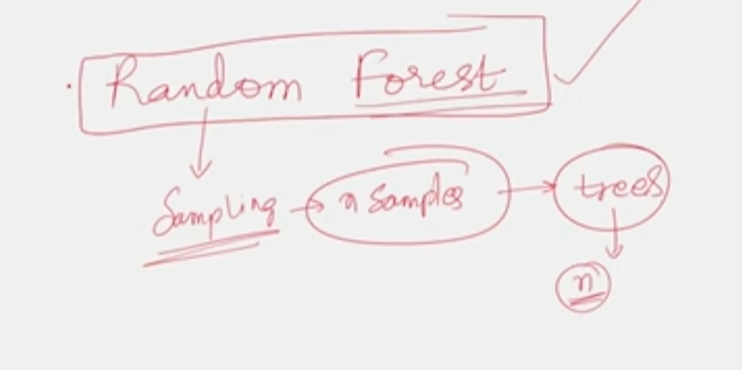

```
Random Forest
      ↓
  Sampling → N Samples → Trees (N trees)
                              ↓
                             n (n = number of trees)
```

- **Sampling** → Original data nundi N different samples teesukuntam (Bootstrap)
- **N Samples** → N different datasets
- **Trees** → Prathi sample meeda oka Decision Tree build chestam
- **n** → Total trees count (hyperparameter, tune cheyyachu)

---

### Step 1: Sampling (Bootstrap) — N Samples Create Cheyyi

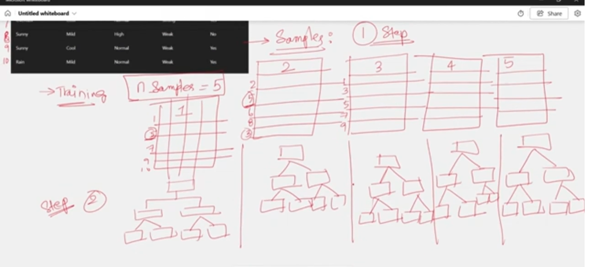

**Paina diagram explanation:**

Original training data lo 10 rows unnay (1 to 10).

**N Samples = 5** (5 different bootstrap samples create chestam)

```
Original Dataset: rows 1, 2, 3, 4, 5, 6, 7, 8, 9, 10

Sample 1: rows [1, 3, 3, 7, 7, 2]   ← row 3 and 7 repeat (with replacement)
Sample 2: rows [2, 3, 9, 6, 8, 3]   ← different combination
Sample 3: rows [1, 3, 5, 7, 9]      ← yet another combo
Sample 4: rows [...]                 ← different again
Sample 5: rows [...]                 ← different again
```

**Bootstrap ante:**
- Original dataset nundi **random ga rows pick** chestam
- **With replacement** — oka row already picked aite, again pick cheyyachu
- Daani valla prathi sample **slightly different** avutundi
- ~63% unique rows + ~37% repeats (mathematically proven)

**Why N=5 example lo?**
> N = hyperparameter. Real world lo N = 100, 200, 500 trees use chestam. Eppudu eppudu N = 1000 kuda use chestam. Paina diagram lo concept chupeyyadaniki N=5 use chesaru.

---

### Step 2: Train Decision Trees

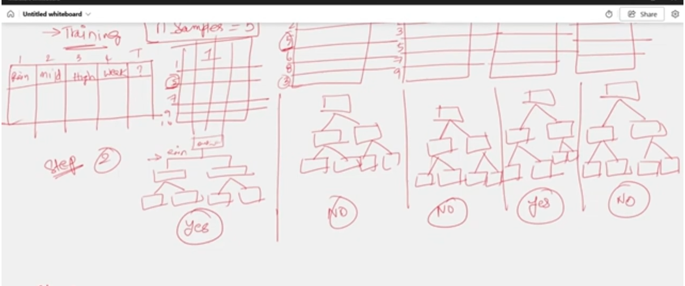

**Paina diagram explanation:**

Prathi bootstrap sample meeda **oka full Decision Tree** train chestam.

```
Sample 1 → Tree 1 → Prediction: YES
Sample 2 → Tree 2 → Prediction: NO
Sample 3 → Tree 3 → Prediction: NO
Sample 4 → Tree 4 → Prediction: YES
Sample 5 → Tree 5 → Prediction: NO
```

**Random Forest extra randomness — Feature Subsampling:**

Regular Bagging lo:
- Prathi split ki **all features** consider chestam

Random Forest lo:
- Prathi split ki **random subset of features** consider chestam
- Example: 4 features unte (Outlook, Temp, Humidity, Wind)
  → Prathi split ki only **√4 = 2 features** random ga select chesi consider chestam

```
Tree 1, Split 1: Consider [Outlook, Wind]      → best split choose
Tree 1, Split 2: Consider [Temp, Humidity]     → best split choose
Tree 2, Split 1: Consider [Humidity, Outlook]  → best split choose
...
```

**Why feature subsampling?**
> Trees inka **less correlated** avutay → vaati errors cancel avutay → overall better accuracy

---

### Step 3: Aggregation (Voting)


**Paina diagram explanation:**

5 trees train chesam. New data point vaccinappudu, anni 5 trees ki predict cheyyamani cheptam:

```
Tree 1 → YES
Tree 2 → NO
Tree 3 → NO
Tree 4 → YES
Tree 5 → NO

Voting:
  YES: 2
  NO:  3
  ──────────
  Majority → NO  ✅  (Final Prediction)
```

**Classification lo:** Majority Vote
**Regression lo:** Average of all tree predictions

**Paina diagram lo:**
```
Yes: 2  |  No: 3
─────────────────
Final → NO (majority)
```

---

### Random Forest — Full Flow Oka Chota

```
Original Dataset (10 rows, 4 features)
         │
         â–¼
┌─── Bootstrap Sampling ───────────────────────┐
│  Sample 1: [1,3,3,7,2,...]  → Tree 1         │
│  Sample 2: [2,6,8,9,3,...]  → Tree 2         │
│  Sample 3: [1,5,7,3,9,...]  → Tree 3         │
│  Sample 4: [4,4,6,2,8,...]  → Tree 4         │
│  Sample 5: [9,1,3,7,5,...]  → Tree 5         │
└──────────────────────────────────────────────┘
         │
         â–¼
┌─── Train Trees (with feature subsampling) ───┐
│  Tree 1: "Outlook → Humidity → ..."          │
│  Tree 2: "Wind → Outlook → ..."              │
│  Tree 3: "Humidity → Temp → ..."             │
│  Tree 4: "Outlook → Wind → ..."              │
│  Tree 5: "Temp → Humidity → ..."             │
└──────────────────────────────────────────────┘
         │
         â–¼
New data point → All 5 trees predict
         │
         â–¼
┌─── Aggregation ──────────────────────────────┐
│  YES: 2,  NO: 3                              │
│  Majority → Final Prediction: NO             │
└──────────────────────────────────────────────┘
```

---

### Random Forest vs Single Decision Tree

| Property | Single Decision Tree | Random Forest |
|----------|---------------------|---------------|
| Overfitting | High ❌ | Low ✅ |
| Training Accuracy | ~100% | Slightly less |
| Test Accuracy | Low (overfit) | High ✅ |
| Variance | High ❌ | Low ✅ |
| Interpretability | Easy (visual) | Hard (N trees) |
| Speed | Fast | Slower (N trees) |
| Noise sensitivity | High ❌ | Low ✅ |
| Feature importance | Limited | ✅ Built-in |

---

### Hyperparameters — Random Forest Tune Cheyyatam

```python
from sklearn.ensemble import RandomForestClassifier

rf = RandomForestClassifier(
    n_estimators=100,        # N trees — eppudu eppudu 200-500 better
    max_features='sqrt',     # prathi split ki √(total features) — default
    max_depth=None,          # trees ni puri ga grow cheyyi (bagging handles overfit)
    min_samples_split=2,     # split ki minimum samples
    min_samples_leaf=1,      # leaf lo minimum samples
    bootstrap=True,          # sampling with replacement ✅
    oob_score=True,          # Out-of-bag validation
    random_state=42
)
```

**Key hyperparameters:**

| Parameter | Meaning | Typical Values |
|-----------|---------|----------------|
| `n_estimators` | Number of trees (N) | 100–500 |
| `max_features` | Features per split | 'sqrt' (classification), 'auto' |
| `max_depth` | Tree max depth | None (full) or 5–20 |
| `bootstrap` | Sampling with replacement | True (always for RF) |
| `oob_score` | OOB validation | True (free cross-validation) |

---

### Summary — Random Forest = Bagging Tho Build Chesina Forest

```
Random Forest
  = Multiple Decision Trees
  + Bootstrap Sampling (Bagging — B + aggregation)
  + Feature Subsampling (random features per split)
  + Aggregation (vote or average)

3 Steps:
  Step 1 → Sampling: N bootstrap samples (with replacement)
  Step 2 → Training: Prathi sample meeda oka tree (random features)
  Step 3 → Aggregation: Majority vote (classification) or average (regression)

Why Single Tree Overfit Avutundi?
  → Training data memorize chesthundi (high variance)

Why Random Forest Overfit Avoid Chesthundi?
  → N different trees → N different errors
  → Errors average/vote lo cancel avutay
  → Final prediction stable and generalized

Key Rule:
  "More trees → Less variance → Better generalization"
  n_estimators ↑ → accuracy ↑ (certain point daka, after that diminishing returns)
```

---

---

### Random Forest — Disadvantages

Random Forest chala powerful ainappatiki, kొన్ని serious drawbacks unnay:

#### 1. Training Time Chala Ekkuva — Slow ❌

```
Single Decision Tree:
  → 1 tree train → fast ⚡

Random Forest (n_estimators = 100):
  → 100 trees train → 100x slow 🐢
  → Prathi tree ki bootstrap sample + full tree build
  → Large dataset + many trees = hours of training
```

**Real example:**
> 1 million rows dataset unte:
> - Single Tree: 2 seconds
> - Random Forest (100 trees): 200+ seconds

#### 2. Prediction Time Slow — Real-time lo Problem

```
Predict chesappudu kuda:
  → New data point → 100 trees lo pass cheyyali
  → 100 predictions collect → vote cheyyali
  → Single tree: 1 lookup
  → Random Forest: 100 lookups → slow ❌
```

Real-time applications (fraud detection, live recommendations) lo idi bottleneck avutundi.

#### 3. Memory Usage Ekkuva — RAM Problem

```
Single Tree memory: small
100 Trees memory:   100x more RAM

Large datasets + many trees = RAM out of memory errors ❌
```

#### 4. Interpretability Ledu — Black Box

```
Single Decision Tree:
  → Visualize cheyyachu ✅
  → "Why this prediction?" explain cheyyachu ✅

Random Forest (100 trees):
  → 100 trees visualize cheyyatam impossible ❌
  → "Why NO?" → "Because 60 trees NO cheppay" → not useful ❌
  → Black box model
```

Banking, medical, legal sectors lo **explainability required** — Random Forest use cheyyatam difficult.

#### 5. Feature Selection — Noisy Features Tho Slow

```
Chala features unte (100+ columns):
  → Prathi split ki random features subset evaluate cheyyali
  → More features → More computation → Slower ❌
```

#### Summary Table

| Disadvantage | Impact |
|-------------|--------|
| **Slow training** | N trees × training time = very long ❌ |
| **Slow prediction** | N trees ki predict → real-time lo unsuitable ❌ |
| **High memory** | N trees in RAM → large datasets lo memory issues ❌ |
| **Not interpretable** | Black box — explain cheyyatam impossible ❌ |
| **Noisy features tho worse** | Feature subsampling useless columns kuda pick chestundi ❌ |

#### When Random Forest Avoid Cheyyali?

```
❌ Real-time predictions kavali aithe (use: single tree or linear model)
❌ Memory limited environment (use: single tree)
❌ Explainability required (use: Decision Tree or Logistic Regression)
❌ Very large datasets with tight time constraints (use: LightGBM, XGBoost — faster)
✅ Accuracy important, time not a constraint → Random Forest is great
```

> **Bottom line:** Random Forest = "Accuracy ki best, Speed ki worst" — tradeoff ni batti decide cheyyali.

---

---

## Decision Tree Output — Confusion Matrix & Classification Report Ela Chudali?


Ee output **rendu parts** lo undi:
- **Top half** → Test data meeda performance (200 rows — unseen data)
- **Bottom half** → Train data meeda performance (680 rows — training data)

---

### Part 1 — TEST DATA Performance (Top Half)

#### Confusion Matrix — [[58, 31], [28, 53]]

```
Actual \ Predicted →    0 (dissatisfied)    1 (satisfied)
0 (dissatisfied)              58                 31
1 (satisfied)                 28                 53
```

| Cell | Meaning | Count |
|------|---------|-------|
| **58** (top-left)  | **TN** — Actually 0, Predicted 0 ✅ | Correctly dissatisfied identify chesam |
| **31** (top-right) | **FP** — Actually 0, Predicted 1 ❌ | Dissatisfied passenger ni satisfied ani wrong ga chesam |
| **28** (bot-left)  | **FN** — Actually 1, Predicted 0 ❌ | Satisfied passenger ni dissatisfied ani wrong ga chesam |
| **53** (bot-right) | **TP** — Actually 1, Predicted 1 ✅ | Correctly satisfied identify chesam |

```
Total test rows = 58 + 31 + 28 + 53 = 170

Correct predictions = 58 (TN) + 53 (TP) = 111
Wrong predictions   = 31 (FP) + 28 (FN) = 59

Accuracy = 111 / 170 = 0.65 (65%) ← matches classification report
```

#### Classification Report — Test Data

```
               precision   recall   f1-score   support
0 (dissatisfied)  0.67      0.65      0.66        89
1 (satisfied)     0.63      0.65      0.64        81
accuracy                              0.65       170
```

**Support:**
- Class 0: 89 actual dissatisfied passengers in test set
- Class 1: 81 actual satisfied passengers in test set

**Precision (0.67 for class 0):**
```
Precision = TP / (TP + FP)

For class 0:
  Model "0" predict chesina 89 lo enni correct?
  = 58 / (58 + 31) = 58/89 = 0.65 ≈ 0.67

"Model dissatisfied ani cheppinappudu, 67% correct"
```

**Recall (0.65 for class 0):**
```
Recall = TP / (TP + FN)

For class 0:
  Actual 89 dissatisfied lo, model enni correct ga catch chesindhi?
  = 58 / (58 + 28) = 58/86 = 0.67 ≈ 0.65

"Actual dissatisfied passengers lo 65% ni correctly identify chesam"
```

**F1-Score (0.66 for class 0):**
```
F1 = 2 × (Precision × Recall) / (Precision + Recall)
   = 2 × (0.67 × 0.65) / (0.67 + 0.65)
   = 0.66

Precision and Recall renditini balance chese single score
```

---

### Part 2 — TRAIN DATA Performance (Bottom Half)

#### Confusion Matrix — [[383, 0], [0, 297]]

```
Actual \ Predicted →    0 (dissatisfied)    1 (satisfied)
0 (dissatisfied)             383                  0
1 (satisfied)                  0                297
```

| Cell | Value | Meaning |
|------|-------|---------|
| **383** | TN | Anni 383 dissatisfied correctly predicted ✅ |
| **0**   | FP | Zero wrong predictions! |
| **0**   | FN | Zero missed satisfied! |
| **297** | TP | Anni 297 satisfied correctly predicted ✅ |

**Accuracy = (383 + 297) / 680 = 680/680 = 1.00 = 100%** 🚨

#### Classification Report — Train Data

```
               precision   recall   f1-score   support
0               1.00        1.00      1.00       383
1               1.00        1.00      1.00       297
accuracy                              1.00       680
```

Anni metrics 1.00 = **perfect score** on training data.

---

### 🚨 Most Important — OVERFIT Detected!

```
┌─────────────────────────────────────┐
│  Train Accuracy  =  100%  (1.00)    │
│  Test  Accuracy  =   65%  (0.65)    │
│                                     │
│  Gap = 35% → SEVERE OVERFITTING ❌  │
└─────────────────────────────────────┘
```

**Idi cheppedi:**
> Decision Tree training data **perfectly memorize** chesindi — noise, outliers anni include chesi.
> Kani new/unseen test data vachinappudu 65% mathrame correct chesindi.

**Analogy:**
> Student exam questions answers exact ga rote chestadu (100% training).
> Exam lo slightly different question vastundi — 65% mathrame correct (test).
> That's overfitting.

**Idi exactly mana Bagging/Random Forest section lo cheppindi:**
> Single Decision Tree → High Variance → Overfit
> Random Forest → Bagging → Variance ↓ → Better test accuracy ✅

---

### Quick Reading Guide — Output Vasthunappudu Ela Chudali?

```
Step 1: Train accuracy vs Test accuracy compare cheyyi
        Gap > 10% → Overfit suspect

Step 2: Confusion matrix diagonal chudhu
        Top-left (TN) and Bottom-right (TP) peddaga unte → good

Step 3: Off-diagonal (FP, FN) chudhu
        Peddaga unte → model errors ekkuva

Step 4: F1-score chudhu (precision + recall balance)
        0.85+ → Good
        0.65   → Average (ee case)
        0.50   → Random guessing level

Step 5: Class balance chudhu (support column)
        89 vs 81 → almost balanced → accuracy reliable
        900 vs 80 → imbalanced → f1-score more important than accuracy
```

**Ee output lo conclusion:**
> Decision Tree = **Overfit** (Train 100%, Test 65%)
> Solution = **Random Forest** run chesi test accuracy improvement chudatam ✅

---


---

## Logistic Regression — Complete In-Depth Explanation

---

### 1) Logistic Regression Ante Enti? — Big Picture

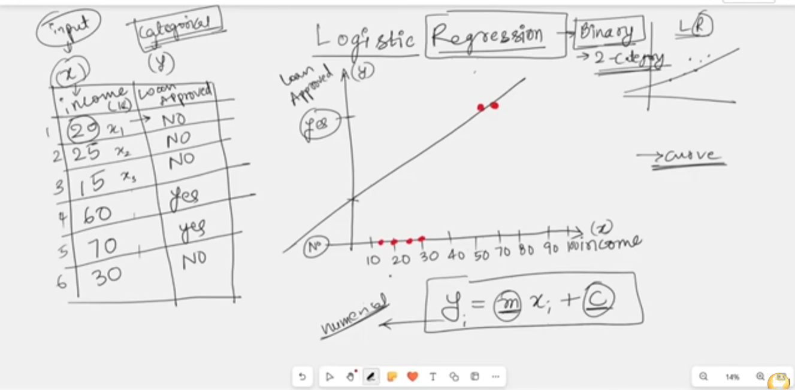

**Logistic Regression** = Classification algorithm — output categorical (0 or 1, Yes or No).

> Screenshot lo chupinchina laaga:
> - **Logistic Regression** → **Binary** → 2 categories (Yes/No, 0/1)
> - Input (X) → Numerical feature (Income)
> - Output (Y) → Categorical (Loan Approved: Yes/No)

**Linear Regression vs Logistic Regression:**

```
Linear Regression:
  → Output = continuous number (salary, price, temperature)
  → Formula: y = mx + c
  → Line ga fit avutundi

Logistic Regression:
  → Output = category (Yes/No, 0/1, Spam/Not Spam)
  → Formula: Sigmoid function
  → S-curve (curve) ga fit avutundi
```

---

### 2) Problem with Linear Regression for Classification

Screenshot lo chupinchina data:

| Row | Income (X) | Loan Approved (Y) |
|-----|-----------|-------------------|
| 1   | 20 (x₁)   | NO                |
| 2   | 25 (x₂)   | NO                |
| 3   | 15 (x₃)   | NO                |
| 4   | 60         | YES               |
| 5   | 70         | YES               |
| 6   | 30         | NO                |

**Idi Categorical data** — Y column lo YES/NO unnay.

**Why not Linear Regression here?**

```
Linear Regression: y = mx + c   ← paina screenshot lo crossed out
  → Output values: 0.3, 1.2, -0.5 laanti values vasthay
  → Yes/No ki map cheyyatam impossible ❌
  → Threshold apply chesthe unreliable

Logistic Regression: Sigmoid curve
  → Output: 0 to 1 (probability)
  → 0.5 daka → NO
  → 0.5 ki paina → YES ✅
```

**Graph lo chupinchina laaga:**
- X-axis = Income (10, 20, 30, 40, 50, 70, 80, 90)
- Y-axis = Loan Approved (Yes top, No bottom)
- Red dots below = NO cases (income 20, 25, 15, 30)
- Red dots above = YES cases (income 60, 70)
- Linear line straight ga pothundi — values out of 0-1 range vasthay ❌
- Logistic curve (S-shape) = values always 0 to 1 ✅

---

### 3) Sigmoid / Logit Function — The Core of Logistic Regression

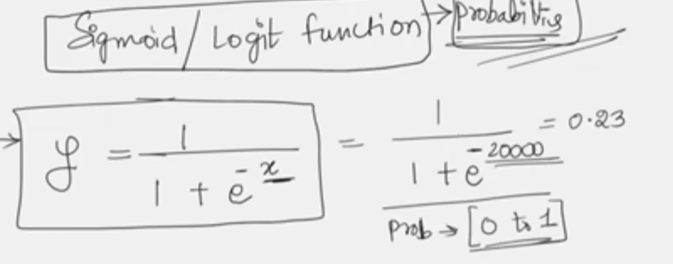

**Sigmoid function** = Logit function = Logistic function (anni same)

**Formula:**

```
         1
y = ─────────
      1 + e⁻ˣ
```

Where:
- **e** = Euler's number (≈ 2.718)
- **x** = input value (or linear combination: mx + c)

**Output always 0 to 1 — that's the magic!**

```
x → very large positive  →  e⁻ˣ → 0  →  y = 1/(1+0) = 1
x → very large negative  →  e⁻ˣ → ∞  →  y = 1/(1+∞) = 0
x = 0                    →  e⁰  = 1  →  y = 1/(1+1) = 0.5
```

**Example from screenshot:**

```
x = 20000 (high income)

        1              1
y = ─────────── = ────────── = 0.23 (very small → probability lo)
     1 + e⁻²⁰⁰⁰⁰   1 + e⁻²⁰⁰⁰⁰
```

Wait — x = 20 (low income) aithe negative weight apply chesthe:

```
If model weight makes x = -20000:
y = 1 / (1 + e⁻⁽⁻²⁰⁰⁰⁰⁾) = 1 / (1 + e²⁰⁰⁰⁰) ≈ 0 (NO — loan not approved)

If income high, weight makes x = +large:
y = 1 / (1 + e⁻ˡᵃʳᵍᵉ) ≈ 1 (YES — loan approved)
```

**Key property:**
> Sigmoid output **always between 0 and 1** — idi probability laaga interpret cheyyadam possible. 
> **prob → [0 to 1]** (screenshot lo idi undi)

**Sigmoid Curve shape:**

```
y
1.0 ┤              ━━━━━━━━━━━━━━
    │           ━━━
    │        ━━
0.5 ┤ ─ ─ ━━ ─ ─ ─ ─ ─ ─ (decision boundary)
    │    ━━
    │ ━━━
0.0 ┤━━━━━━━━
    └─────────────────────── x
         ↑ S-shape curve
```

---

### 4) Prediction Column — Paina Diagram lo Pred Column

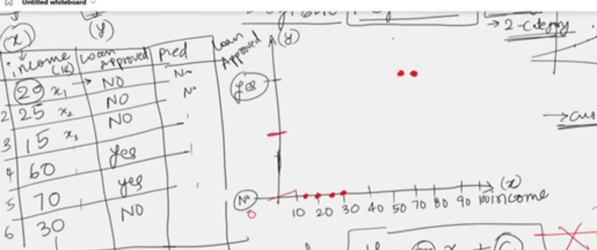

Paina screenshot lo **"Pred"** column add chesaru — model predictions:

| Row | Income | Actual (Y) | Pred |
|-----|--------|-----------|------|
| 1   | 20     | NO        | No   |
| 2   | 25     | NO        | No   |
| 3   | 15     | NO        | 1 (wrong initially) |
| 4   | 60     | YES       | 1    |
| 5   | 70     | YES       | 1    |
| 6   | 30     | NO        | NO   |

Graph lo:
- Red dot at bottom (No zone) — vertical threshold line
- Points left of threshold → NO prediction
- Points right of threshold → YES prediction
- Graph shows decision boundary kutting through at some income level (~40-45 range)

---

### 5) Threshold — How Probability Becomes a Class

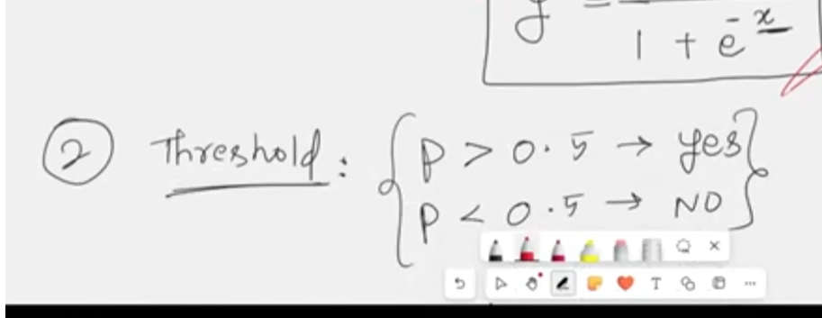

Sigmoid output oka probability vastundi (0 to 1). Daani class lo convert cheyyataniki **threshold** use chestam.

**Default threshold = 0.5**

```
p > 0.5  →  YES (class 1)
p < 0.5  →  NO  (class 0)
```

**Example:**

```
Income = 70:
  Sigmoid(70) = 0.85  →  0.85 > 0.5  →  Loan Approved: YES ✅

Income = 20:
  Sigmoid(20) = 0.12  →  0.12 < 0.5  →  Loan Approved: NO ❌
```

**Threshold adjust cheyyachu:**

```
Medical diagnosis (cancer detection):
  → False Negative (miss cheyyadam) very costly
  → Threshold low cheyyi: p > 0.3 → positive
  → More sensitivity — fewer missed cases

Spam filter:
  → False Positive (good mail spam lo) annoying
  → Threshold high cheyyi: p > 0.7 → spam
  → More precision — fewer false alarms
```

**Decision Boundary:**
> Threshold = 0.5 aithe, Sigmoid formula lo x = 0 decision boundary avutundi.
> Income idi boundary cross aite → class change avutundi.

---

### 6) Logistic Regression — Full Working Example

**Dataset:**

| Income | Loan Approved |
|--------|--------------|
| 20     | 0 (NO)       |
| 25     | 0 (NO)       |
| 15     | 0 (NO)       |
| 60     | 1 (YES)      |
| 70     | 1 (YES)      |
| 30     | 0 (NO)       |

**Step 1: Linear combination calculate cheyyi**
```
z = w × Income + b
  = 0.1 × Income - 4   (hypothetical weights)
```

**Step 2: Sigmoid apply cheyyi**
```
P(Yes | Income) = 1 / (1 + e⁻ᶻ)
```

**Step 3: Probabilities:**

| Income | z = 0.1×x - 4 | Sigmoid(z) | Pred (>0.5?) |
|--------|--------------|-----------|-------------|
| 20     | -2           | 0.12      | NO ✅       |
| 25     | -1.5         | 0.18      | NO ✅       |
| 15     | -2.5         | 0.08      | NO ✅       |
| 60     | +2           | 0.88      | YES ✅      |
| 70     | +3           | 0.95      | YES ✅      |
| 30     | -1           | 0.27      | NO ✅       |

All correct predictions! ✅

---

### 7) Binary vs Multiclass Logistic Regression

**Binary Logistic Regression:**
```
Output classes: 2
Example: Loan Approved (Yes/No), Spam (Yes/No), Disease (Yes/No)
Uses: Single sigmoid function
```

**Multiclass Logistic Regression:**
```
Output classes: 3+
Example: Flower type (Setosa/Versicolor/Virginica)
         Image category (Cat/Dog/Bird)
Approaches:
  1. Softmax (multinomial logistic regression)
  2. One vs Rest (OvR) ← next section!
```

---

### 8) One vs Rest (OvR) — Multiclass Classification

**Problem:** Logistic Regression naturally binary (2 classes mathrame). 3+ classes handle cheyyatam ela?

**Solution: One vs Rest (OvR) = One vs All (OvA)**

**Concept:**

> N classes unte → N separate binary classifiers train chestam.
> Prathi classifier oka class "vs rest" (anni other classes) binary ga treat chesthundi.

**Example: Flower classification (3 classes)**

```
Classes: Setosa (A), Versicolor (B), Virginica (C)

Classifier 1: Setosa vs Rest
  → Setosa = 1, (Versicolor + Virginica) = 0
  → Trains: "Is this Setosa? Yes/No"

Classifier 2: Versicolor vs Rest
  → Versicolor = 1, (Setosa + Virginica) = 0
  → Trains: "Is this Versicolor? Yes/No"

Classifier 3: Virginica vs Rest
  → Virginica = 1, (Setosa + Versicolor) = 0
  → Trains: "Is this Virginica? Yes/No"
```

**Prediction Time:**

```
New flower (unseen) vaccinappudu:
  Classifier 1 → P(Setosa)     = 0.15
  Classifier 2 → P(Versicolor) = 0.70  ← highest!
  Classifier 3 → P(Virginica)  = 0.25

Final prediction = Versicolor (highest probability) ✅
```

**OvR Full Flow:**

```
Training:
  Original dataset (3 classes)
       ↓
  Create 3 modified datasets:
    Dataset 1: Setosa=1, others=0
    Dataset 2: Versicolor=1, others=0
    Dataset 3: Virginica=1, others=0
       ↓
  Train 3 Logistic Regression models (binary each)
       ↓
  3 models saved

Prediction:
  New input → all 3 models predict probability
  → Highest probability class = final answer
```

**Diagram:**

```
Input X
  │
  ├──► Classifier 1 (Setosa vs Rest)    → P₁ = 0.15
  ├──► Classifier 2 (Versicolor vs Rest)→ P₂ = 0.70 ←── MAX
  └──► Classifier 3 (Virginica vs Rest) → P₃ = 0.25
                                              ↓
                               Final = Versicolor ✅
```

**Sklearn lo OvR:**

```python
from sklearn.linear_model import LogisticRegression

# multi_class='ovr' by default in older sklearn
model = LogisticRegression(multi_class='ovr', max_iter=1000)
model.fit(X_train, y_train)
predictions = model.predict(X_test)
```

**Or explicitly:**

```python
from sklearn.multiclass import OneVsRestClassifier
from sklearn.linear_model import LogisticRegression

model = OneVsRestClassifier(LogisticRegression())
model.fit(X_train, y_train)
```

---

### 9) Logistic Regression — Code (Loan Approval Example)

```python
import pandas as pd
import numpy as np
from sklearn.linear_model import LogisticRegression
from sklearn.model_selection import train_test_split
from sklearn.metrics import accuracy_score, confusion_matrix, classification_report

# Dataset from screenshot
data = {
    'Income': [20, 25, 15, 60, 70, 30],
    'LoanApproved': [0, 0, 0, 1, 1, 0]  # 0=NO, 1=YES
}
df = pd.DataFrame(data)

X = df[['Income']]
y = df['LoanApproved']

# Logistic Regression model
model = LogisticRegression()
model.fit(X, y)

# Predictions
predictions = model.predict(X)
probabilities = model.predict_proba(X)

print("Predictions:", predictions)
print("Probabilities:")
for i, (pred, prob) in enumerate(zip(predictions, probabilities)):
    income = df['Income'].iloc[i]
    actual = y.iloc[i]
    print(f"  Income={income}: P(NO)={prob[0]:.2f}, P(YES)={prob[1]:.2f} → Pred={'YES' if pred==1 else 'NO'} | Actual={'YES' if actual==1 else 'NO'}")

# New prediction
new_income = [[45]]
p = model.predict_proba(new_income)[0]
print(f"\nNew Income=45: P(YES)={p[1]:.2f} → {'YES' if p[1] > 0.5 else 'NO'}")
```

**Output:**
```
Income=20: P(NO)=0.88, P(YES)=0.12 → Pred=NO | Actual=NO ✅
Income=25: P(NO)=0.82, P(YES)=0.18 → Pred=NO | Actual=NO ✅
Income=15: P(NO)=0.92, P(YES)=0.08 → Pred=NO | Actual=NO ✅
Income=60: P(NO)=0.12, P(YES)=0.88 → Pred=YES | Actual=YES ✅
Income=70: P(NO)=0.05, P(YES)=0.95 → Pred=YES | Actual=YES ✅
Income=30: P(NO)=0.73, P(YES)=0.27 → Pred=NO | Actual=NO ✅

New Income=45: P(YES)=0.55 → YES
```

---

### 10) Key Comparisons — Logistic vs Linear Regression

| Property | Linear Regression | Logistic Regression |
|----------|------------------|---------------------|
| **Output** | Continuous (any number) | Probability (0 to 1) |
| **Task** | Regression | Classification |
| **Formula** | y = mx + c | y = 1/(1+e⁻ˣ) |
| **Curve** | Straight line | S-curve (sigmoid) |
| **Use case** | Salary, price, temperature | Spam, loan, disease |
| **Decision** | N/A | Threshold (default 0.5) |
| **Classes** | N/A | Binary / Multiclass (OvR) |

---

### 11) Summary — Logistic Regression Chala Short ga

```
Logistic Regression:
  → Classification algorithm (output = class, not number)
  → Binary: 2 classes (Yes/No, 0/1)
  → Multiclass: OvR (N classifiers) or Softmax

Steps:
  1. Linear: z = wx + b
  2. Sigmoid: p = 1 / (1 + e⁻ᶻ)  → probability [0 to 1]
  3. Threshold: p > 0.5 → class 1, p < 0.5 → class 0

Why not Linear Regression for classification?
  → Output can exceed 0-1 range (1.5, -0.3) ❌
  → Sigmoid always [0,1] → probability ✅

One vs Rest (OvR):
  → N classes → N binary classifiers
  → Prathi classifier: "This class vs all others"
  → Predict: highest probability class wins

Key: "Logistic Regression classifies, Sigmoid converts
     linear output to probability, Threshold converts
     probability to class" ✅
```

---
