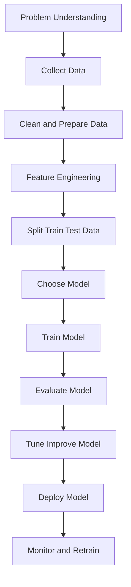
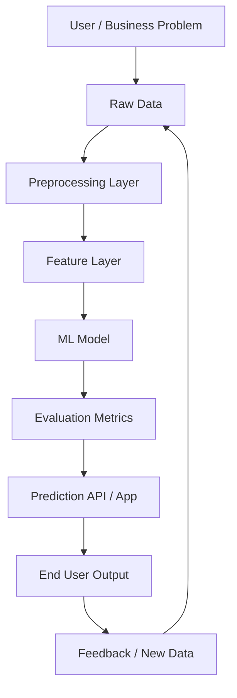
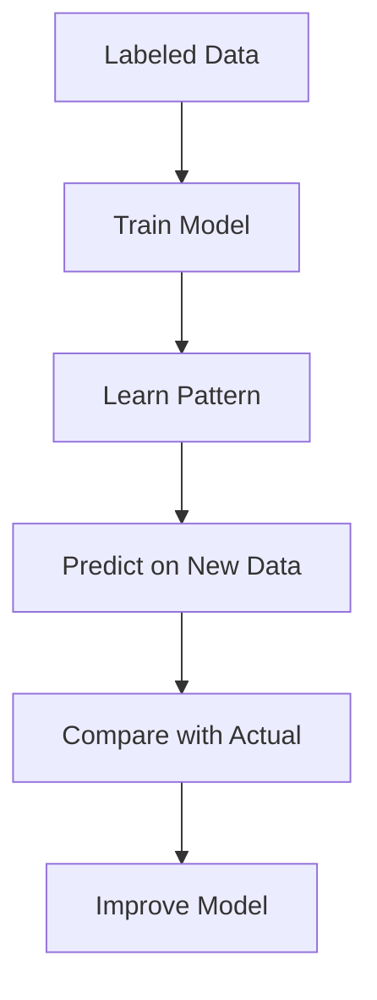
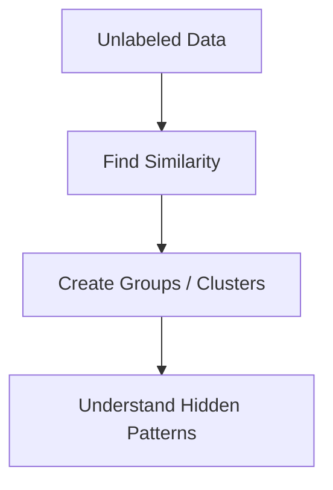
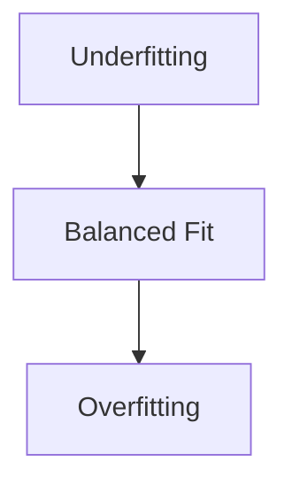
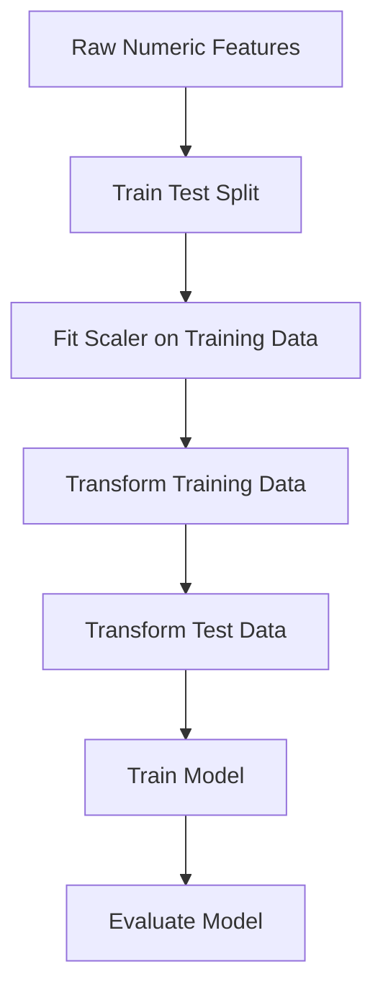
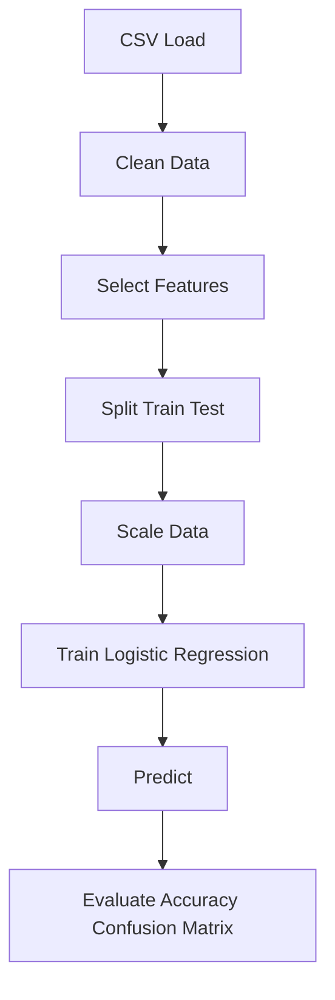
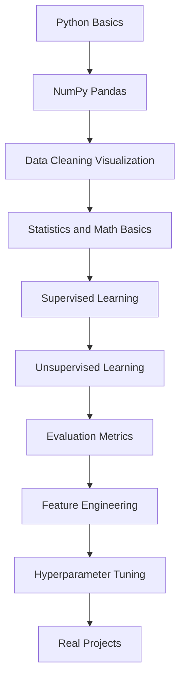

# Machine Learning Complete Guide

Machine Learning ni simple ga cheppalante:

**Machine Learning = data nundi patterns nerchukoni predictions or decisions cheyyadam**

---

## Recommended Concept Order

Nuvvu beginner aithe ee concepts ni ila order lo nerchukunte easy ga ardham avuthundi:

1. Machine Learning ante enti?
2. Data, Pattern, Prediction
3. Real-life ML examples
4. Features and Labels
5. Train set, Test set, Validation set
6. Supervised vs Unsupervised Learning
7. Regression vs Classification
8. Data Cleaning
9. Feature Scaling
10. Common Algorithms
11. Overfitting vs Underfitting
12. Evaluation Metrics
13. Feature Engineering
14. Hyperparameters
15. Cross Validation
16. Real Project Flow

### Beginner learning flow in one line

**Basics -> Data -> Train/Test -> Types of ML -> Algorithms -> Metrics -> Improvement -> Projects**

---

## Beginner Explanation: ML ni Kid ki cheppinattu

Nuvvu oka chinna pillavadi ki Machine Learning explain chesthunnaav ani imagine cheyyi.

### Very simple meaning

Machine Learning ante:

**computer ki direct rules rayakunda, examples chupinchi nerpinchadam**

School lo teacher ela chestharu?

- 2 + 2 = 4
- 3 + 3 = 6
- 4 + 4 = 8

Ila chala examples chupisthe, student pattern ardham chesukuntadu.

Machine Learning lo kuda same idea.
Computer ki examples istam.
Adi aa examples nundi pattern learn chesi, new input vachinappudu answer chepthundi.

### One very easy real-time example

Suppose mee intlo mummy apples select chesthunnaru.

Mummy antaru:
- red and fresh ga unte good apple
- black spots ekkuva unte bad apple

Nuvvu 100 apples chusi observe chesthe, next apple chusi nuvve guess chesthav:
- idi good apple aa?
- bad apple aa?

Idi human learning.

Machine Learning lo kuda same:
- past examples chustundi
- pattern nerchukuntundi
- new case ki guess/predict chestundi

### ML and normal programming difference

#### Normal programming

Manam computer ki rules direct ga cheptham.

Example:

```text
if marks >= 35:
	pass
else:
	fail
```

#### Machine Learning

Manam direct rule rayamu.
Instead, past student data istam:

- study hours
- attendance
- previous marks
- final result

Computer antundi:
"Sare, nenu pattern kanukunta. Future student pass avuthada ani nenu predict chestha."

### ML ekkada use avuthundi? Real life lo

#### 1. YouTube recommendations

Nuvvu ekkuva ga tech videos chusthe, YouTube malli tech videos chupisthundi.

Enduku?

Because system chusindi:
- nuvvu emi click chesthunnaav
- emi ekkuva time watch chesthunnaav
- emi skip chesthunnaav

Aa data batti system learn ayi next recommended videos istundi.

#### 2. Google Maps traffic prediction

Maps app chepthundi:
- ee road lo traffic ekkuva undi
- ee route fast untundi

Idi random kaadu.
Past and current data chusi predict chestundi.

#### 3. Spam mail detection

Gmail chala mails ni chusi nerchukundi:
- konni words spam lo ekkuva untayi
- suspicious links untayi
- unknown senders untaru

Aa pattern batti new email spam aa kaada ani guess chestundi.

#### 4. Shopping apps

Amazon/Flipkart lo nuvvu shoes search chesthe, next malli similar products chupisthayi.

System nerchukundi:
- nuvvu em search chesavu
- em click chesavu
- em konnavu

#### 5. Netflix / Spotify

Nuvvu action movies chusthe action movies suggest chesthundi.
Slow songs vinnte similar songs suggest chesthundi.

Idi kuda ML.

---

## ML ni inka simple story laga artham chesukundam

Suppose nuvvu oka chinna shop owner.
Nee daggara old customers data undi:

- Age
- Salary
- Product purchase chesara leda

Ippudu new customer vachadu.
Question:

**Ee customer product koneda?**

Old data chusi pattern kanukoni, new customer gurinchi prediction cheyyadam = Machine Learning.

### Story format

1. Past lo jarigina examples collect chestham
2. Aa examples nundi common pattern identify chestham
3. New person/value/input vachinappudu guess chestham

Idi exact ga ML core idea.

---

## ML lo 3 main words first ardham chesuko

### 1. Data

Data ante information.

Examples:
- student marks
- customer age
- salary
- house size
- email text

### 2. Pattern

Pattern ante repeated relationship.

Example:
- ekkuva study hours unna students pass ayye chance ekkuva
- salary ekkuva unna customers konni products konachu

### 3. Prediction

Prediction ante future or unknown case meeda guess.

Example:
- ee house price entha?
- ee mail spam aa?
- ee customer buy chesthada?

---

## ML ni human learning tho compare cheddam

### Human learning

Pillavadu dog ni 10 times chusthadu.
Teacher antaru: "idi dog"

Tarvata kotha dog image chupisthe pillavadu antadu:
"idi kuda dog anukunta"

### ML learning

Computer ki thousands dog images chupistam.
Labels kuda istam: dog / not dog.

Tarvata new image ichinappudu computer predict chestundi:
"dog"

Same concept.

---

## ML model ante enti?

Model ante nerchukunna brain laanti system.

Simple ga:

- Data teacher laga panichestundi
- Training learning process laga untundi
- Model student brain laga untundi
- Prediction answer laga untundi

### School analogy

- Examples = textbook problems
- Training = practice
- Model = student
- Test data = final exam

If student just memorize chesthe exam lo new questions ki fail avvachu.
Ade overfitting concept ki base idea.

---

## ML project complete ga em chestham?

Kid-level ga chala simple steps:

1. Problem choose chestham
2. Data collect chestham
3. Data clean chestham
4. Model ki nerpistham
5. Correct ga nerchukundha check chestham
6. New data meeda test chestham
7. Real app lo use chestham

### House price example

Problem:
- ee house cost entha predict cheyyali

Data:
- area
- bedrooms
- location
- old selling price

Model learning:
- big house usually high price
- good location price ekkuva

Prediction:
- new house price estimate

---

## Real-time examples by problem type

### A. Regression example

Question:
- house price entha?
- tomorrow temperature entha?

Output:
- one number

### B. Classification example

Question:
- spam aa not spam aa?
- pass aa fail aa?
- disease unda leda?

Output:
- category / class

### C. Clustering example

Question:
- similar customers evaru?
- shopping behavior batti groups enti?

Output:
- groups

---

## Enduku data quality chala important?

Simple example:

Nuvvu oka student ni wrong examples tho nerpithe, answer wrong ostundi.

Machine Learning lo kuda:

- wrong data
- incomplete data
- dirty data

unte model poor ga nerchukuntundi.

Anduke people antaru:

**Garbage in -> Garbage out**

Meaning:
- bad data isthe bad result vastundi

---

## ML ni beginner ela think cheyyali?

Machine Learning anedi magic kaadu.

Adi just:
- examples chustundi
- pattern kanukuntundi
- next answer predict chestundi

### One-line kid version

**Machine Learning ante computer ki examples chupinchi, aa examples nundi nerpinchadam.**

Traditional programming lo manam rules write chestham.
Machine Learning lo manam data istam, model aa data nundi rules learn chestundi.

Example:
- Traditional program: "if marks > 35 pass"
- ML program: previous student data batti "ee student pass avuthada?" ani predict chestundi

---

## 1. Machine Learning ante enti?

Machine Learning anedi Artificial Intelligence lo oka branch.

Idi em chesthundi?
- Data ni observe chesthundi
- Patterns ni identify chesthundi
- Future lo predictions chesthundi
- Manual ga rules anni rayakunda decisions ki help chesthundi

### Real-life examples

- Email spam detection
- YouTube/Netflix recommendations
- House price prediction
- Fraud detection
- Face recognition
- Customer churn prediction
- Medical diagnosis support

---

## 2. Machine Learning End-to-End Flow



Simple flow line:

**Problem -> Data -> Cleaning -> Features -> Train -> Evaluate -> Improve -> Deploy -> Monitor**

---

## 3. Machine Learning Architecture Diagram



### Architecture simple ga artham chesukovali ante

1. User/business problem start point
2. Data collect chestham
3. Data clean chestham
4. Useful features create chestham
5. Model train chestham
6. Metrics tho check chestham
7. App/API lo use chestham
8. New feedback tho model ni improve chestham

---

## 4. ML Project lo Common Steps

### Step 1: Problem define cheyyadam

Mundhu task enti ani clear ga define cheyyali.

Examples:
- House price estimate cheyyala?
- Customer purchase chesthada predict cheyyala?
- Email spam aa kaada classify cheyyala?

### Step 2: Data collect cheyyadam

Data sources:
- CSV files
- Excel files
- Database
- API
- User logs
- Sensors

### Step 3: Data cleaning

Data usually clean ga undadu.

Fix cheyyalsina problems:
- Missing values
- Duplicate rows
- Wrong data types
- Outliers
- Empty columns
- Inconsistent labels

### Step 4: Feature engineering

Feature ante model ki ivvadaniki useful input column.

Examples:
- Date nundi year, month extract cheyyadam
- Age group create cheyyadam
- Salary range create cheyyadam
- Text ni numbers ga convert cheyyadam

### Step 5: Train/Test split

Model ni same data meeda test cheyyakudadhu.

Usually:
- 80% training
- 20% testing

### Training set and Test set ni kid-style lo artham chesukundam

Idi chala important topic.
Machine Learning lo beginners mostly ikkade confuse avtharu.

Simple ga:

- **Training set** = model nerchukune material
- **Test set** = model actual ga nerchukundha leda ani check chese exam

### School example

Nuvvu exam ki prepare avthunnav ani imagine cheyyi.

Teacher mundhu practice questions istaru.
Nuvvu aa questions solve chesi pattern nerchukuntav.

Ivi:
- training questions

Tarvata final exam lo kotha questions vastayi.
Teacher chustharu:
- nuvvu nijanga concept ardham chesukunnava?
- leka practice questions maatrame memorize chesava?

Aa final exam questions:
- test set

### Why separate sets are needed?

Suppose same practice questions ni exam lo kuda icharu ante?

Student full marks techina, actually concept ardham ayindha leda teliyadu.

ML lo kuda same.

If model ni same data meeda train chesi same data meeda test chesthe:
- result fake ga chala good ga kanipisthundi
- kani real new data meeda fail avvachu

Anduke training set and test set separate ga pettali.

### Very simple real-time example

Suppose mee daggara 100 customer records unnayi.

Each record lo:
- Age
- Salary
- Purchased or not

Ippudu:
- 80 records model ki nerpistam -> training set
- remaining 20 records model ki chupinchakunda pakkana pettukuntam -> test set

Model training time lo first 80 records nundi pattern nerchukuntundi.

Example ga ila think chestundi:
- high salary + certain age group customers konachu
- low salary customers maybe konakapovachu

Tarvata aa 20 unseen records meeda predict cheyyamani adugutham.

Appude manaki actual ga telustundi:
- model new data meeda work chesthunda?

### Training set ante exact ga em chestham?

Training set lo:
- input features istam
- correct output kuda istam
- model pattern learn chestundi

Example:

| Age | Salary | Purchased |
|---|---|---|
| 25 | 30000 | 0 |
| 40 | 70000 | 1 |
| 35 | 50000 | 1 |

Ivi chusi model relation learn chestundi.

### Test set ante exact ga em chestham?

Test set lo kuda input untundi.
Kani model ki answer already chupinchakudadhu during training.

Model ki just features istam:
- Age
- Salary

Then adi predict chestundi:
- Purchased = 1 or 0

Tarvata actual answer tho compare chestham.

### Easy mental model

- Training set = tuition class
- Test set = final exam

### Model good aa kaada ela telustundi?

#### Case 1: Training score high, Test score also high
- Model baaga nerchukundi
- Good sign

#### Case 2: Training score high, Test score low
- Model memorize chesindi
- Idi overfitting

#### Case 3: Training score low, Test score also low
- Model sarigga nerchukoledu
- Idi underfitting

### Common split ratios

Usually people use:
- 80% train / 20% test
- 70% train / 30% test
- 75% train / 25% test

Data size batti choose chestharu.

### Validation set kuda untunda?

Yes, konni projects lo 3 parts untayi:

- Training set
- Validation set
- Test set

#### Simple meaning

- Training set = learn cheyyadaniki
- Validation set = settings compare cheyyadaniki
- Test set = final exam

Example split:
- 70% train
- 15% validation
- 15% test

### Small story example

Suppose nuvvu cricket aadatam nerchukuntunnav.

- Practice lo 100 balls adav -> training
- Coach konni extra balls tho test chesthadu -> validation style check
- Match lo actual performance -> test

Match lo baaga aadithe meaning real ga nerchukunnav.

### Why test set must be unseen?

Enduku unseen undali ante:

Model ki mundhe answer teliste genuine performance measure cheyyalem.

Same old questions malli adagadam laanti di.

### Practical ML example

House price prediction lo:

Training set lo:
- area
- bedrooms
- location
- old price

Model relation nerchukuntundi.

Test set lo:
- kotha houses details istam
- model price predict chestundi
- actual market price tho compare chestham

### One-line summary

**Training set model ni nerpisthundi. Test set model nijanga nerchukundha leda ani check chestundi.**

### Example code

```python
from sklearn.model_selection import train_test_split

X = [[20, 20000], [25, 30000], [35, 50000], [45, 80000], [50, 90000]]
y = [0, 0, 1, 1, 1]

X_train, X_test, y_train, y_test = train_test_split(
	X, y, test_size=0.2, random_state=42
)

print("Training set:", X_train)
print("Test set:", X_test)
print("Training labels:", y_train)
print("Test labels:", y_test)
```

### Output meaning

- `X_train` -> model training kosam inputs
- `X_test` -> model testing kosam unseen inputs
- `y_train` -> training answers
- `y_test` -> testing actual answers

### Step 6: Model train cheyyadam

Algorithm ni select chesi model ni fit chestham.

### Step 7: Evaluate cheyyadam

Prediction quality batti metrics use chestham.

### Step 8: Improve cheyyadam

- Better features
- Better algorithm
- Hyperparameter tuning

### Step 9: Deploy cheyyadam

Model ni app/API/backend lo use chestham.

### Step 10: Monitor cheyyadam

Real-world data change ayithe model performance taggachu. Appudu retrain cheyyali.

---

## 5. Types of Machine Learning

Machine Learning ni mostly 3 main types ga divide chestharu.

### 5.1 Supervised Learning

Input + correct output rendu untayi.

Example:
- House size, location -> house price
- Email text -> spam or not spam

#### Supervised learning two main tasks

##### A. Regression

Output continuous value.

Examples:
- House price prediction
- Salary prediction
- Temperature prediction

##### B. Classification

Output categories or classes.

Examples:
- Spam / Not Spam
- Pass / Fail
- Disease / No Disease

---

### 5.2 Unsupervised Learning

Input data untundi, kani correct labels undavu.

Goal:
- Similar groups identify cheyyadam
- Hidden structure kanukovadam

Examples:
- Customer segmentation
- Similar products grouping
- Anomaly detection

---

### 5.3 Reinforcement Learning

Agent action chestundi, reward or penalty vasthundi.

Examples:
- Game playing AI
- Robot movement
- Self-driving decision making concepts

Simple ga:

**Try -> Feedback -> Improve**

---

## 6. Supervised Learning Detailed Flow



Example:

Student data:
- Study hours
- Attendance
- Previous marks

Target:
- Pass or Fail

Model ee patterns ni nerchukoni kotha student pass avuthada ani predict chestundi.

---

## 7. Unsupervised Learning Detailed Flow



Example:

Shopping app lo customers ni purchase behavior batti groups ga divide cheyyachu:
- Budget shoppers
- Premium shoppers
- Frequent buyers

---

## 8. Common Machine Learning Algorithms

## 8.1 Linear Regression

Use:
- Continuous number predict cheyyadaniki

Example:
- Area batti house price predict cheyyadam

Simple idea:
- Data points madhya best-fit line find chestundi

Equation form:

`y = mx + c`

Where:
- `x` = input
- `y` = output
- `m` = slope
- `c` = intercept

### Example

```python
from sklearn.linear_model import LinearRegression

X = [[1000], [1200], [1500], [1800]]
y = [20, 24, 30, 36]

model = LinearRegression()
model.fit(X, y)

prediction = model.predict([[1600]])
print(prediction)
```

---

## 8.2 Logistic Regression

Name regression laga untundi, kani mostly classification ki use chestharu.

Example:
- User buy chesthada leda?
- Disease unda leda?

Output usually probability laga ostundi:
- 0 to 1 madhya

Example:
- 0.90 -> high chance of yes
- 0.10 -> low chance of yes

### Example

```python
from sklearn.linear_model import LogisticRegression

X = [[22], [25], [47], [52]]
y = [0, 0, 1, 1]

model = LogisticRegression()
model.fit(X, y)

prediction = model.predict([[40]])
print(prediction)
```

---

## 8.3 Decision Tree

Decision tree human decision style laga panichestundi.

Example:

`Age > 30?`
- Yes -> Salary > 50K?
- No -> another branch

Use cases:
- Classification
- Regression

Advantages:
- Easy to understand
- Explainable

Disadvantage:
- Overfitting chance ekkuva

---

## 8.4 Random Forest

Random forest = chala decision trees kalipi final decision tiskovadam.

Use:
- Better accuracy
- Less overfitting than single tree

Simple idea:
- Multiple trees vote chestayi
- Final result majority or average base meeda untundi

---

## 8.5 K-Nearest Neighbors (KNN)

Simple idea:
- Kotha point ki daggara unna nearest points evaro chusi class decide chestundi

Example:
- New customer similar ga unna old customers ni chusi classification

Disadvantage:
- Large data meeda slow avvachu

---

## 8.6 Support Vector Machine (SVM)

SVM main idea:
- Classes ni best boundary tho separate cheyyadam

Use:
- Classification problems

Best when:
- Clear margin separation unte

---

## 8.7 K-Means Clustering

Unsupervised learning algorithm.

Goal:
- Similar data points ni clusters ga group cheyyadam

Example:
- Customers ni 3 groups ga divide cheyyadam

Flow:
1. K choose chestham
2. Random centers pick chestham
3. Points ni nearest center ki assign chestham
4. Centers update chestham
5. Repeat until stable

---

## 8.8 PCA (Principal Component Analysis)

PCA dimensionality reduction technique.

Simple ga:
- Features ekkuva unte important information maintain chesi dimensions tagginchadam

Use:
- Visualization
- Speed improvement
- Noise reduction

---

## 9. Features and Labels

ML lo two important words:

### Features

Input columns

Examples:
- age
- salary
- experience

### Label / Target

Predict cheyyalsina output

Examples:
- bought/not bought
- house price
- spam/not spam

### Example table idea

| Age | Salary | Purchased |
|---|---|---|
| 25 | 30000 | 0 |
| 40 | 80000 | 1 |

Ikkada:
- Features = Age, Salary
- Label = Purchased

---

## 10. Training, Validation, Testing

### Training Data

Model learn cheyyadaniki use chestham.

### Validation Data

Settings compare cheyyadaniki use chestham.

### Test Data

Final ga unbiased performance check cheyyadaniki use chestham.

### Why separate sets?

Same exam questions mundhe chupinchi exam pedithe real skill teliyadu.
Ade logic ikkada.

---

## 11. Overfitting and Underfitting

## Underfitting

Model very simple ga untundi.
Data patterns proper ga learn cheyyadu.

Result:
- Train performance bad
- Test performance bad

## Overfitting

Model training data ni too much memorize chestundi.

Result:
- Train performance excellent
- Test performance poor

## Good fit

Model main patterns learn chesi new data meeda kuda baaga work cheyyali.



---

## 12. Evaluation Metrics

Metrics problem type batti change avuthayi.

## 12.1 Classification Metrics

### Accuracy

Correct predictions / total predictions

### Precision

Positive ani cheppina vatilo entha correct?

### Recall

Actual positives lo entha capture chesam?

### F1-score

Precision and recall balance metric

### Confusion Matrix

Shows:
- True Positive
- True Negative
- False Positive
- False Negative

### Example use case

Disease detection lo recall important avvachu.
Spam filter lo precision kuda important avvachu.

---

## 12.2 Regression Metrics

### MAE

Average absolute error

### MSE

Squared error average

### RMSE

Square root of MSE

### R² Score

Model data variation ni entha explain chestundo chepthundi.

---

## 13. Data Preprocessing

Data preprocessing chala important.
Bad data unte good model kuda fail avvachu.

### Common preprocessing tasks

#### Missing value handling
- remove cheyyachu
- mean/median/mode fill cheyyachu

#### Encoding categorical data
- label encoding
- one-hot encoding

#### Feature scaling

Feature scaling anedi chala important preprocessing step.

Simple ga:

**Different size lo unna numbers ni same range or same scale lo ki teesukuravadam ni feature scaling antaru.**

### Kid-style explanation

Suppose 2 students ni compare chesthunnaav:
- one student height centimeters lo undi
- inko student weight kilograms lo undi

Now numbers ila unnayi ani assume cheyyi:
- Height = 170
- Weight = 55

Inko feature salary aithe:
- Salary = 50000

Ippudu machine ki inputs ichinappudu problem enti ante:
- Age maybe 25
- Salary maybe 50000

Salary number chala pedda value kabatti model ki adhe ekkuva important ani feel avvachu, even if actually age kuda important ayina.

Anduke all features ni balanced range lo ki teesukuravalsi untundi.

### Very simple real-life analogy

Nuvvu race conduct chesthunnaav ani imagine cheyyi.

One person meters lo run chesthunnadu.
Inko person kilometers lo distance chepthunnadu.

Direct ga compare chesthe confusion ostundi.
First same unit lo ki convert cheyyali.

ML lo scaling kuda exactly ade idea.

### Why feature scaling needed?

Suppose customer purchase prediction lo 2 features unnayi:
- Age = 25
- Salary = 60000

Without scaling:
- model salary ni chala pedda number ani ekkuva importance ivvachu

With scaling:
- age and salary balanced ga consider cheyyadaniki help chestundi

### Eppudu feature scaling important?

Especially useful for:
- KNN
- SVM
- Logistic Regression
- Linear Regression (some workflows lo helpful)
- Neural Networks
- K-Means clustering
- PCA

### Eppudu less important?

Tree-based models lo usually scaling compulsory kaadu:
- Decision Tree
- Random Forest
- XGBoost

Because avi splits meeda work chestayi, distance meeda kaadu.

### Main two methods

### 1. Standardization

Data ni mean 0 and standard deviation 1 range around ki convert chestundi.

Simple ga:
- center around 0
- spread normalize chestundi

Formula:

`z = (x - mean) / standard deviation`

Where:
- `x` = current value
- `mean` = average value
- `standard deviation` = values entha spread ayyayyo chupinche measure

Use when:
- normal/distributed data meeda often useful
- many ML algorithms lo common default choice

### Standardization worked example

Suppose ages unnayi:

`[20, 30, 40]`

Assume:
- mean = 30
- standard deviation = 10

Now `x = 20` ki standardization apply chesthe:

`z = (20 - 30) / 10`

`z = -10 / 10`

`z = -1`

`x = 40` ki:

`z = (40 - 30) / 10 = 1`

So roughly scaled values ila untayi:
- 20 -> -1
- 30 -> 0
- 40 -> 1

Meaning:
- mean value 30 center point ayindi
- danikanna thakkuva values negative side ki vellayi
- ekkuva values positive side ki vellayi

### Standardization code example

```python
from sklearn.preprocessing import StandardScaler

data = [[20], [30], [40]]

scaler = StandardScaler()
scaled_data = scaler.fit_transform(data)

print(scaled_data)
```

### 2. Normalization

Data ni usually 0 to 1 range lo ki convert chestundi.

Formula idea:

`x_new = (x - min) / (max - min)`

Where:
- `x` = current value
- `min` = smallest value
- `max` = biggest value

Use when:
- fixed bounded range kavali
- deep learning / distance-based methods lo konni cases lo useful

### Normalization worked example

Same values use cheddam:

`[20, 30, 40]`

Ikkada:
- min = 20
- max = 40

Now `x = 30` ki normalization apply chesthe:

`x_new = (30 - 20) / (40 - 20)`

`x_new = 10 / 20`

`x_new = 0.5`

Other values:
- 20 -> 0
- 30 -> 0.5
- 40 -> 1

Meaning:
- smallest value 0 ayindi
- largest value 1 ayindi
- middle value 0.5 ayindi

### Normalization code example

```python
from sklearn.preprocessing import MinMaxScaler

data = [[20], [30], [40]]

scaler = MinMaxScaler()
scaled_data = scaler.fit_transform(data)

print(scaled_data)
```

### Easy difference

- Standardization -> values around 0 ki shift chestundi
- Normalization -> values ni 0 to 1 madhya compress chestundi

### Quick memory trick

- **Standardization** = center around 0
- **Normalization** = squeeze into 0 to 1 range

### Real example without scaling

| Age | Salary |
|---|---|
| 20 | 20000 |
| 30 | 50000 |
| 40 | 90000 |

Ikkada salary values age kanna chala pedda range lo unnayi.

Model distance-based algorithm aithe salary influence ekkuva undachu.

### Real example after scaling idea

| Age_scaled | Salary_scaled |
|---|---|
| small balanced value | small balanced value |
| small balanced value | small balanced value |
| small balanced value | small balanced value |

Ippudu model rendu features ni more fairly compare chestundi.

### Feature scaling end-to-end flow



### Very important rule

Scaler ni **training data meeda maatrame fit** cheyyali.

Wrong way:
- full dataset meeda fit cheyyadam

Right way:
- training data meeda fit
- test data meeda same scaler apply

Enduku?

Because test data information mundhe use chesthe data leakage avvachu.

### Example with StandardScaler

```python
from sklearn.model_selection import train_test_split
from sklearn.preprocessing import StandardScaler

X = [[20, 20000], [25, 30000], [35, 50000], [45, 80000], [50, 90000]]
y = [0, 0, 1, 1, 1]

X_train, X_test, y_train, y_test = train_test_split(
	X, y, test_size=0.2, random_state=42
)

scaler = StandardScaler()
X_train_scaled = scaler.fit_transform(X_train)
X_test_scaled = scaler.transform(X_test)

print("Original training data:", X_train)
print("Scaled training data:\n", X_train_scaled)
print("Scaled test data:\n", X_test_scaled)
```

### Example with MinMaxScaler (Normalization)

```python
from sklearn.preprocessing import MinMaxScaler

X = [[20, 20000], [25, 30000], [35, 50000], [45, 80000], [50, 90000]]

scaler = MinMaxScaler()
X_scaled = scaler.fit_transform(X)

print(X_scaled)
```

### One more simple mental model

Feature scaling ante classroom lo andaru students ni same type bench meeda kuchobettadam laanti di.

Different heights unna pillalu unna, classroom compare/sit/manage cheyyadaniki proper arrangement chestharu.

ML lo features different scales lo unna, model ki easy ga compare cheyyadaniki scaling chestham.

### When beginners make mistakes

1. Scaling avasaram unna algorithms lo scaling skip chestharu
2. Train/test split mundhe scaling chestharu
3. Test data meeda kuda fit chestharu
4. Tree models ki unnecessary tension padatharu

### One-line summary

**Feature scaling ante features ni same scale lo ki teesukuravadam, so model vatini fair ga compare cheyyagaladu.**

### Small combined preprocessing example

```python
from sklearn.model_selection import train_test_split
from sklearn.preprocessing import StandardScaler

X = [[20, 20000], [25, 30000], [35, 50000], [45, 80000]]
y = [0, 0, 1, 1]

X_train, X_test, y_train, y_test = train_test_split(X, y, test_size=0.25, random_state=42)

scaler = StandardScaler()
X_train_scaled = scaler.fit_transform(X_train)
X_test_scaled = scaler.transform(X_test)

print(X_train_scaled)
```

---

## 14. Feature Engineering

Feature engineering ante raw data nundi better inputs create cheyyadam.

Examples:
- DOB nundi age create cheyyadam
- address nundi city extract cheyyadam
- timestamp nundi hour/month/day extract cheyyadam
- transaction count create cheyyadam

Good features = better model chance.

---

## 15. Hyperparameters

Hyperparameters ante model training mundhe manam set chese settings.

Examples:
- Decision tree depth
- KNN lo `k`
- Learning rate
- Number of estimators

Veetini tuning chesi performance improve cheyyachu.

Methods:
- Grid Search
- Random Search

---

## 16. Cross Validation

Single train/test split meeda depend kakunda multiple splits lo model evaluate cheyyadam.

Benefit:
- More reliable performance estimate

Example:
- 5-fold cross validation

Data ni 5 parts ga divide chestham.
4 parts training, 1 part testing.
I process repeat chestham.

---

## 17. Bias and Variance

### Bias

Too many wrong assumptions.
Model simple ga undi patterns miss chesthundi.

### Variance

Training data changes ki too sensitive ga untundi.
Model overfit avvachu.

Target:
- bias-variance balance maintain cheyyadam

---

## 18. Practical Example: Social Network Ads style problem

Mee folder lo `Social_Network_Ads.csv` undi kabatti ila think cheyyachu.

Problem:
- User age and salary batti ad/product purchase chesthada predict cheyyali

Possible features:
- Age
- EstimatedSalary

Label:
- Purchased

### End-to-end flow



### Example code

```python
import pandas as pd
from sklearn.model_selection import train_test_split
from sklearn.preprocessing import StandardScaler
from sklearn.linear_model import LogisticRegression
from sklearn.metrics import accuracy_score, confusion_matrix

df = pd.read_csv("Social_Network_Ads.csv")

X = df[["Age", "EstimatedSalary"]]
y = df["Purchased"]

X_train, X_test, y_train, y_test = train_test_split(X, y, test_size=0.25, random_state=42)

scaler = StandardScaler()
X_train = scaler.fit_transform(X_train)
X_test = scaler.transform(X_test)

model = LogisticRegression()
model.fit(X_train, y_train)

y_pred = model.predict(X_test)

print("Accuracy:", accuracy_score(y_test, y_pred))
print("Confusion Matrix:\n", confusion_matrix(y_test, y_pred))
```

---

## 19. ML Libraries You Should Know

### NumPy
- numerical arrays and math

### Pandas
- data loading and cleaning

### Matplotlib / Seaborn
- visualization

### scikit-learn
- classical ML algorithms and preprocessing

### PyTorch
- deep learning

### XGBoost
- boosting models

---

## 20. Common Mistakes Beginners Chestharu

1. Data cleaning skip cheyyadam
2. Train and test data mix cheyyadam
3. Overfitting ni ignore cheyyadam
4. Wrong metric use cheyyadam
5. Feature scaling avasaram unna place lo cheyyakapovadam
6. Imbalanced data ni ignore cheyyadam
7. Business problem ardham kakunda direct algorithm run cheyyadam

---

## 21. When to Use Which Model?

### Continuous value predict cheyyali ante
- Linear Regression
- Random Forest Regressor

### Binary classification ante
- Logistic Regression
- Decision Tree
- Random Forest
- SVM

### Grouping cheyyali ante
- K-Means

### Dimensions reduce cheyyali ante
- PCA

### Complex text/image problems ante
- Deep Learning models

---

## 22. Machine Learning vs Deep Learning vs Generative AI

### Machine Learning
- structured data meeda chala use avuthundi

### Deep Learning
- images, audio, text lo complex patterns handle chestundi

### Generative AI
- kotha content create chestundi
  - text
  - image
  - code

Simple ga:

**ML -> predict**

**Deep Learning -> complex patterns learn**

**GenAI -> create**

---

## 23. Final Learning Roadmap for ML Only



Simple order:

1. Python
2. NumPy + Pandas
3. Data cleaning + visualization
4. Statistics basics
5. Regression + Classification
6. Clustering + PCA
7. Metrics
8. Feature engineering
9. Tuning
10. Real projects

---

## 24. Final Summary

Machine Learning lo most important enti ante:

- Problem ni correct ga define cheyyali
- Good data collect cheyyali
- Data clean cheyyali
- Correct features select cheyyali
- Suitable algorithm use cheyyali
- Proper metrics tho evaluate cheyyali
- Real-world lo deploy chesi monitor cheyyali

One-line ga:

**Good data + good features + correct algorithm + proper evaluation = good ML system**

---

## 25. Interview-style Short Definitions

### Machine Learning
Data nundi learn chesi predictions or decisions cheyyadam.

### Feature
Model ki input column.

### Label
Predict cheyyalsina target output.

### Overfitting
Training data ni memorize chesi new data meeda fail avvadam.

### Underfitting
Data patterns ni sarigga learn cheyyakapovadam.

### Regression
Continuous value predict cheyyadam.

### Classification
Category/class predict cheyyadam.

### Clustering
Similar data ni groups ga divide cheyyadam.

### Evaluation Metric
Model performance ni measure cheyyadaniki use chese value.
