# AI Engineer Roadmap (Flow-Only Version)

This is the simplified flow version.
Detailed version is in roadmap.md.

## Master Flow

```mermaid
flowchart LR
    P1[Phase 1: Python + Git] --> P2[Phase 2: Data + SQL]
    P2 --> P3[Phase 3: Machine Learning]
    P3 --> P4[Phase 4: Deep Learning]
    P4 --> P5[Phase 5: GenAI + LLM APIs]
    P5 --> P6[Phase 6: RAG + AI Agents]
    P6 --> P7[Phase 7: FastAPI Backend]
    P7 --> P8[Phase 8: Docker + Cloud]
    P8 --> P9[Phase 9: Testing + Evaluation]
    P9 --> P10[Phase 10: Production Projects]
```

Quick line:
Python -> Data/SQL -> ML -> DL -> LLM -> RAG/Agents -> Backend -> Docker/Cloud -> Eval -> Projects

---

## Phase-by-Phase Flow

## Phase 1: Python + Git Foundation
Goal: Coding base strong cheyyadam.

Learn:
- Python core (functions, OOP, exceptions)
- Virtual environments
- Debugging
- Git/GitHub basics

Output:
- Clean Python code and Git workflow

---

## Phase 2: Data + SQL
Goal: Data ni handle cheyyadam and DB nundi fetch cheyyadam.

Learn:
- NumPy, Pandas
- Data cleaning
- SQL (SELECT, WHERE, JOIN, GROUP BY)

Output:
- Data processing pipelines create cheyyagalavu

---

## Phase 3: Machine Learning
Goal: Prediction models build + evaluate cheyyadam.

Learn:
- Supervised and unsupervised learning
- Core algorithms (Regression, Tree models, K-means, PCA)
- Metrics and validation

Output:
- End-to-end ML baseline project

---

## Phase 4: Deep Learning
Goal: Neural networks practical ga use cheyyadam.

Learn:
- Neural network fundamentals
- Backprop, optimizers
- CNN, RNN/LSTM concept, Transformers intro
- PyTorch basics

Output:
- Basic deep learning model training

---

## Phase 5: Generative AI + LLM APIs
Goal: LLM-powered app features build cheyyadam.

Learn:
- Tokens, embeddings, context window
- Prompt design
- Function/tool calling
- Structured output

Output:
- Summarizer/chat assistant style app

---

## Phase 6: RAG + AI Agents
Goal: Grounded answers and action-capable AI systems.

Learn:
- Chunking, embeddings, retrieval, citations
- Vector databases
- Agent loop, memory, tools, guardrails

Output:
- RAG app + basic agent app

---

## Phase 7: FastAPI Backend
Goal: AI logic ni production-style API ga expose cheyyadam.

Learn:
- FastAPI + Pydantic
- Validation and error handling
- Async basics
- Logging and auth basics

Output:
- Deployable backend for AI features

---

## Phase 8: Docker + Cloud
Goal: App ni reliable ga deploy cheyyadam.

Learn:
- Docker image/container workflow
- One cloud platform (AWS or Azure or GCP)
- Secrets, IAM, storage, compute basics

Output:
- Local and cloud lo same behavior

---

## Phase 9: Testing + Evaluation + Monitoring
Goal: Quality, safety, and reliability maintain cheyyadam.

Learn:
- Hallucination and retrieval tests
- Regression tests
- Prompt injection checks
- Latency and cost tracking
- Tracing/observability

Output:
- Measurable and stable AI system

---

## Phase 10: Production Projects
Goal: Portfolio-level full systems build cheyyadam.

Build ladder:
1. ML churn prediction
2. DL image classifier
3. LLM assistant app
4. RAG document Q&A
5. AI agent assistant
6. Full production stack (Frontend + FastAPI + RAG/Agent + DB + Docker + Cloud + Eval)

Output:
- Strong AI Engineer portfolio

---

## Suggested Order for You (QA Background)

Python -> ML fundamentals -> LLM + RAG -> Agents -> Testing/Evaluation -> FastAPI + Docker + Cloud -> Production AI Engineer
