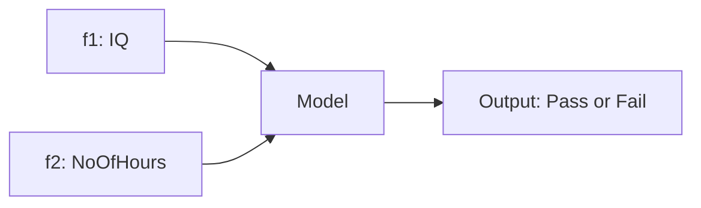
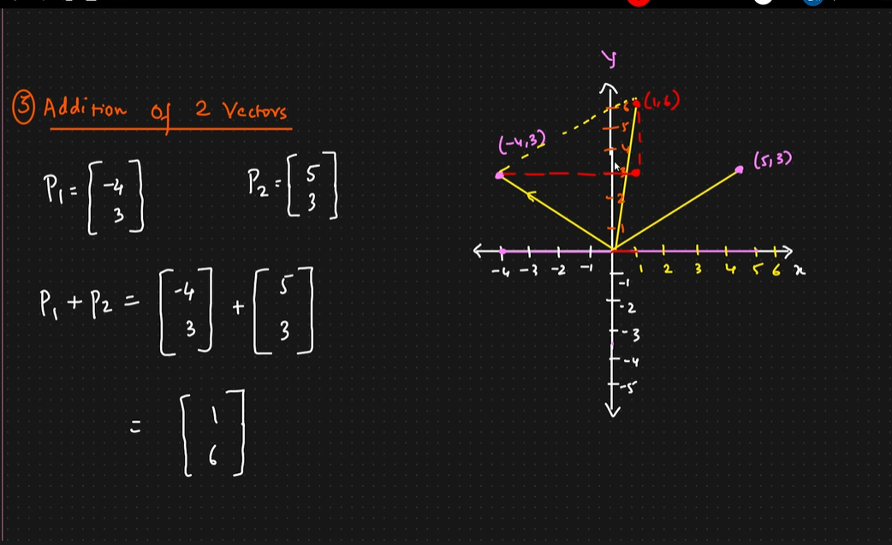
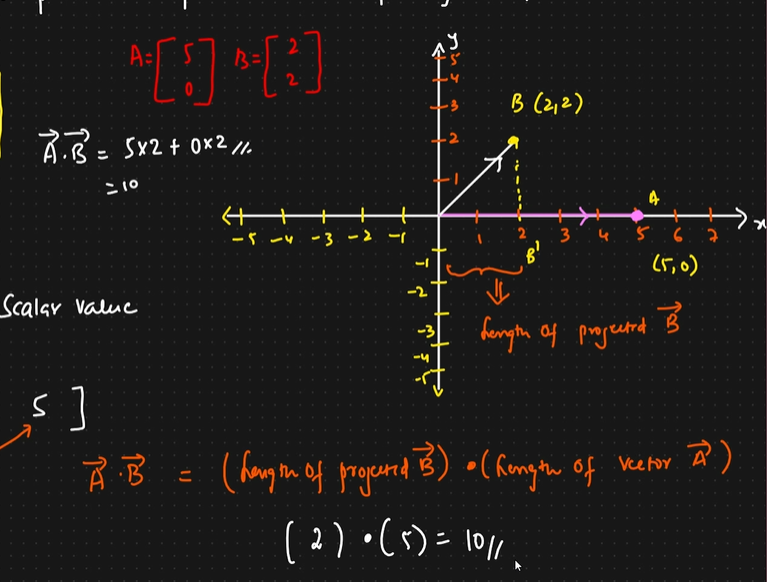
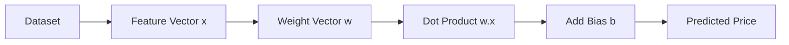
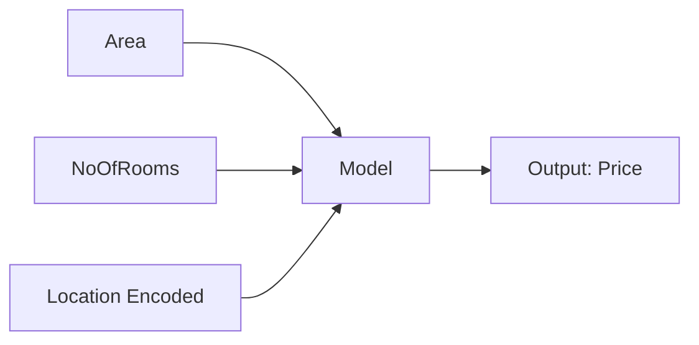
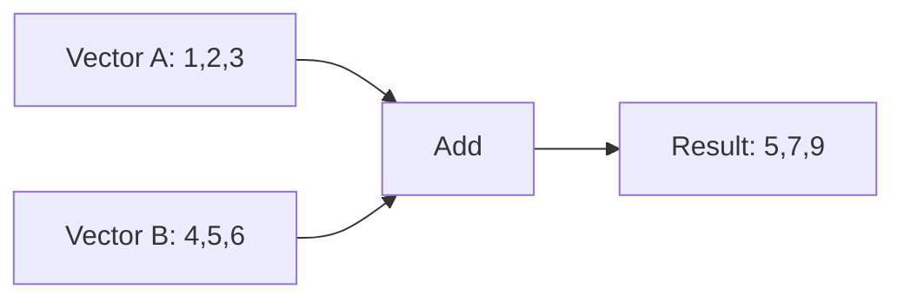
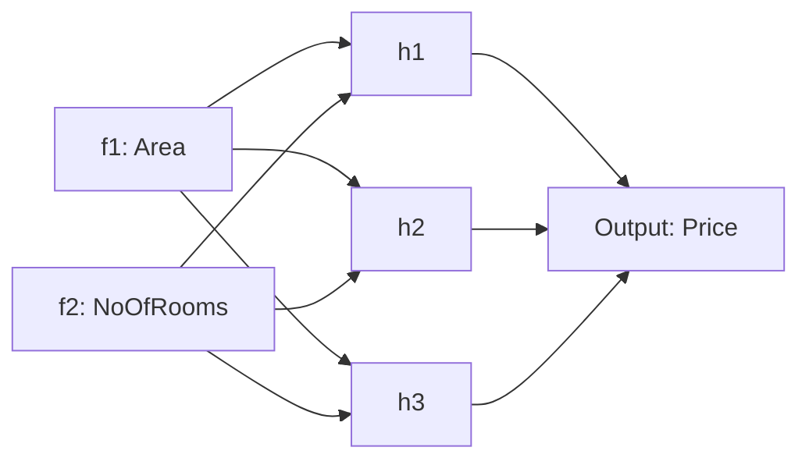

# Linear Algebra - Simple Telugu English Notes

Linear Algebra ante numbers ni single ga kakunda group ga chusi, vatini rules tho operate cheyyadam.
Idi ML, DL, NLP, Computer Vision lo chala important.

## Enduku Linear Algebra Important?

1. Data ni represent cheyyadaniki (tables, vectors, matrices)
2. Relations ni ardham chesukodaniki (features madhya relation)
3. Fast ga calculations cheyyadaniki (matrix operations)
4. Models train cheyyadaniki (weights updates, transformations)

Kid analogy:
- Oka toy box undi ani anuko.
- Single toy = scalar
- Toy line lo arrange chesthe = vector
- Toys ni rows and columns lo shelf lo arrange chesthe = matrix

## 1) Scalars, Vectors, Matrices

### Scalar
Oka single value.

Example:
- temperature = 32
- house price = 75

### Vector
Order lo values list.

Example:
- student marks vector: [85, 90, 78]
- 3D point: [2, 3, 4]

#### Vector Detailed Explanation (Screenshot Add-on)

Vector ante numerical value ki magnitude and direction rendu untayi.

Magnitude ante vector length/size. Direction ante vector e side ki point chestundo adi.

Simple definition:
- scalar -> only magnitude
- vector -> magnitude + direction

Important clarity:
- "45 km/hr" only magnitude kabatti idi scalar.
- "45 km/hr East direction" ante adhi vector concept (velocity type).

```text
45 km/hr East  --------->

Arrow length  -> magnitude
Arrow facing  -> direction
```

Magnitude formula (2D vector):

$$|v| = \sqrt{x^2 + y^2}$$

General formula (n-dimension):

$$|v| = \sqrt{x_1^2 + x_2^2 + \dots + x_n^2}$$

Example 1:

$$v = [3,4] \Rightarrow |v| = \sqrt{3^2+4^2}=5$$

Example 2 (speed intuition):
- 45 km/hr East is vector-like velocity info (magnitude = 45, direction = East)
- only "45 km/hr" direction lekunda unte scalar laga treat chestham

### Data Science Example: Student Features as Vector

Suppose student info:
- IQ = 90
- StudyHours = 3

Feature vector:

$$[90,\ 3]$$

Inko student:

$$[100,\ 3]$$

Possible target:
- Pass/Fail

Meaning:
- input features vector form lo model ki velthai
- model output scalar/class label istundi

#### Classification View (Screenshot Add-on)

Features and output mapping:
- f1 = IQ
- f2 = NoOfHours (study hours)
- output = Pass/Fail

Label encoding:
- Fail = 0
- Pass = 1

Sample labeled points:

| f1 (IQ) | f2 (Hours) | Output Label |
|---:|---:|---|
| 90 | 2 | Fail (0) |
| 100 | 3 | Pass (1) |
| 95 | 2.5 | Pass (1) |
| 85 | 1.5 | Fail (0) |

Model flow:



2D points with labels:

```text
NoOfHours (f2)
^
| 4.0 |
| 3.5 |
| 3.0 |                          P(100,3)  -> Pass
| 2.5 |                 P(95,2.5) -> Pass
| 2.0 |          F(90,2)  -> Fail
| 1.5 |   F(85,1.5) -> Fail
| 1.0 |
+------------------------------------------------------> IQ (f1)
	80      85      90      95      100      105
```

Decision boundary idea:

```text
NoOfHours (f2)
^
|                         P P P P
|                     P P P P
|                -------------------  boundary line
|              F F F F
|          F F F F
+---------------------------------------------------> IQ (f1)
```

Simple meaning:
- boundary line ki oka side mostly Fail points
- inko side mostly Pass points
- model goal: ee line ni correct ga place cheyyadam

### Vector Over Time Example (Higher Dimension)

Person weight 4 days data:

$$[70, 72, 75, 73]$$

Idi 4-dimension vector example.

### 2D Vector Coordinate Example

A and B vectors ni consider cheddam:

$$A = [1, 2],\quad B = [-3, 2]$$

```text
2D plane (x,y)

y
^                 B(-3,2)
|                 *
|   A(-3,0)       |
|      *----------*  B(-3,2)
|      |
|      |
|      O(0,0) ---------> C(1,0)
|                    \
|                     \
|                      * D(1,2)
|                        (vector [1,2] endpoint)
|__________________________________> x
```

A vector magnitude:

$$|A| = \sqrt{1^2 + 2^2} = \sqrt{5}$$

### 3D Vector Coordinate Example

General 3D vector:

$$C = [x, y, z]$$

Example point:

$$C = (2, 4, 2)$$

```text
				x
				^
				|
				|            C(2,4,2)
				|           *
				|
				|       (projection)
				+-----------> y
			   /
			  /
			 v
			z

O = (0,0,0), point C(2,4,2) exists in 3D space
```

### Unit Vector and Basis Vectors (i-hat, j-hat) - Detailed

Ippudu screenshot lo unna core idea ni detail ga chuddam.

#### 1) Basis vectors ante enti?

2D lo standard basis vectors:

$$\hat{i} = (1,0), \quad \hat{j} = (0,1)$$

Meaning:
- $\hat{i}$ x-axis direction lo 1 unit length
- $\hat{j}$ y-axis direction lo 1 unit length
- rendu unit vectors magnitude 1 untundi

```text
y
^
|      j-hat = (0,1)
|      ^
|      |
|      O-------> i-hat = (1,0)
|
+--------------------------------> x
```

#### 2) Point (3,3) ni vector ga ela rayali?

If point $P=(3,3)$, origin nundi P ki vellina arrow vector:

$$\vec{OP} = (3,3) = 3\hat{i} + 3\hat{j}$$

Ikkada:
- x direction lo 3 units
- y direction lo 3 units

```text
y
^
|                         P(3,3)
|                        *
|                     /  |
|                  /     | 3 units (y part)
|               /        |
|            /           |
|         O--------------* (3,0)
|           3 units (x part)
+--------------------------------------> x
```

#### 3) Magnitude of vector (3,3)

Vector length (magnitude):

$$
|\vec{OP}| = \sqrt{3^2 + 3^2} = \sqrt{18} = 3\sqrt{2}
$$

Meaning:
- magnitude ante arrow total length
- coordinates kaadu, overall distance from origin

#### 4) Unit vector in same direction

Unit vector formula:

$$\hat{u} = \frac{\vec{v}}{|\vec{v}|}$$

For $\vec{v}=(3,3)$:

$$
\hat{u} = \frac{(3,3)}{3\sqrt{2}} = \left(\frac{1}{\sqrt{2}}, \frac{1}{\sqrt{2}}\right)
$$

Check magnitude:

$$
\left|\hat{u}\right| = \sqrt{\left(\frac{1}{\sqrt{2}}\right)^2 + \left(\frac{1}{\sqrt{2}}\right)^2} = 1
$$

#### 5) Graph: original vector vs unit vector

```text
y
^
|                         * P(3,3)   (long vector)
|                      /
|                   /
|                /
|             * Q(0.707,0.707)       (unit vector endpoint)
|           /
|         O
+--------------------------------------------> x
```

Note:
- O->P and O->Q same direction lo untayi
- kani O->Q length exactly 1

#### 6) Why unit vector useful in ML/Data Science?

1. Direction-only comparison:
- magnitude effect remove chesi pure direction compare cheyyachu

2. Cosine similarity base:
- normalized vectors use chesthe angle-based similarity easy avtundi

3. Stable training intuition:
- very large feature scales impact ni tagginchadaniki normalization help chestundi

#### 7) One More Example (quick)

If $v=(4,0)$:

$$|v|=4, \quad \hat{v}=(1,0)=\hat{i}$$

If $v=(0,5)$:

$$|v|=5, \quad \hat{v}=(0,1)=\hat{j}$$

Ivi screenshot lo mention chesina "unit vector towards x and y axis" concept ki exact examples.

### Property: Free Vector or Translation Invariance

Mee screenshot lo main property idi:
- vector ni parallel ga slide chesina, vector value change avvadu
- as long as direction and length same unte, adi same vector

Simple ga:
- starting point change avvachu
- ending point kuda shift avvachu
- kani delta x and delta y same unte vector same

#### What it means with (3,3)

Suppose one vector:

$$v=(3,3)$$

Idi origin nundi draw chesthe O(0,0) -> P(3,3).
Ippudu same arrow ni inko place ki slide chesi A(5,1) nundi draw chesthe endpoint B(8,4).

Endukante:

$$B-A=(8-5,4-1)=(3,3)=v$$

So O->P and A->B geometric ga different places lo unna, vector math lo same vector.

```text
y
^
|                    P(3,3) *
|                         /      O->P = (3,3)
|                      /
|                   O(0,0)*
|
|      A(5,1) *-----------* B(8,4)
|                A->B = (3,3)
+-------------------------------------------------> x
```

Conclusion:
- vector "position" kaadu
- vector "displacement" (change) represent chestundi

#### Parallel lines picture meaning

Mee right-side graph lo unna parallel lines meaning:
- same slope/direction unna lines family
- center lo origin nundi velle line direction ni represent chestundi
- vere parallel lines ante same direction but shifted positions

```text
y
^
|      /  /  /   (parallel family: same direction)
|     /  /  /
|----/--/--/-------------------------------> x
|   /  /  /
|  /  /  /
```

Middle line origin ni cross chesthe, dani direction vector ni base ga tiskoni
parallel ga shift ayina anni lines same direction class lo untayi.

#### ML/Data Science connection

1. Feature shift and invariance intuition:
- absolute location kanna relative differences important ani idea build avtundi

2. Decision boundary intuition:
- classifier lo boundary line shift ayina slope same unte orientation same untundi

3. Vector operations:
- add/subtract lo displacement concept direct ga use avtundi

Kid analogy:
- floor meeda oka arrow sticker undi ani anuko.
- adhe sticker ni side ki move chesina arrow direction and length marakapothe, meaning same.

### Matrix
Rows and columns lo values table.

Example:

| Area (sqft) | Rooms | LocationScore | Price (lakhs) |
|---|---|---|---|
| 1000 | 2 | 7 | 45 |
| 1400 | 3 | 8 | 62 |
| 1800 | 4 | 9 | 88 |

Ikkada first 3 columns input features, last column output target.

### Applications in Data Science

Scalars, vectors, matrices data science lo direct ga use avutayi.

1. Feature representation:
- Oka row lo unna feature values (Area, Rooms, LocationScore) -> vector
- Full dataset rows+columns -> matrix

2. Target prediction:
- Price, Sales, Rating laanti output mostly scalar value

3. Similarity check:
- User A interests vector and User B interests vector compare cheyyadaniki dot product or cosine similarity use chestham

4. Recommendation systems:
- user-feature matrix and item-feature matrix use chesi best recommendations istaru

5. Image and text data:
- image pixel grid ni matrix ga represent chestham
- text embedding ni high-dimension vector ga represent chestham

6. Feature scaling and normalization:
- temperature, salary, age laanti different scale values ni model ki easy ga nerpinchadaniki normalize chestham

Mini example:

```text
Input vector x = [Area, Rooms, LocationScore] = [1200, 2, 7]
Weight vector w = [0.03, 5, 2]

Prediction score = w . x + b
```

Kid analogy:
- Data science kitchen laanti di.
- ingredients list = vector
- full grocery table = matrix
- final dish taste score = scalar output

## 2) Basic Operations

### Vector Addition
[1, 2, 3] + [4, 5, 6] = [5, 7, 9]

Analogy: rendu chocolate bags lo chocolates count kalipinattu.

#### Addition of 2 Vectors (Screenshot Example)

Given:

$$P_1 = \begin{bmatrix}-4 \\ 3\end{bmatrix}, \quad P_2 = \begin{bmatrix}5 \\ 3\end{bmatrix}$$

Vector addition element-wise chestham:

$$
P_1 + P_2 =
\begin{bmatrix}-4 \\ 3\end{bmatrix} +
\begin{bmatrix}5 \\ 3\end{bmatrix} =
\begin{bmatrix}1 \\ 6\end{bmatrix}
$$

Resultant vector:

$$R = (1,6)$$

Graph points:
- $P_1$ endpoint = $(-4,3)$
- $P_2$ endpoint = $(5,3)$
- $R$ endpoint = $(1,6)$



Note: mee screenshot image ni `math/linearAlgebra/assets/vector-addition-screenshot.png` name tho place chesthe idi direct ga render avtundi.

Interpretation:
- x-components: $-4 + 5 = 1$
- y-components: $3 + 3 = 6$
- kabatti final arrow origin nundi $(1,6)$ ki vellutundi.

Easy memory:
- "x with x add cheyyali, y with y add cheyyali".

#### Real-Time AI Example: Query + Context Vector Add

Oka chatbot lo user query embedding vector untundi.
System ki recent conversation context vector kuda untundi.
I rendu kalipi final intent representation create chestharu.

Example:
- Query vector $q = [0.8, 0.1, 0.4]$
- Context vector $c = [0.2, 0.7, 0.1]$

Combined vector:

$$
q + c = [0.8,0.1,0.4] + [0.2,0.7,0.1] = [1.0,0.8,0.5]
$$

Meaning:
- first dimension signal stronger ayindi ($1.0$)
- second dimension context valla boost ayindi ($0.8$)
- model final decision better ga teesukuntundi

Mini intuition graph:

```text
Query signal     ---> [0.8, 0.1, 0.4]
Context signal   ---> [0.2, 0.7, 0.1]
Final signal     ---> [1.0, 0.8, 0.5]
```

Ila vector addition real-time lo RAG/chatbot/search systems lo chala common.

#### Word Embeddings Example (Data + Science)

Word embedding vectors:
- Data = [0.2, 0.1, 0.4]
- Science = [0.3, 0.7, 0.2]

Phrase "Data Science" ni approximate ga ila represent cheyochu:

$$
v_{data} + v_{science} = [0.2,0.1,0.4] + [0.3,0.7,0.2] = [0.5,0.8,0.6]
$$

Quick view:

```text
v_data    = [0.2, 0.1, 0.4]
v_science = [0.3, 0.7, 0.2]
----------------------------
v_phrase  = [0.5, 0.8, 0.6]   -> Data Science
```

Meaning:
- rendu word signals kalisi phrase meaning ni stronger ga represent chestayi.

#### Multiplication of Vectors (3 Types)

Vector operations lo addition tho patu multiplication kuda important.
Common ga 3 types use chestham:

1. Dot Product (Inner Product)
2. Element-wise Multiplication
3. Scalar Multiplication

##### 1) Dot Product (Inner Product)

Definition:
- rendu same-size vectors ni multiply chesi, final ga oka single number (scalar) vasthe danini dot product antaru.

Formula:

$$a \cdot b = \sum_i a_i b_i$$

Worked example:

$$a=[1,2,3],\ b=[4,5,6]$$

Step-by-step:

$$
a \cdot b = (1*4) + (2*5) + (3*6) = 4 + 10 + 18 = 32
$$

Meaning in simple way:
- value pedda ga unte vectors similar direction lo unnayi ani hint.
- zero daggara unte relation takkuva/orthogonal la undachu.

Kid analogy:
- Idhi quiz matching game la untundi.
- Nee answers and answer key ni pair-pair ga compare chesi total score istaru.
- Final score ekkuva unte "baaga match ayindi" ani artham.

Real-time AI example:
- user query embedding `q` and document embedding `d` teesukuntaru.
- $q \cdot d$ score ekkuva unte document relevant ani rank chestharu.

Mini scoring example:

$$q=[0.4,0.6],\ d_1=[0.5,0.5],\ d_2=[0.9,0.1]$$

$$q\cdot d_1=0.2+0.3=0.5,\quad q\cdot d_2=0.36+0.06=0.42$$

Kabatti $d_1$ query ki koncham ekkuva match.

Screenshot style example:

Definition line (simple):
- Dot product of two vectors ante corresponding components products ni sum chesthe oka scalar value vastundi.

Take:

$$A=\begin{bmatrix}2 \\ 3\end{bmatrix},\quad B=\begin{bmatrix}4 \\ 5\end{bmatrix}$$

Then:

$$
A \cdot B = 2*4 + 3*5 = 8 + 15 = 23
$$

So result scalar value = 23.

Transpose view (same idea):

$$
[2\ \ 3]\begin{bmatrix}4 \\ 5\end{bmatrix} = 2*4 + 3*5 = 23
$$

Easy note:
- Dot product compute cheyyadaniki one vector row form lo, inko vector column form lo rayadam comfortable.
- final answer single number ga vastundi, vector kaadu.

Geometric interpretation (projection view) - screenshot concept:

Take vectors:

$$A=\begin{bmatrix}5 \\ 0\end{bmatrix},\quad B=\begin{bmatrix}2 \\ 2\end{bmatrix}$$

Algebra method:

$$A \cdot B = 5*2 + 0*2 = 10$$

Projection meaning:
- $A$ x-axis meeda undi (length $|A|=5$)
- $B$ point $(2,2)$ ki velthundi
- $B$ ni $A$ direction (x-axis) meeda project chesthe projected component $B'$ length = 2

Kabatti:

$$A \cdot B = (\text{length of projected }B\text{ on }A) * (|A|) = 2 * 5 = 10$$

Equivalent formula:

$$A \cdot B = |A||B|\cos\theta$$

Ikkada $|B|\cos\theta = 2$ (adi projection part), and $|A|=5$.



Note: ee screenshot ni `math/linearAlgebra/assets/dot-product-projection-screenshot.png` path lo place chesthe, image direct ga render avtundi.

Why do we need to do this (dot product)?

Main reason:
- rendu vectors madhya "entha alignment undi" ani single score lo telusukodaniki.

Intuition:
- values match ayite score high
- opposite direction unte score negative
- unrelated/90-degree la unte score near zero

Practical use enduku:
1. Fast decision:
- multiple features unna data ni okka scalar score ga convert cheyyadam easy

2. Ranking:
- e candidate better match ani quickly compare cheyyachu

3. Projection meaning:
- oka vector lo inko vector direction ki entha part contribute chestundo measure cheyyachu

Tiny sign intuition:

$$
u=[1,0],\ v=[2,0] \Rightarrow u\cdot v=2\ (>0, same direction)
$$

$$
u=[1,0],\ v=[-2,0] \Rightarrow u\cdot v=-2\ (<0, opposite direction)
$$

$$
u=[1,0],\ v=[0,3] \Rightarrow u\cdot v=0\ (orthogonal)
$$

When dot-product scalar result is positive, negative, or zero

Use formula:

$$a\cdot b = |a||b|\cos\theta$$

Ikkada sign mostly $\cos\theta$ meeda depend avtundi.

1. Positive scalar result ($a\cdot b > 0$)
- Case: angle $\theta$ is less than 90 deg (acute angle)
- Meaning: vectors roughly same direction lo move avutunnayi

Example:

$$a=[2,1],\ b=[3,4]$$

$$a\cdot b = 2*3 + 1*4 = 10 > 0$$

2. Negative scalar result ($a\cdot b < 0$)
- Case: angle $\theta$ is between 90 deg and 180 deg (obtuse angle)
- Meaning: vectors opposite side tendency chupistunnayi

Example:

$$a=[2,1],\ b=[-3,-4]$$

$$a\cdot b = 2*(-3) + 1*(-4) = -10 < 0$$

3. Zero result ($a\cdot b = 0$)

Main cases:
- Case A: vectors orthogonal (90 deg)
- Case B: one vector zero vector

Case A example (orthogonal):

$$a=[1,2],\ b=[2,-1]$$

$$a\cdot b = 1*2 + 2*(-1) = 2-2 = 0$$

Case B example (zero vector):

$$a=[0,0,0],\ b=[5,1,-2]$$

$$a\cdot b = 0$$

Quick memory:
- positive -> similar direction
- negative -> opposite direction
- zero -> perpendicular or one vector is zero

Applications in AI field:

1. Semantic search and RAG:
- query embedding and document embedding dot product use chesi relevance score compute chestharu
- top score docs ni retrieve chestharu

2. Recommendation systems:
- user preference vector and item vector dot product -> interest score
- score high unte recommend chestharu

3. Classification models:
- linear models lo $w\cdot x + b$ core computation
- final prediction decision idhe score meeda depend avtundi

4. Neural networks:
- every neuron mostly weighted sum (dot product form) perform chestundi
- forward propagation lo repeated ga use avtundi

5. Attention mechanism intuition:
- query-key similarity calculate cheyyadaniki dot-product style scoring use chestharu
- model e token meeda focus cheyyalo decide chestundi

6. Cosine Similarity (Gen AI app -> RAG):
- cosine similarity anedi 2 vectors entha similar ga unnayo measure chestundi
- idi angle based similarity score istundi

Definition (simple):
- cosine of angle between two vectors = similarity score

Formula:

$$
\cos\theta = \frac{A\cdot B}{\|A\|\|B\|}
$$

Range interpretation:
- +1  -> complete similar direction
- 0   -> orthogonal / unrelated direction
- -1  -> opposite direction

AI/RAG context lo usually embeddings similar side lone untayi kabatti score mostly 0 to 1 madhya untundi.

Worked example:

$$A=[1,2],\ B=[2,3]$$

$$A\cdot B = 1*2 + 2*3 = 8$$

$$\|A\|=\sqrt{1^2+2^2}=\sqrt{5},\quad \|B\|=\sqrt{2^2+3^2}=\sqrt{13}$$

$$
\cos\theta = \frac{8}{\sqrt{5}\sqrt{13}} \approx 0.993
$$

Meaning:
- score 0.993 ante chala high similarity
- RAG lo ilanti high score documents top lo retrieve chestharu

Recommendation system example (Netflix-style, with graphs):

Suppose genre order fix chesam:

$$[\text{Action, Comedy, Drama, Romance, Thriller}]$$

Movie/user vector A (Avengers type profile):

$$A=[1,2,0,3,1]$$

Candidate vector B:

$$B=[2,0,1,1,1]$$

Step 1: Dot product

$$
A\cdot B = 1*2 + 2*0 + 0*1 + 3*1 + 1*1 = 6
$$

Step 2: Vector magnitudes

$$
\|A\| = \sqrt{1^2+2^2+0^2+3^2+1^2} = \sqrt{15} \approx 3.872
$$

$$
\|B\| = \sqrt{2^2+0^2+1^2+1^2+1^2} = \sqrt{7} \approx 2.646
$$

Step 3: Cosine score

$$
\cos\theta = \frac{A\cdot B}{\|A\|\|B\|} = \frac{6}{3.872*2.646} \approx 0.586
$$

Interpretation:
- similarity around 0.586 ante moderate positive similarity
- recommendation system lo idi "somewhat relevant" signal
- inka higher-score movies unte avi first recommend avtayi

Graph intuition 1 (vector space direction):

```text
origin O -----> A  (longer vector)
origin O ---->  B  (different angle)

angle between A and B small-unna better match,
angle pedda ayite match taggutundi.
```

Graph intuition 2 (calculation flow):

```mermaid
flowchart LR
	A1[A vector: 1,2,0,3,1] --> D[Dot product A.B = 6]
	B1[B vector: 2,0,1,1,1] --> D
	A1 --> NA[Norm |A| = sqrt15]
	B1 --> NB[Norm |B| = sqrt7]
	D --> C[Cosine = 6/(|A||B|)]
	NA --> C
	NB --> C
	C --> R[Score ~ 0.586 => moderate positive similarity]
```

Kid analogy:
- dot product ni "match meter" la think cheyyi.
- two answer sheets compare chesi oka total match score ivvadam la untundi.
- score ekkuva unte "idhi correct direction" ani model ki clue dorukutundi.

##### 2) Element-wise Multiplication

Definition:
- vector lo prathi position ni ade position value tho multiply chestham.
- output malli vector ga vastundi.

Formula:

$$c = a \odot b,\quad c_i = a_i b_i$$

Worked example:

$$[1,2,3] \odot [4,5,6] = [1*4, 2*5, 3*6] = [4,10,18]$$

Meaning in simple way:
- prathi feature ki local weight apply ayinatlu.
- e dimension important o direct ga control cheyyachu.

Kid analogy:
- Oka fruit basket lo apples, bananas, mangoes unnayi ani anuko.
- Teacher chepthadu: apples full, bananas koncham, mangoes half use cheyyali.
- Ante prathi fruit quantity ki separate multiplier apply chestunnam.

Real-time AI example (feature gating):
- image features $f=[0.8,0.2,0.6]$
- attention/gate weights $g=[1.0,0.1,0.5]$

$$f \odot g = [0.8,0.02,0.3]$$

Ikkada second feature almost suppress ayindi, first feature strong ga undi.

##### 3) Scalar Multiplication

Definition:
- oka number (scalar) ni vector lo prathi element tho multiply chestham.

Formula:

$$k[a_1,a_2,\dots,a_n]=[ka_1,ka_2,\dots,ka_n]$$

Worked example:

$$3[1,2,3] = [3,6,9]$$

Meaning in simple way:
- vector direction same untundi (k positive unte), length matram scale avtundi.
- k negative unte direction reverse avtundi.

Kid analogy:
- Photo zoom in / zoom out la anuko.
- Same photo untundi, kani size matram perugutundi leda taggutundi.
- Negative zoom la think chesthe opposite direction side ki tirigina la untundi.

Mini example:

$$-2[1,-3]=[-2,6]$$

Real-time AI example:
- recommendation score combine chestappudu context importance ni 0.7 or 1.3 la scale chestharu.
- ante "entha importance ivvali" ani scalar decide chestundi.

#### Quick Comparison (Easy Recall)

| Type | Input | Output | Main purpose |
|---|---|---|---|
| Dot product | vector + vector | scalar | similarity / score |
| Element-wise | vector + vector | vector | per-feature gating |
| Scalar mult | scalar + vector | vector | scaling strength |

Common mistakes avoid cheyyali:
- different lengths vectors ki dot/element-wise cheyyakudadhu.
- dot product result vector kaadu, scalar.
- element-wise and dot product ni confuse avvakudadhu.

Super quick kid memory trick:
- Dot product = "score card"
- Element-wise = "item-wise stickers"
- Scalar mult = "zoom button"

### Dot Product
[1, 2, 3] . [4, 5, 6] = (1x4) + (2x5) + (3x6) = 32

Dot product use:
- similarity check
- prediction score calculate cheyyadam

### Matrix Multiplication
Idi transformation and model calculations ki base.

If

A = [[1, 2], [3, 4]]

B = [[5, 6], [7, 8]]

then

A x B = [[19, 22], [43, 50]]

## 3) Linear Transformation (Easy Meaning)

Transformation ante shape ni move/rotate/scale cheyyadam, kani straight lines ni straight lines gane unchadam.

Examples:
- scaling
- rotation
- shearing

Kid analogy:
- Paper meeda square draw chesi stretch chesthe rectangle avtundi.
- Adi transformation.

## 4) Eigen Value and Eigen Vector (Simple)

Konni directions untayi, transformation apply chesina direction maradu, size matrame marutundi.

- direction marakunda unte adi eigen vector
- size entha marindo adi eigen value

Analogy:
- Rubber sheet ni stretch chesthunappudu konni arrows same direction lo untayi, length matrame perigedi/taggedi.

Use cases:
- PCA (dimensionality reduction)
- image compression
- recommendation systems

## 5) ML Connection - House Price Example

Meeru screenshot lo unna idea ni simple ga:

Input features:
- Area
- Number of rooms
- Location score

Model output:
- Predicted price

Equation form:

Price = w1*Area + w2*Rooms + w3*LocationScore + b

Ikkada:
- [Area, Rooms, LocationScore] = vector x
- [w1, w2, w3] = weight vector w
- prediction = w . x + b

Ante model mostly dot product meeda run avutundi.

## 6) 3D Graph Intuition

3 features unte data ni 3D space lo plot cheyochu.

Axes example:
- X-axis: Area
- Y-axis: Rooms
- Z-axis: Price

### 3D Scatter Concept (ASCII view)

```text
				Z (Price)
				^
				|
				|        P3(1800,4,88)
				|         *
				|    P2(1400,3,62)
				|      *
				|  P1(1000,2,45)
				|    *
				|
				+------------------> X (Area)
			   /
			  /
			 v
		 Y (Rooms)
```

### 3D Plane Concept (Model fit)

Linear regression 3D lo mostly oka plane fit chestundi.

```text
				Z (Price)
				^
				|        .  .
				|     .  /----/.
				|   .   /____/  .
				|  .     plane   .
				+------------------> X (Area)
			   /
			  /
			 v
		 Y (Rooms)
```

## 7) Mermaid Flow (Data to Prediction)



## 7.1) Include This Too - Dataset to Model (Screenshot Style)

Mee image lo unna same idea ni clear ga ila chuddam.

### Dataset Columns

- Input features (X): Area, NoOfRooms, Location
- Output feature (Y): Price

| Area | NoOfRooms | Location | Price |
|---:|---:|---|---:|
| 1200 | 2 | Bangalore | 45 |
| 1500 | 3 | Hyderabad | 62 |
| 1800 | 4 | Bangalore | 88 |

Note:
- Location text value kabatti model direct ga teesukodu.
- So Location ni numeric ga convert chestham (encoding).

Example encoding:
- Bangalore = 1
- Hyderabad = 2
- Chennai = 3

### Input Feature to Output Feature Flow



Ikkada model pani enti ante relation ni quantify cheyyadam.

Simple ga:
- X change ayite Y ela marutundi?
- e direction lo marutundi?
- entha strength tho marutundi?

### X-Y Relationship Patterns

```text
Case 1: Positive relation (x perigite y kuda perugutundi)
y
^        *
|      *
|    *
|  *
+------------------> x

Case 2: Negative relation (x perigite y taggutundi)
y
^  *
|    *
|      *
|        *
+------------------> x

Case 3: Weak/no clear relation
y
^   *    *
|      *
| *      *
|    *
+------------------> x
```

### 2D Point nundi 3D Point ki Move (Screenshot Concept)

Oka single house ni 2 features tho represent chesthe 2D point vastundi.

Example:
- (x, y) = (Area, Price) = (1200, 45)
- Idi 2-dimension vector la treat cheyochu.

```text
2D view (Area vs Price)

Area
^
|                           * (1200,45)
|
|
+----------------------------------------> Price
```

Ippudu inkoka feature add chesthe, ante NoOfRooms add chesthe, point 3D space ki shift avutundi.

3D point example:
- (x, y, z) = (Area, NoOfRooms, Price)
- (1200, 2, 45)

```text
3D view

					   Area
						^
						|
						|      *
						|   *
						| *
						+---------------------> Price
					   /
					  /
					 v
				 NoOfRooms
```

Meaning:
- 2D lo okka relation (Area-Price) matrame kanipistundi.
- 3D lo additional info (NoOfRooms) kuda capture avutundi.
- Kabatti model better ga pattern ni ardham cheskuntundi.

Kid analogy:
- 2D ante map lo street matrame choosinatlu.
- 3D ante same street + building floors info kuda add ayinatlu.

### Covariance and Correlation (Very Simple)

- Covariance: x, y same direction lo move avutunnaya leka opposite direction lo move avutunnaya ani cheptundi.
- Correlation: covariance idea ne scale chesi -1 nunchi +1 range lo istundi.

Quick interpretation:
- correlation +1 ki daggara unte strong positive relation
- correlation -1 ki daggara unte strong negative relation
- correlation 0 daggara unte clear linear relation ledu

Mini relation table:

| X movement | Y movement | Meaning |
|---|---|---|
| X up | Y up | positive relation |
| X up | Y down | negative relation |
| X down | Y up | negative relation |
| random | random | weak relation |

Kid analogy:
- Ice cream sales (x) and temperature (y): usually rendu kalisi perugutayi -> positive.
- Rain ekkuva ayite playground kids count taggipotundi -> negative.

## 8) Graphs Only - Vector and Matrix Visual

### Vector Addition Graph (2D idea)



### Matrix as Data Grid

| Row | Area | Rooms | Location | Price |
|---|---:|---:|---:|---:|
| 1 | 1000 | 2 | 7 | 45 |
| 2 | 1400 | 3 | 8 | 62 |
| 3 | 1800 | 4 | 9 | 88 |

Graph meaning:
- Columns = features
- Each row = oka house point
- Full table = matrix representation

## 9) Graphs Only - 3D Understanding

### 3D Scatter (House Data Points)

```text
						Z = Price
							^
							|
					 88   |                 * (1800,4,88)
					 75   |
					 62   |          * (1400,3,62)
					 50   |
					 45   |    * (1000,2,45)
							+----------------------------------> X = Area
						  /
						 /
						v
					Y = Rooms
```

### 3D Plane Intuition (Linear Model Surface)

```text
						Z = Price
							^
							|            . . . . .
							|          .   plane   .
							|        .  y = w1x1 + w2x2 + b .
							|      . . . . . . . . . . . .
							+----------------------------------> X = Area
						  /
						 /
						v
					Y = Rooms
```

### Top View Projection (X-Y only)

```text
Y (Rooms)
4 |                      *  (1800,4)
3 |            *  (1400,3)
2 |      *  (1000,2)
  +-------------------------------- X (Area)
	 1000        1400        1800
```

### Side View Projection (X-Z only)

```text
Z (Price)
90 |                      *  (1800,88)
70 |            *  (1400,62)
45 |      *  (1000,45)
	+------------------------------- X (Area)
	  1000      1400       1800
```

Ivi chuste 3D point ni 2D views lo kuda easy ga ardham cheskovachu.

### Linear Algebra Works with Higher-Dimension Data

Exactly mee point: linear algebra higher dimension data tho baga work chestundi.

3D varaku manam draw cheyochu, kani real ML lo 10, 50, 100+ features untayi.
Appudu every data point oka high-dimension vector avtundi.

Example (house dataset):
- 2D: [Area, Price]
- 3D: [Area, Rooms, Price]
- 5D: [Area, Rooms, LocationScore, AgeOfHouse, DistanceToMetro]

```text
2D point  -> (x1, x2)
3D point  -> (x1, x2, x3)
nD point  -> (x1, x2, x3, ..., xn)
```

Simple meaning:
- dimensions perigina, concept same untundi: vector and matrix operations.
- human eye ki draw cheyyatam kastam, kani math ki kastam kadu.

Kid analogy:
- 2 features ante 2 color pencils tho drawing.
- 10 features ante 10 color pencils tho detail drawing.
- colors ekkuva aina, drawing rules maravu; ade linear algebra idea.

## 10) Quick Revision

1. Scalar = single number
2. Vector = list of numbers
3. Matrix = table of numbers
4. Dot product = weighted sum
5. Matrix multiplication = transformation engine
6. Eigen concepts = stable direction + scaling
7. ML lo prediction core math = linear algebra

## 11) One More Kid Analogy (Super Simple)

Imagine crayons box:
- red, blue, green crayons counts = vector
- class lo andari crayons counts table = matrix
- teacher total colors power calculate chesthe = dot product laga
- crayons ni rotate chesi new pattern create chesthe = transformation

Ila chusthe Linear Algebra scary kadu, pattern game la untundi.

## 12) Machine Learning and AI lo Linear Algebra Role

### (a) Linear Equation and Model Training Intuition

Model training lo chala operations matrix arithmetic meeda base untayi.
Simple line relation ni usually ila rayachu:

$$ax + by + c = 0$$

or slope-intercept form:

$$y = mx + c$$

Price vs Size graph lo, points ni best ga fit ayye line ni model nerchukuntundi.

```text
Price
^
|                x
|           x
|      x
|   x
|______________________________> Size
			/ best fit line /
```

### (b) Eigen Value and Eigen Vector -> Dimensionality Reduction

Future topics lo chala important point idi:
- eigen value and eigen vector help tho high-dimension data ni low-dimension space ki map cheyyachu.

Simple ga cheppali ante:
- data lo most important directions (information ekkuva unna directions) ni pick chestham
- less important directions ni drop chestham
- appudu dimension reduce avutundi, but useful information major ga save avutundi

Idi PCA concept ki core base.

```text
Higher Dimension Data  ---->  Principal Directions  ---->  Lower Dimension Data
	  (many features)             (eigen vectors)               (compact features)
```

Note:
- "higher dimension nundi lower dimension ki reduce" ane idea exact ga ikkade use avutundi.
- detailed math steps (covariance matrix, eigen decomposition) next ga depth lo chudachu.

### (c) Neural Networks: Forward Propagation and Backward Propagation

Deep learning lo neural network ane concept untundi.
Prerequisite ga full depth teliyakapoina parvaledu; basic idea unte enough.

Mee example ni same ga represent chesthe:
- Input features: f1 = Area, f2 = NoOfRooms
- Hidden layer neurons: 3
- Output feature: Price



Ikkada two inputs nundi three hidden neurons ki full connections unnayi kabatti,
input-to-hidden weights shape:

$$2 \times 3$$

Weight matrix ni ila rayachu:

$$
W =
\begin{bmatrix}
w_1 & w_2 & w_3 \\
w_4 & w_5 & w_6
\end{bmatrix}
$$

Meaning:
- 2 rows -> 2 input features (f1, f2)
- 3 columns -> 3 hidden neurons (h1, h2, h3)

Forward propagation:
- inputs and weights use chesi output predict chestham.

Backward propagation:
- prediction error batti weights update chestham.

#### Same Diagram Style View (f1, f2 and 2x3 Matrix Multiplication)

Input feature vector ni row form lo ila rayachu:

$$X = [f_1\ \ f_2]$$

Input-to-hidden weight matrix:

$$
W_{ih} =
\begin{bmatrix}
w_1 & w_2 & w_3 \\
w_4 & w_5 & w_6
\end{bmatrix}
$$

Forward step lo first hidden pre-activation:

$$Z_{hidden} = XW_{ih} = [f_1\ \ f_2]
\begin{bmatrix}
w_1 & w_2 & w_3 \\
w_4 & w_5 & w_6
\end{bmatrix}
$$

Result shape:

$$1 \times 3$$

Ante hidden layer lo 3 neurons ki 3 values vastayi.

```text
Forward propagation direction:
f1, f2  ------->  Hidden(3)  ------->  Output(Price)

Backward propagation direction:
error from output  <-------  Hidden(3)  <-------  f1, f2
```

Simple summary:
- forward lo matrix multiplication tho prediction ki vellam.
- backward lo error ni venakki pampinchi weights (w1..w6) update chestham.

Kid analogy:
- forward ante exam attempt chesi marks techukovadam.
- backward ante mistakes chusi next attempt lo improve avvadam.

## 13) Optimization (ML lo Chala Important)

### (a) Solving Equations -> Linear Equation to Regression

Linear model ni simple ga ila rayachu:

$$y = mx + c$$

Ikkada:
- $m$ = slope (coefficient), idi scalar value
- $c$ = intercept, idi kuda scalar value

Important note:
- Simple linear regression lo okka input feature unte, $m$ and $c$ rendu scalar values.
- Multiple linear regression lo coefficients vector la untayi, but intercept mostly scalar gane untundi.

House example lo:
- $x$ = size (input feature)
- $y$ = price (output)

Main goal:
- correct slope and intercept find cheyyali,
- so predictions points ki close ga ravali.

#### Detailed Example (Step by Step)

Manam 3 data points tiskundam (Size, Price):
- (1000, 45)
- (1500, 65)
- (2000, 85)

Ivi almost straight-line relation laga unnayi.

Step 1: Slope $m$ estimate (first and last point use chesi)

$$
m = \frac{y_2 - y_1}{x_2 - x_1} = \frac{85 - 45}{2000 - 1000} = \frac{40}{1000} = 0.04
$$

Step 2: Intercept $c$ find cheyyadam

Equation: $y = mx + c$

First point $(1000,45)$ substitute chesthe:

$$
45 = 0.04(1000) + c = 40 + c
$$

So,

$$c = 5$$

Final model:

$$\hat{y} = 0.04x + 5$$

Step 3: Prediction example

If size $x=1800$:

$$
\hat{y} = 0.04(1800) + 5 = 72 + 5 = 77
$$

Ante model prakaram predicted price = 77 (lakhs ani assume cheyochu).

Step 4: Error ela compute cheyyali

Suppose actual price = 80.

$$
error = y - \hat{y} = 80 - 77 = 3
$$

Squared error:

$$
(y - \hat{y})^2 = 3^2 = 9
$$

Ila every point ki squared error calculate chesi average tiskunte MSE vastundi.

Quick understanding:
- $m$ ekkuva unte line steep ga untundi.
- $c$ marite line up/down shift avutundi.
- training lo main target: right $m$, right $c$ dorakadam.

### (b) Many Possible Lines, Best Line Edi?

Same data ki chala lines draw cheyochu, kani best line ante error takkuva undedi.

```text
Price
^
|                x
|         x            x
|      x
|   x
|--------------------------------------------------  line-1 (too flat)
|             / best-fit line /
|          /
|       /                                            line-3 (too steep)
+---------------------------------------------------------------> Size
```

Pink-type vertical gaps (actual point nundi line varaku distance) ni errors anukondi.
Best line ante total error minimum ayye line.

### (c) Objective Function (Error ni Minimize Cheyyadam)

Regression lo objective usually error minimize cheyyadam.

Simple ga:
- model function $f(x)$ best ga undali
- error (loss) minimize avvali

Mean Squared Error intuition:

$$
Loss = \frac{1}{n}\sum_{i=1}^{n}(y_i - \hat{y}_i)^2
$$

Target:

$$\min Loss$$

### (d) Gradient Descent -> Optimizer

Gradient descent ane optimizer slope/intercept (or weights) ni step-by-step update chestundi,
loss tagge direction lo move avutundi.

Update idea:

$$
	heta_{new} = \theta_{old} - \eta \cdot \nabla Loss
$$

Ikkada:
- $\theta$ = parameters (example: $m, c$)
- $\eta$ = learning rate
- $\nabla Loss$ = gradient direction

```text
Start params -> compute error -> compute gradient -> update params -> better line
					^                                              |
					|______________________________________________|
							  repeat until error small
```

Kid analogy:
- hill paina nunchi kindaki digetappudu, every step lo ekkada slope kindaki untundo akkadike move avvadam.
- alane gradient descent error-hill lo minimum point ki velthundi.
