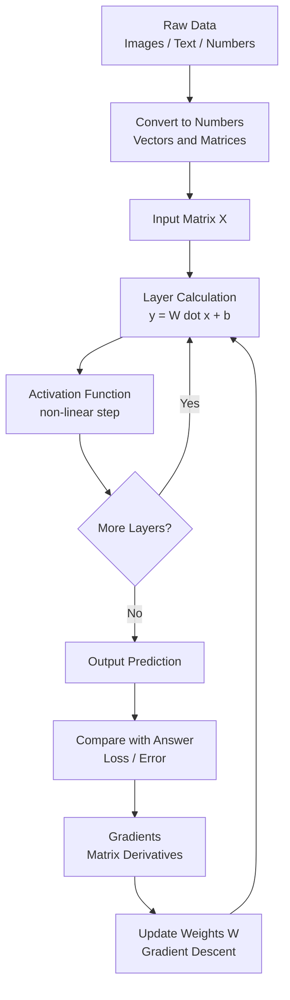

# Linear Algebra for AI (Simple Telugu-English Mix)

## Linear Algebra ante enti?

**Definition (formal):** Linear Algebra ante mathematics lo oka branch, idi **vectors, matrices, and linear equations** meeda study chestundi. Linear equations ante `a1*x1 + a2*x2 + ... = b` laanti equations (variables ki power 1 matrame untundi, curves undavu).

**Simple definition:** Numbers ni **groups (vectors, matrices) laaga arrange chesi**, vaati meeda add, multiply, transform laanti calculations cheyyadame linear algebra.

- Oka single number = **Scalar**.
  Example: `age = 25` (oka single number).
- Numbers oka line laaga = **Vector**.
  Example: oka student marks `[85, 90, 78]` (Maths, Physics, Chemistry).
- Numbers oka table laaga (rows and columns) = **Matrix**.
  Example: 3 students marks:
  ```
  [[85, 90, 78],
   [70, 65, 80],
   [95, 88, 91]]
  ```
- Multiple matrices stacked = **Tensor**.
  Example: oka color photo = 3 matrices (Red, Green, Blue), prathi one 100x100 size, kalipi shape (3, 100, 100).

Simple ga: Excel sheet lo rows and columns tho numbers arrange chesinattu. Aa numbers meeda add, multiply laanti operations cheyyadame linear algebra.

---

## Numbers ni enduku vectors/matrices ga marchali? (Why transform?)

Manaki oka doubt ravachu: "already numbers unnaayi kada, malli enduku vector/matrix ga marchali?" Karanam idi:

### 1) Oka item ki multiple values untayi (single number saripodu)
- Oka house ni describe cheyyali ante oka number saripodu.
  Area, bedrooms, price, age anni kavali -> `[1200, 3, 5000000, 10]`.
- **Real example:** oka person ni describe cheyyadaniki height, weight, age kavali. Anduke `[170, 65, 25]` vector.
- Single number tho full information cheppalem, so **vector** kavali.

### 2) Chala items oka sari lo handle cheyyadaniki
- Oka house kadu, 1000 houses unte, prathi house oka row -> full **matrix**.
- **Real example:** class lo 60 students, prathi student ki 5 subjects marks -> (60, 5) matrix. Anni oka table lo.
- Idi lekapothe prathi item ni separate ga handle cheyyali -> chala slow.

### 3) Computer ki text/image ardham kaadu, numbers matrame ardham
- Model ki "France", "cat photo", "hello" direct ga ardham kaadu.
- Vaatini numbers (vectors/matrices) ga marchi ivvali.
- **Real example:** word "king" -> `[0.2, 0.9, -0.1]` embedding. Photo -> pixel numbers matrix.

### 4) Fast calculations (parallel math)
- Numbers ni matrix laaga pedithe, computer (especially GPU) **anni oka sari lo** (parallel) calculate chestundi.
- **Real example:** 1000 students total marks calculate cheyyali. Loop tho okko okkati cheyyadam slow. Matrix operation tho anni oka step lo -> chala fast.
- AI lo millions of calculations untayi, so ee speed chala important.

### 5) Math operations clean and standard avuthai
- Vector/matrix form lo unte add, multiply, transform anni ready-made rules tho easy.
- **Real example:** oka image ni brighten cheyyali ante, matrix ki oka number add chesthe chalu (`image + 50`). Anni pixels oka sari update.

### Chinna summary
- Single value -> **scalar**.
- Oka item multiple values -> **vector**.
- Chala items -> **matrix**.
- Data type complex (image/video) -> **tensor**.
- Karanam: **full information store cheyyadaniki + fast, clean math cheyyadaniki.**

---

## AI lo Linear Algebra enduku kavali? (Detail)

AI/ML lo **anni data numbers ga convert avuthundi**, and aa numbers matrices/vectors laaga store avuthayi. Model nerchukovadam ante just **matrix calculations** chesi correct answer ki raavadam. Anduke linear algebra AI ki foundation.

### 1) Data ni represent cheyyadaniki
- Prati row = oka example (oka student, oka image, oka customer).
- Prati column = oka feature (age, salary, pixel value).
- Ee full table oka **matrix** (`X`).
- Example: 100 students, 5 features -> `X` shape = (100, 5) matrix.

### 2) Images ni numbers ga marchadaniki
- Oka gray image = pixel values matrix.
- Oka color image = 3 matrices (Red, Green, Blue) = **tensor**.
- Model ki image ardham kaadu, kani ee number matrix ardham avuthundi.

### 3) Text ni numbers ga marchadaniki (NLP)
- Words ni **embeddings** (vectors) ga marustam.
- Example: "king" -> [0.2, 0.9, -0.1, ...] laanti vector.
- Similar words vectors daggara daggara untayi. Idi anta vector math.

### 4) Model calculations (main reason)
- Neural network lo prati layer basic ga: **y = W·x + b**.
  - `x` = input vector.
  - `W` = weights matrix.
  - `b` = bias vector.
  - `·` = **matrix multiplication** (linear algebra core operation).
- Ee W·x millions of times jaruguthundi. Anduke fast matrix math kavali.

### 5) Optimization (model nerchukovadam)
- Model error ni thaggincadaniki **gradients** calculate chestundi.
- Gradients kuda vectors/matrices meeda derivatives.
- Gradient Descent = matrix operations tho weights ni update cheyyadam.
- Example: weight `W = 0.8`, gradient `= 0.2`, learning rate `= 0.1`.
  New `W = 0.8 - (0.1 * 0.2) = 0.78`. Ee small update millions of weights ki matrix laaga jaruguthundi.

### 6) Dimensionality Reduction
- Ekkuva features unte model slow and confusing.
- **PCA** laanti techniques (eigenvalues, eigenvectors) tho important features matrame teesukuntam antaru, idi pure linear algebra.

### Chinna summary
- Data = matrix.
- Model = matrix multiplications.
- Learning = matrix meeda gradient updates.
- **Linear algebra lekunda AI ledu.**

---

## Key Concepts (Quick List)

| Concept | Ante enti | AI lo enduku |
|---|---|---|
| Scalar | Single number | Single value (learning rate) |
| Vector | List of numbers | Oka data point / word embedding |
| Matrix | Rows x Columns table | Full dataset / weights |
| Tensor | 3D+ numbers | Images, videos, batches |
| Dot Product | Vectors ni multiply chesi add | Similarity, layer output |
| Matrix Multiplication | Rows x Columns combine | Neural network layers |
| Transpose | Rows and columns swap | Shape adjust cheyyadaniki |
| Eigenvalue / Eigenvector | Matrix special directions | PCA, dimensionality reduction |

---

## Key Concepts with Worked Examples

Prati concept ki oka chinna real example tho chuddam.

### 1) Scalar (single number)
- Example: `learning_rate = 0.01`.
- AI lo: training speed control cheyyadaniki oka single number.
- **Real-time example:** meeru shop lo konna oka item price = `Rs 50`. Adi oka single number, ade scalar.
- **Explain:** scalar ki direction/list undadu, just oka value. Temperature `30 degrees`, meeru speed `60 kmph` anni scalars.

### 2) Vector (list of numbers)
- Example: oka house data `[1200, 3, 2]` = (area sqft, bedrooms, bathrooms).
- AI lo: oka data point / oka word embedding.
- Vector addition example:
  `[2, 3] + [1, 4] = [3, 7]` (same positions add avuthayi).
- **Real-time example:** oka Swiggy/Zomato order `[2, 1, 3]` = (2 biryani, 1 coke, 3 roti). Oka order ni describe cheyyadaniki multiple numbers oka line lo.
- **Explain:** oka single number tho order cheppalem, so list (vector) vadatam. GPS location `[17.3, 78.4]` (latitude, longitude) kuda oka vector.

### 3) Matrix (rows x columns)
- Example: 2 houses data:
  ```
  [[1200, 3, 2],
   [1500, 4, 3]]
  ```
- Shape = (2 rows, 3 columns) = (2, 3).
- AI lo: full dataset `X` or weights `W`.
- **Real-time example:** oka class attendance register. Prathi row = oka student, prathi column = oka day. Cell lo present(1)/absent(0).
  ```
  Student   Mon Tue Wed
  Ravi   -> [ 1,  0,  1]
  Sita   -> [ 1,  1,  1]
  Kiran  -> [ 0,  1,  1]
  ```
- **Explain:** oka table lo rows and columns tho full information store avuthundi. Excel sheet, cricket score card, bank statement anni matrices laantivi.

### 4) Tensor (3D+ numbers)
- Tensor ante matrices ni stack chesi (paina paina petti) build chesina multi-dimensional numbers box.
- **Small concrete example:** oka chinna 2x2 color image tiskundam. Prathi pixel ki 3 values untayi (Red, Green, Blue). So idi shape (3, 2, 2) tensor.
  ```
  Red channel:        Green channel:      Blue channel:
  [[255, 100],        [[0,   50],         [[10,  20],
   [ 40, 200]]         [30, 220]]          [90, 130]]
  ```
  - Red matrix -> prathi pixel entha erra unnado.
  - Green matrix -> entha green.
  - Blue matrix -> entha blue.
  - Ee 3 matrices kalipi = 1 tensor (oka full color image).
- **Shape ela chaduvutam?**
  - Oka number = **scalar** -> shape ().
  - `[85, 90]` = **vector** -> shape (2,).
  - `[[1,2],[3,4]]` = **matrix** -> shape (2, 2).
  - Paina 3 channel image = **tensor** -> shape (3, 2, 2).
- **Batch example (AI lo real usage):** 100 color images, prathi 28x28 pixels, 3 colors -> shape (100, 3, 28, 28).
  - 100 = enni images (batch size).
  - 3 = colors (R, G, B).
  - 28, 28 = height, width.
- AI lo: images, videos (extra time dimension), and training batches anni tensors laaga store avuthai. Anduke library peru kuda "**TensorFlow**" and "PyTorch tensor".
- **Real-time example:** meeru phone lo teesina oka photo. Adi screen meeda color ga kanipisthundi, kani internal ga adi 3 number grids (Red, Green, Blue) = oka tensor. Video ante ee photos chala frames stack ayyi, extra time dimension add avuthundi.
- **Explain:** manaki photo color ga kanipisthundi, kani computer ki adi just numbers box. Prathi pixel ki 3 numbers, anni kalipi tensor.

### 5) Dot Product (multiply then add)
- Formula: `a·b = a1*b1 + a2*b2 + ...`
- Example: `[1, 2, 3] · [4, 5, 6] = (1*4) + (2*5) + (3*6) = 4 + 10 + 18 = 32`.
- AI lo: oka neuron output calculate cheyyadaniki (inputs * weights).
- **Real-time example:** shopping bill. Items quantity `[2, 1, 3]` (biryani, coke, roti), prices `[120, 40, 15]`.
  Total bill = `(2*120) + (1*40) + (3*15) = 240 + 40 + 45 = 325`. Idi exact ga dot product.
- **Explain:** rendu lists ni position-position multiply chesi, anni kalipi oka single total number ki teesukostam. Bill total, weighted marks anni dot product.

### 6) Matrix Multiplication
- Rule: A(rows x k) * B(k x cols) = C(rows x cols). Middle numbers match avvali.
- Example:
  ```
  A = [[1, 2],        B = [[5, 6],
       [3, 4]]             [7, 8]]

  A * B = [[1*5 + 2*7, 1*6 + 2*8],
           [3*5 + 4*7, 3*6 + 4*8]]
        = [[19, 22],
           [43, 50]]
  ```
- AI lo: oka full layer output (`W * x`) ilage calculate avuthundi.
- **Real-time example:** oka shop lo 2 customers, prathi okaru 2 items konnaru. Quantities matrix ni prices tho multiply chesthe, prathi customer total bill matrix laaga vasthundi. Oka sari lo anni customers bills calculate cheyyadam idi.
- **Explain:** matrix multiplication ante just chala dot products oka sari lo cheyyadam. Anduke AI lo oka batch data anta oka multiply lo process avuthundi (fast).

### 7) Transpose (rows and columns swap)
- Example:
  ```
  A = [[1, 2, 3],        A.T = [[1, 4],
       [4, 5, 6]]               [2, 5],
                                [3, 6]]
  ```
- Shape (2, 3) -> (3, 2).
- AI lo: shapes match cheyyadaniki (matrix multiply valid avvadaniki).
- **Real-time example:** Excel lo oka table ni rotate chesinattu. Rows lo unna data ni columns loki, columns lo unna data ni rows loki marchadam. Names row lo unte, transpose chesthe names column loki veltayi.
- **Explain:** data content same, kani arrangement (rows <-> columns) marutundi. Report format marchadaniki idi use avuthundi.

### 8) Identity Matrix (diagonal 1s)
- Example:
  ```
  I = [[1, 0],
       [0, 1]]
  ```
- Rule: `A * I = A` (number `1` laaga behave chestundi).
- AI lo: math proofs, matrix inverse concepts.
- **Real-time example:** number `1` tho multiply chesthe value marani laaga (`50 * 1 = 50`), identity matrix tho multiply chesina matrix marani ga untundi.
- **Explain:** identity matrix matrix world lo "number 1" laantidi. Emi effect ledu, but math rules and inverse calculations ki base.

### 9) Eigenvalue / Eigenvector
- Idea: matrix `A` ni oka special vector `v` meeda apply chesthe, direction marakunda just length matrame marutundi.
- Formula: `A·v = lambda·v` (lambda = eigenvalue).
- Simple example: `A = [[2, 0], [0, 3]]`, vector `v = [1, 0]`.
  `A·v = [2, 0] = 2 * [1, 0]` -> eigenvalue `lambda = 2`.
- AI lo: **PCA** lo important directions (max variance) kanukkovadaniki.
- **Real-time example:** meeru oka rubber sheet ni stretch chesthe, konni directions ekkuva stretch avuthayi, konni takkuva. Ekkuva stretch aye direction = eigenvector, entha stretch = eigenvalue.
- **Explain:** oka pedda data lo "most important direction" (ekkuva information unna direction) ni pattukovadaniki eigenvectors help chestai. Anduke face recognition, recommendation systems lo PCA vadatam.

---

## Matrix (Detail)

### Matrix ante enti? (Definition)
- **Matrix** ante numbers ni **rows (horizontal lines)** and **columns (vertical lines)** lo, oka rectangle table laaga arrange chesina structure.
- Prathi number ni **element** antaru.
- Example:
  ```
  A = [[2, 4, 6],
       [1, 3, 5]]
  ```
  Ikkada 2 rows and 3 columns unnayi.

### Matrix Entry (Element) ante enti?
- **Entry** (or **element**) ante matrix lo unna **oka single number**. Matrix ante ee entries anni kalisi.
- Example:
  ```
  A = [[2, 4, 6],
       [1, 3, 5]]
  ```
  Ikkada `2, 4, 6, 1, 3, 5` prathi okkati oka **entry**. Total 6 entries.
- Prathi entry ki oka **address (position)** untundi: `A[i][j]` (i = row, j = column).
  - `2` -> `A[0][0]` (1st row, 1st column).
  - `5` -> `A[1][2]` (2nd row, 3rd column).

### Entries enduku kavali? (Why we need them)
- **Actual information entries lo untundi:** matrix ante just box, kani real data (marks, prices, pixels) anni entries lo store avuthundi.
  - Example: student marks matrix lo `A[0][1] = 90` ante "1st student ki 2nd subject lo 90 marks".
- **Oka specific value ni pick cheyyadaniki:** manaki oka particular data kavali ante, aa entry position use chesi teesukuntam.
  - Example: `A[2][0]` -> 3rd customer age.
- **Calculations anni entries meeda jarugutai:** addition, multiply, scaling anni entry-by-entry (or entry combinations) tho jarugutai.
  - Example: `image + 50` ante prathi pixel **entry** ki 50 add.
- **AI lo:** neural network lo prathi weight oka entry. Training ante ee entries ni slowly correct values ki update cheyyadam.
- **Real-time example:** Excel sheet lo prathi **cell** value = oka entry. Meeru oka cell (B3) lo number chudadam ante, aa matrix entry ni address tho access cheyyadam.

### Matrix Dimension ante enti?
- Matrix dimension = **rows count x columns count** (ela raasukuntam: `rows x columns`).
- Rule: **rows mundu, columns tarvata** (R x C).
- Paina `A` matrix lo 2 rows, 3 columns -> dimension = **2 x 3** ("2 by 3" ani chaduvutam).
- Inko example:
  ```
  B = [[7],
       [8],
       [9]]
  ```
  3 rows, 1 column -> dimension = **3 x 1**.
- **Gurthu pettuko:** dimension order chala important. `2 x 3` and `3 x 2` rendu veru veru matrices.

### Element position ela cheptam?
- Oka element ni `A[i][j]` laaga cheptam. `i` = row number, `j` = column number.
- Programming lo counting **0 nunchi** start (Python/numpy).
  ```
  A = [[2, 4, 6],
       [1, 3, 5]]
  ```
  - `A[0][0] = 2` (1st row, 1st column).
  - `A[0][2] = 6` (1st row, 3rd column).
  - `A[1][1] = 3` (2nd row, 2nd column).

### Matrix Types (Common ones)
- **Singleton Matrix:** oka single element matrame (1 row, 1 column). Example: `[[5]]` -> dimension 1 x 1.
- **Row Matrix:** oka row matrame. Example: `[[1, 2, 3]]` -> dimension 1 x 3.
- **Column Matrix:** oka column matrame. Example: `[[1],[2],[3]]` -> dimension 3 x 1.
- **Square Matrix:** number of rows and number of columns **same** unte, adi square matrix. Example: 2 x 2, 3 x 3.
  ```
  [[1, 2],
   [3, 4]]
  ```
  Ikkada 2 rows and 2 columns (same), anduke idi square matrix.
- **Zero Matrix (Null Matrix):** anni elements 0. Dinne **null matrix** ani kuda antaru. Example: `[[0,0],[0,0]]`.
- **Diagonal Matrix:** diagonal lo matrame values, migatha 0.
  ```
  [[5, 0],
   [0, 8]]
  ```
- **Scalar Matrix:** oka diagonal matrix, kani diagonal lo **anni values same** untayi (migatha anni 0). Example:
  ```
  [[7, 0],
   [0, 7]]
  ```
  Ikkada diagonal anni `7` (same value), anduke idi scalar matrix. Diagonal value `1` aithe adi identity matrix (scalar matrix lo special case).
- **Identity Matrix:** diagonal anni 1, migatha 0 (matrix world lo "number 1").
  ```
  [[1, 0],
   [0, 1]]
  ```
  - Identity matrix ni `I` tho denote chestam, order ni subscript ga rastam.
  - **I2** = 2 x 2 identity matrix:
    ```
    [[1, 0],
     [0, 1]]
    ```
  - **I3** = 3 x 3 identity matrix:
    ```
    [[1, 0, 0],
     [0, 1, 0],
     [0, 0, 1]]
    ```
  - Ante `In` = n x n identity matrix (n rows, n columns, diagonal anni 1).
- **Triangular Matrix:** square matrix lo oka side (diagonal ki paina or kinda) anni 0 unte, adi triangular matrix. Rendu types:
  - **Upper Triangular:** diagonal **kinda** anni 0 (values diagonal and paina matrame).
    ```
    [[3, 5, 2],
     [0, 4, 7],
     [0, 0, 9]]
    ```
  - **Lower Triangular:** diagonal **paina** anni 0 (values diagonal and kinda matrame).
    ```
    [[3, 0, 0],
     [6, 4, 0],
     [1, 8, 9]]
    ```
  - AI/math lo: equations solve cheyyadaniki (Gaussian elimination), determinant fast ga cheyyadaniki triangular form use avuthundi.
- **Equivalent Matrix:** oka matrix ni **elementary operations** tho marchi inko matrix ni pondithe, aa rendu matrices ni **equivalent** antaru (`A ~ B`). Detailed explanation kinda "Equivalent Matrix (Clear Explanation)" section lo undi.
- **Equal Matrices:** rendu matrices **exactly same** aithe (equal), aa condition:
  - Rendu **same order** (same rows and columns) kaligi undali.
  - Prathi **corresponding entry same** value undali (`A[i][j] = B[i][j]` anni positions lo).
  - Symbol: `A = B`.
  - Example (equal):
    ```
    A = [[2, 3],        B = [[2, 3],
         [4, 5]]              [4, 5]]
    ```
    Anni entries same -> `A = B`.
  - Example (NOT equal):
    ```
    A = [[2, 3],        C = [[2, 3],
         [4, 5]]              [4, 9]]
    ```
    `A[1][1] = 5` kani `C[1][1] = 9`, so `A` and `C` equal kaadu.
  - **Equal vs Equivalent teda:** equal ante anni entries same. Equivalent ante entries veru unna, row/column operations tho oka dani nunchi inkodi teesukovachu.

### Equivalent Matrix (Clear Explanation)

Idi konchem confusing untundi, so step by step chuddam.

#### Step 1: Elementary Operations ante enti?
Matrix meeda cheyagalige 3 simple "allowed" changes ni **elementary operations** antaru. Ivi matrix ni marchutai kani important properties (rank) marchavu:
1. **Two rows swap cheyyadam.** Example: `R1 <-> R2` (row 1 and row 2 place marchadam).
2. **Oka row ni oka non-zero number tho multiply cheyyadam.** Example: `R2 -> 3 * R2` (row 2 lo anni values 3 tho multiply).
3. **Oka row ki inko row (multiple) ni add/subtract cheyyadam.** Example: `R2 -> R2 - 2*R1`.

(Ivi columns ki kuda cheyyachu, appudu column operations antaru.)

#### Step 2: Equivalent ante enti? (Simple definition)
- Oka matrix `A` ni teesukoni, paina cheppina elementary operations apply chesi inko matrix `B` ni sadhinchagalige, appudu `A` and `B` **equivalent**.
- Ante: `B` anedi `A` ye, kani konni row/column steps tarvata kotha rupu lo (shape same, information same, just arrangement/simplification marindi).
- Symbol: `A ~ B` ("A is equivalent to B").

#### Step 3: Worked Example (step by step)
Start matrix:
```
A = [[1, 2],
     [2, 5]]
```
Ippudu oka operation cheddam: `R2 -> R2 - 2*R1` (row 2 nunchi 2 times row 1 ni subtract).
- New Row 2 = old Row2 - 2 * Row1
- = `[2, 5] - 2*[1, 2]`
- = `[2 - 2*1, 5 - 2*2]`
- = `[2 - 2, 5 - 4]`
- = `[0, 1]`

So result:
```
B = [[1, 2],
     [0, 1]]
```
Ikkada `A ~ B`, endukante `B` ni manam `A` nunchi **oka valid row operation** tho teesukunnam. Rendu equivalent.

#### Step 4: Enduku ee concept kavali?
- Pedda matrix (equations) ni solve cheyyadaniki, daanini **simple form** (zeros ekkuva unna form) loki marustam.
- Original matrix and simplified matrix **equivalent** kabatti, simplified form nunchi vachina answer original ki kuda correct.
- Real ga: mana problem same, kani easy version lo solve chesi answer teesukunnattu.

#### Step 5: Chinna analogy
- Oka math problem ni `2x = 10` ga rayochu, `x = 5` ga kuda rayochu. Rendu **same meaning** (equivalent), just second form solve cheyyadaniki easy.
- Alage equivalent matrices: rupu veru, kani lopala same information.

#### Equal vs Equivalent (malli gurthu)
- **Equal:** anni entries exactly same (`A = B`).
- **Equivalent:** entries veru undochu, kani row/column operations tho oka dani nunchi inkodi ravachu (`A ~ B`).

### Principal Diagonal ante enti?
- **Principal diagonal** (main diagonal) ante top-left corner nunchi bottom-right corner varaku vache elements.
- Ivi `A[i][j]` lo **i and j same** unna elements (`A[0][0]`, `A[1][1]`, `A[2][2]`, ...).
- Example:
  ```
  A = [[5, 2, 1],
       [3, 8, 4],
       [7, 6, 9]]
  ```
  Principal diagonal = `5, 8, 9` (positions [0][0], [1][1], [2][2]).
- **Gurthu:** diagonal matrix and identity matrix lo values anni ee principal diagonal meeda matrame untayi.
- AI/math lo: **trace** (diagonal elements sum) laanti calculations, and diagonal-based operations ki idi base.

### Matrices tho common operations
- **Addition/Subtraction:** same dimension unte matrame, same position elements add/subtract.
  `[[1,2]] + [[3,4]] = [[4,6]]`.
- **Scalar Multiply:** prathi element ni oka number tho multiply.
  `2 * [[1,2],[3,4]] = [[2,4],[6,8]]`.
- **Matrix Multiply:** first matrix columns = second matrix rows aithe matrame possible (below worked examples lo detail undi).
- **Transpose:** rows and columns swap. `2 x 3` matrix transpose -> `3 x 2`.

### Matrix Addition (Detail)

#### Matrix Addition ante enti? (Definition)
- **Matrix Addition** ante rendu matrices ni kalpadam, kani **same position (same row, same column) lo unna elements ni matrame add** cheyyadam.
- Result matrix kuda **same dimension** lo untundi (rows and columns marav).
- Rule (formula): `C[i][j] = A[i][j] + B[i][j]` (prathi position separately add).

#### Main condition (chala important)
- Rendu matrices ki **same order (same dimension)** undali. Ante rows count same, columns count same.
- Example: `2 x 3` matrix ni inko `2 x 3` matrix tho matrame add cheyyagalam.
- **Different dimensions** aithe (example `2 x 3` and `2 x 2`), addition **cheyyalem** (not defined).

#### Step by step Worked Example 1 (2 x 2)
```
A = [[1, 2],        B = [[5, 6],
     [3, 4]]             [7, 8]]
```
Prathi same position element add:
- `[0][0]: 1 + 5 = 6`
- `[0][1]: 2 + 6 = 8`
- `[1][0]: 3 + 7 = 10`
- `[1][1]: 4 + 8 = 12`

Result:
```
A + B = [[6,  8],
         [10, 12]]
```

#### Worked Example 2 (2 x 3)
```
A = [[2, 0, 1],        B = [[3, 4, 2],
     [5, 6, 7]]             [1, 0, 8]]

A + B = [[2+3, 0+4, 1+2],
         [5+1, 6+0, 7+8]]
      = [[5, 4,  3],
         [6, 6, 15]]
```

#### Worked Example 3 (NOT possible - different order)
```
A = [[1, 2, 3],        B = [[1, 2],
     [4, 5, 6]]             [3, 4]]
```
- `A` dimension = `2 x 3`, `B` dimension = `2 x 2`.
- Columns count veru (3 vs 2), so `A + B` **cheyyalem** (undefined).

#### Matrix Addition Properties (rules)

> **[IMPORTANT]** Ee 4 properties matrix addition ki base rules. Exams and AI formulas lo eppudu vasthayi, so gurthupettuko.

- **Commutative:** `A + B = B + A` (order maarina result same).
  - Example: `[[1,2]] + [[3,4]] = [[4,6]]` and `[[3,4]] + [[1,2]] = [[4,6]]` (same).
- **Associative:** `(A + B) + C = A + (B + C)` (grouping maarina result same).
- **Zero matrix (identity for addition):** matrix ki zero matrix add chesthe adi marani ga untundi. `A + 0 = A`.
  - Example: `[[5,6],[7,8]] + [[0,0],[0,0]] = [[5,6],[7,8]]`.
- **Additive inverse:** prathi matrix `A` ki oka `-A` untundi, `A + (-A) = 0` (zero matrix).
  - Example: `[[2,3]] + [[-2,-3]] = [[0,0]]`.

#### Cheatsheet (gurthupettukovadaniki easy trick)

| Property | Rule (formula) | One-line gurthu | Chinna example |
|----------|----------------|-----------------|----------------|
| Commutative | `A + B = B + A` | **C**ommutative = **C**hange order, same answer | `[[1,2]]+[[3,4]] = [[3,4]]+[[1,2]]` |
| Associative | `(A+B)+C = A+(B+C)` | **A**ssociative = brackets **A**nywhere | `([[1]]+[[2]])+[[3]] = [[1]]+([[2]]+[[3]])` |
| Zero matrix | `A + 0 = A` | Zero add chesthe **no change** (0 = "number 1 of addition") | `[[5,6]]+[[0,0]] = [[5,6]]` |
| Additive inverse | `A + (-A) = 0` | Sign flip cheste **cancel** (sunna) | `[[2,3]]+[[-2,-3]] = [[0,0]]` |

- **Memory trick (2 words):** "**C**hange & **A**nywhere" (Commutative = Change order, Associative = brackets Anywhere). Zero and inverse ni "add 0 = same, add opposite = 0" ani gurthupettuko.
- **Ottisari gurthu:** addition anni "friendly" rules follow avuthundi (order, grouping easy). Multiplication laaga strict kaadu. Anduke addition simple.

#### Enduku kavali? (Why we need matrix addition)
- **Rendu datasets ni kalapadaniki:** same structure unna rendu tables values ni combine cheyyadam.
  - Example: January sales matrix + February sales matrix = total sales.
- **AI lo (chala important):** neural network lo `W*x + b` lo `b` (bias) ni add cheyyadam matrix/vector addition.
- **Images lo:** rendu images ni blend cheyyadaniki, or brightness marchadaniki (`image + 50`) addition vadatam.
- **Errors/updates accumulate cheyyadaniki:** gradients add chesi weights update cheyyadam.

#### Real-time example
- Oka shop lo 2 counters (Counter1, Counter2) unnayi, prathi one lo 2 items (biryani, coke) sales.
  ```
  Counter1 = [[10, 5]]   (10 biryani, 5 coke)
  Counter2 = [[8,  7]]   (8 biryani, 7 coke)

  Total = Counter1 + Counter2 = [[10+8, 5+7]] = [[18, 12]]
  ```
- Ante total 18 biryani, 12 coke. Rendu counters same structure (same items order) unnanduke add ayyindi.

#### Kid explanation
- Rendu same-size boxes (same rows/columns) unnayi anuko. Prathi cell lo unna toffees ni, aa same cell tho kalapadam ye matrix addition.
- Box sizes veru aithe (oka box lo ekkuva gadi, inko dani lo takkuva) kalapalem - anduke same dimension rule.

#### Python (numpy) code
```python
import numpy as np

A = np.array([[1, 2], [3, 4]])
B = np.array([[5, 6], [7, 8]])

print(A + B)
# [[ 6  8]
#  [10 12]]
```

### Matrix Subtraction (Detail)

#### Matrix Subtraction ante enti? (Definition)
- **Matrix Subtraction** ante rendu matrices lo **same position (same row, same column) lo unna elements ni matrame subtract** cheyyadam.
- Result matrix kuda **same dimension** lo untundi (rows and columns marav).
- Rule (formula): `C[i][j] = A[i][j] - B[i][j]` (prathi position separately subtract).
- Gurthu: `A - B` ante `A + (-B)` (B lo anni elements ki sign flip chesi add chesinatte).

#### Main condition (addition laage)
- Rendu matrices ki **same order (same dimension)** undali (rows count same, columns count same).
- **Different dimensions** aithe subtraction **cheyyalem** (not defined).
- **Order important:** addition lo `A + B = B + A`, kani subtraction lo `A - B` and `B - A` **veru veru** (commutative kaadu).

#### Step by step Worked Example 1 (2 x 2)
```
A = [[9, 8],        B = [[5, 6],
     [7, 4]]             [3, 1]]
```
Prathi same position element subtract:
- `[0][0]: 9 - 5 = 4`
- `[0][1]: 8 - 6 = 2`
- `[1][0]: 7 - 3 = 4`
- `[1][1]: 4 - 1 = 3`

Result:
```
A - B = [[4, 2],
         [4, 3]]
```

#### Worked Example 2 (2 x 3)
```
A = [[10, 5, 8],        B = [[3, 2, 6],
     [7,  9, 4]]             [1, 0, 4]]

A - B = [[10-3, 5-2, 8-6],
         [7-1,  9-0, 4-4]]
      = [[7, 3, 2],
         [6, 9, 0]]
```

#### Order matters (A - B vs B - A)
```
A = [[9, 8],        B = [[5, 6],
     [7, 4]]             [3, 1]]

A - B = [[4,  2],       B - A = [[-4, -2],
         [4,  3]]                [-4, -3]]
```
- `A - B` and `B - A` results opposite signs. So subtraction lo order chala important.

#### Matrix Subtraction Properties (rules)

> **[IMPORTANT]** Addition laaga subtraction "friendly" kaadu. Order and grouping matter avuthundi, jagratha.

- **NOT commutative:** `A - B != B - A` (order maarithe answer marutundi, opposite signs).
  - Example: `[[9,8]] - [[5,6]] = [[4,2]]` kani `[[5,6]] - [[9,8]] = [[-4,-2]]`.
- **NOT associative:** `(A - B) - C != A - (B - C)`.
  - Example: `A=[[8]], B=[[3]], C=[[2]]`. `(8-3)-2 = 3` kani `8-(3-2) = 7`. Veru veru.
- **Zero matrix:** `A - 0 = A` (zero teesivesthe no change), kani `0 - A = -A` (order maarithe negative).
  - Example: `[[5,6]] - [[0,0]] = [[5,6]]`, and `[[0,0]] - [[5,6]] = [[-5,-6]]`.
- **Self subtraction = zero:** `A - A = 0` (same matrix teesivesthe zero matrix).
  - Example: `[[7,3]] - [[7,3]] = [[0,0]]`.
- **Addition tho relation:** `A - B = A + (-B)` (subtraction ante negative ni add cheyyadam).
  - Example: `[[9,8]] - [[5,6]] = [[9,8]] + [[-5,-6]] = [[4,2]]`.
- **Same order condition:** rendu matrices same shape (order) unte ne subtract cheyyagalam.

#### Cheatsheet (subtraction gurthupettukovadaniki)

| Property | Rule | One-line gurthu | Chinna example |
|----------|------|-----------------|----------------|
| Not commutative | `A - B != B - A` | Order **maarithe** sign flip | `[[9,8]]-[[5,6]]` vs `[[5,6]]-[[9,8]]` |
| Not associative | `(A-B)-C != A-(B-C)` | Brackets **matter** | `(8-3)-2=3` vs `8-(3-2)=7` |
| Zero (one side) | `A - 0 = A`, `0 - A = -A` | 0 teesthe same, 0 nunchi teesthe negative | `[[5]]-[[0]]=[[5]]` |
| Self subtract | `A - A = 0` | Same matrix teesthe **sunna** | `[[7,3]]-[[7,3]]=[[0,0]]` |
| Add relation | `A - B = A + (-B)` | Minus ante **negative add** | `[[9]]-[[5]] = [[9]]+[[-5]]` |

- **Memory trick:** subtraction ni "**one-way street**" anuko - order and direction matter (`A - B` != `B - A`). Addition "two-way" (free), subtraction "one-way" (strict).
- **Quick tip:** ye subtraction problem ni `A + (-B)` ga marchi addition laaga solve cheyyochu. Anduke rules gurthu lekapothe idi safe way.

#### Enduku kavali? (Why we need matrix subtraction)
- **Difference/change kanukovadaniki:** rendu tables madhya teda (change) chudadam.
  - Example: `This_month_sales - Last_month_sales` = entha perigindo/taggindo.
- **Error calculate cheyyadaniki (AI lo chala important):** `Error = Actual - Predicted`. Idi matrix/vector subtraction.
- **Images lo:** rendu images difference (motion detect, background remove) ki subtraction vadatam.
- **Distance/gap ki:** rendu points/vectors madhya teda kanukovadaniki.

#### Real-time example
- Oka student ki 3 subjects lo target marks and actual marks unnayi.
  ```
  Target = [[90, 85, 80]]
  Actual = [[75, 88, 70]]

  Difference = Target - Actual = [[90-75, 85-88, 80-70]]
             = [[15, -3, 10]]
  ```
- Ante Maths lo 15 takkuva, Physics lo 3 ekkuva (target daati), Chemistry lo 10 takkuva vachayi. Negative value ante target ni daatindi ani.

#### Kid explanation
- Rendu same-size boxes lo toffees unnayi anuko. Prathi cell lo, first box toffees nunchi second box toffees ni teesesthe (minus), migilina toffees ye subtraction result.
- Box sizes veru aithe cheyyalem (same dimension rule addition laage).

#### AI lo ee subtraction ekkada vadathamu? (Real situation + example)

> **Situation:** AI model ni train chesetappudu, model prediction correct aa kaada ani telusukovali. Anduku **Error = Actual - Predicted** matrix subtraction vadathamu. Ee error batti model ni improve chestham (weights update).

- **Scenario:** oka house price prediction model. 3 houses ki model price predict chesindi, mana daggara actual (real) prices kuda unnayi.
  ```
  Actual (real prices, lakhs)     = [[50], [80], [25]]
  Predicted (model output, lakhs) = [[45], [90], [20]]

  Error = Actual - Predicted = [[50-45],
                                [80-90],
                                [25-20]]
        = [[ 5],
           [-10],
           [ 5]]
  ```
- **Ee error ardham enti?**
  - House 1: `+5` -> model 5 lakhs takkuva cheppindi (under-predict).
  - House 2: `-10` -> model 10 lakhs ekkuva cheppindi (over-predict).
  - House 3: `+5` -> malli 5 lakhs takkuva.
- **Enduku ee step important:** ee error matrix batti **loss** (MSE laantivi) calculate chestham, aa loss ni tagginchadaniki gradient descent tho weights update chestham. Ee "Actual - Predicted" subtraction lekapothe model tanu entha tappu chestundo teliyadu, so nerchukoledu.
- **Inko real situation - image lo motion detect:** CCTV lo `Frame_now - Frame_before` (rendu images subtraction) cheste, ekkada change aindo (person move ayyadu) aa pixels highlight avuthayi. Migatha (no change) 0 avuthayi. Idi security cameras, self-driving cars lo motion detect ki vadathamu.

#### Python (numpy) code
```python
import numpy as np

A = np.array([[9, 8], [7, 4]])
B = np.array([[5, 6], [3, 1]])

print(A - B)
# [[4 2]
#  [4 3]]
```

### Matrix Multiplication (Detail)

#### Matrix Multiplication ante enti? (Definition)
- **Matrix Multiplication** ante addition/subtraction laaga same-position kaadu. Ikkada **first matrix lo prathi row ni, second matrix lo prathi column tho "dot product"** chestham (multiply chesi add).
- Result lo prathi cell = oka row and oka column combine ayina value.
- Rule (formula): `C[i][j] = (A row i) dot (B column j) = A[i][0]*B[0][j] + A[i][1]*B[1][j] + ...`

#### Main condition (chala important - shape rule)
- **First matrix columns count = Second matrix rows count** aithe matrame multiply cheyyagalam.
- Shape rule: `A (m x n) * B (n x p) = C (m x p)`.
  - Middle numbers (`n` and `n`) **match avvali**.
  - Result shape = outer numbers (`m x p`).
- Example: `A` (2 x 3) and `B` (3 x 2) -> middle 3 = 3 match -> result (2 x 2). OK.
- Example: `A` (2 x 3) and `B` (2 x 3) -> middle 3 vs 2, match kaadu -> **cheyyalem**.

#### Step by step Worked Example 1 (2 x 2 into 2 x 2)
```
A = [[1, 2],        B = [[1, 0],
     [3, 4]]             [0, 1]]
```
Prathi cell = (A row) dot (B column):
- `C[0][0] = (1*1) + (2*0) = 1 + 0 = 1`
- `C[0][1] = (1*0) + (2*1) = 0 + 2 = 2`
- `C[1][0] = (3*1) + (4*0) = 3 + 0 = 3`
- `C[1][1] = (3*0) + (4*1) = 0 + 4 = 4`

Result:
```
A * B = [[1, 2],
         [3, 4]]
```
(Ikkada `B` identity matrix, anduke result `A` ye vachindi.)

#### Worked Example 2 (chinna numbers)
```
A = [[1, 2],        B = [[2, 0],
     [0, 1]]             [1, 3]]
```
- `C[0][0] = (1*2) + (2*1) = 2 + 2 = 4`
- `C[0][1] = (1*0) + (2*3) = 0 + 6 = 6`
- `C[1][0] = (0*2) + (1*1) = 0 + 1 = 1`
- `C[1][1] = (0*0) + (1*3) = 0 + 3 = 3`

Result:
```
A * B = [[4, 6],
         [1, 3]]
```

#### Order matters (A*B vs B*A)
- Matrix multiplication **commutative kaadu:** `A * B` and `B * A` **veru veru** (results different, konni sarlu B*A possible ye kaadu shape valid kakapothe).
- Anduke order (ye matrix mundu) chala important.

#### Matrix Multiplication Properties (rules)
- **Not commutative:** `A * B != B * A` (generally).
  - Example: `A = [[1, 2], [0, 1]]`, `B = [[1, 0], [3, 1]]`.
    - `A * B = [[(1*1)+(2*3), (1*0)+(2*1)], [(0*1)+(1*3), (0*0)+(1*1)]] = [[7, 2], [3, 1]]`.
    - `B * A = [[(1*1)+(0*0), (1*2)+(0*1)], [(3*1)+(1*0), (3*2)+(1*1)]] = [[1, 2], [3, 7]]`.
    - `A * B != B * A` (results veru veru).
- **Associative:** `(A * B) * C = A * (B * C)` (grouping maarina result same).
  - Example: `A = [[1, 0], [0, 2]]`, `B = [[1, 1], [0, 1]]`, `C = [[2, 0], [0, 1]]`.
    - `A * B = [[1, 1], [0, 2]]`, then `(A*B) * C = [[2, 1], [0, 2]]`.
    - `B * C = [[2, 1], [0, 1]]`, then `A * (B*C) = [[2, 1], [0, 2]]`.
    - Rendu same -> associative.
- **Distributive:** `A * (B + C) = A*B + A*C`.
  - Example: `A = [[1, 1], [0, 1]]`, `B = [[1, 0], [0, 1]]`, `C = [[2, 0], [0, 2]]`.
    - `B + C = [[3, 0], [0, 3]]`, then `A * (B+C) = [[3, 3], [0, 3]]`.
    - `A*B = [[1, 1], [0, 1]]`, `A*C = [[2, 2], [0, 2]]`, sum = `[[3, 3], [0, 3]]`.
    - Rendu same -> distributive.
- **Identity:** `A * I = A` and `I * A = A` (identity matrix "number 1" laaga).
  - Example: `A = [[4, 5], [6, 7]]`, `I = [[1, 0], [0, 1]]`.
    - `A * I = [[(4*1)+(5*0), (4*0)+(5*1)], [(6*1)+(7*0), (6*0)+(7*1)]] = [[4, 5], [6, 7]]` = `A`.
    - `I * A` kuda `[[4, 5], [6, 7]]` = `A`.

#### Enduku kavali? (Why we need matrix multiplication)
- **Anni data ni oka sari lo transform cheyyadaniki:** matrix multiplication ante chala dot products oka sari lo. Anduke pedda data fast ga process avuthundi.
- **AI lo core operation (main reason):** neural network lo prathi layer `W * x` oka matrix multiplication. Idi model lo lakshalasarlu jaruguthundi.
- **Rotations/scaling (graphics):** images, 3D objects ni rotate/scale cheyyadaniki multiplication matrices vadatam.
- **Combine two relationships:** oka table inko table tho combine chesi kotha result table teeyadaniki.

#### AI lo ekkada vadathamu? (Real situation + example)

> **Situation:** neural network lo oka layer output = inputs ni weights tho multiply chesi teeyadam (`output = W * x`). Idi anni neurons ki oka sari lo matrix multiplication tho jaruguthundi.

- **Scenario:** oka neuron ki 2 inputs `x` unnayi, 2 neurons ki weights `W` unnayi (chinna whole numbers).
  ```
  W = [[1, 2],       x = [[1],
       [3, 0]]            [2]]

  output = W * x
         = [[(1*1) + (2*2)],
            [(3*1) + (0*2)]]
         = [[1 + 4],
            [3 + 0]]
         = [[5],
            [3]]
  ```
- **Ee output ardham:** neuron 1 value 5, neuron 2 value 3. Ee values next layer ki veltayi.
- **Enduku important:** oka image ni classify cheyyali (cat/dog) ante, ee `W * x` type multiplications chala layers lo jaragi final answer vasthundi. Millions of these multiplications GPU oka sari lo (parallel) chestundi. Anduke matrix multiplication AI ki heart laantidi.

#### Real-time example
- Oka shop lo 2 customers, prathi okaru 2 items (biryani, coke) konnaru. Prathi item ki price undi.
  ```
  Quantities (2 customers x 2 items):     Prices (2 items x 1):
  Q = [[2, 1],                             P = [[100],
       [1, 3]]                                  [ 50]]

  Bill = Q * P = [[(2*100) + (1*50)],
                  [(1*100) + (3*50)]]
               = [[200 + 50],
                  [100 + 150]]
               = [[250],
                  [250]]
  ```
- Customer 1 bill = 250, Customer 2 bill = 250. Oka multiplication lo iddaru bills vachayi.

#### Kid explanation
- First matrix lo oka **row** (oka student marks laanti), second matrix lo oka **column** (aa subject weightage laanti) teesuko. Rendini position-position multiply chesi anni kalipithe oka cell value vasthundi.
- Idi prathi row-column jodi ki cheste full result matrix vasthundi. Ante "row-tho-column mix" cheyyadam.

#### Python (numpy) code
```python
import numpy as np

A = np.array([[1, 2], [3, 4]])
B = np.array([[5, 6], [7, 8]])

print(A @ B)      # @ = matrix multiply
# [[19 22]
#  [43 50]]

# Note: A * B (star) ante element-wise multiply (veru), A @ B ante matrix multiply.
```

#### Example Question (Algebra of Matrices) - solve chesi choodu

> **Question:** Ee 2 matrices teesuko:
> ```
> A = [[2, 1],        B = [[1, 3],
>      [0, 4]]             [2, 0]]
> ```
> Kindivi kanukko: (i) `A + B`  (ii) `A - B`  (iii) `A * B`.

**Solution:**

**(i) A + B (addition - same position kalupu):**
```
A + B = [[2+1, 1+3],
         [0+2, 4+0]]
      = [[3, 4],
         [2, 4]]
```

**(ii) A - B (subtraction - same position teesivestham):**
```
A - B = [[2-1, 1-3],
         [0-2, 4-0]]
      = [[1, -2],
         [-2, 4]]
```

**(iii) A * B (multiplication - row-tho-column dot product):**
```
A * B = [[(2*1)+(1*2), (2*3)+(1*0)],
         [(0*1)+(4*2), (0*3)+(4*0)]]
      = [[2+2, 6+0],
         [0+8, 0+0]]
      = [[4, 6],
         [8, 0]]
```

- **Gurthupettuko:** addition/subtraction lo just same position values kalupu/teesivey, kani multiplication lo row-column dot product cheyyali. Anduke `A + B` and `A * B` results chala veru vachayi.

#### Example Question 2 (Harder - scalar, mix operations, 3x3) - solve chesi choodu

> **Question:** Ee 3 matrices teesuko:
> ```
> A = [[1, 2, 0],       B = [[2, 0, 1],       C = [[1, 1, 0],
>      [0, 1, 3],            [1, 1, 0],             [0, 2, 1],
>      [2, 0, 1]]            [0, 2, 1]]             [1, 0, 2]]
> ```
> Kindivi kanukko: (i) `2A - B`  (ii) `A * B`  (iii) `(A * B) + C`  (iv) verify `(A + B).T = A.T + B.T`.

**Solution:**

**(i) 2A - B (mundu scalar multiply, tarvata subtract):**
```
2A = [[2, 4, 0],
      [0, 2, 6],
      [4, 0, 2]]

2A - B = [[2-2, 4-0, 0-1],
          [0-1, 2-1, 6-0],
          [4-0, 0-2, 2-1]]
       = [[0,  4, -1],
          [-1, 1,  6],
          [4, -2,  1]]
```

**(ii) A * B (prathi row-tho prathi column dot product):**
```
Row 1 of A = [1, 2, 0]:
  col1: (1*2)+(2*1)+(0*0) = 4
  col2: (1*0)+(2*1)+(0*2) = 2
  col3: (1*1)+(2*0)+(0*1) = 1

Row 2 of A = [0, 1, 3]:
  col1: (0*2)+(1*1)+(3*0) = 1
  col2: (0*0)+(1*1)+(3*2) = 7
  col3: (0*1)+(1*0)+(3*1) = 3

Row 3 of A = [2, 0, 1]:
  col1: (2*2)+(0*1)+(1*0) = 4
  col2: (2*0)+(0*1)+(1*2) = 2
  col3: (2*1)+(0*0)+(1*1) = 3

A * B = [[4, 2, 1],
         [1, 7, 3],
         [4, 2, 3]]
```

**(iii) (A * B) + C (paina result ki C kalupu, same position):**
```
(A*B) + C = [[4+1, 2+1, 1+0],
             [1+0, 7+2, 3+1],
             [4+1, 2+0, 3+2]]
          = [[5, 3, 1],
             [1, 9, 4],
             [5, 2, 5]]
```

**(iv) Verify (A + B).T = A.T + B.T:**
```
A + B = [[3, 2, 1],
         [1, 2, 3],
         [2, 2, 2]]

(A + B).T = [[3, 1, 2],      (rows <-> columns swap)
             [2, 2, 2],
             [1, 3, 2]]

A.T = [[1, 0, 2],       B.T = [[2, 1, 0],
       [2, 1, 0],             [0, 1, 2],
       [0, 3, 1]]             [1, 0, 1]]

A.T + B.T = [[3, 1, 2],
             [2, 2, 2],
             [1, 3, 2]]
```
- Rendu results same vachayi -> `(A + B).T = A.T + B.T` **true** (transpose distributes over addition).

- **Gurthupettuko:** `2A` ante prathi element ni 2 tho multiply (scalar). Order matter avutundi: mundu scalar/multiply, tarvata add/subtract cheyyali (BODMAS laaga). Transpose property `(A+B).T = A.T + B.T` epudu true, kani multiplication lo `(A*B).T = B.T * A.T` (order reverse avutundi, jagratha).

#### Example Question 3 (Matrix Power - pattern kanukko) - MCQ

> **Question:** If `A = [[1, 1], [0, 1]]`, then `A^n = ?`
> - (a) `[[1, n], [0, 1]]`
> - (b) `[[n, n], [0, n]]`
> - (c) `[[n, 1], [0, n]]`
> - (d) `[[1, 1], [0, n]]`

**Solution (chinna powers cheddam, pattern chuddam):**

`A^n` ante `A` ni `A` tho `n` sarlu multiply cheyyadam. Mundu `A^2` chuddam.

**A^2 = A * A:**
```
A * A = [[(1*1)+(1*0), (1*1)+(1*1)],
         [(0*1)+(1*0), (0*1)+(1*1)]]
      = [[1, 2],
         [0, 1]]
```

**A^3 = A^2 * A:**
```
A^2 * A = [[(1*1)+(2*0), (1*1)+(2*1)],
           [(0*1)+(1*0), (0*1)+(1*1)]]
        = [[1, 3],
           [0, 1]]
```

**Pattern:**
```
A^1 = [[1, 1], [0, 1]]
A^2 = [[1, 2], [0, 1]]
A^3 = [[1, 3], [0, 1]]
...
A^n = [[1, n], [0, 1]]
```

- Top-right corner value `1, 2, 3, ...` ga penchutundi (ante `n`). Migatha positions constant (`1, 0, 1`).
- **Answer: (a) `[[1, n], [0, 1]]`.**

- **Gurthupettuko:** matrix power problems lo direct formula gurthu ledu ante, `A^2`, `A^3` chinna cases solve chesi pattern kanipettu. Idi exams lo ( smart trick) chala help avutundi.

### Transpose Matrix (Detail)
- **Transpose** ante oka matrix lo **rows ni columns loki, columns ni rows loki** marchadam.
- Symbol: `A.T` or `A'` (A transpose).
- Rule: original `A[i][j]` value, transpose lo `A.T[j][i]` position ki veltundi (row and column numbers swap).
- Example:
  ```
  A = [[1, 2, 3],        A.T = [[1, 4],
       [4, 5, 6]]               [2, 5],
                                [3, 6]]
  ```
  Shape (2, 3) -> transpose (3, 2).
- **Simple ga:** matrix ni oka table anukunte, transpose ante daanini 90 degrees tippi rows and columns swap chesinattu.
- AI lo: shapes match cheyyadaniki (matrix multiply valid avvadaniki) transpose chala vadatam.

#### Transpose enduku kavali? (Why we need it)
- **Shapes match cheyyadaniki:** matrix multiply cheyyali ante first matrix columns = second matrix rows kavali. Shapes match kakapothe, transpose chesi correct shape ki teesukuntam.
  - Example: `X` shape (100, 5), inko `X` tho multiply cheyyali ante `X.T` (5, 100) vadali -> `X.T * X` valid avuthundi.
  - Chinna example: `A` shape (2, 3), inko `A` tho multiply cheyyali. `A * A` invalid (3 != 2). `A.T` (3, 2) teesukunte `A.T * A` -> (3,2)*(2,3) = (3,3) valid.
- **Row data ni column data ga marchadaniki:** oka row vector ni column vector ga (or reverse) kavalante transpose vadatam.
  - Example: `v = [[1, 2, 3]]` (1 row, 3 cols). `v.T = [[1], [2], [3]]` (3 rows, 1 col). Row ippudu column ayindi.
- **Formulas lo common:** ML lo chala formulas transpose tho untai. Example: linear regression normal equation `w = (X.T * X)^-1 * X.T * y` lo `X.T` chala sarlu vasthundi.
  - Example: `X = [[1, 2], [1, 3], [1, 4]]` (3, 2). `X.T = [[1, 1, 1], [2, 3, 4]]` (2, 3), so `X.T * X` -> (2, 2) small square matrix ki chinna avuthundi.
- **Dot product / similarity ki:** rendu vectors dot product cheyyali ante oka daanini transpose chesi (`a.T * b`) multiply chestam.
  - Example: `a = [[1], [2], [3]]`, `b = [[4], [5], [6]]`. `a.T * b = [[1, 2, 3]] * [[4], [5], [6]] = [[(1*4)+(2*5)+(3*6)]] = [[32]]`.
- **Data reshape ki:** oka dataset lo rows and columns role marchali ante (features <-> samples) transpose handy.
  - Example: `D = [[10, 20], [30, 40], [50, 60]]` (3 samples, 2 features). `D.T = [[10, 30, 50], [20, 40, 60]]` (2 features, 3 samples) - ippudu prathi row oka feature.
- **Real-time example:** Excel lo oka report lo names row lo unnayi, kani meeku names column lo kavali. "Paste Special -> Transpose" cheste rows and columns swap avuthai. Ade matrix transpose.

#### Properties of Transpose (rules + examples)

Ee properties `A = [[1, 2], [3, 4]]`, `B = [[5, 6], [7, 8]]` teesukoni chuddam.

- **1. Double transpose = original:** `(A.T).T = A`.
  - `A.T = [[1, 3], [2, 4]]`, malli transpose `(A.T).T = [[1, 2], [3, 4]] = A`.
  - Ante rendu sarlu transpose cheste malli original vasthundi.

- **2. Transpose of sum:** `(A + B).T = A.T + B.T`.
  - `A + B = [[6, 8], [10, 12]]`, dani transpose = `[[6, 10], [8, 12]]`.
  - `A.T + B.T = [[1, 3], [2, 4]] + [[5, 7], [6, 8]] = [[6, 10], [8, 12]]`. Rendu same.

- **3. Transpose of scalar multiply:** `(k * A).T = k * (A.T)` (k oka number).
  - `k = 2`: `2A = [[2, 4], [6, 8]]`, transpose = `[[2, 6], [4, 8]]`.
  - `2 * (A.T) = 2 * [[1, 3], [2, 4]] = [[2, 6], [4, 8]]`. Rendu same.

- **4. Transpose of product (ORDER REVERSE avutundi):** `(A * B).T = B.T * A.T`.
  - `A * B = [[19, 22], [43, 50]]`, transpose = `[[19, 43], [22, 50]]`.
  - `B.T * A.T = [[5, 7], [6, 8]] * [[1, 3], [2, 4]] = [[19, 43], [22, 50]]`. Rendu same.
  - **Jagratha:** `(A*B).T` ante `A.T * B.T` KAADU, order reverse chesi `B.T * A.T` avvali.

- **5. Transpose of identity:** `I.T = I` (identity matrix transpose ade identity).
  - `I = [[1, 0], [0, 1]]`, transpose kuda `[[1, 0], [0, 1]] = I`.

- **6. Symmetric case:** oka matrix symmetric ayithe `A.T = A` (transpose ade matrix).
  - Example: `[[2, 5], [5, 9]].T = [[2, 5], [5, 9]]` (same).

- **Gurthupettuko:** addition/scalar lo transpose easy ga distribute avutundi, kani **multiplication lo order reverse** (`(AB).T = B.T A.T`) - idi exams and ML formulas lo chala important.

#### Python (numpy) code - transpose properties verify
```python
import numpy as np

A = np.array([[1, 2], [3, 4]])
B = np.array([[5, 6], [7, 8]])

print(np.array_equal((A.T).T, A))            # True  -> (A.T).T = A
print(np.array_equal((A + B).T, A.T + B.T))  # True  -> (A+B).T = A.T + B.T
print(np.array_equal((A @ B).T, B.T @ A.T))  # True  -> (A*B).T = B.T * A.T
```

### Symmetric Matrix
- **Symmetric matrix** ante oka **square matrix**, deeni transpose ade matrix ki equal: `A.T = A`.
- Ante: principal diagonal ki **mirror image** laaga rendu sides same untayi (`A[i][j] = A[j][i]`).
- Example:
  ```
  A = [[1, 7, 3],
       [7, 4, 5],
       [3, 5, 9]]
  ```
  - Check: position [0][1] = 7 and position [1][0] = 7 (same).
  - position [0][2] = 3 and [2][0] = 3 (same).
  - Diagonal ki paina, kinda values mirror laaga same -> **symmetric**.
- **Simple ga:** diagonal ni oka mirror anukunte, paina unna values kinda values ki reflection laaga untayi.
- AI/math lo: covariance matrix, distance matrix laantivi symmetric untayi.

### Skew-Symmetric Matrix
- **Skew-symmetric matrix** ante oka **square matrix**, deeni transpose = **negative of original**: `A.T = -A`.
- Rule: `A[i][j] = -A[j][i]` (mirror values opposite signs), and **diagonal anni 0** (endukante `A[i][i] = -A[i][i]` ante value 0 ye).
- Example:
  ```
  A = [[ 0,  2, -3],
       [-2,  0,  5],
       [ 3, -5,  0]]
  ```
  - Diagonal anni `0`.
  - position [0][1] = 2 and [1][0] = -2 (opposite signs).
  - position [0][2] = -3 and [2][0] = 3 (opposite signs).
  - So `A.T = -A` -> **skew-symmetric**.
- **Simple ga:** symmetric laantidi, kani mirror side lo values **sign flip** (plus -> minus) avuthayi, and diagonal anni sunna.
- **Symmetric vs Skew-Symmetric (gurthu):**
  - Symmetric: `A[i][j] = A[j][i]` (same value).
  - Skew-symmetric: `A[i][j] = -A[j][i]` (opposite value), diagonal = 0.

### Hermitian Matrix (Detail)

- **Hermitian matrix** ante oka **square matrix** with **complex numbers** (numbers with `i`, where `i = sqrt(-1)`), deeni **conjugate transpose** ade matrix ki equal: `A = (A.T with conjugate)`.
- Rule: `A[i][j] = conjugate(A[j][i])` (mirror position lo value, kani `i` sign flip chesinadi).
- Ante Hermitian anedi symmetric matrix ki **complex-number version**.

#### Mundu: Complex number and Conjugate ante enti?
- **Complex number:** oka number `a + bi` form lo (example `2 + 3i`). `a` = real part, `b` = imaginary part, `i = sqrt(-1)`.
- **Conjugate:** oka complex number lo imaginary part sign flip cheste conjugate vasthundi.
  - `conjugate(2 + 3i) = 2 - 3i`.
  - `conjugate(1 - 4i) = 1 + 4i`.
  - `conjugate(-i) = i`.
  - Real number ki (`i` lekapothe) conjugate ade number (`conjugate(5) = 5`).

#### Conjugate transpose (A*) ante enti?
- 2 steps: (1) **Transpose** cheyyi (rows <-> columns swap), (2) prathi element ni **conjugate** cheyyi (`i` sign flip).
- Symbol: `A*` or `A^H` (A Hermitian / conjugate transpose).
- Hermitian condition: `A* = A` (conjugate transpose ade original matrix).

#### Worked Example (whiteboard nundi)
```
A = [[ 1,      2 - 3i,  1 - 4i],
     [ 2 + 3i, 0,       -i    ],
     [ 1 + 4i, i,       0     ]]
```

**Step 1 - Transpose (rows <-> columns swap):**
```
A.T = [[ 1,      2 + 3i,  1 + 4i],
       [ 2 - 3i, 0,       i     ],
       [ 1 - 4i, -i,      0     ]]
```

**Step 2 - Conjugate prathi element (i sign flip):**
```
A* = [[ 1,      2 - 3i,  1 - 4i],
      [ 2 + 3i, 0,       -i    ],
      [ 1 + 4i, i,       0     ]]
```

- Ippudu chudu: `A* = A` (original matrix ye malli vachindi). Anduke **A oka Hermitian matrix**.

#### Rendu key points (gurthupettuko)
- **Diagonal anni REAL numbers (imaginary part 0):** endukante `A[i][i] = conjugate(A[i][i])` avvali, adi real ayithe ne saadhyam. (Example lo diagonal = `1, 0, 0` - anni real.)
- **Mirror positions conjugates:** `A[0][1] = 2 - 3i` and `A[1][0] = 2 + 3i` (oka daaniki inkoti conjugate).
- Real numbers ye unte (imaginary part 0), Hermitian anedi normal **symmetric matrix** avuthundi. So symmetric anedi Hermitian ki special case.

#### Symmetric vs Hermitian (compare)
- **Symmetric:** real numbers, `A.T = A` (just transpose = same).
- **Hermitian:** complex numbers, `A* = A` (conjugate transpose = same, ante transpose + i sign flip).

#### AI/math lo ekkada vadathamu?
- **Quantum computing:** quantum states and operators Hermitian matrices tho represent chestaru (physics lo energy/observables anni Hermitian).
- **Signal processing / Fourier:** complex-valued signals tho panichesetappudu Hermitian matrices vasthayi.
- **Eigenvalues real:** Hermitian matrix ki eigenvalues eppudu real numbers (idi chala useful property optimization/physics lo).
- Deep learning lo direct ga takkuva, kani advanced math (spectral methods, PCA complex version) lo important.

#### Python (numpy) code - Hermitian check
```python
import numpy as np

A = np.array([[1,      2 - 3j, 1 - 4j],
              [2 + 3j, 0,      -1j   ],
              [1 + 4j, 1j,     0     ]])

# conjugate transpose = A.conj().T  (or A.conj().T == A*)
A_star = A.conj().T

print(np.array_equal(A, A_star))   # True -> Hermitian
```
- Note: Python lo `i` ni `j` tho rastaru (`3j` ante `3i`).

### Skew-Hermitian Matrix (Detail)

- **Skew-Hermitian matrix** ante oka **square matrix** with **complex numbers**, deeni **conjugate transpose = negative of original**: `A* = -A`.
- Rule: `A[i][j] = -conjugate(A[j][i])` (mirror position value ki conjugate teesi, minus sign pettadam).
- Idi **Hermitian ki opposite version**, and **skew-symmetric matrix ki complex-number version**.

#### Rendu key points (gurthupettuko)
- **Diagonal anni purely imaginary (or 0):** `A[i][i] = -conjugate(A[i][i])` avvali. Idi imaginary number (`bi` form, example `2i`) or `0` ayithe ne saadhyam. (Real part eppudu 0.)
- **Mirror positions:** `A[i][j]` and `A[j][i]` - okati inkoti conjugate ki negative.

#### Worked Example
```
A = [[ 2i,      3 + 4i,  1 - 2i],
     [-3 + 4i,  0,       5i    ],
     [-1 - 2i,  5i,      i     ]]
```

**Step 1 - Transpose (rows <-> columns swap):**
```
A.T = [[ 2i,      -3 + 4i,  -1 - 2i],
       [ 3 + 4i,  0,        5i     ],
       [ 1 - 2i,  5i,       i      ]]
```

**Step 2 - Conjugate prathi element (i sign flip) => A*:**
```
A* = [[ -2i,     -3 - 4i,  -1 + 2i],
      [ 3 - 4i,  0,        -5i    ],
      [ 1 + 2i,  -5i,      -i     ]]
```

**Step 3 - Check A* = -A ?**
```
-A = [[ -2i,     -3 - 4i,  -1 + 2i],
      [ 3 - 4i,  0,        -5i    ],
      [ 1 + 2i,  -5i,      -i     ]]
```
- `A* = -A` (rendu same) -> **A oka Skew-Hermitian matrix**.
- Diagonal chudu: `2i, 0, i` - anni purely imaginary (real part 0). Correct.

#### Compare table (4 types oksaari)
- **Symmetric:** real, `A.T = A`.
- **Skew-Symmetric:** real, `A.T = -A`, diagonal = 0.
- **Hermitian:** complex, `A* = A`, diagonal = real.
- **Skew-Hermitian:** complex, `A* = -A`, diagonal = purely imaginary (or 0).

#### AI/math lo ekkada vadathamu?
- **Quantum mechanics:** skew-Hermitian matrices `i` tho multiply cheste Hermitian avuthayi, so quantum operators lo vasthayi.
- **Eigenvalues purely imaginary:** skew-Hermitian matrix eigenvalues eppudu purely imaginary (or 0) - idi stability analysis lo useful.
- **Rotations / Lie algebra:** advanced math lo rotations describe cheyyadaniki skew-Hermitian/skew-symmetric matrices vadatam.

#### Python (numpy) code - Skew-Hermitian check
```python
import numpy as np

A = np.array([[ 2j,      3 + 4j,  1 - 2j],
              [-3 + 4j,  0,       5j    ],
              [-1 - 2j,  5j,      1j    ]])

A_star = A.conj().T          # conjugate transpose

print(np.array_equal(A_star, -A))   # True -> Skew-Hermitian
```

### Determinant (Detail) - Story Style lo

#### Katha (story) tho start cheddam

> Oka village lo "Determia" ane oka magic gadi (box) undi. Ee box lo meeru oka square matrix pedithe, adi meeku **oka single number** icchestundi. Aa number ni **determinant** antaru (symbol `det(A)` or `|A|`).
>
> Aa magic number cheppedi enti? "Ee matrix balamaindaa (strong), leda balaheenamaindaa (weak)?" Number `0` kakapothe matrix strong (invertible - deeni reverse cheyyochu). Number `0` ayithe matrix weak (singular - reverse cheyyalem, information poyindi).

- Ante determinant ante oka square matrix ni represent chese **oka single special number**.
- **Main gurthu:** determinant only **square matrix** ki ne untundi (rows = columns). Rectangle matrix ki determinant undadu.

#### Kid version (chinna pilla ki cheppinattu)

- Oka matrix ni oka **rubber sheet** anuko. Determinant ante "aa sheet ni matrix entha **stretch** or **shrink** chestundo" cheppe number.
- `det = 1` ante size same (no change).
- `det = 2` ante area **2 rettlu** (double) ayindi.
- `det = 0` ante sheet ni **flat** ga nokkesaaru (area sunna ayindi) - anduke information poyindi, reverse cheyyalem.
- `det` negative (`-3` laaga) ante sheet **flip** (mirror) ayi 3 rettlu stretch ayindi.

#### 2x2 matrix determinant (easy formula)

```
A = [[a, b],
     [c, d]]

det(A) = (a * d) - (b * c)
```

- **Trick (cross multiply):** main diagonal (`a*d`) product nunchi, other diagonal (`b*c`) product teesivey. "**Cross** chesi, **minus**."

**Worked Example 1:**
```
A = [[3, 8],
     [4, 6]]

det(A) = (3 * 6) - (8 * 4) = 18 - 32 = -14
```

**Worked Example 2:**
```
B = [[2, 0],
     [1, 5]]

det(B) = (2 * 5) - (0 * 1) = 10 - 0 = 10
```

> **[QUIZ 1]** `C = [[4, 2], [3, 1]]`. `det(C) = ?`
> <details><summary>Answer chudu</summary>
>
> `det(C) = (4 * 1) - (2 * 3) = 4 - 6 = -2`.
> </details>

#### 3x3 matrix determinant (kaasta pedda, kani easy trick tho)

Ee matrix teesuko:
```
A = [[a, b, c],
     [d, e, f],
     [g, h, i]]
```

**Rule (expand along top row):** prathi top element ki, aa element unna row and column ni cover chesi, migilina 2x2 determinant teesuko. Signs `+ - +` order lo.

```
det(A) = a * det([[e, f], [h, i]])
       - b * det([[d, f], [g, i]])
       + c * det([[d, e], [g, h]])
```

**Worked Example:**
```
A = [[1, 2, 3],
     [4, 5, 6],
     [7, 8, 10]]

det(A) = 1 * ((5*10) - (6*8))     ->  1 * (50 - 48) = 1 * 2  =  2
       - 2 * ((4*10) - (6*7))     ->  2 * (40 - 42) = 2 * -2 = -(-4) = +4
       + 3 * ((4*8)  - (5*7))     ->  3 * (32 - 35) = 3 * -3 = -9

det(A) = 2 + 4 - 9 = -3
```

- **Sign pattern gurthu (checkerboard):**
  ```
  + - +
  - + -
  + - +
  ```

> **[QUIZ 2]** Sign pattern lo, 3x3 matrix middle element (`e`) ki sign enti (`+` or `-`)?
> <details><summary>Answer chudu</summary>
>
> `+` (middle position `[1][1]` ki plus). Checkerboard lo corner and center anni `+`.
> </details>

#### Minors and Cofactors (elements ki)

> **Story:** oka element ni "star" anuko. Aa star unna **row and column ni cover** chesi (chethi tho daachi), migilina chinna matrix determinant teesukunte - adi aa element ki **Minor**. Aa Minor ki correct sign (`+` or `-`) pettinaka - adi **Cofactor**.

**Minor (M) ante enti?**
- Oka element `A[i][j]` ki minor: aa element unna **row `i` and column `j`** ni teesivesi, migilina matrix determinant.
- Symbol: `M(i,j)`.

**Cofactor (C) ante enti?**
- Cofactor = Minor ki sign apply chesindi. Formula:
  ```
  C(i,j) = (-1)^(i+j) * M(i,j)
  ```
- Simple ga: checkerboard sign (`+ - +`) minor ki multiply cheyyadam.
  ```
  + - +
  - + -
  + - +
  ```

**2x2 matrix ki Minor and Cofactor (easy start):**
- 2x2 lo oka element ki minor: aa element unna row and column teesivesthe, **oka single element** migulutundi. Aa single element ye minor (single number ki determinant ade number).
- Sign pattern (2x2):
  ```
  + -
  - +
  ```
- **Example:**
  ```
  A = [[3, 5],
       [2, 7]]
  ```
  - `A[0][0] = 3` ki minor: row 0, column 0 teesivey -> migilindi `7`. So `M(0,0) = 7`. Cofactor `C(0,0) = (-1)^(0+0) * 7 = +7`.
  - `A[0][1] = 5` ki minor: row 0, column 1 teesivey -> migilindi `2`. So `M(0,1) = 2`. Cofactor `C(0,1) = (-1)^(0+1) * 2 = -2`.
  - `A[1][0] = 2` ki minor: row 1, column 0 teesivey -> migilindi `5`. So `M(1,0) = 5`. Cofactor `C(1,0) = (-1)^(1+0) * 5 = -5`.
  - `A[1][1] = 7` ki minor: row 1, column 1 teesivey -> migilindi `3`. So `M(1,1) = 3`. Cofactor `C(1,1) = (-1)^(1+1) * 3 = +3`.
- **Cross-check with determinant:** `det(A) = A[0][0]*C(0,0) + A[0][1]*C(0,1) = (3*7) + (5*-2) = 21 - 10 = 11`. Direct formula tho kuda `(3*7)-(5*2) = 21-10 = 11`. Rendu same.

**Worked Example** (3x3 tho):
```
A = [[1, 2, 3],
     [4, 5, 6],
     [7, 8, 10]]
```

- **Element `A[0][0] = 1` ki minor:** row 0, column 0 teesivey ->
  ```
  [[5, 6],
   [8, 10]]   ->  M(0,0) = (5*10) - (6*8) = 50 - 48 = 2
  ```
  Cofactor: `C(0,0) = (-1)^(0+0) * 2 = (+1) * 2 = 2`.

- **Element `A[0][1] = 2` ki minor:** row 0, column 1 teesivey ->
  ```
  [[4, 6],
   [7, 10]]   ->  M(0,1) = (4*10) - (6*7) = 40 - 42 = -2
  ```
  Cofactor: `C(0,1) = (-1)^(0+1) * (-2) = (-1) * (-2) = 2`.

- **Element `A[0][2] = 3` ki minor:** row 0, column 2 teesivey ->
  ```
  [[4, 5],
   [7, 8]]    ->  M(0,2) = (4*8) - (5*7) = 32 - 35 = -3
  ```
  Cofactor: `C(0,2) = (-1)^(0+2) * (-3) = (+1) * (-3) = -3`.

**Determinant with cofactors (connection):**
- Determinant = oka row (or column) elements ni vaati cofactors tho multiply chesi add cheyyadam.
  ```
  det(A) = A[0][0]*C(0,0) + A[0][1]*C(0,1) + A[0][2]*C(0,2)
         = (1 * 2) + (2 * 2) + (3 * -3)
         = 2 + 4 - 9 = -3
  ```
- Ade answer (`-3`) mundu vachindi. Ante determinant anedi cofactors tho ne calculate avuthundi.

**Minor vs Cofactor (teda gurthu):**
- **Minor** = just chinna determinant (sign ledu).
- **Cofactor** = minor + checkerboard sign (`(-1)^(i+j)`).
- Ante: `Cofactor = sign * Minor`.

> **[QUIZ - minor/cofactor]** `A = [[1,2,3],[4,5,6],[7,8,10]]` lo element `A[1][0] = 4` ki minor `M(1,0)` and cofactor `C(1,0)` enti?
> <details><summary>Answer chudu</summary>
>
> Row 1, column 0 teesivey -> `[[2,3],[8,10]]`. `M(1,0) = (2*10)-(3*8) = 20-24 = -4`.
> Sign: `C(1,0) = (-1)^(1+0) * (-4) = (-1)*(-4) = 4`.
> </details>

#### Cheatsheet (Minor and Cofactor)

| Term | Meaning | Formula | Gurthu |
|------|---------|---------|--------|
| Minor `M(i,j)` | Row `i`, col `j` teesivesi migilina det | small determinant | "cover row+column, det teesuko" |
| Cofactor `C(i,j)` | Minor + sign | `(-1)^(i+j) * M(i,j)` | "minor ki checkerboard sign" |
| Sign rule | `+ - +` checkerboard | `i+j` even -> `+`, odd -> `-` | corners and center `+` |
| det (via cofactors) | row/col dot cofactors | `sum(A[i][j] * C(i,j))` | "element * cofactor, add" |

**Tip to remember:** "**Minor** = **hide** the cross (row + column), take small det. **Cofactor** = minor + **sign**." `i+j` add chesi even aithe `+`, odd aithe `-`.

#### Why do we need minors and cofactors? Where in AI?

> **Oka line lo:** minors and cofactors anevi determinant and inverse ni step-by-step build cheyyadaniki "building blocks" laantivi. Pedda matrix ni chinna chinna pieces ga break chesi solve cheyyadaniki vadatam.

**Enduku kavali? (purpose)**
- **1. Pedda determinant calculate cheyyadaniki:** 3x3, 4x4 laanti pedda matrices determinant direct ga cheyyalemu. Cofactor expansion (elements * cofactors add) tho chinna 2x2 pieces ga break chesi solve chestam.
- **2. Inverse matrix kanukovadaniki:** matrix inverse formula lo cofactors direct ga vasthayi.
  ```
  A^-1 = (1 / det(A)) * adjugate(A)
  ```
  Ikkada `adjugate` = cofactors matrix ni transpose chesindi. Ante inverse cheyyali ante cofactors kavali.
- **3. Adjugate (adjoint) build cheyyadaniki:** anni elements cofactors calculate chesi, oka matrix ga petti, transpose cheste adjugate vasthundi. Idi inverse lo core step.

**AI/ML lo ekkada vadatam? (real usage)**
- **Linear regression (normal equation):** best-fit line weights formula `w = (X.T * X)^-1 * X.T * y` lo `(...)^-1` (inverse) undi. Aa inverse cofactors/determinant meeda aadhaarapadi untundi. Determinant `0` aithe inverse ledu, so model ee approach lo solve avvadu.
- **Invertible aa kaada check:** `det = 0` (cofactor-based) aithe matrix singular, so AI lo `(X.T * X)` invert cheyyalem (features linear ga dependent ayithe idi jarugutundi).
- **Covariance matrix inverse:** Gaussian models, Mahalanobis distance, PCA laantivi lo covariance matrix inverse kavali. Adi cofactor/determinant meeda aadhaarapadi untundi.
- **Small transforms (graphics/robotics):** chinna 2x2, 3x3 matrices inverse (rotate/scale undo cheyyadaniki) cofactor method tho fast ga chestaru.

**Real-world lo practical note:** actual big AI systems lo cofactor method direct ga vadaru (chala slow for large matrices). Baduluga LU decomposition laanti fast methods vadatharu. Kani **concept** (inverse exists aa leda, determinant enti) ardham chesukovadaniki minors/cofactors base. Ante "why it works" ardham cheyyadaniki ivi important, "how fast" ki veru methods.

#### Determinant Properties (rules) with examples

- **1. Identity matrix ki det = 1:** `det(I) = 1`.
  - Example: `det([[1,0],[0,1]]) = (1*1)-(0*0) = 1`.
- **2. Oka row/column anni 0 ayithe det = 0:** `det = 0`.
  - Example: `det([[5, 7], [0, 0]]) = (5*0)-(7*0) = 0`.
- **3. Rendu rows same ayithe det = 0:** (duplicate row = weak matrix).
  - Example: `det([[2, 3], [2, 3]]) = (2*3)-(3*2) = 0`.
- **4. Transpose det same:** `det(A) = det(A.T)`.
- **5. Product rule:** `det(A * B) = det(A) * det(B)`.
- **6. Triangular matrix det = diagonal product:** diagonal values multiply cheste chalu.
  - Example: `det([[2, 9], [0, 3]]) = 2 * 3 = 6` (kinda 0 unnanduna diagonal product).
- **7. Rendu rows (or columns) interchange chesthe, det value same kani SIGN change avuthundi:** ante rows swap chesthe answer ki `-` (minus) vasthundi (magnitude same).
  - Example (rows swap chesi chuddam):
    ```
    A = [[1,  2],          det(A) = (1*-1) - (2*3) = -1 - 6 = -7
         [3, -1]]

    B = [[2,  1],   (A lo rows swap chesina rupam)
         [-1, 3]]          det(B) = (2*3) - (1*-1) = 6 - (-1) = +7
    ```
  - `det(A) = -7`, `det(B) = +7`. Value `7` same, kani sign flip ayindi (`-` nunchi `+`).

- **8. Oka row (or column) ni number `k` tho multiply chesthe, det value `k` rettlu (k times) avuthundi:** ante oka row/column anni `k` tho multiply chesthe, determinant kuda `k` tho multiply ayindi.
  - Example (column 1 ni `k = 2` tho multiply):
    ```
    A = [[1, 5],           det(A) = (1*-1) - (5*2) = -1 - 10 = -11
         [2, -1]]

    B = [[2, 5],   (A lo column 1 ni 2 tho multiply: [1,2] -> [2,4])
         [4, -1]]          det(B) = (2*-1) - (5*4) = -2 - 20 = -22
    ```
  - `det(B) = -22 = 2 * (-11) = 2 * det(A)`. Ante column ni 2 tho multiply chesthe, det kuda 2 rettlu ayindi.
  - **Gurthu:** full matrix (n x n) ni `k` tho multiply chesthe (anni rows), det `k^n` rettlu avuthundi (prathi row nunchi oka `k`). Oka single row/column aithe just `k` rettlu.

- **9. Oka row (or column) lo prathi element rendu terms sum ga rasthe, determinant ni RENDU determinants sum ga split cheyyochu:** ante oka row `(a+x, b+y, c+z)` laaga unte, aa determinant = (aa row `a,b,c` unna det) + (aa row `x,y,z` unna det). Migatha rows same untayi.
  - Example (top row split: `[2-1, 1+1, 1+0]` = `[2,1,1]` and `[-1,1,0]`):
    ```
    LHS = | 2-1  1+1  1+0 |     = | 1  2  1 |
          |  3    2    1  |       | 3  2  1 |
          |  1    5   -1  |       | 1  5 -1 |

    det(LHS) = 1*(-2-5) - 2*(-3-1) + 1*(15-2)
             = -7 + 8 + 13 = 14
    ```
    Ippudu rendu determinants ga split:
    ```
    Part I = | 2  1  1 |        Part II = | -1  1  0 |
             | 3  2  1 |                  |  3  2  1 |
             | 1  5 -1 |                  |  1  5 -1 |

    det(I)  = 2*(-2-5) - 1*(-3-1) + 1*(15-2) = -14 + 4 + 13 = 3
    det(II) = -1*(-2-5) - 1*(-3-1) + 0*(15-2) = 7 + 4 + 0 = 11
    ```
  - `det(I) + det(II) = 3 + 11 = 14 = det(LHS)`. Rendu match -> property true.
  - **Gurthu:** idi only **oka** row (or column) split ki. Rendu rows oksari split cheyyakudadu.

> **[QUIZ 3]** `det([[7, 1], [7, 1]]) = ?` (hint: rendu rows same).
> <details><summary>Answer chudu</summary>
>
> `0` (rendu rows same ayithe determinant eppudu 0).
> </details>

### Solved Example 1: Solve the Equation (Whiteboard nundi)

**Problem:** Solve the equation:

```
| x+a   b     c   |
| c     x+b   a   |  = 0
| a     b     x+c |
```

**Step 1: Column operation `C1 -> C1+C2+C3`**

Column 1 lo prathi row ki, aa row lo unna 3 elements ni add chestham (anni rows lo result same: `x+a+b+c`):

```
Delta = | x+a+b+c   b     c   |
        | x+a+b+c   x+b   a   |   , C1 -> C1+C2+C3
        | x+a+b+c   b     x+c |
```

**Step 2: Common term `(x+a+b+c)` ni column 1 nunchi factor out cheyyadam**

```
= (x+a+b+c) | 1   b     c   |
            | 1   x+b   a   |
            | 1   b     x+c |
```

**Step 3: Row operations `R2 -> R2-R1` and `R3 -> R3-R1`**

```
= (x+a+b+c) | 1   b     c    |
            | 0   x     a-c  |   R2 -> R2-R1
            | 0   0     x    |   R3 -> R3-R1
```

**Step 4: Triangular matrix determinant = diagonal product**

```
= (x+a+b+c) [x^2 - 0] = (x+a+b+c) * x^2
```

**Step 5: Equation solve cheyyadam**

```
LHS = x^2 (x+a+b+c) = 0
```

- `x^2 = 0`  ->  `x = 0`
- `(x+a+b+c) = 0`  ->  `x = -(a+b+c)`

**Final Answer:** `x = 0` or `x = -(a+b+c)`

---

### Solved Example 2: Trigonometric Determinant Equation (Whiteboard nundi)

**Problem:** `theta` value `0` and `pi/2` madhya undi, ee equation ni satisfy chestundi:

```
| 1+sin^2(theta)   cos^2(theta)      4sin(4*theta)   |
| sin^2(theta)     1+cos^2(theta)    4sin(4*theta)   |  = 0
| sin^2(theta)     cos^2(theta)      1+4sin(4*theta) |
```

Options: (a) `3*pi/24`  (b) `5*pi/24`  (c) `11*pi/24`  (d) `pi/24`

**Step 1: Row operations `R1 -> R1-R2` and `R2 -> R2-R3`**

```
| 1   -1   0                     |
| 0    1   -1                    |  = 0
| sin^2(theta)  cos^2(theta)  1+4sin(4*theta) |
```

**Step 2: Column 1 ni expand cheyyadam**

```
1 * [1*(1+4sin(4*theta)) - (-1)*cos^2(theta)] + 1 * [sin^2(theta)] = 0
```

**Step 3: Simplify (sin^2(theta) + cos^2(theta) = 1 use chesi)**

```
1 + 4sin(4*theta) + cos^2(theta) + sin^2(theta) = 0
1 + 4sin(4*theta) + 1 = 0
2 + 4sin(4*theta) = 0
1 + 2sin(4*theta) = 0
sin(4*theta) = -1/2
```

**Step 4: `4*theta` ni solve cheyyadam**

`theta` range `0` to `pi/2` kabatti, `4*theta` range `0` to `2*pi` (`0 <= 4*theta <= 2*pi`). `sin(4*theta) = -1/2` avvali ante (3rd and 4th quadrants):

```
4*theta = pi + pi/6  or  2*pi - pi/6
        = 7*pi/6      or  11*pi/6
```

**Step 5: `theta` ki divide cheyyadam**

```
theta = 7*pi/24  or  11*pi/24
```

**Final Answer:** Options lo `7*pi/24` ledu, kani `11*pi/24` undi -> **Answer: (c) 11*pi/24**.

---

#### Cheatsheet (determinant ni gurthupettukovadaniki)

| Concept | Rule / Formula | One-line gurthu |
|---------|----------------|-----------------|
| 2x2 det | `(a*d) - (b*c)` | **Cross** chesi **minus** |
| 3x3 sign | `+ - +` top row | Checkerboard `+ - +` |
| det = 0 | matrix weak (singular) | Reverse cheyyalem, "flat sheet" |
| det != 0 | matrix strong (invertible) | Reverse cheyyochu |
| Duplicate row | det = 0 | Same row = **copy** = weak |
| Identity | `det(I) = 1` | No stretch, size same |
| Triangular | diagonal product | Diagonal values multiply |

#### Tips to remember (easy tricks)

- **2x2 tip:** "**X** gurthu" - matrix meeda oka X geeyi. Down-diagonal (`a*d`) plus, up-diagonal (`b*c`) minus. `X` chesi cross-multiply.
- **det = 0 tip:** "0 ante **hero weak**" - matrix reverse (inverse) cheyyalem. Movie lo hero power poyinattu.
- **Story tip:** determinant = "stretch factor". `2` ante double, `0` ante squished flat, negative ante flip.
- **Duplicate tip:** rendu rows (or columns) same ga kanipisthe, calculate cheyyakunda ne `det = 0` ani cheppochu.

#### Enduku kavali? (Why determinant matters in AI/math)

- **Inverse undaa leda cheppadaniki:** `det != 0` ayithe ne matrix inverse untundi. AI lo `(X.T * X)^-1` laanti formulas ki idi important.
- **Equations solve cheyyadaniki:** linear equations system solution unda leda determinant cheptundi (Cramer's rule).
- **Area/volume scaling:** graphics/transform lo shape entha stretch/shrink ayindo determinant cheptundi.
- **Stability check:** matrix "weak" (singular) aithe calculations break avuthayi, determinant mundu warning istundi.

#### Why do we need it? What's the purpose? (deep ga, simple ga)

> **Oka line lo:** determinant ante oka matrix ki "**health report card**" laantidi. Aa matrix ni multiply/inverse/solve cheyyagalama ledaa, and adi entha strong undo - anni oka single number lo cheptundi.

**1. Purpose - "reverse cheyyagalama?" (invertibility check)**
- Manam AI lo chala sarlu matrix ni **undo** (reverse) cheyyali. Example: prediction nunchi malli original data ki vellalante inverse kavali.
- Kani anni matrices reverse cheyyalemu. Determinant `0` aithe reverse **saadhyam kaadu** (information poyindi).
- **Real analogy:** oka smoothie chesaka, malli original fruits ni separate cheyyalemu (det = 0 laantidi). Kani oka box lo items neat ga unte, malli teeyochu (det != 0).

**2. Purpose - "equations ki answer undaa?" (solution exists?)**
- Rendu unknowns tho 2 equations unte, vaatiki oka unique answer undaa leda cheptundi determinant.
- `det != 0` -> **oka clear answer** untundi. `det = 0` -> **answer ledu or infinite answers** (confusion).
- **Real analogy:** 2 clues tho oka mystery solve cheyyali. Clues clear ga veru veru unte (det != 0) answer dorukutundi. Clues same/useless aithe (det = 0) solve cheyyalemu.

**3. Purpose - "shape entha marindi?" (area/volume scaling)**
- Oka transformation (rotate/stretch) matrix apply cheste, shape area entha rettlu ayindo determinant absolute value cheptundi.
- `|det| = 3` -> area 3 rettlu. `det = 0` -> shape flat ayindi (area sunna).
- **Real analogy:** photo ni zoom chesinappudu entha pedda ayindo cheppe number laantidi.

**4. Purpose - "matrix strong aa weak aa?" (stability)**
- AI training lo matrix "weak" (det almost 0) aithe calculations unstable avuthayi (numbers explode or NaN).
- Determinant chusi mundu ne "ee matrix tho jagratta" ani telusukovacchu.

**Chinna gurthu (summary):** determinant `0` = **danger** (weak, no inverse, no unique solution). Determinant `0` kaadu = **safe** (strong, invertible, unique solution untundi). Anduke matrix tho pani cheyyemundu determinant oka sari check cheyyadam manchidi.

#### Python (numpy) code - determinant

```python
import numpy as np

A = np.array([[3, 8],
              [4, 6]])

print(np.linalg.det(A))   # -14.0 (2x2 example)

B = np.array([[1, 2, 3],
              [4, 5, 6],
              [7, 8, 10]])

print(round(np.linalg.det(B)))   # -3 (3x3 example)
```

> **[QUIZ 4 - final]** Oka matrix `det = 0` unte, daaniki inverse untundaa?
> <details><summary>Answer chudu</summary>
>
> Undadu. `det = 0` ante matrix singular (weak), inverse ledu. Inverse undalante `det != 0` avvali.
> </details>

### Rank of a Matrix (Whiteboard nundi)

**Definition (formal):** A positive integer `r` is said to be the **rank** of a non-zero matrix `A`, if:
1. There exists **atleast one minor** in `A` of order `r` which is **not zero**.
2. **Every minor** in `A` of order **greater than `r`** is **zero**.

It is written as `rho(A) = r`. For a **zero matrix**, the rank of the matrix is **zero**.

#### Simple ga ardham chesukundam (word by word)

- **"Minor of order `r`" ante enti?** Matrix nunchi eppudaina `r` rows and `r` columns teesukoni build chesina **`r x r` chinna square piece ki determinant**. Example: `3 x 3` matrix nunchi ye `2` rows and ye `2` columns teesukunna, aa `2x2` piece determinant = **order 2 minor**.
  - Order 1 minor = matrix lo oka single element (`1x1` determinant = aa element value).
  - Order 2 minor = matrix nunchi teesukunna `2x2` piece determinant.
  - Order 3 minor = `3x3` piece determinant. Ila matrix full size varaku vellochu.
- **Rank ante okka maatalo (one line):** matrix lo "**zero kaani determinant vachche pedda-lo-pedda square piece**" size ye rank.
- **Rule 1 (kanuko - "at least this much strength undi"):** size `r` ki, **kaneesam oka** minor `0` **kaadu** ani chupinchali (matrix ki `r` varaku "useful/independent" information undi ani prove).
- **Rule 2 (limit pettu - "idi kanna ekkuva ledu"):** size `r` kanna **pedda** (`r+1`, `r+2`, ...) unna **prathi** minor `0` avvali (matrix `r` kanna ekkuva independent info ledu ani prove).
- Ee rendu rules kalisi satisfy ayithe, `r` ye final answer -> **`rho(A) = r`**.

#### Quick Rule (whiteboard lo chala common case - easy shortcut)

> Oka **square (`n x n`) matrix** ki, `det(A) != 0` ayithe, **direct ga `rho(A) = n`** (full rank). Chinna minors ni check cheyyalsina avasaram ledu!

Enduku ila? Endukante full matrix (biggest possible size `n`) ye non-zero determinant (order `n` minor `!= 0`) isthe, Rule 1 already satisfy ayindi ee `n` size ki, and `n` kanna pedda minor `n x n` matrix lo undadu (Rule 2 automatic ga satisfy, "greater than n" ane size ye ledu). Anduke full-rank check **1 step**lo aipotundi.

**Whiteboard Example 1 (2x2):**
```
A = [[2, 1],
     [1, 3]]

det(A) = (2*3) - (1*1) = 6 - 1 = 5   (not zero)
```
- `A` **2 x 2** matrix, `det(A) = 5 != 0`. Quick Rule prakaram -> **`rho(A) = 2`** (full rank, direct ga).

**Whiteboard Example 2 (3x3 identity matrix):**
```
I = [[1, 0, 0],
     [0, 1, 0],
     [0, 0, 1]]

det(I) = 1   (not zero)
```
- `I` **3 x 3** matrix, `det(I) = 1 != 0`. Quick Rule prakaram -> **`rho(I) = 3`** (full rank, direct ga).
- **Gurthu:** identity matrix eppudu full rank (`rho(I_n) = n`), endukante `det(I) = 1` eppudu non-zero.

#### How to Find Rank - Full Step-by-Step Method (matrix "weak" unnappudu)

Paina Quick Rule pani chestundi **`det != 0`** unnappudu matrame. Kani `det = 0` aithe (or matrix square kaakapothe, rectangle aithe), full method follow avvali:

1. **Start with the biggest possible minor size.** Square matrix aithe full size (`n`), rectangle matrix aithe `min(rows, columns)`.
2. **Aa size determinant (minor) check chey.** Non-zero aithe -> **STOP**, adhe rank (`rho = aa size`).
3. **Zero aithe, size ni 1 tagginchi (size - 1) tho malli try chey** - aa size lo **ye okka combination** (rows/columns ye teesukunna) non-zero minor dorikina chalu.
4. **Ila size ni takkuva takkuva chesthu povali**, ye size lo modatisaari non-zero minor dorikithe, **ade rank**.
5. **Anni sizes (1 varaku) lo kuda anni minors 0 aithe matrame**, rank = `0` (matrix full zero matrix ayithe matrame idi jarugutundi).

#### Worked Example (rank takkuva unna case - method motham use chesi)

```
A = [[1, 2],
     [2, 4]]
```

- **Step 1: Biggest size = 2 (2x2 matrix). Order 2 minor (full det) check cheddam:**
  `det(A) = (1*4) - (2*2) = 4 - 4 = 0`. **Zero vachindi**, so rank `2` **kaadu** (Quick Rule ikkada apply avvadu, endukante det = 0).
- **Step 2: Size 1 ki digudam (single elements check):**
  Elements: `1, 2, 2, 4` - ivi anni `0` **kaavu** (example: `A[0][0] = 1 != 0`).
  Order 1 lo **atleast oka non-zero minor** (`1`) dorikindi.
- **Result:** order 2 anni (idi okate undi) minors `0` (Rule 2 satisfy), order 1 lo non-zero minor undi (Rule 1 satisfy) -> **`rho(A) = 1`**.
- **Enduku ila jarigindi?** `A` lo row 2 (`[2,4]`) = row 1 (`[1,2]`) ni `2` tho multiply chesindi ye (`2*[1,2] = [2,4]`) - ante rendu rows **same direction** (dependent), kotha information ivvavu. Anduke full 2 kaadu, matrame 1.

Inko example (`rho = 2`, full rank direct ga Quick Rule tho):
```
B = [[1, 2],
     [3, 5]]

det(B) = (1*5) - (2*3) = 5 - 6 = -1   (not zero)
```
- `det(B) != 0` -> Quick Rule -> **`rho(B) = 2`** direct ga (rows independent, chinna minors check cheyyalsina avasaram ledu).

#### Worked Example (3x3 matrix, order 3 -> order 2 ki digevadam - Whiteboard nundi)

```
C = [[2, 1, 3],
     [4, 2, 6],
     [3, 1, 4]]
```

- **Step 1: Biggest size = 3 (3x3 matrix). Order 3 minor (full determinant) check cheddam:**
  Row 2 (`[4, 2, 6]`) = Row 1 (`[2, 1, 3]`) ni `2` tho multiply chesindi (`2*[2,1,3] = [4,2,6]`). Anduke `2` ni row 2 nunchi common factor ga bayataki teestham:
  ```
  det(C) = 2 * | 2  1  3 |
               | 2  1  3 |   (row 2 lo 2 factor out chesaka, row 1 tho SAME ayindi)
               | 3  1  4 |
  ```
  - Ippudu row 1 and row 2 **same** (duplicate rows) -> determinant properties prakaram (property 3: rendu rows same ayithe det = 0) -> `det(C) = 2 * 0 = 0`.
  - Order 3 minor `0` vachindi, so rank `3` **kaadu**. Size ni `1` takkuva chesi (`2`) ki digudam.

- **Step 2: Size 2 ki digi, order 2 minors (2x2 pieces) try cheddam:**
  Mundu top-left `2x2` piece teesukundam:
  ```
  | 2  1 |
  | 4  2 | = (2*2) - (1*4) = 4 - 4 = 0
  ```
  - Ee minor kuda `0` vachindi (endukante ikkada kuda row 2 = 2 * row 1). Anduke **inko `2x2` combination** try cheyyali (same size lo, veru rows/columns tho).

  Malli row 2 and row 3 tho, column 1 and 2 teesukundam:
  ```
  | 4  2 |
  | 3  1 | = (4*1) - (2*3) = 4 - 6 = -2   (not zero)
  ```
  - Ee minor **non-zero** (`-2`) dorikindi! Rule 1 satisfy (size 2 ki non-zero minor undi), and Rule 2 already satisfy (size 3 anni minors 0, Step 1 lo chusam).

- **Result:** -> **`rho(C) = 2`**.
- **Enduku ila jarigindi?** `C` lo row 2 (`[4,2,6]`) row 1 (`[2,1,3]`) ki exact `2` rettlu (dependent row, kotha information ivvadu) - anduke full 3 kaadu. Kani row 3 (`[3,1,4]`) migilina rows ki dependent kaadu, so **konchem** independent information (2 dimensions worth) migilundi -> rank `2`.
- **Chinna gurthu (important):** oka size lo **oka minor `0`** vachindi ani vetane rank decide cheyyakudadu - **ye combination (rows/columns) tho ainaa** non-zero minor dorikithe chalu aa size ki. Anduke first `2x2` (`0`) fail ayyaka, malli inko `2x2` (`-2`) try chesi confirm chesam.

#### Worked Example (Find the Rank of the Matrix - Whiteboard nundi)

```
A = [[1, 2,  3],
     [2, 4,  7],
     [3, 6, 10]]
```

- **Step 1: Biggest size = 3. Row operation `R3 -> R3 - (R1+R2)` tho check cheddam:**
  - `R1 + R2 = [1+2, 2+4, 3+7] = [3, 6, 10]`.
  - `R3 - (R1+R2) = [3-3, 6-6, 10-10] = [0, 0, 0]`.
  ```
  A = | 1  2  3 |
      | 2  4  7 |    R3 -> R3 - (R1+R2)
      | 0  0  0 |
  ```
  - Row 3 anni zeros ayyindi (row 3 = row 1 + row 2, dependent row) -> full determinant `det(A) = 0` (oka row anni `0` ayithe det eppudu `0`, Property 2 gurthu). Anduke rank `3` **kaadu**. Size ni `1` takkuva chesi `2` ki digudam.
  - **Doubt vaste ("row operation cheyyakunda direct ga det(A) calculate chesthe, adi zero kaadhaa?"):** Kaadu, **direct ga expand chesina kuda `det(A) = 0` ye vastundi** - row operation valla determinant VALUE maaradu (idi mundu chusina property: "oka row ki inko rows combination add/subtract chesthe, det same ye untundi"). Row operation ni manam just **easy ga calculate cheyyadaniki** (zeros create chesi) vadatunnam, det ni maarchadaniki kaadu. Direct expansion tho verify cheddam:
    ```
    det(A) = 1*(4*10 - 7*6) - 2*(2*10 - 7*3) + 3*(2*6 - 4*3)
           = 1*(40 - 42) - 2*(20 - 21) + 3*(12 - 12)
           = 1*(-2) - 2*(-1) + 3*(0)
           = -2 + 2 + 0 = 0
    ```
    - Ade answer (`0`) row-operation tho kuda, direct expansion tho kuda vachindi. Row operation determinant ni **change cheyyadu**, just calculation ni **simple** (zeros tho) chestundi.

- **Step 2: Size 2 ki digi, order 2 minors (2x2 pieces) - ONE-BY-ONE try cheddam (idi important step, anni minors 0 kaavu):**

  Minor 1 - Row 1,2 and Column 1,2:
  ```
  | 1  2 |
  | 2  4 | = (1*4) - (2*2) = 4 - 4 = 0
  ```
  - **Zero vachindi.** Ee combination tho kudaradu, **inko combination** try cheyyali (rank decide cheyyaledu ika).

  Minor 2 - Row 2,3 and Column 1,2:
  ```
  | 2  4 |
  | 3  6 | = (2*6) - (4*3) = 12 - 12 = 0
  ```
  - **Idi kuda zero.** Malli inko combination try cheddam.

  Minor 3 - Row 1,2 and Column 2,3:
  ```
  | 2  3 |
  | 4  7 | = (2*7) - (3*4) = 14 - 12 = 2   (not zero)
  ```
  - **Ee minor non-zero (`2`) dorikindi!** Rule 1 satisfy (size 2 ki non-zero minor undi).

- **Result:** `\therefore` Rank of matrix `A` is `rho(A) = 2`.
- **Enduku 2 sarlu zero minors vachina inka try chesam?** Endukante oka size lo **oka combination** `0` vachindi ani, aa size **motham** `0` ani cheppalem. `r x r` size lo possible combinations anni (rows and columns select cheyyadam different ways) `0` ayyithe matrame aa size **completely** fail. Anduke systematic ga (row/column combinations maarchi maarchi) try cheyyali, ye okka non-zero minor dorikina chalu.
- **Chinna gurthu:** ee example lo `R1, R2, R3` madhya oka linear relation undi (`R3 = R1 + R2`) - anduke full row-space "2 independent directions" varake untundi (`R1` and `R2` independent, `R3` vaatilo linear combination), so rank `3` kaadu, `2` ye.

#### Kid Analogy

- Rank ni oka group photo lo "**enni unique poses**" unnayo ani count cheyyadam laaga anukondi.
- Iddaru students **same pose** (same row/column repeat, like `A` above: row 2 = 2 * row 1) isthe, aa pose **kotha information ivvadu** - so rank takkuva.
- Prathi okkaru **veru veru pose** isthe (independent rows/columns), rank full (matrix size antha) - Identity matrix laaga, prathi row completely veru direction lo untundi.
- **Quick Rule kid version:** full class photo (matrix) lo, "group photo overall crisp ga (det != 0) vachinda?" ani okka sari chusthe chalu - crisp ga vaste, prathi okkaru unique pose ye ani direct ga cheppochu (full rank), okko okkarini verega check cheyyalsina avasaram ledu.

#### Properties of the Rank of a Matrix (Whiteboard nundi)

**(i) The rank of the matrix remains unaltered by elementary transformation.**

- Ante: row/column ki elementary operations (rows swap cheyyadam, oka row ni scalar tho multiply cheyyadam, oka row ki inko row multiple add cheyyadam) apply chesina, rank **maaradu** (same ye untundi). Ee elementary operations ni mundu "Equivalent Matrix" section lo chusam (`A ~ B`).
- **Example:**
  ```
  A = [[1, 2],
       [2, 4]]
  ```
  `det(A) = (1*4)-(2*2) = 0`, order 1 minor (`1`) non-zero -> `rho(A) = 1`.

  Ippudu row operation `R2 -> R2 - 2*R1` apply cheddam:
  ```
  B = [[1, 2],
       [0, 0]]
  ```
  `B` lo row 2 anni zeros -> order 2 minor (`det`) `= 0`, order 1 minor (`1`) non-zero -> `rho(B) = 1`.
  - `rho(A) = rho(B) = 1` -> elementary operation (`R2 -> R2-2R1`) chesina rank **same ga** migilindi.

**(ii) No skew-symmetric matrix can be of rank 1.**

- Skew-symmetric matrix ante `A.T = -A` (mundu "Skew-Symmetric Matrix" section lo chusam), diagonal anni `0`.
- **Example (2x2 skew-symmetric):**
  ```
  A = [[0,  b],
       [-b, 0]]

  det(A) = (0*0) - (b*-b) = b^2
  ```
  - `b = 0` aithe: `A` full **zero matrix** -> `rho(A) = 0`.
  - `b != 0` aithe: `det(A) = b^2` (always positive, non-zero) -> Quick Rule prakaram **`rho(A) = 2`** (full rank) direct ga.
  - **Rank `1` eppudu raadu** - `b` value batti rank `0` (`b=0` unnappudu) or `2` (`b != 0` unnappudu) matrame vastundi, madhyalo `1` randi.
- **Enduku ila?** Rank 1 ante matrix lo anni rows oka **single direction (vector)** ki multiples ga undali. Kani skew-symmetric lo `A[i][j] = -A[j][i]` (mirror position sign flip) rule valla, ee "anni oka direction" structure possible kaadu (contradiction vasthundi) - anduke either anni `0` (rank 0) or full independent (rank = matrix size, always **even** number).

**(iii) The rank of matrix A and rank of A' (transpose) is same.**

- `rho(A) = rho(A.T)` eppudu **true**.
- **Example:**
  ```
  A = [[1, 2, 3],
       [2, 4, 6]]

  A.T = [[1, 2],
         [2, 4],
         [3, 6]]
  ```
  - `A` lo row 2 = `2 * row 1` (dependent row) -> order 2 anni minors `0`, order 1 minor (`1`) non-zero -> `rho(A) = 1`.
  - `A.T` lo column 2 = `2 * column 1` (transpose lo rows columns ayyayi, kani same dependency) -> `rho(A.T) = 1` kuda.
  - `rho(A) = rho(A.T) = 1` -> **same**.

**(iv) The rank of matrix AA' is same as that of matrix A.**

- `A * A.T` (A ni A transpose tho multiply chesindi) rank, `A` rank ki equal: `rho(A * A.T) = rho(A)`.
- **Example:**
  ```
  A = [[1, 2],
       [2, 4]]        (rho(A) = 1, row 2 = 2*row1)

  A.T = [[1, 2],
         [2, 4]]

  A * A.T = [[(1*1)+(2*2), (1*2)+(2*4)],
             [(2*1)+(4*2), (2*2)+(4*4)]]
          = [[5,  10],
             [10, 20]]
  ```
  - `det(A*A.T) = (5*20)-(10*10) = 100-100 = 0`. Order 1 minor (`5`) non-zero -> `rho(A*A.T) = 1`.
  - `rho(A) = 1` and `rho(A*A.T) = 1` -> **same**.
- **AI/ML lo ekkada vadatam:** `X.T * X` (or `X * X.T`) laanti matrices - **covariance matrix**, **Gram matrix** - anni ee property meeda base padi untayi. `X` (features) rank entha undo, `X.T * X` rank kuda **ade** untundi. Anduke `X.T * X` invertible check cheyyalante, `X` full rank aa kaada chusthe chalu.

**Chinna summary (properties):** Rank ni chinni "safe" operations (row/column shuffle, transpose, self-multiply tho `AA'`) maarchavu - rank oka **stable, reliable fingerprint** matrix ki.

#### Enduku kavali? (Why rank matters in AI/ML)

- **Redundant features kanukkovadaniki:** dataset lo oka column inko column ki exact multiple (or copy) aithe, rank takkuva avuthundi - ante konni features **duplicate information** istunnayi ani ardham.
- **Invertibility check:** square matrix `A` (n x n) ki full rank (`rho(A) = n`) unte matrame `A` invertible. Rank takkuva unte (`rho(A) < n`), matrix **singular** (det = 0, inverse ledu) - idi mundu "Determinant" section lo chusina invertibility concept ki kalisi untundi. (Quick Rule ikkade nunchi vachindi: `det != 0` <=> full rank <=> invertible, anni oka same fact ni cheppedi.)
- **Linear independence:** rank = matrix lo unna **independent rows (or columns)** count. Linear regression lo `(X.T * X)` full rank kakapothe (features linearly dependent), unique solution dorakadu.
- **Dimensionality reduction:** PCA laanti techniques rank takkuva chesi (important directions matrame unchi), data ni chinna size lo represent chestai.

**Chinna summary:** Rank = matrix lo unna "**real, independent information**" entha undo cheppe number. **Shortcut gurthu:** square matrix ki `det != 0` ayithe rank = full size (direct answer). `det = 0` ayithe, chinna chinna minors (size takkuva chesukuntu) check chesi, modatisaari non-zero vachina size ye rank.

### Echelon Form (Whiteboard nundi)

#### Zero Row and Non-Zero Row

- **Zero row:** If **all** the elements of a row of a matrix are zero, then it is called a **zero row**.
- **Non-zero row:** If **one or all** the elements of a row of a matrix are **non-zero**, then it is called a **non-zero row**.

**Example:**
```
[0, 0, 0]   -> Zero row (anni elements 0)
[2, 0, 5]   -> Non-zero row (konni elements non-zero unte chalu)
[0, 0, 7]   -> Non-zero row (kaneesam okka element (7) non-zero unna chalu, anni 0 kaavali "zero row" avvadaniki)
```
- **Gurthu:** row "non-zero" avvadaniki **anni** elements non-zero avvalsina avasaram ledu - **oka** element non-zero unna chalu.

#### Conditions of a Matrix to be in Echelon Form

Oka matrix ni **Echelon Form** lo undhi anadaniki, ee **3 conditions** anni satisfy avvali:

**1. All (or any) zero rows follow all the non-zero rows of the matrix.**
- Ante: matrix lo **non-zero rows anni mundu (top)** undali, **zero rows anni kinda (bottom)** undali. Zero row tarvata malli non-zero row raakudadu.
- **Correct example:**
  ```
  [[1, 2, 3],
   [0, 1, 4],
   [0, 0, 0]]     <- zero row bottom lo undi, sarina order
  ```
- **Wrong example (violates condition 1):**
  ```
  [[1, 2, 3],
   [0, 0, 0],     <- zero row MADHYALO vachindi
   [0, 0, 5]]     <- ee row tarvata malli non-zero row - INVALID echelon form
  ```

**2. No. of zeros before the first non-zero element in 1st, 2nd, 3rd rows... should be in increasing order.**
- Ante: prathi row lo, **first non-zero element ki mundu enni zeros unnayo** count cheyyi. Ee count, next row ki veltu **peragali (peragali = penchali/increase avvali)** - "**staircase (mettu)**" pattern laaga kanipinchali.
- **Correct example:**
  ```
  [[1, 2, 3, 4],     Row 1: 0 zeros before first non-zero (1)
   [0, 5, 6, 7],     Row 2: 1 zero before first non-zero (5)
   [0, 0, 8, 9]]     Row 3: 2 zeros before first non-zero (8)
  ```
  - Zeros count: `0, 1, 2` - **increasing order** ga undi -> condition satisfy.
- **Wrong example (violates condition 2):**
  ```
  [[1, 2, 3],      Row 1: 0 zeros before first non-zero (1)
   [0, 0, 5],      Row 2: 2 zeros before first non-zero (5)
   [0, 4, 6]]      Row 3: 1 zero before first non-zero (4) <- decrease ayindi (2 nunchi 1 ki)!
  ```
  - Zeros count: `0, 2, 1` - **increasing order kaadu** (row 3 lo takkuva ayindi) -> condition **fail**.

**3. The first non-zero element in each row be unity (i.e., equal to `1`).**
- Ante: prathi (non-zero) row lo, **first non-zero number eppudu `1` ye** undali.
- **Correct example:**
  ```
  [[1, 3, 4],       first non-zero = 1 (correct)
   [0, 1, 5]]       first non-zero = 1 (correct)
  ```
- **Wrong example (violates condition 3):**
  ```
  [[2, 3, 4],       first non-zero = 2 (NOT 1) - INVALID
   [0, 1, 5]]
  ```
  - Idi fix cheyyalante, row 1 ni `2` tho divide chestham: `[2,3,4]/2 = [1, 1.5, 2]` - appudu first non-zero `1` avuthundi.

#### Full Worked Example (Echelon Form check)

```
A = [[1, 4, 2, 3],
     [0, 1, 5, 6],
     [0, 0, 1, 7],
     [0, 0, 0, 0]]
```
- **Condition 1:** Row 4 (`[0,0,0,0]`) zero row, adi **last** lo undi (bottom) - non-zero rows (1,2,3) anni mundu unnayi. **Satisfy.**
- **Condition 2:** Zeros before first non-zero: Row1 `0`, Row2 `1`, Row3 `2` - **increasing** (`0 < 1 < 2`). **Satisfy.**
- **Condition 3:** First non-zero elements: Row1 `1`, Row2 `1`, Row3 `1` - anni **unity**. **Satisfy.**
- **Result:** `A` **Echelon Form** lo undi (anni 3 conditions satisfy ayyayi).

#### Worked Example 2 (Rectangular Matrix, 4x5 - Whiteboard nundi)

Echelon form **square matrix ki matrame** kaadu - **rectangular matrices** (rows and columns different) ki kuda apply avuthundi.

```
A = [[1, 2, 3, 4, 5],
     [0, 1, 2, 3, 4],
     [0, 0, 1, 3, 4],
     [0, 0, 0, 0, 0]]      (4 x 5 matrix)
```

- **Condition 1:** Row 4 (`[0,0,0,0,0]`) zero row, adi **last** lo undi - non-zero rows (1,2,3) anni mundu unnayi. **Satisfy.**
- **Condition 2:** Zeros before first non-zero: Row1 `0`, Row2 `1`, Row3 `2` - **increasing** (`0 < 1 < 2`). **Satisfy.**
- **Condition 3:** First non-zero elements: Row1 `1`, Row2 `1`, Row3 `1` - anni **unity**. **Satisfy.**
- **Result:** `A` **Echelon Form** lo undi, matrix **square kaakapoyina** (`4 x 5`, rows != columns).
- **Rank connection:** Non-zero rows count = `3` (row 1, 2, 3), row 4 zero row -> **`rho(A) = 3`** direct ga (echelon form nunchi counting chesi).
- **Gurthu:** rectangular matrix ki rank eppudu `min(rows, columns)` kanna takkuva or equal untundi. Ikkada `min(4, 5) = 4`, kani rank `3` vachindi (oka zero row unna kaarananga, full `4` kaadu).

> **Rule (whiteboard nundi):** "No. of non-zero rows of echelon form is rank of matrix." Ante: matrix ni echelon form loki teeskuni vachaka, **just non-zero rows ni count cheste chalu** - adi ye rank. Paina example ki: `A` echelon form lo `3` non-zero rows unnayi, so `rho(A) = 3`.

#### Worked Example 3 (First column anni zeros unna case - Whiteboard nundi)

```
B = [[0, 1, 2, 3],
     [0, 0, 1, 2],
     [0, 0, 0, 0]]      (3 x 4 matrix)
```

- **Condition 1:** Row 3 (`[0,0,0,0]`) zero row, adi **last** lo undi - non-zero rows (1,2) anni mundu unnayi. **Satisfy.**
- **Condition 2:** Zeros before first non-zero: Row1 lo `1` zero (position 1 lo `0`, position 2 lo first non-zero `1`), Row2 lo `2` zeros (positions 1,2 lo `0`, position 3 lo first non-zero `1`) - **increasing** (`1 < 2`). **Satisfy.**
- **Condition 3:** First non-zero elements: Row1 `1`, Row2 `1` - anni **unity**. **Satisfy.**
- **Result:** `B` **Echelon Form** lo undi.
- **Rank connection:** Non-zero rows count = `2` (row 1, 2), row 3 zero row -> **`rho(B) = 2`** (Rule prakaram, direct counting).
- **Ee example enduku special?** `B` lo **column 1 full ga zeros** (`0, 0, 0`) - echelon form ki matrix **first column nunchi ne** non-zero start avvalsina avasaram ledu. Staircase pattern (condition 2) **row-to-row zeros count** batti decide avuthundi, column 1 specifically ki kaadu.

#### Worked Example 4: Reduce a Matrix to Echelon Form and Find its Rank (Whiteboard nundi)

**Problem:** Reduce the matrix `A` to echelon form and then find its rank:

```
A = [[ 2,  4,  3],
     [ 1,  2, -1],
     [-1, -2,  6]]
```

- **Step 1: Row operation `R1 <-> R2`** (rows swap chesi, first row lo simple `1` techukundam - calculation easy avutundi):
  ```
  A = [[ 1,  2, -1],
       [ 2,  4,  3],
       [-1, -2,  6]]
  ```

- **Step 2: Row operations `R2 -> R2 - 2*R1` and `R3 -> R3 + R1`** (row 1 use chesi, column 1 lo zeros create cheddam):
  - `R2 - 2*R1 = [2-2*1, 4-2*2, 3-2*(-1)] = [0, 0, 5]`.
  - `R3 + R1 = [-1+1, -2+2, 6+(-1)] = [0, 0, 5]`.
  ```
  A = [[1, 2, -1],
       [0, 0,  5],
       [0, 0,  5]]
  ```

- **Step 3: Row operation `R3 -> R3 - R2`** (row 3 and row 2 same ga unnayi, anduke row 3 ni row 2 tho subtract chesi zero row create cheddam):
  - `R3 - R2 = [0-0, 0-0, 5-5] = [0, 0, 0]`.
  ```
  A = [[1, 2, -1],
       [0, 0,  5],
       [0, 0,  0]]
  ```

- **Echelon Form check:** Row 3 (`[0,0,0]`) zero row, **last** lo undi (Condition 1 satisfy). Zeros before first non-zero: Row1 `0`, Row2 `2` - increasing (Condition 2 satisfy). -> **`A` echelon form lo undi.**
- **Rank:** Here, **number of non-zero rows are two** (row 1 and row 2, row 3 zero row) -> **`rho(A) = 2`**.

**Chinna doubt clear cheddam (Condition 3 gurinchi):** Ee example lo row 2 first non-zero element `5` (not `1`) - Condition 3 ("first non-zero element unity") **strict ga satisfy avvaledu**. Kani **rank kanukkovadaniki** idi problem kaadu - endukante rank ki matter ayyedi **only Condition 1 and 2** (zero rows bottom lo, staircase pattern of zeros). Rank = non-zero rows count, first non-zero element value (`1` or `5` or ye number aina) rank ni maarchadu. Anduke practical ga, rank kosam matrame echelon ki teeskuntunte, Condition 3 ni **skip cheyyachu** - `5` ni `1` ki normalize cheyyalsina avasaram ledu.

#### Worked Example 5: Reduce a 4x4 Matrix to Echelon Form and Find its Rank (Whiteboard nundi)

**Problem:** Reduce the matrix `A` to echelon form and then find its rank:

```
A = [[1, -2,  1, -1],
     [1,  1, -2,  3],
     [4,  1, -5,  8],
     [5, -7,  2, -1]]
```

- **Step 1: Row operations `R2 -> R2-R1`, `R3 -> R3-4*R1`, `R4 -> R4-5*R1`** (row 1 use chesi, column 1 lo zeros create cheddam):
  - `R2 - R1 = [1-1, 1-(-2), -2-1, 3-(-1)] = [0, 3, -3, 4]`.
  - `R3 - 4*R1 = [4-4, 1-4*(-2), -5-4*1, 8-4*(-1)] = [0, 9, -9, 12]`.
  - `R4 - 5*R1 = [5-5, -7-5*(-2), 2-5*1, -1-5*(-1)] = [0, 3, -3, 4]`.
  ```
  A = [[1, -2,  1, -1],
       [0,  3, -3,  4],
       [0,  9, -9, 12],
       [0,  3, -3,  4]]
  ```

- **Step 2: Row 3 and row 4 ni observe cheddam:** `R3 = [0,9,-9,12] = 3 * [0,3,-3,4] = 3*R2` (exact multiple), and `R4 = [0,3,-3,4]` **exact ga `R2` same**. Anduke:
  - `R3 -> R3 - 3*R2 = [0-0, 9-9, -9+9, 12-12] = [0, 0, 0, 0]`.
  - `R4 -> R4 - R2 = [0-0, 3-3, -3+3, 4-4] = [0, 0, 0, 0]`.
  ```
  A = [[1, -2,  1, -1],
       [0,  3, -3,  4],
       [0,  0,  0,  0],
       [0,  0,  0,  0]]
  ```

- **Echelon Form check:** Row 3 and Row 4 (`[0,0,0,0]`) zero rows, anni **last** lo unnayi (Condition 1 satisfy). Zeros before first non-zero: Row1 `0`, Row2 `1` - increasing (Condition 2 satisfy). -> **`A` echelon form lo undi.**
- **Rank:** **Number of non-zero rows = 2** (row 1, row 2), row 3 and row 4 zero rows -> **`rho(A) = 2`**.
- **Enduku ila jarigindi (explanation):** `R3` and `R4` (original matrix lo) `R1` and `R2` ki **linear combinations** ye - ante `R3` and `R4` "kotha" (independent) information ivvavu, `R1` and `R2` nunchi ne derive avvachu. Anduke full `4` rows unna, matrix lo matrame **2 independent directions** untayi -> rank `2`.

#### Enduku Echelon Form kavali? (Connection to Rank)

> **Main Point:** Oka matrix ni Echelon Form loki teeskuni vachaka, **Rank = matrix lo unna non-zero rows count** - direct ga counting chesi cheppochu, minors calculate cheyyalsina avasaram ledu!

- Paina example `A` lo **3 non-zero rows** (row 1, 2, 3) unnayi, row 4 zero row - anduke **`rho(A) = 3`** (direct ga, echelon form nunchi).
- Idi mundu chusina "minors check chesi rank kanukkovadam" method kanna **chala fast and easy** - especially pedda matrices (4x4, 5x5...) ki, minors chala ekkuva combinations untai, kani echelon form ki convert chesi non-zero rows count cheste chalu.
- **Elementary row operations** (row swap, row ni scalar tho multiply, oka row ki inko row multiple add) tho **ye matrix ni ainaa echelon form loki** teeskuni raavachu - and rank (mundu chusina Property `(i)`: rank elementary operations tho maaradu) same ye untundi.

#### Kid Analogy

- Echelon form ni oka **descending staircase (metlu)** anukondi - prathi metu (step) previous metu kanna konchem **lopala (indented)** untundi.
- Non-zero rows = "**strong, useful**" metlu (top nundi start), zero rows = "**empty, no-step**" migilina space (bottom).
- Prathi row first number `1` (unity) undadam ante, prathi step "**clean, standard size**" ga undhi ani gurthu.

**Chinna summary:** Echelon Form = matrix ni oka **staircase pattern** (zeros ekkuva ga penchukuntu) loki teeskuni raavadam. Prathi non-zero row first element `1`, zero rows anni bottom lo. Rank kanukkovadaniki ide **fastest practical method**.

### AI lo matrices enduku important?
- Full dataset oka **matrix** (`X`): rows = examples, columns = features.
- Neural network **weights** oka matrix (`W`).
- Prathi layer calculation `W * x` oka **matrix multiplication**.
- Anduke matrix concept clear ga unte AI/ML chala easy avuthundi.

### Real-time example
- Cricket scorecard oka matrix laantidi. Rows = players, columns = (runs, balls, fours, sixes).
  ```
  Player   Runs Balls 4s 6s
  Kohli -> [ 82,  53,  6, 3]
  Rohit -> [ 45,  38,  4, 1]
  ```
- Idi 2 rows x 4 columns = **2 x 4** matrix. Real ga manam roju chuse tables anni matrices laantivi.

---

## Architecture / Flow Diagram

Idi AI pipeline lo linear algebra ekkada pani chestundo chupinche flow.



### Flow ni simple ga cheppali ante
1. **Raw data** vasthundi (image, text, numbers).
2. Adi anni **numbers (matrices)** ga convert avuthundi.
3. Prati layer lo **W·x + b** (matrix multiplication) jaruguthundi.
4. Output vasthundi, error calculate chestam.
5. **Gradients** (matrix math) tho weights update chestam.
6. Ee loop malli malli jarigi model nerchukuntundi (improve avuthundi).

---

## Real-Life Analogy (Kid Style)

Oohinchuko: nuvvu oka **juice machine** vi.
- Fruits (data) matrix laaga box lo pedathav.
- Machine lo blades (weights `W`) fruits ni process chestai.
- Output = juice (prediction).
- Juice bagaledu ante, blades speed (weights) adjust chestav (gradient descent).

Ikkada fruits ni arrange cheyyadam, blades tho mix cheyyadam - anta **linear algebra math**. Machine baga pani cheyyali ante ee math correct ga jaragali.

---

## Final Point

- AI lo **prati step lo** numbers matrices/vectors laaga move avuthayi.
- Model training ante just **fast matrix calculations** millions of times.
- Anduke Deep Learning ki **GPUs** vadatam - avi matrix math chala fast chestai.
- Linear algebra strong ga unte, neural networks, embeddings, PCA anni easy ga ardham avuthai.
