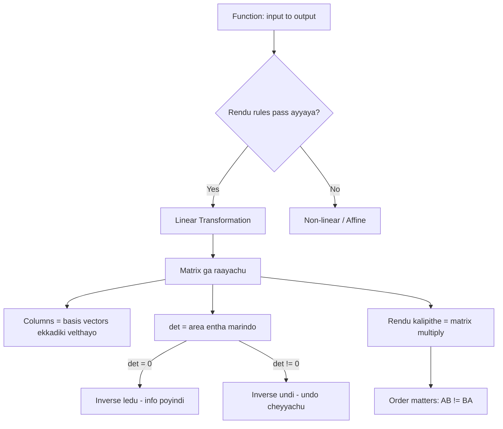

# Functions and Linear Transformations - Simple Telugu English Notes

Function ante input teesukoni output ichhe machine.
Linear Transformation ante **special type function** — input vector, output vector, and konni rules follow avutundi.

Ee rendu ardham chesukunte, **matrix ante enti** ani nijam ga telustundi.
Matrix ante just numbers table kaadu — adi oka **action** (space ni move cheyyadam).

> Ee file lo unna code antha real ga run chesi verify chesam (NumPy 2.4.6). Outputs kuda actual outputs.

## Enduku Ee Topic Important?

1. Matrix multiplication enduku ala untundo ardham avutundi
2. Neural network layer lo `Wx + b` ante emi jarugutundo telustundi
3. PCA, rotation, scaling — anni transformations ne
4. Determinant, inverse — vaati **meaning** telustundi (formula kaadu)

Kid analogy:
- Function = juice machine. Fruit vestav (input), juice vastundi (output).
- Linear transformation = rubber sheet meeda grid draw chesi, sheet ni stretch/rotate cheyyadam. Lines lines gane untay, sunna (origin) akkade untundi.

---

## 1) Function Ante Enti?

**Formal definition:**

> A function is a mathematical relationship that **uniquely associates** elements of one set (called the **domain**) with elements of another set (called the **codomain**).

Simple ga: function ante **inputs ni outputs ki map chese rule**.

Main rule: **oka input ki okate output**.
Rendu different inputs ki **same output** ravochu (adi ok).

### Notation - `f: X → Y`

Set $X$ (domain) nunchi set $Y$ (codomain) ki map chese function $f$ ni ila raastaru:

$$f : X \rightarrow Y$$

"$f$ maps $X$ to $Y$" ani chaduvutaru.

$x$ ante $X$ lo oka element aithe, **$f(x)$** ante $Y$ lo daaniki corresponding element.

```text
        X (domain)                      Y (codomain)
      +-------------+                 +-------------+
      |             |      f          |             |
      |   x1  ------|---------------->|-- y1        |
      |   x2  ------|---------------->|-- y2        |
      |   x3  ------|---------------->|-- y3        |
      |             |                 |             |
      +-------------+                 +-------------+

   Prati x nunchi EXACTLY ONE arrow bayataki velthundi.
   (Rendu arrows velthe -> adi function KAADU)
```

### Example - Regular

$$f(x) = 2x + 3$$

Idi prati real number $x$ ni inko real number ki map chestundi.

$$f : \mathbb{R} \rightarrow \mathbb{R}$$

$x = 2$ pettandi:

$$f(2) = 2 \times 2 + 3 = 7$$

```text
      2  ---- f ---->  7

   Mapping:  2 ∈ R   to   7 ∈ R
```

```python
f = lambda x: 2*x + 3
print(f(2))                        # 7
print(f(np.array([1, 2, 3, 5])))   # [ 5  7  9 13]
```

Verify chesam. Rendo line lo — **motham array ki okesari** apply ayindi (vectorization). AI lo eppudu ila ne, oka value kaadu — **lakshala rows okesari**.

### Example - AI

**Trained model ante oka function ye.** Ade asalu point.

MNIST digit recognition model:

$$f : \mathbb{R}^{784} \rightarrow \mathbb{R}^{10}$$

```text
   X (domain)                    f                 Y (codomain)
   784 numbers                 MODEL              10 numbers
   (28x28 image pixels)   -------------->    (0-9 ki scores)

   [0, 0, 255, 130, ...]  ---- model ---->   [0.01, 0.02, ..., 0.91]
                                                              ^
                                                      "9" ki highest
```

- **Domain** $X = \mathbb{R}^{784}$ → 28 × 28 = **784** pixel values
- **Codomain** $Y = \mathbb{R}^{10}$ → 10 digits (0 to 9) ki scores
- **$f$** = trained neural network

```python
28*28        # 784      <- MNIST image
224*224*3    # 150528   <- color image (RGB), aa model input ki
```

Ade rule ikkada kuda: **oka image ki okate prediction**. Same image rendu sarlu pettithe rendu different answers vasthe — adi function kaadu, and model kuda useless.

### AI lo Prati Chota Functions

| Emi | Function ga | Domain → Codomain |
|---|---|---|
| Trained model (regression) | House price predict | $\mathbb{R}^n \rightarrow \mathbb{R}$ |
| Trained model (classification) | Cat/dog | $\mathbb{R}^n \rightarrow \{0, 1\}$ |
| Tokenizer | Text → numbers | text $\rightarrow \mathbb{Z}^n$ |
| Word embedding | Word → vector | vocabulary $\rightarrow \mathbb{R}^{300}$ |
| ReLU activation | Negative teesestundi | $\mathbb{R} \rightarrow [0, \infty)$ |
| Sigmoid activation | Probability ki marustundi | $\mathbb{R} \rightarrow (0, 1)$ |
| Softmax | Scores → probabilities | $\mathbb{R}^n \rightarrow$ (sum = 1) |
| Loss function | Error entha undo | (pred, actual) $\rightarrow \mathbb{R}$ |

```python
import numpy as np

sigmoid = lambda z: 1 / (1 + np.exp(-z))
relu    = lambda z: np.maximum(0, z)
def softmax(z):
    e = np.exp(z - z.max())      # max teeyyadam = overflow raakunda
    return e / e.sum()

sigmoid(np.array([-10, 0, 10]))      # [0.000045  0.5  0.999955]
relu(np.array([-3, -1, 0, 2, 5]))    # [0 0 0 2 5]
softmax(np.array([2.0, 1.0, 0.1]))   # [0.659 0.2424 0.0986]  sum = 1.0
```

Anni verify chesam.

Gamaninchandi:
- **Sigmoid** codomain $(0,1)$ — anduke **probability** ga vaadataru
- **ReLU** codomain $[0,\infty)$ — negative values anni **0** ayyayi
- **Softmax** output **sum eppudu 1.0** — anduke "ee class ki 65% chance" ani cheppagalam

### Domain, Codomain, Range - Teda

- **Domain** = ye inputs allow chestamo
- **Codomain** = outputs ye set nunchi ravochu (**possible** space)
- **Range** = nijam ga vachhe outputs anni (**actual** values)

**Range ⊆ Codomain** eppudu.

Regular example: $f(x) = x^2$

- Domain = anni real numbers
- Codomain = anni real numbers
- Range = **only 0 and positive** (square negative raadu)

AI example: sigmoid

- Domain = $\mathbb{R}$ (edaina number ravochu)
- Codomain = $\mathbb{R}$ ani anukovachu
- Range = **$(0, 1)$ matrame** — eppudu 0 leda 1 exact ga raadu, daggara ki matrame velthundi

Kid analogy:
- Domain = school lo evaru evaru raavochu
- Range = nijam ga class lo evaru unnaro

**AI lo idi enduku matter avutundi:** Model ki $\mathbb{R}^{784}$ input ani cheppam — kaani training lo model **0-255 pixel values** matrame chusindi. Meeru 5000 value pettithe model confuse avutundi. Ade "**out of distribution**" problem. Domain ni respect cheyyakapothe prediction chettha ga vastundi.

---

## 2) Function Types (Quick)

| Type | Ante enti | Example |
|---|---|---|
| One-to-one (injective) | Prati output ki **okate** input | $f(x)=2x$ |
| Onto (surjective) | Anni outputs cover avutay | $f(x)=x^3$ |
| Many-to-one | Rendu inputs → same output | $f(x)=x^2$ (2 and -2 → 4) |
| Bijective | One-to-one **and** onto | $f(x)=2x$ |

Enduku matter avutundi?
**Bijective aithe ne inverse untundi** (undo cheyyagalam).

$f(x) = x^2$ lo output 4 vasthe — input 2 aa, -2 aa? Cheppalem. So undo cheyyalem.

Idi tarvata **inverse matrix** section lo malli vastundi — same idea.

### AI lo Ee Types

**Classification = many-to-one.** Idi chaala important.

```python
# different confidence vectors -> okate final class
[0.9, 0.1]    -> class 0
[0.7, 0.3]    -> class 0
[0.51, 0.49]  -> class 0
```

Verify chesam. **Laksha different cat photos** → anni "cat" ane okate label.

```text
   MANY images  ------ classifier ------>  ONE label

     cat1.jpg  \
     cat2.jpg   >------ f ------> "cat"
     cat3.jpg  /
```

Anduke: **classifier ni undo cheyyalem.** "cat" ane label nunchi original image ni waapasu teeyalem — information poyindi. Ade section 9 lo chuse **det = 0** situation laantide.

**Kaani konni AI functions invertible (bijective):**

| AI operation | Invertible? | Enduku |
|---|---|---|
| Normalization (0-1 scaling) | ✅ Yes | `scaler.inverse_transform()` undi |
| Standardization (z-score) | ✅ Yes | mean, std daagi unchamu kada |
| Classification (argmax) | ❌ No | Many-to-one |
| ReLU | ❌ No | Anni negatives → 0, evi ento cheppalem |
| Pooling (image chinnaga) | ❌ No | Pixels poyayi |
| Rotation matrix | ✅ Yes | Malli tippachu |

**Ee lekka gurthu pettukondi:** sklearn lo `inverse_transform()` unna prati chota — adi **bijective function**. Lekapothe aa method ye undedi kaadu.

---

## 3) Function ni Graph ga Chudadam

```text
  y
  ^
6 |                    *  f(x)=2x+1
  |                *
4 |            *
  |        *
2 |    *
  |*
  +---+---+---+---+---> x
  0   1   2   3   4
```

Straight line vachhindi → **linear function**.

$f(x) = x^2$ aithe:

```text
  y
  ^
9 |*                       *
  |                     
4 |   *              *
  |
1 |      *        *
  |          *  *
  +---+---+---+---+---+--> x
 -3  -2  -1   0   1   2   3
```

Curve vachhindi → **non-linear function**.

---

## 4) Chaala Pedda Confusion: "Linear Function" vs "Linear Transformation"

School lo cheppindi: $y = mx + c$ ante **linear** ani.
Kaani Linear Algebra lo **adi linear transformation kaadu** (c ≠ 0 aithe).

Enduku? Rendu tests fail avutay.

```python
f = lambda x: 2*x + 3

print(f(0))                      # 3     <- linear aithe 0 ravali!
print(f(1+2), f(1)+f(2))         # 9 12  <- samanam kaavu!
```

Verify chesam. Rendu results **veru veru**.

- **Test 1 fail**: $f(0) = 3$, kaani linear transformation lo **origin akkade undali** ($f(0)=0$)
- **Test 2 fail**: $f(1+2) = 9$, kaani $f(1)+f(2) = 12$

$$y = mx + c \quad \text{(c} \neq \text{0)} \rightarrow \textbf{affine transformation}$$
$$y = mx \quad\quad\quad\ \ \rightarrow \textbf{linear transformation}$$

Gurthu pettukondi:
- **Linear** = line **origin nunchi** velthundi
- **Affine** = linear + shift (origin nunchi jarigindi)

Idi chinna point la kanipistundi, kaani **neural network** lo `Wx + b` — aa `b` valla adi affine, purely linear kaadu. Section 12 lo malli chuddam.

---

## 5) Linear Transformation Ante Enti?

Vector teesukoni, vere vector istundi — **rendu rules** follow avutu:

$$\textbf{Rule 1 (Additivity):} \quad T(u + v) = T(u) + T(v)$$

$$\textbf{Rule 2 (Scaling):} \quad T(c \cdot u) = c \cdot T(u)$$

Ee rendu kalipi cheppedi: "**modata add chesi transform chesina, modata transform chesi add chesina — okate answer**."

### Visual ga Ardham Chesukovadam

Grid paper ni rubber sheet la anukondi. Linear transformation tarvata:

1. **Origin akkade untundi** (kadalidu)
2. **Straight lines straight ga ne untay** (curve avvavu)
3. **Parallel lines parallel ga ne untay**, and gaps **evenly spaced** ga untay

```text
   BEFORE (normal grid)          AFTER (linear transform - shear)

   |  |  |  |                      /  /  /  /
---+--+--+--+---              ----+--+--+--+----
   |  |  |  |                    /  /  /  /
---+--+--+--+---              --+--+--+--+------
   |  |  |  |                  /  /  /  /
   origin fixed                origin STILL fixed
```

Non-linear aithe grid **wavy** ga avutundi, leda origin jarugutundi — appudu adi linear transformation kaadu.

### Code tho Verify

```python
import numpy as np
A = np.array([[2, 1],
              [0, 3]])
u = np.array([1, 1])
v = np.array([3, 2])

np.allclose(A @ (u+v), A@u + A@v)    # True   <- Rule 1 pass
np.allclose(A @ (3*v), 3 * (A@v))    # True   <- Rule 2 pass
A @ np.array([0, 0])                  # [0 0]  <- origin fixed
```

Anni pass ayyayi → **matrix multiplication oka linear transformation**.

---

## 6) Matrix = Linear Transformation (Asalu Idea)

Idi ee file lo **most important section**.

Question: matrix multiplication formula ala vintha ga enduku untundi?

Answer: **Matrix columns ante — basis vectors ekkadiki velthayo, ade.**

### Basis Vectors

2D lo rendu basic vectors:

$$\hat{i} = \begin{bmatrix} 1 \\ 0 \end{bmatrix} \quad\quad \hat{j} = \begin{bmatrix} 0 \\ 1 \end{bmatrix}$$

Prati vector ee rendintini kalipi raayachu:

$$\begin{bmatrix} 3 \\ 2 \end{bmatrix} = 3\hat{i} + 2\hat{j}$$

### Ippudu Magic

```python
A = np.array([[2, 1],
              [0, 3]])
i = np.array([1, 0])
j = np.array([0, 1])

A @ i    # [2 0]   <- A modati column!
A @ j    # [1 3]   <- A rendo column!
```

Verify chesam.

```text
        A = [ 2   1 ]
            [ 0   3 ]
              |   |
              |   +---> rendo column  = j-hat ikkadiki velthundi = [1, 3]
              +-------> modati column = i-hat ikkadiki velthundi = [2, 0]
```

**Matrix ante — "i-hat ikkadiki po, j-hat akkadiki po" ane instruction.**

Migatha anni vectors automatic ga follow avutay:

$$A\begin{bmatrix}3\\2\end{bmatrix} = 3\begin{bmatrix}2\\0\end{bmatrix} + 2\begin{bmatrix}1\\3\end{bmatrix} = \begin{bmatrix}6+2\\0+6\end{bmatrix} = \begin{bmatrix}8\\6\end{bmatrix}$$

```python
A @ np.array([3, 2])    # [8 6]   <- verify chesam
```

Kid analogy:
- Room lo furniture antha carpet meeda undi.
- Carpet ni laagithe, furniture antha **daani tho paate** kadulutundi.
- Carpet = basis vectors, furniture = migatha anni vectors.

---

## 7) Common Transformations (Matrices tho)

Anni verify chesam.

### Identity - Emi Marchadu

$$I = \begin{bmatrix} 1 & 0 \\ 0 & 1 \end{bmatrix}$$

i-hat, j-hat akkade untay. Number **1** laantidi.

### Scaling - Peddha/Chinna Cheyyadam

$$S = \begin{bmatrix} 2 & 0 \\ 0 & 2 \end{bmatrix}$$

Anni 2 rettu peddavi avutay.

```text
   BEFORE          AFTER (scale 2x)

   +--+            +-----+
   |  |            |     |
   +--+            |     |
                   +-----+
```

Different scales kuda: $\begin{bmatrix} 3 & 0 \\ 0 & 1 \end{bmatrix}$ → x lo 3 rettu, y lo marpu ledu.

### Rotation - Tippadam

$$R(\theta) = \begin{bmatrix} \cos\theta & -\sin\theta \\ \sin\theta & \cos\theta \end{bmatrix}$$

90° ki:

$$R(90°) = \begin{bmatrix} 0 & -1 \\ 1 & 0 \end{bmatrix}$$

```python
th = np.pi/2
R = np.array([[np.cos(th), -np.sin(th)],
              [np.sin(th),  np.cos(th)]])
R @ np.array([1, 0])     # [0. 1.]   <- i-hat paiki tirigindi
```

```text
   BEFORE            AFTER (90 degrees)

   j                      i
   ^                      ^
   |                      |
   +---> i          j <---+
```

### Shear - Vaalchadam

$$Sh = \begin{bmatrix} 1 & 1 \\ 0 & 1 \end{bmatrix}$$

```python
Sh @ np.array([0, 1])    # [1 1]   <- j-hat pakkaki vaalindi
```

```text
   BEFORE          AFTER (shear)

   +--+              +--+
   |  |             /  /
   +--+            +--+
```

i-hat akkade undi, j-hat matrame vaalindi. Square → parallelogram.

### Reflection - Adda Tippadam

$$F = \begin{bmatrix} 1 & 0 \\ 0 & -1 \end{bmatrix}$$

```python
F @ np.array([0, 1])     # [ 0 -1]   <- j-hat kindaki tirigindi
```

X-axis meeda **addam** (mirror) pettinattu.

### Projection - Nokkadam

$$P = \begin{bmatrix} 1 & 0 \\ 0 & 0 \end{bmatrix}$$

```python
P @ np.array([3, 4])     # [3 0]   <- y poyindi, x matrame migilindi
```

Anni points **x-axis meediki** nokkabaddayi. Idi **information loss** — undo cheyyalem (section 10 lo chuddam).

### Summary Table

| Transformation | Matrix | Emi chestundi |
|---|---|---|
| Identity | $\begin{bmatrix} 1&0\\0&1 \end{bmatrix}$ | Emi ledu |
| Scale 2x | $\begin{bmatrix} 2&0\\0&2 \end{bmatrix}$ | Peddadi chestundi |
| Rotate 90° | $\begin{bmatrix} 0&-1\\1&0 \end{bmatrix}$ | Tipputundi |
| Shear | $\begin{bmatrix} 1&1\\0&1 \end{bmatrix}$ | Vaalustundi |
| Reflect | $\begin{bmatrix} 1&0\\0&-1 \end{bmatrix}$ | Addam |
| Project | $\begin{bmatrix} 1&0\\0&0 \end{bmatrix}$ | Nokkutundi (flat) |

---

## 8) Composition = Matrix Multiplication

Rendu transformations vempu vempu chesthe? **Matrices ni multiply cheyyandi.**

$$T_2(T_1(v)) = (T_2 \cdot T_1) \cdot v$$

### ORDER CHAALA IMPORTANT

$$AB \neq BA$$

```python
R @ Sh    # [[ 0. -1.]      <- shear chesi, tarvata rotate
          #  [ 1.  1.]]

Sh @ R    # [[ 1. -1.]      <- rotate chesi, tarvata shear
          #  [ 1.  0.]]
```

Rendu **veru veru**. Verify chesam.

Same point $[1,1]$ meeda:

```python
Sh @ (R @ p)    # [0. 1.]     rotate-then-shear
R @ (Sh @ p)    # [-1. 2.]    shear-then-rotate
```

Completely different answers!

Kid analogy:
- Modata socks, tarvata shoes → correct
- Modata shoes, tarvata socks → tappu
- **Order marchithe result marutundi.**

### Kudi nunchi Yeda ki Chadavali

$$A B C v$$

Ikkada **modata C**, tarvata B, chivarilo A apply avutundi — **kudi nunchi yedaki**.

```text
   v ---> [C] ---> [B] ---> [A] ---> result

   raase order:  A B C v
   jarige order:      C, B, A
```

Idi confusion create chestundi, kaani gurthu pettukondi: **vector kudi vaipuna untundi**, so daaniki daggara unna matrix modata apply avutundi.

---

## 9) Determinant = Area Entha Marindi

Determinant ante just formula kaadu — daaniki **meaning** undi:

> **det(A) = area (leda volume) entha rettu ayindo.**

```python
np.linalg.det(np.eye(2))   # 1.0    <- marpu ledu
np.linalg.det(S)           # 4.0    <- 2x2 = 4 rettu area
np.linalg.det(R)           # 1.0    <- rotate chesina area same
np.linalg.det(Sh)          # 1.0    <- shear kuda area marchadu!
np.linalg.det(F)           # -1.0   <- flip ayindi
np.linalg.det(P)           # 0.0    <- area SUNNA ayindi
np.linalg.det(A)           # 6.0
```

Anni verify chesam.

| det value | Ante enti |
|---|---|
| $det = 1$ | Area same (rotation, shear) |
| $det = 4$ | Area 4 rettu peddadi |
| $det = 0.5$ | Area sagam ayindi |
| $det < 0$ | **Flip** ayindi (addam tirigindi) |
| $det = 0$ | **Flat ayipoyindi** — dimension poyindi |

### det = 0 Enduku Muktyam?

Projection matrix $P$ ki $det = 0$. Enduku ante 2D square ni **line** ga nokkesindi — area sunna.

Information **poyindi**. Malli 2D ki teesukellalem.

$$det(A) = 0 \iff \text{inverse ledu} \iff \text{undo cheyyalem}$$

Idi section 2 lo chusina **many-to-one** function laantide — chaala points okate chota velthe, evaru ekkadi nunchi vachharo cheppalem.

```text
   BEFORE (area = 1)        AFTER projection (area = 0)

   +--+                     
   |  |          ---->      ========  (just a line)
   +--+                     
```

---

## 10) Inverse Transformation - Undo Cheyyadam

$$A^{-1}(A v) = v$$

```python
A_inv = np.linalg.inv(A)
# [[ 0.5    -0.1667]
#  [ 0.      0.3333]]

A_inv @ (A @ v)    # [3. 2.]   <- v malli vachesindi
```

Verify chesam — original vector `[3, 2]` waapasu vachhindi.

Projection ki try chesthe:

```python
np.linalg.inv(P)
# LinAlgError: Singular matrix
```

**"Singular"** ante — inverse ledu, det = 0.

Kid analogy:
- Sugar and water kalipithe → sugar water (transformation)
- Malli separate cheyyagalama? Kastam — **information kalisipoyindi**
- Ade det = 0 situation

---

## 11) Ivi Linear Transformations KAAVU

| Function | Enduku kaadu |
|---|---|
| $f(x) = x^2$ | $f(2+3)=25$ kaani $f(2)+f(3)=13$ |
| $f(x) = x + 5$ | $f(0) = 5 \neq 0$ (affine) |
| $f(x) = \sin(x)$ | Curve, straight lines break avutay |
| $f(x) = \|x\|$ | $f(-2 \cdot 1) = 2$ kaani $-2 \cdot f(1) = -2$ |
| $ReLU(x)$ | $f(-1)=0$, scaling rule fail |

**Test cheyyadaniki 2 quick checks:**

1. $f(0) = 0$ aa? Kaakapothe → linear kaadu
2. $f(2x) = 2f(x)$ aa? Kaakapothe → linear kaadu

---

## 12) ML Connection - Asalu Enduku Nerchukuntunnam

### Neural Network Layer

$$\text{output} = W x + b$$

- $W$ = weight **matrix** → idi **linear transformation**
- $x$ = input vector
- $b$ = bias vector → idi **shift** (affine chestundi)

```text
   input x ---> [ W: rotate/scale/shear ] ---> [ + b: shift ] ---> [ activation ] ---> output
                     LINEAR                      AFFINE            NON-LINEAR
```

### Activation Function Enduku Kavali?

Idi **chaala important interview question**.

Rendu linear transformations kalipithe → malli **oka linear transformation** ye (section 8: $AB$ kuda matrix ne).

So 100 layers pettina, activation lekapothe — antha kalipi **okate matrix** tho replace cheyyochu!

$$W_3(W_2(W_1 x)) = (W_3 W_2 W_1) x = W_{single} \cdot x$$

Deep network ki artham ledu. Anduke **madhya lo non-linear** function (ReLU, sigmoid) pedataru — appudu layers **kalipeyyalem**, prati layer kotha pani chestundi.

### PCA

PCA ante — data ni **rotate** chesi, kotha basis vectors (principal components) vaipuki tippadam. Adi **rotation matrix** ye. Data marchadu, **chuse angle** matrame marustundi.

### Image Processing

- Image rotate = rotation matrix
- Image resize = scaling matrix
- Image flip = reflection matrix

Prati image edit **matrix multiplication** ne.

### Embeddings

Word embeddings lo "king - man + woman ≈ queen" — adi vector space lo **linear structure** valla ne pani chestundi.

---

## 13) Mermaid Flow - Motham Kalipi



---

## 14) Summary

```text
FUNCTION
  f: X -> Y   (X = domain, Y = codomain)
  input -> rule -> output | oka input ki OKATE output
  Domain = allowed inputs | Range = actual outputs (Range subset of Codomain)
  Bijective aithe ne inverse untundi

AI lo FUNCTIONS
  Trained model ANTE oka function ye
  MNIST model : f: R^784 -> R^10
  sigmoid: R -> (0,1)  | relu: R -> [0,inf) | softmax: sum = 1
  Classification = MANY-TO-ONE -> undo cheyyalem
  sklearn lo inverse_transform() unte -> adi bijective
  Domain respect cheyyakapothe -> out of distribution problem

LINEAR TRANSFORMATION (2 rules)
  T(u+v) = T(u) + T(v)
  T(cu)  = c T(u)
  => origin fixed, lines straight, parallel lines parallel

LINEAR vs AFFINE (pedda confusion)
  y = mx      -> LINEAR      (origin nunchi)
  y = mx + c  -> AFFINE      (shift undi, f(0) != 0)

MATRIX = TRANSFORMATION
  Matrix columns = i-hat, j-hat ekkadiki velthayo
  A @ i = modati column | A @ j = rendo column
  Migatha vectors anni automatic ga follow avutay

COMMON MATRICES
  identity [[1,0],[0,1]]    -> emi ledu
  scale    [[2,0],[0,2]]    -> peddadi
  rotate90 [[0,-1],[1,0]]   -> tipputundi
  shear    [[1,1],[0,1]]    -> vaalustundi
  reflect  [[1,0],[0,-1]]   -> addam
  project  [[1,0],[0,0]]    -> nokkutundi (det=0)

COMPOSITION
  T2(T1(v)) = (T2 @ T1) v
  AB != BA  -> ORDER MATTERS (socks-shoes)
  Kudi nunchi yedaki apply avutundi

DETERMINANT = area scaling factor
  det = 1  -> area same (rotate, shear)
  det = 4  -> 4 rettu
  det < 0  -> flip
  det = 0  -> flat, inverse ledu, info poyindi

ML CONNECTION
  Layer = Wx + b  (W linear, b affine chestundi)
  Activation lekapothe 100 layers = 1 layer!
  PCA = rotation to better basis
  Image rotate/resize/flip = matrix multiply
```

Final point:
**Matrix ante numbers table kaadu — adi space ni move chese action.**
Aa action ni ardham chesukunte, migatha linear algebra antha sulabham avutundi.

---

---

# Functions — AI lo Enduku Kaavali? (Why Functions Matter in AI)

## Short Answer

> AI = functions on top of functions on top of functions.
> Oka neural network = oka giant composite function.
> Idi ardham kaakunda AI code raayatam — blindly typing.

---

## Architecture Diagram — Functions in AI

```
Raw Input (image, text, number)
        |
        v
   [Function 1: Embedding / Preprocessing]
        |
        v
   [Function 2: Linear Transformation — Wx + b]
        |
        v
   [Function 3: Activation Function — ReLU/Sigmoid]
        |
        v
   [Function 4: Another layer — Wx + b + activation]
        |
        v  (repeat N times = N layers)
        |
        v
   [Function 5: Output layer — Softmax / Linear]
        |
        v
   Prediction (cat/dog, sentiment, next word...)
        |
        v
   [Function 6: Loss Function — compare prediction vs truth]
        |
        v
   [Function 7: Gradient — loss ni parameters tho differentiate]
        |
        v
   [Function 8: Optimizer — parameters update cheyyadam]
        |
        v
   (Loop back — training continues)
```

---

## 1. Neural Network = Composed Functions

**Math lo:**
```
f(x) = x²       -- oka simple function

g(x) = 2x + 1   -- inkoka function

Composed: g(f(x)) = g(x²) = 2x² + 1
```

**Neural network lo:**
```
Layer 1: f₁(x) = ReLU(W₁x + b₁)
Layer 2: f₂(x) = ReLU(W₂x + b₂)
Layer 3: f₃(x) = Softmax(W₃x + b₃)

Final network: f₃(f₂(f₁(x)))
= oka composed function — input nunchi output ki
```

**Functions file lo chudina notation:**
```
f : X → Y    (domain nunchi codomain ki)

Neural network:
  f : ℝ⁷⁸⁴ → ℝ¹⁰
  (784 pixel input → 10 class probabilities output)
  Input space nunchi output space ki mapping — idi function ne!
```

**Python code:**
```python
import numpy as np

# Layer = oka function: input vector ni output vector ki map chestundi
def layer(x, W, b, activation='relu'):
    z = W @ x + b          # linear transformation: Wx + b
    if activation == 'relu':
        return np.maximum(0, z)    # ReLU activation
    return z

# Network = composed functions
def neural_network(x, weights):
    # Layer 1
    h1 = layer(x,           weights['W1'], weights['b1'], 'relu')
    # Layer 2
    h2 = layer(h1,          weights['W2'], weights['b2'], 'relu')
    # Output layer
    out = layer(h2,         weights['W3'], weights['b3'], 'none')
    return out

# Idi = f₃(f₂(f₁(x))) — functions compose cheyyadam
```

---

## 2. Linear Transformation — Neural Network lo Core

**Functions file lo:** Linear transformation = `T(x) = Ax` (matrix multiply)

**AI lo:** Prathi layer = oka linear transformation + bias

```python
import numpy as np

# Linear transformation — functions file lo chudina concept
# T(x) = Wx + b
# W = weight matrix (linear transformation)
# b = bias (affine transformation — origin shift)

x = np.array([1.0, 2.0, 3.0])      # input: 3D vector

# Weight matrix W — input (3D) ni output (2D) ki transform chestundi
W = np.array([
    [0.5, 0.3, 0.2],    # output neuron 1 ki weights
    [0.1, 0.8, 0.4],    # output neuron 2 ki weights
])
b = np.array([0.1, -0.2])           # bias vector

# Linear transformation: Wx + b
z = W @ x + b
print("Layer output:", z)            # [1.7, 2.1] approximately

# Idi exactly functions file lo unna concept:
# T: ℝ³ → ℝ²   (3D input, 2D output)
# Linearity preserve: T(ax + by) = aT(x) + bT(y)
```

**Enduku important:**
```
100 layers lo oka kuda activation function lēkapothe:
f₁₀₀(f₉₉(...f₁(x)...))
= W₁₀₀ * W₉₉ * ... * W₁ * x   (matrix multiply chestam)
= W_combined * x               (oka single linear transformation)

100 layers = 1 layer — NO depth, NO power!

Activation function add chestunte:
  Non-linear transformation add avutundi
  Network complex patterns learn cheyyagaladu
  "Universal function approximator" avutundi
```

---

## 3. Activation Functions — Non-linear Transformations

**Why non-linearity kaavali:**
```
Functions file lo: Linear transformation straight lines, planes preserve chestundi
AI lo: Real-world data non-linear patterns have
       (image lo cat vs dog boundary curved line, straight line kadu)
       Activation functions non-linearity inject chestundi
```

**Common activation functions:**

```python
import numpy as np
import matplotlib.pyplot as plt

x = np.linspace(-5, 5, 100)

# ReLU: f(x) = max(0, x)
# Function file notation: f: ℝ → ℝ≥0
relu = np.maximum(0, x)
# Property: x > 0 aithe identity, x <= 0 aithe 0
# Use: Hidden layers lo most common

# Sigmoid: f(x) = 1 / (1 + e^(-x))
# Function file notation: f: ℝ → (0, 1)
sigmoid = 1 / (1 + np.exp(-x))
# Property: output always 0 to 1 — probability ga interpret cheyyochu
# Use: Binary classification output layer

# Tanh: f(x) = (e^x - e^(-x)) / (e^x + e^(-x))
# Function file notation: f: ℝ → (-1, 1)
tanh = np.tanh(x)
# Property: output -1 to 1 — zero-centered
# Use: RNNs, LSTMs

# Softmax: multi-class probability distribution
# Function notation: f: ℝⁿ → probability simplex
def softmax(z):
    e_z = np.exp(z - np.max(z))    # numerical stability
    return e_z / e_z.sum()

logits = np.array([2.0, 1.0, 0.5])
probs = softmax(logits)
print("Softmax output:", probs)     # sum = 1.0, each in [0,1]
print("Sum:", probs.sum())          # exactly 1.0
# Use: Multi-class classification final layer
```

---

## 4. Loss Function — Prediction Error Measure Cheyyadam

**Function ante enti?** — Input teesukoni output ichhe rule.

**Loss function:**
```
Input:  (prediction, true_label)
Output: oka number — error measure (takkuva better)

f: (ŷ, y) → ℝ≥0

Domain:   prediction, true label pairs
Codomain: non-negative real numbers
```

```python
import numpy as np

# Mean Squared Error (MSE) — Regression problems ki
# L(ŷ, y) = (1/n) * Σ(ŷᵢ - yᵢ)²
def mse_loss(y_pred, y_true):
    return np.mean((y_pred - y_true) ** 2)

y_pred = np.array([2.5, 3.0, 4.0])
y_true = np.array([3.0, 3.0, 4.5])
print("MSE Loss:", mse_loss(y_pred, y_true))    # 0.1667

# Binary Cross-Entropy — Binary classification ki
# L(ŷ, y) = -[y*log(ŷ) + (1-y)*log(1-ŷ)]
def binary_cross_entropy(y_pred, y_true):
    eps = 1e-8    # log(0) avoid cheyyadaniki
    return -np.mean(
        y_true * np.log(y_pred + eps) +
        (1 - y_true) * np.log(1 - y_pred + eps)
    )

y_pred = np.array([0.9, 0.1, 0.8])     # probabilities
y_true = np.array([1.0, 0.0, 1.0])     # true labels
print("BCE Loss:", binary_cross_entropy(y_pred, y_true))

# Categorical Cross-Entropy — Multi-class ki
def categorical_cross_entropy(y_pred, y_true):
    eps = 1e-8
    return -np.sum(y_true * np.log(y_pred + eps))

y_pred = np.array([0.7, 0.2, 0.1])     # 3 class probabilities
y_true = np.array([1.0, 0.0, 0.0])     # true class (one-hot)
print("CCE Loss:", categorical_cross_entropy(y_pred, y_true))
```

---

## 5. Gradient — Function Derivative AI lo

**Functions file lo:** Function `f(x)` derivative = `f'(x)` = slope at that point

**AI lo:** Gradient = loss function ni parameters tho partial derivatives
= "emi direction lo parameters move chesthe loss tagutuundi?"

```python
import numpy as np

# Simple example: f(w) = w² + 3w + 2
# Derivative: f'(w) = 2w + 3

def f(w):
    return w**2 + 3*w + 2

def f_derivative(w):
    return 2*w + 3

# Gradient descent: loss minimum ki move cheyyadam
w = 10.0           # starting point
lr = 0.1           # learning rate (step size)

print(f"Starting w={w:.4f}, f(w)={f(w):.4f}")
for i in range(20):
    grad = f_derivative(w)          # gradient calculate
    w = w - lr * grad               # gradient ki opposite direction lo move
    if i % 5 == 0:
        print(f"Step {i+1}: w={w:.4f}, f(w)={f(w):.4f}, grad={grad:.4f}")

print(f"\nMinimum at w={w:.4f}")    # w = -1.5 (analytical minimum)

# AI lo same concept:
# Loss function: L(W, b) — W and b parameters
# Gradient: ∂L/∂W, ∂L/∂b  — partial derivatives
# Update: W = W - lr * ∂L/∂W
#         b = b - lr * ∂L/∂b
# Training = idi laksha sarlu repeat cheyyadam
```

**Chain rule — Backpropagation:**
```python
# Functions file lo: composed functions ki derivative
# (g∘f)'(x) = g'(f(x)) * f'(x)   -- chain rule

# Neural network = composed functions
# f₃(f₂(f₁(x))) derivative = chain rule apply cheyyadam

# Idi ane concept: BACKPROPAGATION
# Output nunchi input ki, layer by layer derivative calculate cheyyadam
# PyTorch/TensorFlow idi automatic ga chestundi (autograd)

import torch

x = torch.tensor([1.0, 2.0, 3.0], requires_grad=True)
W = torch.tensor([[0.5, 0.3, 0.2],
                  [0.1, 0.8, 0.4]], requires_grad=True)

z = W @ x           # linear transformation
loss = z.sum()      # simple loss

loss.backward()     # backprop — chain rule automatic ga apply avutundi

print("x.grad:", x.grad)    # ∂loss/∂x
print("W.grad:", W.grad)    # ∂loss/∂W
```

---

## 6. Injective, Surjective, Bijective — AI lo Meaning

**Functions file lo notation:** idi inject/surjective properties.

**AI lo real connection:**

```
Injective (one-to-one):
  Different inputs → different outputs
  Embedding functions injectivity maintain cheyyadam important
  Oka word embedding: different words → different vectors (injective kaavali)
  "Cat" and "Dog" same vector ki map avvadam = information loss!

  Example:
  Word embeddings (Word2Vec, BERT) — injective property maintain
  "king" ≠ "queen" in embedding space
```

```python
import numpy as np

# Embedding = injective function
# Word → Vector ki map chestundi
simple_embeddings = {
    "cat":   np.array([0.9, 0.1, 0.2]),
    "dog":   np.array([0.8, 0.2, 0.1]),
    "fish":  np.array([0.1, 0.9, 0.3]),
    "bird":  np.array([0.2, 0.8, 0.1]),
}

# Injectivity check: different words → different vectors
words = list(simple_embeddings.keys())
for i in range(len(words)):
    for j in range(i+1, len(words)):
        w1, w2 = words[i], words[j]
        v1 = simple_embeddings[w1]
        v2 = simple_embeddings[w2]
        distance = np.linalg.norm(v1 - v2)
        print(f"'{w1}' vs '{w2}': distance = {distance:.4f}")
        # Idi 0 aithe — same vector — injectivity fail — information loss

# Surjective (onto):
# Autoencoder lo decoder cheyye reconstruction:
# Compressed representation → Original space — surjective kaavali
# Every possible output reachable aithe decoder complete ga information restore

# Bijective (one-to-one AND onto):
# Normalizing flows — probability distributions transform chestundi
# Input distribution ↔ Output distribution bijective mapping
# Invertible Neural Networks (INNs) — bijective functions only use chestay
```

---

## 7. Function Composition — Deep Learning lo

**Functions file lo:** `g ∘ f` = `g(f(x))`

**AI lo:** Every deep learning model = composed functions

```python
import numpy as np

def relu(x):
    return np.maximum(0, x)

def sigmoid(x):
    return 1 / (1 + np.exp(-x))

def linear(x, W, b):
    return W @ x + b

# Oka forward pass = function composition
def forward(x, params):
    # Layer 1: linear → relu (function composition)
    h1 = relu(linear(x, params['W1'], params['b1']))

    # Layer 2: linear → relu
    h2 = relu(linear(h1, params['W2'], params['b2']))

    # Output: linear → sigmoid
    out = sigmoid(linear(h2, params['W3'], params['b3']))

    return out
    # = sigmoid(linear(relu(linear(relu(linear(x))))))
    # = f₅ ∘ f₄ ∘ f₃ ∘ f₂ ∘ f₁

# Idi literally functions file lo unna composition concept:
# (f₅ ∘ f₄ ∘ f₃ ∘ f₂ ∘ f₁)(x)

np.random.seed(42)
params = {
    'W1': np.random.randn(4, 3) * 0.1,
    'b1': np.zeros(4),
    'W2': np.random.randn(4, 4) * 0.1,
    'b2': np.zeros(4),
    'W3': np.random.randn(1, 4) * 0.1,
    'b3': np.zeros(1),
}

x = np.array([1.0, 2.0, 3.0])
prediction = forward(x, params)
print("Prediction:", prediction)
```

---

## 8. Real AI Models — Functions Connection

### LLM (Large Language Model) lo

```
Input:  "What is the capital of India?"
        ↓ (tokenize)
Tokens: [1234, 567, 89, 12, 456, 78]    -- integers

Token Embedding Function:
  f: integer → ℝ⁷⁶⁸ (768-dim vector per token)
  Idi function: token ID → dense vector
        ↓
Transformer layers (each = function composition)
  Attention: f_attn: ℝⁿˣ⁷⁶⁸ → ℝⁿˣ⁷⁶⁸
  FFN:       f_ffn:  ℝ⁷⁶⁸ → ℝ⁷⁶⁸
        ↓
Output projection:
  f_out: ℝ⁷⁶⁸ → ℝ⁵⁰²⁵⁶  (vocabulary size)
        ↓
Softmax:
  f_sm: ℝ⁵⁰²⁵⁶ → probability distribution
        ↓
Output: probability over next token → sample → "Delhi"
```

### Image Classifier (CNN) lo

```
Input: 224×224×3 image (150,528 numbers)
        ↓
Convolution layers:
  f_conv: image → feature maps
  (pattern detection functions)
        ↓
Pooling:
  f_pool: feature map → smaller feature map
  (dimensionality reduction function)
        ↓
Flatten + Dense:
  f_dense: vector → vector (linear transformation)
        ↓
Softmax:
  f_sm: logits → probabilities
        ↓
Output: [cat: 0.92, dog: 0.05, bird: 0.03]
```

---

## 9. Functions Summary Table — Math ↔ AI Connection

| Math Concept (Functions file) | AI Application | Example |
|---|---|---|
| `f: X → Y` (domain → codomain) | Model: input space → output space | Image → Label probabilities |
| `f(x) = y` (evaluation) | Forward pass | `model(image)` = prediction |
| Function composition `g∘f` | Deep learning layers | `layer3(layer2(layer1(x)))` |
| Linear transformation `T(x) = Ax` | Neural layer weights | `Wx + b` |
| Injective (one-to-one) | Embeddings preserve information | Word → unique vector |
| Bijective (invertible) | Normalizing flows, INNs | Invertible transformations |
| Derivative `f'(x)` | Gradient for backprop | `∂L/∂W` |
| Chain rule `(g∘f)' = g'∘f * f'` | Backpropagation algorithm | Multi-layer gradients |
| Domain restriction | Data preprocessing range | Normalize [0,1] |
| Range/Image of function | Model output space | Probability in [0,1] |

---

## 10. Oka Line Summary

```
Functions ante enti?     → Input teesukoni output ichhe rule
AI lo functions enduku?  → Neural network = chained functions
                           Training = function parameters optimize cheyyadam
                           Prediction = function evaluate cheyyadam

Idi telustunte:
  Wx + b  ante enti?          — linear transformation function
  ReLU ante enti?             — activation function (non-linear)
  Loss ante enti?             — error measure function
  Gradient descent ante enti? — function minimize cheyyadam
  Backprop ante enti?         — composed function derivative (chain rule)
  Embedding ante enti?        — injective mapping function
  Softmax ante enti?          — normalization function (sums to 1)

AI = Functions, all the way down.
```
