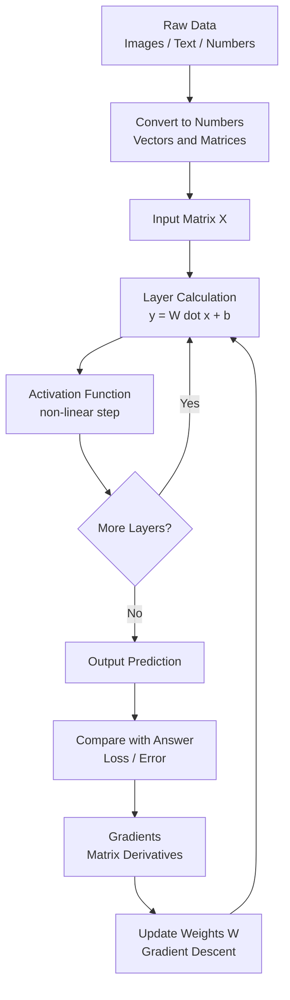

# Linear Algebra for AI (Simple Telugu-English Mix)

## Linear Algebra ante enti?

**Definition (formal):** Linear Algebra ante mathematics lo oka branch, idi **vectors, matrices, and linear equations** meeda study chestundi. Linear equations ante `a1*x1 + a2*x2 + ... = b` laanti equations (variables ki power 1 matrame untundi, curves undavu).

**Simple definition:** Numbers ni **groups (vectors, matrices) laaga arrange chesi**, vaati meeda add, multiply, transform laanti calculations cheyyadame linear algebra.


- Oka single number = **Scalar**.
  Example: `age = 25` (oka single number).
- Numbers oka line laaga = **Vector**.
  Example: oka student marks `[85, 90, 78]` (Maths, Physics, Chemistry).
- Numbers oka table laaga (rows and columns) = **Matrix**.
  Example: 3 students marks:
  ```
  [[85, 90, 78],
   [70, 65, 80],
   [95, 88, 91]]
  ```
- Multiple matrices stacked = **Tensor**.
  Example: oka color photo = 3 matrices (Red, Green, Blue), prathi one 100x100 size, kalipi shape (3, 100, 100).

Simple ga: Excel sheet lo rows and columns tho numbers arrange chesinattu. Aa numbers meeda add, multiply laanti operations cheyyadame linear algebra.

---

## Numbers ni enduku vectors/matrices ga marchali? (Why transform?)

Manaki oka doubt ravachu: "already numbers unnaayi kada, malli enduku vector/matrix ga marchali?" Karanam idi:

### 1) Oka item ki multiple values untayi (single number saripodu)
- Oka house ni describe cheyyali ante oka number saripodu.
  Area, bedrooms, price, age anni kavali -> `[1200, 3, 5000000, 10]`.
- **Real example:** oka person ni describe cheyyadaniki height, weight, age kavali. Anduke `[170, 65, 25]` vector.
- Single number tho full information cheppalem, so **vector** kavali.

### 2) Chala items oka sari lo handle cheyyadaniki
- Oka house kadu, 1000 houses unte, prathi house oka row -> full **matrix**.
- **Real example:** class lo 60 students, prathi student ki 5 subjects marks -> (60, 5) matrix. Anni oka table lo.
- Idi lekapothe prathi item ni separate ga handle cheyyali -> chala slow.

### 3) Computer ki text/image ardham kaadu, numbers matrame ardham
- Model ki "France", "cat photo", "hello" direct ga ardham kaadu.
- Vaatini numbers (vectors/matrices) ga marchi ivvali.
- **Real example:** word "king" -> `[0.2, 0.9, -0.1]` embedding. Photo -> pixel numbers matrix.

### 4) Fast calculations (parallel math)
- Numbers ni matrix laaga pedithe, computer (especially GPU) **anni oka sari lo** (parallel) calculate chestundi.
- **Real example:** 1000 students total marks calculate cheyyali. Loop tho okko okkati cheyyadam slow. Matrix operation tho anni oka step lo -> chala fast.
- AI lo millions of calculations untayi, so ee speed chala important.

### 5) Math operations clean and standard avuthai
- Vector/matrix form lo unte add, multiply, transform anni ready-made rules tho easy.
- **Real example:** oka image ni brighten cheyyali ante, matrix ki oka number add chesthe chalu (`image + 50`). Anni pixels oka sari update.

### Chinna summary
- Single value -> **scalar**.
- Oka item multiple values -> **vector**.
- Chala items -> **matrix**.
- Data type complex (image/video) -> **tensor**.
- Karanam: **full information store cheyyadaniki + fast, clean math cheyyadaniki.**

---

## AI lo Linear Algebra enduku kavali? (Detail)

AI/ML lo **anni data numbers ga convert avuthundi**, and aa numbers matrices/vectors laaga store avuthayi. Model nerchukovadam ante just **matrix calculations** chesi correct answer ki raavadam. Anduke linear algebra AI ki foundation.

### 1) Data ni represent cheyyadaniki
- Prati row = oka example (oka student, oka image, oka customer).
- Prati column = oka feature (age, salary, pixel value).
- Ee full table oka **matrix** (`X`).
- Example: 100 students, 5 features -> `X` shape = (100, 5) matrix.

### 2) Images ni numbers ga marchadaniki
- Oka gray image = pixel values matrix.
- Oka color image = 3 matrices (Red, Green, Blue) = **tensor**.
- Model ki image ardham kaadu, kani ee number matrix ardham avuthundi.

### 3) Text ni numbers ga marchadaniki (NLP)
- Words ni **embeddings** (vectors) ga marustam.
- Example: "king" -> [0.2, 0.9, -0.1, ...] laanti vector.
- Similar words vectors daggara daggara untayi. Idi anta vector math.

### 4) Model calculations (main reason)
- Neural network lo prati layer basic ga: **y = W·x + b**.
  - `x` = input vector.
  - `W` = weights matrix.
  - `b` = bias vector.
  - `·` = **matrix multiplication** (linear algebra core operation).
- Ee W·x millions of times jaruguthundi. Anduke fast matrix math kavali.

### 5) Optimization (model nerchukovadam)
- Model error ni thaggincadaniki **gradients** calculate chestundi.
- Gradients kuda vectors/matrices meeda derivatives.
- Gradient Descent = matrix operations tho weights ni update cheyyadam.
- Example: weight `W = 0.8`, gradient `= 0.2`, learning rate `= 0.1`.
  New `W = 0.8 - (0.1 * 0.2) = 0.78`. Ee small update millions of weights ki matrix laaga jaruguthundi.

### 6) Dimensionality Reduction
- Ekkuva features unte model slow and confusing.
- **PCA** laanti techniques (eigenvalues, eigenvectors) tho important features matrame teesukuntam antaru, idi pure linear algebra.

### Chinna summary
- Data = matrix.
- Model = matrix multiplications.
- Learning = matrix meeda gradient updates.
- **Linear algebra lekunda AI ledu.**

---

## Key Concepts (Quick List)

| Concept | Ante enti | AI lo enduku |
|---|---|---|
| Scalar | Single number | Single value (learning rate) |
| Vector | List of numbers | Oka data point / word embedding |
| Matrix | Rows x Columns table | Full dataset / weights |
| Tensor | 3D+ numbers | Images, videos, batches |
| Dot Product | Vectors ni multiply chesi add | Similarity, layer output |
| Matrix Multiplication | Rows x Columns combine | Neural network layers |
| Transpose | Rows and columns swap | Shape adjust cheyyadaniki |
| Eigenvalue / Eigenvector | Matrix special directions | PCA, dimensionality reduction |

---

## Matrix (Detail)

### Matrix ante enti? (Definition)
- **Matrix** ante numbers ni **rows (horizontal lines)** and **columns (vertical lines)** lo, oka rectangle table laaga arrange chesina structure.
- Prathi number ni **element** antaru.
- Example:
  ```
  A = [[2, 4, 6],
       [1, 3, 5]]
  ```
  Ikkada 2 rows and 3 columns unnayi.

### Matrix Entry (Element) ante enti?
- **Entry** (or **element**) ante matrix lo unna **oka single number**. Matrix ante ee entries anni kalisi.
- Example:
  ```
  A = [[2, 4, 6],
       [1, 3, 5]]
  ```
  Ikkada `2, 4, 6, 1, 3, 5` prathi okkati oka **entry**. Total 6 entries.
- Prathi entry ki oka **address (position)** untundi: `A[i][j]` (i = row, j = column).
  - `2` -> `A[0][0]` (1st row, 1st column).
  - `5` -> `A[1][2]` (2nd row, 3rd column).

### Entries enduku kavali? (Why we need them)
- **Actual information entries lo untundi:** matrix ante just box, kani real data (marks, prices, pixels) anni entries lo store avuthundi.
  - Example: student marks matrix lo `A[0][1] = 90` ante "1st student ki 2nd subject lo 90 marks".
- **Oka specific value ni pick cheyyadaniki:** manaki oka particular data kavali ante, aa entry position use chesi teesukuntam.
  - Example: `A[2][0]` -> 3rd customer age.
- **Calculations anni entries meeda jarugutai:** addition, multiply, scaling anni entry-by-entry (or entry combinations) tho jarugutai.
  - Example: `image + 50` ante prathi pixel **entry** ki 50 add.
- **AI lo:** neural network lo prathi weight oka entry. Training ante ee entries ni slowly correct values ki update cheyyadam.
- **Real-time example:** Excel sheet lo prathi **cell** value = oka entry. Meeru oka cell (B3) lo number chudadam ante, aa matrix entry ni address tho access cheyyadam.

### Matrix Dimension ante enti?
- Matrix dimension = **rows count x columns count** (ela raasukuntam: `rows x columns`).
- Rule: **rows mundu, columns tarvata** (R x C).
- Paina `A` matrix lo 2 rows, 3 columns -> dimension = **2 x 3** ("2 by 3" ani chaduvutam).
- Inko example:
  ```
  B = [[7],
       [8],
       [9]]
  ```
  3 rows, 1 column -> dimension = **3 x 1**.
- **Gurthu pettuko:** dimension order chala important. `2 x 3` and `3 x 2` rendu veru veru matrices.

### Element position ela cheptam?
- Oka element ni `A[i][j]` laaga cheptam. `i` = row number, `j` = column number.
- Programming lo counting **0 nunchi** start (Python/numpy).
  ```
  A = [[2, 4, 6],
       [1, 3, 5]]
  ```
  - `A[0][0] = 2` (1st row, 1st column).
  - `A[0][2] = 6` (1st row, 3rd column).
  - `A[1][1] = 3` (2nd row, 2nd column).

### Matrix Types (Common ones)
- **Singleton Matrix:** oka single element matrame (1 row, 1 column). Example: `[[5]]` -> dimension 1 x 1.
- **Row Matrix:** oka row matrame. Example: `[[1, 2, 3]]` -> dimension 1 x 3.
- **Column Matrix:** oka column matrame. Example: `[[1],[2],[3]]` -> dimension 3 x 1.
- **Square Matrix:** number of rows and number of columns **same** unte, adi square matrix. Example: 2 x 2, 3 x 3.
  ```
  [[1, 2],
   [3, 4]]
  ```
  Ikkada 2 rows and 2 columns (same), anduke idi square matrix.
- **Zero Matrix (Null Matrix):** anni elements 0. Dinne **null matrix** ani kuda antaru. Example: `[[0,0],[0,0]]`.
- **Diagonal Matrix:** diagonal lo matrame values, migatha 0.
  ```
  [[5, 0],
   [0, 8]]
  ```
- **Scalar Matrix:** oka diagonal matrix, kani diagonal lo **anni values same** untayi (migatha anni 0). Example:
  ```
  [[7, 0],
   [0, 7]]
  ```
  Ikkada diagonal anni `7` (same value), anduke idi scalar matrix. Diagonal value `1` aithe adi identity matrix (scalar matrix lo special case).
- **Identity Matrix:** diagonal anni 1, migatha 0 (matrix world lo "number 1").
  ```
  [[1, 0],
   [0, 1]]
  ```
  - Identity matrix ni `I` tho denote chestam, order ni subscript ga rastam.
  - **I2** = 2 x 2 identity matrix:
    ```
    [[1, 0],
     [0, 1]]
    ```
  - **I3** = 3 x 3 identity matrix:
    ```
    [[1, 0, 0],
     [0, 1, 0],
     [0, 0, 1]]
    ```
  - Ante `In` = n x n identity matrix (n rows, n columns, diagonal anni 1).
- **Triangular Matrix:** square matrix lo oka side (diagonal ki paina or kinda) anni 0 unte, adi triangular matrix. Rendu types:
  - **Upper Triangular:** diagonal **kinda** anni 0 (values diagonal and paina matrame).
    ```
    [[3, 5, 2],
     [0, 4, 7],
     [0, 0, 9]]
    ```
  - **Lower Triangular:** diagonal **paina** anni 0 (values diagonal and kinda matrame).
    ```
    [[3, 0, 0],
     [6, 4, 0],
     [1, 8, 9]]
    ```
  - AI/math lo: equations solve cheyyadaniki (Gaussian elimination), determinant fast ga cheyyadaniki triangular form use avuthundi.
- **Equivalent Matrix:** oka matrix ni **elementary operations** tho marchi inko matrix ni pondithe, aa rendu matrices ni **equivalent** antaru (`A ~ B`). Detailed explanation kinda "Equivalent Matrix (Clear Explanation)" section lo undi.
- **Equal Matrices:** rendu matrices **exactly same** aithe (equal), aa condition:
  - Rendu **same order** (same rows and columns) kaligi undali.
  - Prathi **corresponding entry same** value undali (`A[i][j] = B[i][j]` anni positions lo).
  - Symbol: `A = B`.
  - Example (equal):
    ```
    A = [[2, 3],        B = [[2, 3],
         [4, 5]]              [4, 5]]
    ```
    Anni entries same -> `A = B`.
  - Example (NOT equal):
    ```
    A = [[2, 3],        C = [[2, 3],
         [4, 5]]              [4, 9]]
    ```
    `A[1][1] = 5` kani `C[1][1] = 9`, so `A` and `C` equal kaadu.
  - **Equal vs Equivalent teda:** equal ante anni entries same. Equivalent ante entries veru unna, row/column operations tho oka dani nunchi inkodi teesukovachu.

### Equivalent Matrix (Clear Explanation)

Idi konchem confusing untundi, so step by step chuddam.

#### Step 1: Elementary Operations ante enti?
Matrix meeda cheyagalige 3 simple "allowed" changes ni **elementary operations** antaru. Ivi matrix ni marchutai kani important properties (rank) marchavu:
1. **Two rows swap cheyyadam.** Example: `R1 <-> R2` (row 1 and row 2 place marchadam).
2. **Oka row ni oka non-zero number tho multiply cheyyadam.** Example: `R2 -> 3 * R2` (row 2 lo anni values 3 tho multiply).
3. **Oka row ki inko row (multiple) ni add/subtract cheyyadam.** Example: `R2 -> R2 - 2*R1`.

(Ivi columns ki kuda cheyyachu, appudu column operations antaru.)

#### Step 2: Equivalent ante enti? (Simple definition)
- Oka matrix `A` ni teesukoni, paina cheppina elementary operations apply chesi inko matrix `B` ni sadhinchagalige, appudu `A` and `B` **equivalent**.
- Ante: `B` anedi `A` ye, kani konni row/column steps tarvata kotha rupu lo (shape same, information same, just arrangement/simplification marindi).
- Symbol: `A ~ B` ("A is equivalent to B").

#### Step 3: Worked Example (step by step)
Start matrix:
```
A = [[1, 2],
     [2, 5]]
```
Ippudu oka operation cheddam: `R2 -> R2 - 2*R1` (row 2 nunchi 2 times row 1 ni subtract).
- New Row 2 = old Row2 - 2 * Row1
- = `[2, 5] - 2*[1, 2]`
- = `[2 - 2*1, 5 - 2*2]`
- = `[2 - 2, 5 - 4]`
- = `[0, 1]`

So result:
```
B = [[1, 2],
     [0, 1]]
```
Ikkada `A ~ B`, endukante `B` ni manam `A` nunchi **oka valid row operation** tho teesukunnam. Rendu equivalent.

#### Step 4: Enduku ee concept kavali?
- Pedda matrix (equations) ni solve cheyyadaniki, daanini **simple form** (zeros ekkuva unna form) loki marustam.
- Original matrix and simplified matrix **equivalent** kabatti, simplified form nunchi vachina answer original ki kuda correct.
- Real ga: mana problem same, kani easy version lo solve chesi answer teesukunnattu.

#### Step 5: Chinna analogy
- Oka math problem ni `2x = 10` ga rayochu, `x = 5` ga kuda rayochu. Rendu **same meaning** (equivalent), just second form solve cheyyadaniki easy.
- Alage equivalent matrices: rupu veru, kani lopala same information.

#### Equal vs Equivalent (malli gurthu)
- **Equal:** anni entries exactly same (`A = B`).
- **Equivalent:** entries veru undochu, kani row/column operations tho oka dani nunchi inkodi ravachu (`A ~ B`).

### Principal Diagonal ante enti?
- **Principal diagonal** (main diagonal) ante top-left corner nunchi bottom-right corner varaku vache elements.
- Ivi `A[i][j]` lo **i and j same** unna elements (`A[0][0]`, `A[1][1]`, `A[2][2]`, ...).
- Example:
  ```
  A = [[5, 2, 1],
       [3, 8, 4],
       [7, 6, 9]]
  ```
  Principal diagonal = `5, 8, 9` (positions [0][0], [1][1], [2][2]).
- **Gurthu:** diagonal matrix and identity matrix lo values anni ee principal diagonal meeda matrame untayi.
- AI/math lo: **trace** (diagonal elements sum) laanti calculations, and diagonal-based operations ki idi base.

### Matrices tho common operations
- **Addition/Subtraction:** same dimension unte matrame, same position elements add/subtract.
  `[[1,2]] + [[3,4]] = [[4,6]]`.
- **Scalar Multiply:** prathi element ni oka number tho multiply.
  `2 * [[1,2],[3,4]] = [[2,4],[6,8]]`.
- **Matrix Multiply:** first matrix columns = second matrix rows aithe matrame possible (below worked examples lo detail undi).
- **Transpose:** rows and columns swap. `2 x 3` matrix transpose -> `3 x 2`.

### Transpose Matrix (Detail)
- **Transpose** ante oka matrix lo **rows ni columns loki, columns ni rows loki** marchadam.
- Symbol: `A.T` or `A'` (A transpose).
- Rule: original `A[i][j]` value, transpose lo `A.T[j][i]` position ki veltundi (row and column numbers swap).
- Example:
  ```
  A = [[1, 2, 3],        A.T = [[1, 4],
       [4, 5, 6]]               [2, 5],
                                [3, 6]]
  ```
  Shape (2, 3) -> transpose (3, 2).
- **Simple ga:** matrix ni oka table anukunte, transpose ante daanini 90 degrees tippi rows and columns swap chesinattu.
- AI lo: shapes match cheyyadaniki (matrix multiply valid avvadaniki) transpose chala vadatam.

#### Transpose enduku kavali? (Why we need it)
- **Shapes match cheyyadaniki:** matrix multiply cheyyali ante first matrix columns = second matrix rows kavali. Shapes match kakapothe, transpose chesi correct shape ki teesukuntam.
  - Example: `X` shape (100, 5), inko `X` tho multiply cheyyali ante `X.T` (5, 100) vadali -> `X.T * X` valid avuthundi.
- **Row data ni column data ga marchadaniki:** oka row vector ni column vector ga (or reverse) kavalante transpose vadatam.
- **Formulas lo common:** ML lo chala formulas transpose tho untai. Example: linear regression normal equation `w = (X.T * X)^-1 * X.T * y` lo `X.T` chala sarlu vasthundi.
- **Dot product / similarity ki:** rendu vectors dot product cheyyali ante oka daanini transpose chesi (`a.T * b`) multiply chestam.
- **Data reshape ki:** oka dataset lo rows and columns role marchali ante (features <-> samples) transpose handy.
- **Real-time example:** Excel lo oka report lo names row lo unnayi, kani meeku names column lo kavali. "Paste Special -> Transpose" cheste rows and columns swap avuthai. Ade matrix transpose.

### Symmetric Matrix
- **Symmetric matrix** ante oka **square matrix**, deeni transpose ade matrix ki equal: `A.T = A`.
- Ante: principal diagonal ki **mirror image** laaga rendu sides same untayi (`A[i][j] = A[j][i]`).
- Example:
  ```
  A = [[1, 7, 3],
       [7, 4, 5],
       [3, 5, 9]]
  ```
  - Check: position [0][1] = 7 and position [1][0] = 7 (same).
  - position [0][2] = 3 and [2][0] = 3 (same).
  - Diagonal ki paina, kinda values mirror laaga same -> **symmetric**.
- **Simple ga:** diagonal ni oka mirror anukunte, paina unna values kinda values ki reflection laaga untayi.
- AI/math lo: covariance matrix, distance matrix laantivi symmetric untayi.

### Skew-Symmetric Matrix
- **Skew-symmetric matrix** ante oka **square matrix**, deeni transpose = **negative of original**: `A.T = -A`.
- Rule: `A[i][j] = -A[j][i]` (mirror values opposite signs), and **diagonal anni 0** (endukante `A[i][i] = -A[i][i]` ante value 0 ye).
- Example:
  ```
  A = [[ 0,  2, -3],
       [-2,  0,  5],
       [ 3, -5,  0]]
  ```
  - Diagonal anni `0`.
  - position [0][1] = 2 and [1][0] = -2 (opposite signs).
  - position [0][2] = -3 and [2][0] = 3 (opposite signs).
  - So `A.T = -A` -> **skew-symmetric**.
- **Simple ga:** symmetric laantidi, kani mirror side lo values **sign flip** (plus -> minus) avuthayi, and diagonal anni sunna.
- **Symmetric vs Skew-Symmetric (gurthu):**
  - Symmetric: `A[i][j] = A[j][i]` (same value).
  - Skew-symmetric: `A[i][j] = -A[j][i]` (opposite value), diagonal = 0.

### AI lo matrices enduku important?
- Full dataset oka **matrix** (`X`): rows = examples, columns = features.
- Neural network **weights** oka matrix (`W`).
- Prathi layer calculation `W * x` oka **matrix multiplication**.
- Anduke matrix concept clear ga unte AI/ML chala easy avuthundi.

### Real-time example
- Cricket scorecard oka matrix laantidi. Rows = players, columns = (runs, balls, fours, sixes).
  ```
  Player   Runs Balls 4s 6s
  Kohli -> [ 82,  53,  6, 3]
  Rohit -> [ 45,  38,  4, 1]
  ```
- Idi 2 rows x 4 columns = **2 x 4** matrix. Real ga manam roju chuse tables anni matrices laantivi.

---

## Key Concepts with Worked Examples

Prati concept ki oka chinna real example tho chuddam.

### 1) Scalar (single number)
- Example: `learning_rate = 0.01`.
- AI lo: training speed control cheyyadaniki oka single number.
- **Real-time example:** meeru shop lo konna oka item price = `Rs 50`. Adi oka single number, ade scalar.
- **Explain:** scalar ki direction/list undadu, just oka value. Temperature `30 degrees`, meeru speed `60 kmph` anni scalars.

### 2) Vector (list of numbers)
- Example: oka house data `[1200, 3, 2]` = (area sqft, bedrooms, bathrooms).
- AI lo: oka data point / oka word embedding.
- Vector addition example:
  `[2, 3] + [1, 4] = [3, 7]` (same positions add avuthayi).
- **Real-time example:** oka Swiggy/Zomato order `[2, 1, 3]` = (2 biryani, 1 coke, 3 roti). Oka order ni describe cheyyadaniki multiple numbers oka line lo.
- **Explain:** oka single number tho order cheppalem, so list (vector) vadatam. GPS location `[17.3, 78.4]` (latitude, longitude) kuda oka vector.

### 3) Matrix (rows x columns)
- Example: 2 houses data:
  ```
  [[1200, 3, 2],
   [1500, 4, 3]]
  ```
- Shape = (2 rows, 3 columns) = (2, 3).
- AI lo: full dataset `X` or weights `W`.
- **Real-time example:** oka class attendance register. Prathi row = oka student, prathi column = oka day. Cell lo present(1)/absent(0).
  ```
  Student   Mon Tue Wed
  Ravi   -> [ 1,  0,  1]
  Sita   -> [ 1,  1,  1]
  Kiran  -> [ 0,  1,  1]
  ```
- **Explain:** oka table lo rows and columns tho full information store avuthundi. Excel sheet, cricket score card, bank statement anni matrices laantivi.

### 4) Tensor (3D+ numbers)
- Tensor ante matrices ni stack chesi (paina paina petti) build chesina multi-dimensional numbers box.
- **Small concrete example:** oka chinna 2x2 color image tiskundam. Prathi pixel ki 3 values untayi (Red, Green, Blue). So idi shape (3, 2, 2) tensor.
  ```
  Red channel:        Green channel:      Blue channel:
  [[255, 100],        [[0,   50],         [[10,  20],
   [ 40, 200]]         [30, 220]]          [90, 130]]
  ```
  - Red matrix -> prathi pixel entha erra unnado.
  - Green matrix -> entha green.
  - Blue matrix -> entha blue.
  - Ee 3 matrices kalipi = 1 tensor (oka full color image).
- **Shape ela chaduvutam?**
  - Oka number = **scalar** -> shape ().
  - `[85, 90]` = **vector** -> shape (2,).
  - `[[1,2],[3,4]]` = **matrix** -> shape (2, 2).
  - Paina 3 channel image = **tensor** -> shape (3, 2, 2).
- **Batch example (AI lo real usage):** 100 color images, prathi 28x28 pixels, 3 colors -> shape (100, 3, 28, 28).
  - 100 = enni images (batch size).
  - 3 = colors (R, G, B).
  - 28, 28 = height, width.
- AI lo: images, videos (extra time dimension), and training batches anni tensors laaga store avuthai. Anduke library peru kuda "**TensorFlow**" and "PyTorch tensor".
- **Real-time example:** meeru phone lo teesina oka photo. Adi screen meeda color ga kanipisthundi, kani internal ga adi 3 number grids (Red, Green, Blue) = oka tensor. Video ante ee photos chala frames stack ayyi, extra time dimension add avuthundi.
- **Explain:** manaki photo color ga kanipisthundi, kani computer ki adi just numbers box. Prathi pixel ki 3 numbers, anni kalipi tensor.

### 5) Dot Product (multiply then add)
- Formula: `a·b = a1*b1 + a2*b2 + ...`
- Example: `[1, 2, 3] · [4, 5, 6] = (1*4) + (2*5) + (3*6) = 4 + 10 + 18 = 32`.
- AI lo: oka neuron output calculate cheyyadaniki (inputs * weights).
- **Real-time example:** shopping bill. Items quantity `[2, 1, 3]` (biryani, coke, roti), prices `[120, 40, 15]`.
  Total bill = `(2*120) + (1*40) + (3*15) = 240 + 40 + 45 = 325`. Idi exact ga dot product.
- **Explain:** rendu lists ni position-position multiply chesi, anni kalipi oka single total number ki teesukostam. Bill total, weighted marks anni dot product.

### 6) Matrix Multiplication
- Rule: A(rows x k) * B(k x cols) = C(rows x cols). Middle numbers match avvali.
- Example:
  ```
  A = [[1, 2],        B = [[5, 6],
       [3, 4]]             [7, 8]]

  A * B = [[1*5 + 2*7, 1*6 + 2*8],
           [3*5 + 4*7, 3*6 + 4*8]]
        = [[19, 22],
           [43, 50]]
  ```
- AI lo: oka full layer output (`W * x`) ilage calculate avuthundi.
- **Real-time example:** oka shop lo 2 customers, prathi okaru 2 items konnaru. Quantities matrix ni prices tho multiply chesthe, prathi customer total bill matrix laaga vasthundi. Oka sari lo anni customers bills calculate cheyyadam idi.
- **Explain:** matrix multiplication ante just chala dot products oka sari lo cheyyadam. Anduke AI lo oka batch data anta oka multiply lo process avuthundi (fast).

### 7) Transpose (rows and columns swap)
- Example:
  ```
  A = [[1, 2, 3],        A.T = [[1, 4],
       [4, 5, 6]]               [2, 5],
                                [3, 6]]
  ```
- Shape (2, 3) -> (3, 2).
- AI lo: shapes match cheyyadaniki (matrix multiply valid avvadaniki).
- **Real-time example:** Excel lo oka table ni rotate chesinattu. Rows lo unna data ni columns loki, columns lo unna data ni rows loki marchadam. Names row lo unte, transpose chesthe names column loki veltayi.
- **Explain:** data content same, kani arrangement (rows <-> columns) marutundi. Report format marchadaniki idi use avuthundi.

### 8) Identity Matrix (diagonal 1s)
- Example:
  ```
  I = [[1, 0],
       [0, 1]]
  ```
- Rule: `A * I = A` (number `1` laaga behave chestundi).
- AI lo: math proofs, matrix inverse concepts.
- **Real-time example:** number `1` tho multiply chesthe value marani laaga (`50 * 1 = 50`), identity matrix tho multiply chesina matrix marani ga untundi.
- **Explain:** identity matrix matrix world lo "number 1" laantidi. Emi effect ledu, but math rules and inverse calculations ki base.

### 9) Eigenvalue / Eigenvector
- Idea: matrix `A` ni oka special vector `v` meeda apply chesthe, direction marakunda just length matrame marutundi.
- Formula: `A·v = lambda·v` (lambda = eigenvalue).
- Simple example: `A = [[2, 0], [0, 3]]`, vector `v = [1, 0]`.
  `A·v = [2, 0] = 2 * [1, 0]` -> eigenvalue `lambda = 2`.
- AI lo: **PCA** lo important directions (max variance) kanukkovadaniki.
- **Real-time example:** meeru oka rubber sheet ni stretch chesthe, konni directions ekkuva stretch avuthayi, konni takkuva. Ekkuva stretch aye direction = eigenvector, entha stretch = eigenvalue.
- **Explain:** oka pedda data lo "most important direction" (ekkuva information unna direction) ni pattukovadaniki eigenvectors help chestai. Anduke face recognition, recommendation systems lo PCA vadatam.

---

## Architecture / Flow Diagram

Idi AI pipeline lo linear algebra ekkada pani chestundo chupinche flow.



### Flow ni simple ga cheppali ante
1. **Raw data** vasthundi (image, text, numbers).
2. Adi anni **numbers (matrices)** ga convert avuthundi.
3. Prati layer lo **W·x + b** (matrix multiplication) jaruguthundi.
4. Output vasthundi, error calculate chestam.
5. **Gradients** (matrix math) tho weights update chestam.
6. Ee loop malli malli jarigi model nerchukuntundi (improve avuthundi).

---

## Real-Life Analogy (Kid Style)

Oohinchuko: nuvvu oka **juice machine** vi.
- Fruits (data) matrix laaga box lo pedathav.
- Machine lo blades (weights `W`) fruits ni process chestai.
- Output = juice (prediction).
- Juice bagaledu ante, blades speed (weights) adjust chestav (gradient descent).

Ikkada fruits ni arrange cheyyadam, blades tho mix cheyyadam - anta **linear algebra math**. Machine baga pani cheyyali ante ee math correct ga jaragali.

---

## Final Point

- AI lo **prati step lo** numbers matrices/vectors laaga move avuthayi.
- Model training ante just **fast matrix calculations** millions of times.
- Anduke Deep Learning ki **GPUs** vadatam - avi matrix math chala fast chestai.
- Linear algebra strong ga unte, neural networks, embeddings, PCA anni easy ga ardham avuthai.
